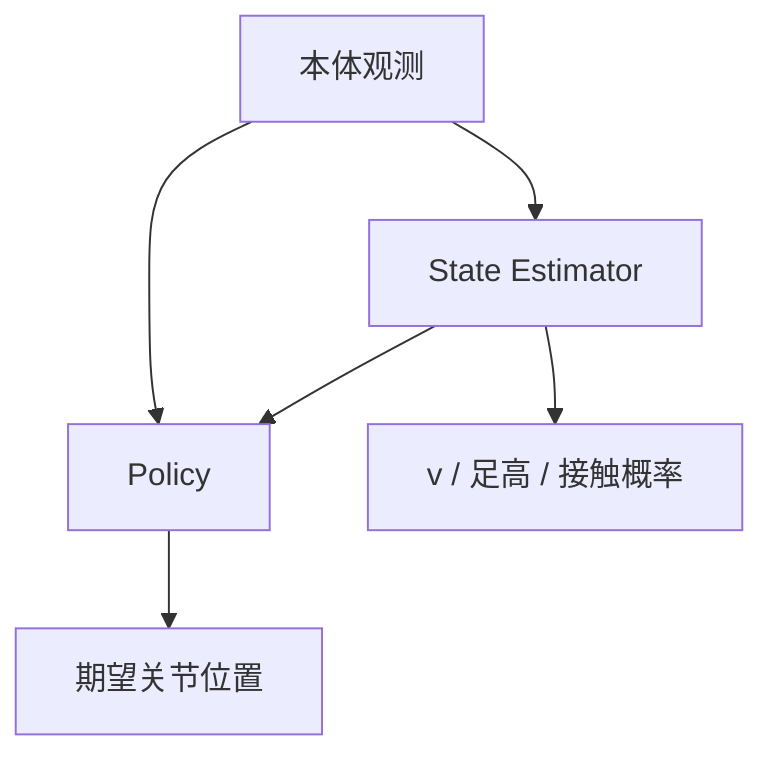

# Concurrent Training of Control Policy and State Estimator

## 一句话定义

**Ji, Mun, Kim & Hwangbo（KAIST，[arXiv:2202.05481](https://arxiv.org/abs/2202.05481)）** 提出 locomotion 训练框架：**控制策略与状态估计网络并发训练**——策略输出期望关节位置，估计器输出基座线速度、足高、接触概率等；快速仿真训练后迁移真机，穿越山坡、滑板、可变形地面等。

## 英文缩写速查

| 缩写 | 英文全称 | 简要说明 |
|------|----------|----------|
| RL | Reinforcement Learning | 策略学习范式 |
| SE | State Estimator | 本文并行训练的估计网络 |
| Sim2Real | Simulation to Real | 仿真到真机迁移 |
| PPO | Proximal Policy Optimization | 常见腿足 RL 算法族（语境） |
| PD | Proportional–Derivative | 关节目标通常经 PD 执行 |

## 为什么重要

- 相对两阶段 teacher–student，**并发**减少串行瓶颈，估计与控制共同适应。
- 把「要估计什么」（速度/足高/接触）说成可学习模块，贴近真机传感缺口。
- 出现在 Mini Cheetah 论文生态清单中，并与 [privileged-training](../concepts/privileged-training.md) 概念页交叉。

## 核心信息

| 项 | 内容 |
|----|------|
| **机构** | 韩国科学技术院（KAIST） |
| **输出** | 策略：关节位置；估计器：速度/足高/接触等 |
| **开源** | **训练代码未官方单列**（依赖开源仿真/控制生态） |

## 核心原理

- 估计量进入策略可用信息，形成端到端可微或可联合优化的训练回路。
- 快速仿真提供并发训练所需样本量。

## 源码运行时序图

**不适用**（截至入库日无与论文一一对应的官方训练仓库；概念复现需自建仿真环境）。

## 工程实践

| 项 | 建议 |
|----|------|
| 估计目标 | 优先基座线速度与接触，对盲走帮助最大 |
| 训练 | 监控估计误差与策略回报是否一同下降 |
| 迁移 | 对 IMU 噪声与足端滑动做域随机化 |

## 评测

| 维度 | 要点 |
|------|------|
| 地形 | 山坡、滑板、可变形地面等 |
| 迁移 | 仿真 → 真机 |
| 范式 | 并发 vs 传统两阶段 |

## 结论

**总判：** 本文把「策略 + 估计」从流水线改成**一起练**，是特权/估计类 Sim2Real 的重要变体。

- 真影响：并发训练与可学习状态估计耦合。
- 次要代价：官方代码不完整；超参耦合更难调。
- 部署：与 RMA/teacher–student 对照选型，见 privileged-training。

## 与其他工作对比

| 对照对象 | 差异要点 |
|----------|----------|
| 两阶段 teacher–student / [特权训练](../concepts/privileged-training.md) | 本文把策略与状态估计**并发**训练，减少串行瓶颈、令估计与控制共同适应 |
| RMA 式在线适应 | RMA 侧重适应模块；本文显式把「要估计什么」（基座速度/足高/接触）做成可学习估计器 |
| [Rapid Locomotion RL](./paper-rapid-locomotion-rl.md) | 同属学习 locomotion 线；Rapid 侧重速度课程 + 在线辨识，本文侧重并发状态估计 |

## 局限与风险

- `sources/papers/privileged_training.md` 曾误写 arXiv `2202.05738`；**正确为 2202.05481**。
- 无官方仓时复现成本高。

## 关联页面

- [Privileged training](../concepts/privileged-training.md)
- [State estimation](../concepts/state-estimation.md)
- [Rapid Locomotion RL](./paper-rapid-locomotion-rl.md)
- [MIT Mini Cheetah](./mit-mini-cheetah.md)

## 参考来源

- [论文归档](../../sources/papers/concurrent_policy_estimator_locomotion_arxiv_2202_05481.md)
- [privileged_training 集合](../../sources/papers/privileged_training.md)

## 推荐继续阅读

- arXiv：<https://arxiv.org/abs/2202.05481>
