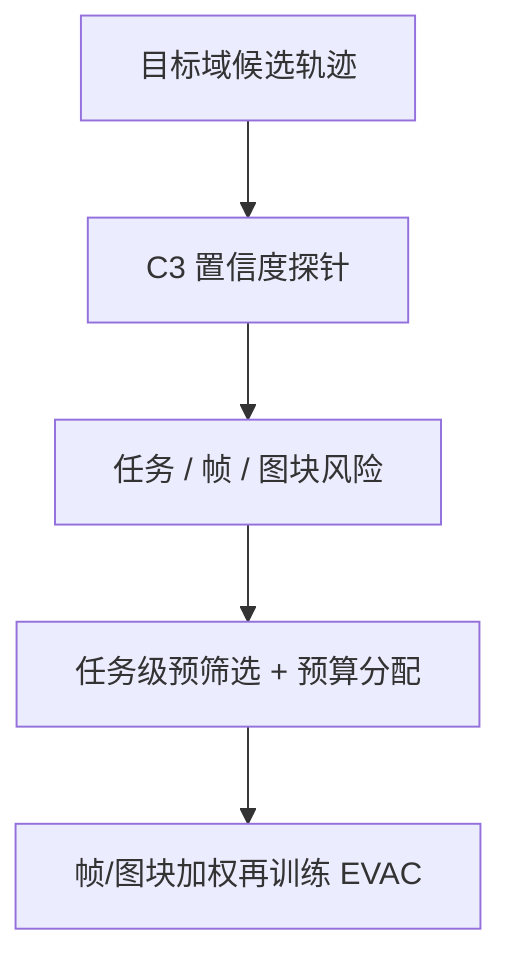
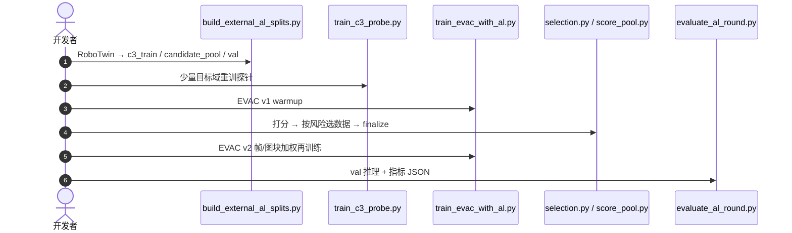

# ConfAL-WM

**ConfAL-WM: Confidence-Guided Active Learning for Action-Conditioned World Models**（[arXiv:2608.25572](https://arxiv.org/abs/2608.25572)，[项目页](https://ConfAL-WM.github.io)，[代码](https://github.com/ConfAL-WM/ConfAL-WM)）——清华大学（Tsinghua）。

## 一句话定义

**世界模型的主动学习应从「选样本」升级为「定位风险并分配监督」。**

## 英文缩写速查

| 缩写 | 英文全称 | 简要说明 |
|------|----------|----------|
| ConfAL | Confidence-guided Active Learning | 置信度引导的主动学习 |
| EVAC | EnerVerse-AC | 本文构建其上的动作条件世界模型 |
| C3 | Confidence probe / c3 | UNet 解码特征上的稠密置信度探针 |
| AL | Active Learning | 后训练数据选择与加权 |

## 为什么重要

- 纳入 [具身智能小站 2026-08-28 九篇盘点](../../sources/blogs/wechat_embodied_station_wam_vla_cross_embodiment_9_papers_2026-08-28.md)：置信度直接指导世界模型补课。
- 开源状态（入库日）：**已开源**。

## 核心信息

| 项 | 内容 |
|----|------|
| **机构** | 清华大学（Tsinghua） |
| **出处** | arXiv:2608.25572（2026-08） |
| **开源** | **已开源**（GitHub + HF 权重/数据） |
| **底座** | [EnerVerse-AC](https://github.com/AgibotTech/EnerVerse-AC) |

### 流程总览

## 工程实践

| 项 | 内容 |
|----|------|
| **配置** | `configs/agibotworld/al_robotwin.yaml`；`--score_method c3` 须贯穿选择/再训练/评测 |
| **探针** | 冻 UNet 解码特征，EMA 校准稠密潜空间可靠性 |
| **权重** | HF `anonymous89793/ConfAL-WM`（warmup / frame / frame+patch） |
| **数据** | HF `anonymous89793/ConfAL-WM-Dataset` 含 50-task prescreen 与预计算推理 |

## 评测

| 项 | 内容 |
|----|------|
| **基准** | RoboTwin 2.0 |
| **选择** | 置信度引导选择提高后训练效率 |
| **加权** | 稠密帧/图块加权优于标量奖励、进度与评审式评分 |

- 数据出处：[ingest 摘录「评测」](../../sources/papers/confal_wm_arxiv_2608_25572.md)。逐项数值以仓内 `eval/al_results/` JSON 为准。

## 结论

**误差集中在手臂、物体、接触与遮挡区时，标量分数选不出该补的地方。**

1. 探针必须长在解码特征上，才能给出可对齐的稠密图。
2. 先任务级预筛选再分配预算，避免把算力撒在低风险场景。
3. 同一置信度信号复用于选择、加权与可视化，减少「评分器与训练器各说各话」。
4. 复现要对齐 `--score_method` / `--select_method` / `--weighting`，路径才对得上。

## 源码运行时序图

关键复现路径：README 的 Step 1–6；评测分 `run_val_inference.py` 与 `evaluate_al_round.py` 两段。

## 局限与风险

- 依赖 EVAC 世界模型与 RoboTwin 2.0 数据转换。
- HF 组织名为 `anonymous89793`，后续可能迁移。
- 主动学习改善的是预测质量与轨迹一致性，不等于直接给出操作策略。

## 与其他工作对比

- 相对标量奖励 / 进度 / LLM judge 选数据：稠密图能加权到接触区。
- 相对 [GaussianDream++](./paper-gaussiandream-plusplus.md)：一个补**后训练数据效率**，一个把世界塞进**策略令牌**。

## 关联页面

- [生成式世界模型](../methods/generative-world-models.md)
- [World Action Models](../concepts/world-action-models.md)
- [GaussianDream++](./paper-gaussiandream-plusplus.md)
- [WAM / VLA / 跨本体 9 篇技术地图](../overview/wam-vla-cross-embodiment-9-papers-technology-map.md)

## 参考来源

- [confal_wm_arxiv_2608_25572](../../sources/papers/confal_wm_arxiv_2608_25572.md)
- [confal-wm 项目页](../../sources/sites/confal-wm.md)
- [confal-wm 仓库](../../sources/repos/confal-wm.md)
- [具身智能小站 9 篇盘点](../../sources/blogs/wechat_embodied_station_wam_vla_cross_embodiment_9_papers_2026-08-28.md)

## 推荐继续阅读

- [arXiv:2608.25572](https://arxiv.org/abs/2608.25572)
- [ConfAL-WM 官方代码](https://github.com/ConfAL-WM/ConfAL-WM)
