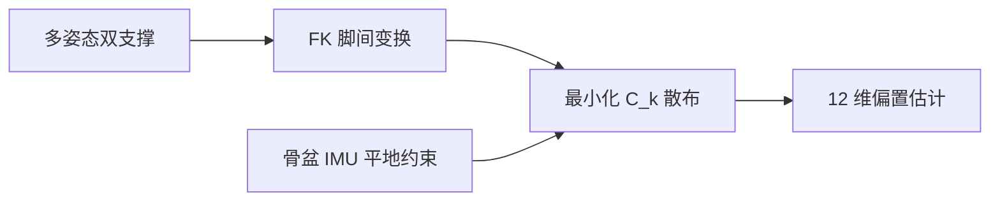

# 接触约束人形下肢关节零位标定

**Contact-Constrained Joint-Offset Calibration**（[arXiv:2609.02306](https://arxiv.org/abs/2609.02306)）由 **武汉大学（WHU）、智元机器人（AgiBot）** 提出（公众号周更 ingest 见 [策展索引](../../sources/blogs/wechat_shenlan_weekly_papers_2026-09-04.md)）。

## 一句话定义

双脚踩地时，**脚间相对变换应不变**——偏置错误会让它随姿态漂移，从而可被批量优化。

## 英文缩写速查

| 缩写 | 英文全称 | 简要说明 |
|------|----------|----------|
| FK | Forward Kinematics | 正向运动学 |
| IMU | Inertial Measurement Unit | 骨盆惯性测量 |
| Hessian | Hessian Matrix | 用于分析不可观与 pitch 耦合 |

## 为什么重要

外参 mocap/激光标定难现场重复；该法 **只需编码器+骨盆 IMU+静态双支撑**。

## 核心信息

| 项 | 内容 |
|----|------|
| **机构** | 武汉大学（WHU）、智元机器人（AgiBot） |
| **开源** | 见 [工程实践](#工程实践) |

## 核心原理

优化 12 维 $\delta q$ 使双支撑序列的 $C_k(\delta q)=T_{BF_L}^{-1}T_{BF_R}$ 离散最小；辅以平地 IMU 约束与 Tikhonov 先验。A2 roll–yaw–pitch 与 A3 pitch–roll–yaw **关节序影响可观性**。

### 流程总览

## 源码运行时序图

**不适用** — 截至 **2026-09-07** 无可运行官方代码（或本文为硬件/协议类工作）。

## 工程实践

| 项 | 说明 |
|----|------|
| 开源状态 | 见论文摘录与项目页核查结论 |
| 复现入口 | 以 arXiv 为准 |

## 实验与评测

| 平台 | 足高 RMS |
|------|----------|
| A3 真机 | 4.26 → **2.20 mm** |
| A2 真机 | 8.03 → **1.43 mm** |

## 结论

接触一致性 + Hessian 几何解释，给出 **可现场跑** 的下肢标定；弱 pitch 链仍需姿态激励与先验。

1. 平行 pitch 轴偏置 **和** 可观、单个不可观——需滚转/偏航激励。
2. 与 Yamane sole-height 法仿真对比 **无 universal winner**。
3. LiDAR 轨迹独立验证俯仰–垂直通道。
4. MuJoCo 同几何隔离关节序效应。
5. **未开源**。

## 与其他工作对比

「标定」在人形上是好几件不同的事，本文只解 **关节零位偏置** 一件——按「标什么 / 要什么设备」分：

| 工作 | 标的量 | 需要的外部设备 | 现场可重复性 | 与本文 |
|------|--------|----------------|--------------|--------|
| **本文** | 下肢 **12 维关节零位偏置** | **无**（编码器 + 骨盆 IMU + 静态双支撑） | 高——站几个姿态即可 | 本页；弱 pitch 链仍需先验 |
| mocap / 激光外参标定 | 连杆几何 + 零位 | 动捕棚或激光跟踪仪 | 低——出厂能做，现场难 | 精度更高但正是本文要绕开的成本 |
| Yamane sole-height 法 | 零位偏置 | 无 | 高 | 论文仿真对比结论是 **无 universal winner**，不是本文全面胜出 |
| [闭链惯量标定](../concepts/humanoid-closed-loop-inertia-calibration.md) | **惯量/质心** 参数 | 无（激励轨迹） | 中 | 正交问题：零位对了不代表惯量对 |
| [关节执行器参数辨识](../methods/joint-actuator-parameter-identification.md) / [辨识实验设计](../methods/sim2real-joint-sysid-experiment-design.md) | 力矩常数、摩擦、传动 | 无（力矩/电流采集） | 中 | 同为 sim2real 前置，标的是 **动力学** 而非运动学零位 |
| [FOCUS](./paper-focus-foot-observation-confidence.md) | 运行时 **接触置信度** | 无 | — | 同 WHU/AgiBot；本文是 **离线一次标定**，FOCUS 是 **在线每步判断**，二者串联而非替代 |

**共同前提提醒：** 本文与 Yamane 法都假设 **地面平整且双脚确实同时着地**——这个假设由 FOCUS 这类接触判据保障，标定质量因此上限受接触检测质量约束。

## 局限与风险

弱 pitch 方向仍先验依赖；需多静态站姿激励。

## 关联页面

- [paper-focus-foot-observation-confidence.md](./paper-focus-foot-observation-confidence.md)
- [ekf](../formalizations/ekf.md)
- [hub-state-estimation](../overview/hub-state-estimation.md)
- [paper-bridge-humanoid.md](./paper-bridge-humanoid.md)
- [人形闭链惯量标定](../concepts/humanoid-closed-loop-inertia-calibration.md) — 正交的动力学参数标定
- [关节执行器参数辨识](../methods/joint-actuator-parameter-identification.md) — 驱动侧辨识对照

## 参考来源

- [contact_constrained_joint_offset_calibration_arxiv_2609_02306.md](../../sources/papers/contact_constrained_joint_offset_calibration_arxiv_2609_02306.md)
- [公众号周更策展](../../sources/blogs/wechat_shenlan_weekly_papers_2026-09-04.md)

## 推荐继续阅读

- [https://arxiv.org/abs/2609.02306](https://arxiv.org/abs/2609.02306)
