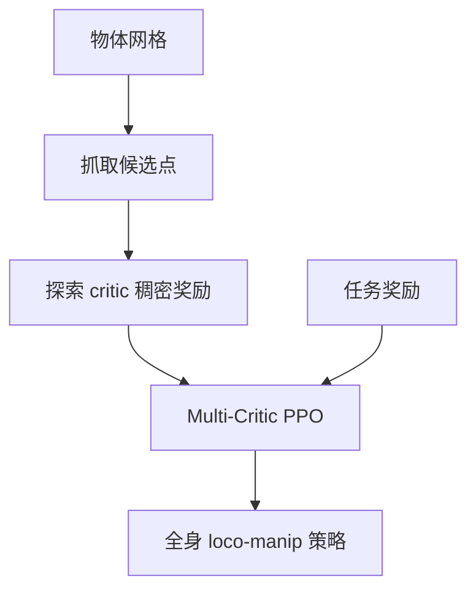

# Contact-Guided Exploration 非抓取移动操作

**Contact-Guided Exploration**（[arXiv:2608.28140](https://arxiv.org/abs/2608.28140)）由 **比萨大学、苏黎世联邦理工（ETH）、NVIDIA** 提出（公众号周更 ingest 见 [策展索引](../../sources/blogs/wechat_shenlan_weekly_papers_2026-09-04.md)）。

## 一句话定义

非抓取 loco-manipulation 的瓶颈是 **_sparse contact_**——用 **可退火的探索 critic** 先把末端送到 **有意义的接触点**。

## 英文缩写速查

| 缩写 | 英文全称 | 简要说明 |
|------|----------|----------|
| RL | Reinforcement Learning | 强化学习 |
| PPO | Proximal Policy Optimization | 近端策略优化 |
| ALMA | ALMA Mobile Manipulator | 四足移动操作真机平台 |

## 为什么重要

单标量奖励下平滑/能耗惩罚会让策略 **永远不接触**；演示数据难覆盖多样几何。

## 核心信息

| 项 | 内容 |
|----|------|
| **机构** | 比萨大学、苏黎世联邦理工（ETH）、NVIDIA |
| **开源** | 见 [工程实践](#工程实践) |

## 核心原理

向量奖励：task / exploration / reg 三 critic 共享 LSTM；$A_t=w_{task}A^{task}+w_{exp}(t)A^{exp}+w_{reg}(t)A^{reg}$。接触候选来自 **通用抓取算法** 网格采样；$w_{exp}$ 训练衰减。

### 流程总览

## 源码运行时序图

**不适用** — 截至 **2026-09-07** 无可运行官方代码（或本文为硬件/协议类工作）。

## 工程实践

| 项 | 说明 |
|----|------|
| 开源状态 | 见论文摘录与项目页核查结论 |
| 复现入口 | 以 arXiv 为准 |

## 实验与评测

| 任务 | 成功率 |
|------|--------|
| 箱推 / 运椅（仿真） | **>90%** |
| ALMA 椅运（真机） | 零样本泛化 IKEA 椅；抗扰与超载 |

## 结论

把 **接触先验** 做成 **可退火的独立 critic**，比固定 shaping 更稳地渡过探索期。

1. 洗碗机开门定性验证。
2. 对比单 critic / 固定权重 multi-critic。
3. 抓取点 **非均匀采样** 优于凸物体均匀点。
4. RA-L 发表。
5. **未见 GitHub**。

## 与其他工作对比

非抓取 loco-manipulation 的真问题是 **探索期没有接触就没有奖励信号**。各路线给的答案不同：

| 路线 | 怎么渡过探索期 | 需要什么先验 | 退火 / 可否撤掉 | 与本文 |
|------|----------------|--------------|-----------------|--------|
| **本文** | **独立 exploration critic** 给稠密「靠近接触点」奖励 | 物体网格 + 通用抓取算法采样候选点 | **可退火**：$w_{exp}(t)$ 训练中衰减到 0 | 本页；论文消融显示优于单 critic 与固定权重 multi-critic |
| 单 critic + 固定 shaping | 把接触项塞进标量奖励 | 手调权重 | 撤不掉——权重固定 | 页首动机：平滑/能耗惩罚会让策略 **永远不接触** |
| 固定权重 multi-critic | 分开算优势但权重不变 | 同上 | 撤不掉 | 论文自带对照组，弱于可退火版 |
| 演示 / 模仿引导（[AMP 风格奖励](../methods/amp-reward.md)） | 用参考动作分布拉近初始策略 | **演示数据** | 通常保留判别器 | 页首动机：演示难覆盖多样几何；本文只要网格不要演示 |
| [课程学习](../concepts/curriculum-learning.md) | 调 **任务难度** 而非奖励结构 | 难度参数化 | 可退火 | 正交手段，可与本文叠加 |

**读法：** 本文的可迁移点不是「多 critic」这个结构本身（[PPO](../methods/ppo.md) 上加多头很常见），而是 **把接触先验做成一个用完即撤的独立优势项**——先验只负责把策略推过探索期，不污染最终最优解。这正是 [奖励设计](../concepts/reward-design.md) 里 shaping 项「引导 vs 偏置最优解」矛盾的一种解法。

## 局限与风险

仍依赖仿真物理与抓取候选质量；长视野任务未全覆盖。

## 关联页面

- [loco-manipulation](../tasks/loco-manipulation.md)
- [contact-rich-manipulation](../concepts/contact-rich-manipulation.md)
- [paper-muldp.md](./paper-muldp.md)
- [奖励设计](../concepts/reward-design.md) — shaping 引导 vs 偏置最优解的矛盾
- [课程学习](../concepts/curriculum-learning.md) — 正交的探索期手段
- [PPO](../methods/ppo.md) — 多 critic 所依附的底座算法

## 参考来源

- [contact_guided_exploration_locomanipulation_arxiv_2608_28140.md](../../sources/papers/contact_guided_exploration_locomanipulation_arxiv_2608_28140.md)
- [contact-guided-exp.md](../../sources/sites/contact-guided-exp.md)
- [公众号周更策展](../../sources/blogs/wechat_shenlan_weekly_papers_2026-09-04.md)

## 推荐继续阅读

- [https://tolomeis.github.io/contact-guided-exp/](https://tolomeis.github.io/contact-guided-exp/)
