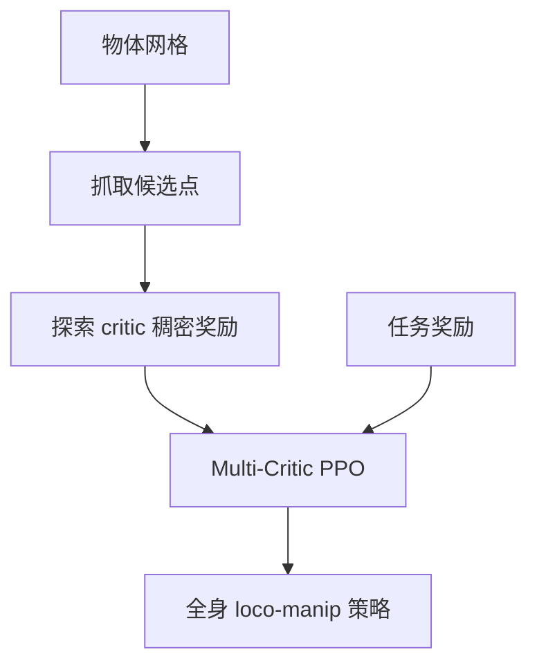
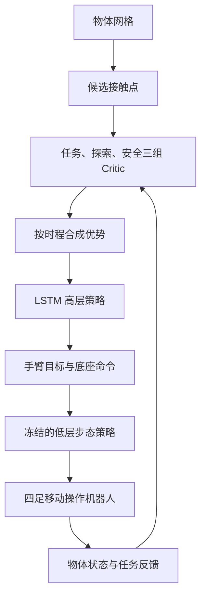

# Contact-Guided Exploration 非抓取移动操作

**Contact-Guided Exploration**（[arXiv:2608.28140](https://arxiv.org/abs/2608.28140)）由 **比萨大学、苏黎世联邦理工（ETH）、NVIDIA** 提出（公众号周更 ingest 见 [策展索引](../../sources/blogs/wechat_shenlan_weekly_papers_2026-09-04.md)）。

## 一句话定义

非抓取 loco-manipulation 的瓶颈是 **_sparse contact_**——用 **可退火的探索 critic** 先把末端送到 **有意义的接触点**。

## 英文缩写速查

| 缩写 | 英文全称 | 简要说明 |
|------|----------|----------|
| RL | Reinforcement Learning | 强化学习 |
| PPO | Proximal Policy Optimization | 近端策略优化 |
| ALMA | ALMA Mobile Manipulator | 四足移动操作真机平台 |

## 为什么重要

单标量奖励下平滑/能耗惩罚会让策略 **永远不接触**；演示数据难覆盖多样几何。

## 核心信息

| 项 | 内容 |
|----|------|
| **机构** | 比萨大学、苏黎世联邦理工（ETH）、NVIDIA |
| **刊物** | IEEE Robotics and Automation Letters (RA-L) |
| **开源** | 见 [工程实践](#工程实践) |

## 核心原理

向量奖励：task / exploration / reg 三 critic 共享 LSTM；$A_t=w_{task}A^{task}+w_{exp}(t)A^{exp}+w_{reg}(t)A^{reg}$。接触候选来自 **通用抓取算法** 网格采样；$w_{exp}$ 训练衰减。

### 流程总览

```mermaid
flowchart TB
  mesh[物体网格] --> grasp[抓取候选点]
  grasp --> exp[探索 critic 稠密奖励]
  exp --> ppo[Multi-Critic PPO]
  task[任务奖励] --> ppo
  ppo --> policy[全身 loco-manip 策略]
```

## 训练与控制实现

论文把高层操作策略与预训练低层步态策略分开：高层 actor 输出 6 维手臂目标关节角、底座平面速度 \((v_x,v_y,\omega_z)\) 和底座高度；冻结的 locomotion policy 跟踪底座命令并产生腿部目标。将底座高度纳入动作，是为了在末端接近地面时避免肩关节逼近运动学限位。

- **策略观测：** 本体关节状态、重力投影、底座速度，以及底座坐标系中的物体位姿与目标误差。
- **Critic 特权观测：** 物体线/角速度和当前采样的目标接触点。
- **探索目标：** 椅子网格由通用 grasp proposal 算法产生 25 个候选点，每个 episode 重置时随机选一点；箱推则在可见表面均匀采样。
- **训练：** Isaac Lab，4096 个并行环境；仿真步长 5 ms、控制步长 20 ms；RSL-RL PPO 改成多 Critic。椅子资产由 15 把 IKEA 椅和 100 把程序生成椅组成。
- **域随机化：** 物体质量 2–4 kg、摩擦系数 0.2–1.5，底座质量 ±5 kg。
- **权重时序：** (w_{task}=0.75) 固定；(w_{exp}) 在第 5k–10k 个训练 step 从 0.1 线性降到 0.01；(w_{reg}) 从 0.15 升到 0.24。该 schedule 在椅子任务调定后原样用于其余任务。

### 训练与控制的数据流

```mermaid
flowchart TB
  mesh["物体网格"] --> candidates["候选接触点"]
  candidates --> critics["任务、探索、安全三组 Critic"]
  critics --> mix["按时程合成优势"]
  mix --> actor["LSTM 高层策略"]
  actor --> arm["手臂目标与底座命令"]
  arm --> loco["冻结的低层步态策略"]
  loco --> robot["四足移动操作机器人"]
  robot --> state["物体状态与任务反馈"]
  state --> critics
```

## 源码运行时序图

**不适用** — 截至 **2026-09-07** 无可运行官方代码（或本文为硬件/协议类工作）。

## 工程实践

| 项 | 说明 |
|----|------|
| 开源状态 | **未开源** — [项目页](https://tolomeis.github.io/contact-guided-exp/) 截至 **2026-09-28** 仍 **未见** GitHub |
| 复现入口 | 以 arXiv / RA-L 正文与项目页为准 |

## 实验与评测

| 评测 | 论文报告 | 解释 |
|---|---:|---|
| 仿真任务 | 箱推、椅子运输各自超过 90% 成功率；正文给出的最佳结果为 94.1% 成功率、4.4% tipover、9.2 s 完成时间 | 不把 94.1% 错写成每个任务都达到该数值 |
| 成功定义 | 物体到目标距离 ≤0.2 m | 另统计 missed contact（物体位移 <0.2 m）、tipover（倾斜 >35°）和 timeout |
| 多随机种子 | 5 seeds；所提方法成功率标准差 0.98%；固定权重 Multi-Critic、PPO+WS、普通 PPO 分别为 4.2%、1.2%、9.7% | 论文 Figure 5 汇总箱推与椅运；不将这些标准差混作硬件误差 |
| 真机椅运 | 4 种未见 IKEA 家具合计 40/58 次成功（69.0%）：ADDE 27/37、SANDSBERG 8/14、VIHALS 3/3、LOVBACKEN 2/4 | ALMA 四足移动操作平台；机器人依赖机载本体感知，物体位姿由外部 motion-capture 跟踪 |
| 负载与扰动 | 椅子总质量增至 6.5 kg 时完成运输；人推扰动后可重新接近、挂接并继续运输 | 属于定性鲁棒性测试，没有给出统一扰动成功率 |
| 洗碗机 | 学会先拉把手、再推门板；靠近手臂关节限位 10% 区域的时间占比平均减少 59% | 定性/附加仿真任务，不应与箱推、椅运的主成功率并列 |

**主要消融结论：** 无探索奖励的变体成功率为 0%；普通 PPO 在椅运上的 missed-contact 为 9.1%；在 scalar reward 上直接衰减权重后该值降至 4.0%，但训练方差较大；固定权重 Multi-Critic 容易持续追逐接触点并增加 tipover。作者的独立 value heads 与探索权重衰减共同解决“先找到接触、再撤掉探索偏置”的问题。

## 结论

把 **接触先验** 做成 **可退火的独立 critic**，比固定 shaping 更稳地渡过探索期。

1. 洗碗机开门定性验证。
2. 对比单 critic / 固定权重 multi-critic。
3. 抓取点 **非均匀采样** 优于凸物体均匀点。
4. RA-L 发表。
5. **未见 GitHub**。

## 与其他工作对比

非抓取 loco-manipulation 的真问题是 **探索期没有接触就没有奖励信号**。各路线给的答案不同：

| 路线 | 怎么渡过探索期 | 需要什么先验 | 退火 / 可否撤掉 | 与本文 |
|------|----------------|--------------|-----------------|--------|
| **本文** | **独立 exploration critic** 给稠密「靠近接触点」奖励 | 物体网格 + 通用抓取算法采样候选点 | **可退火**：$w_{exp}(t)$ 训练中衰减到 0 | 本页；论文消融显示优于单 critic 与固定权重 multi-critic |
| 单 critic + 固定 shaping | 把接触项塞进标量奖励 | 手调权重 | 撤不掉——权重固定 | 页首动机：平滑/能耗惩罚会让策略 **永远不接触** |
| 固定权重 multi-critic | 分开算优势但权重不变 | 同上 | 撤不掉 | 论文自带对照组，弱于可退火版 |
| 演示 / 模仿引导（[AMP 风格奖励](../methods/amp-reward.md)） | 用参考动作分布拉近初始策略 | **演示数据** | 通常保留判别器 | 页首动机：演示难覆盖多样几何；本文只要网格不要演示 |
| [课程学习](../concepts/curriculum-learning.md) | 调 **任务难度** 而非奖励结构 | 难度参数化 | 可退火 | 正交手段，可与本文叠加 |

**读法：** 本文的可迁移点不是「多 critic」这个结构本身（[PPO](../methods/ppo.md) 上加多头很常见），而是 **把接触先验做成一个用完即撤的独立优势项**——先验只负责把策略推过探索期，不污染最终最优解。这正是 [奖励设计](../concepts/reward-design.md) 里 shaping 项「引导 vs 偏置最优解」矛盾的一种解法。

## 局限与风险

- 真机评测仍依赖外部 motion-capture 物体位姿，尚非完全自包含的现场感知部署。
- 仿真 94.1% 与硬件跨物体 69.0% 的落差可见 sim-to-real 与状态估计问题仍重要；论文将部分硬件失败归因于侧向接近造成的急剧 yaw 命令、里程计误差和物体倾倒。
- 接触候选受网格与 grasp proposal 质量影响；论文自己的结果也说明候选点数量、非凸几何与可达性会改变探索效率。
- 测试集中在箱推、椅运及洗碗机开门；作者指出还需更广泛 domain shift 测试，且固定权重 schedule 存在超参数敏感性。

## 关联页面

- [loco-manipulation](../tasks/loco-manipulation.md)
- [contact-rich-manipulation](../concepts/contact-rich-manipulation.md)
- [paper-muldp.md](./paper-muldp.md)
- [paper-forcetwin.md](./paper-forcetwin.md) — 同 ETH/NVIDIA 生态；物体动力学孪生 vs 本文 loco-manip 探索
- [奖励设计](../concepts/reward-design.md) — shaping 引导 vs 偏置最优解的矛盾
- [课程学习](../concepts/curriculum-learning.md) — 正交的探索期手段
- [PPO](../methods/ppo.md) — 多 critic 所依附的底座算法

## 参考来源

- [contact_guided_exploration_locomanipulation_arxiv_2608_28140.md](../../sources/papers/contact_guided_exploration_locomanipulation_arxiv_2608_28140.md)
- [contact-guided-exp.md](../../sources/sites/contact-guided-exp.md)
- [公众号周更策展](../../sources/blogs/wechat_shenlan_weekly_papers_2026-09-04.md)

## 推荐继续阅读

- [arXiv 正文](https://arxiv.org/html/2608.28140v1)
- [项目页与视频](https://tolomeis.github.io/contact-guided-exp/)
- [项目页补充材料 PDF](https://tolomeis.github.io/contact-guided-exp/assets/RAL_Contac_guidance_Supp.pdf)
