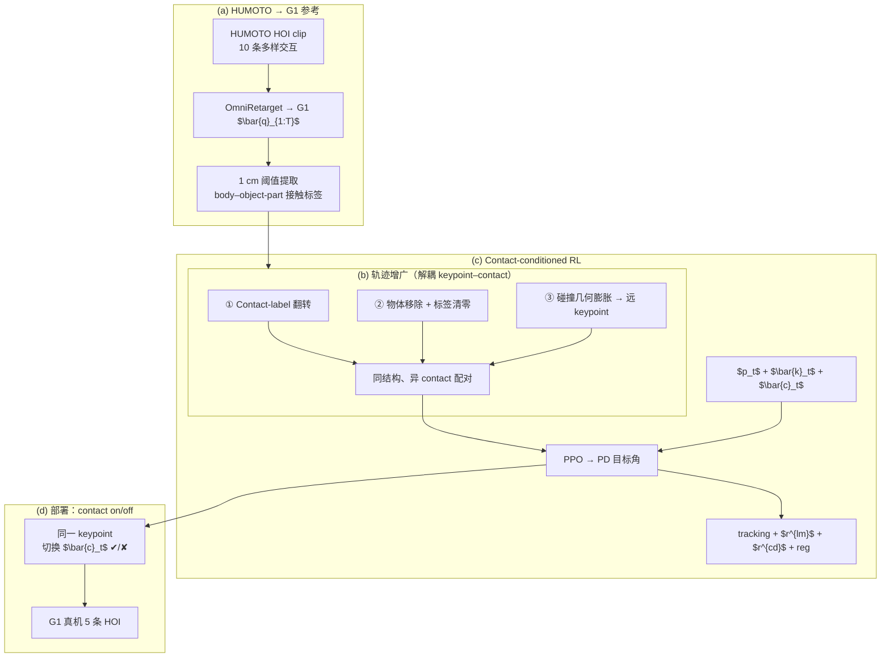

# ContactMimic（Humanoid Object Interaction via Contact Control）

**ContactMimic**（arXiv:2607.08742，2026-07-09，UIUC / Saurabh Gupta 组）提出 **接触条件化 keypoint tracker**：在参考关键点轨迹之外，策略额外接收 **per-body 二值接触指令** $\bar{\mathbf{c}}_t$，并用 **contact-following 奖励** 与 **轨迹增广** 打破原始 HOI 数据中 keypoint 与 contact 的强相关，使部署时可在 **同一运动几何** 下 **刻意建立或抑制** 任务相关物理接触（如擦白板留痕 vs 手悬停、坐椅承重 vs 悬空蹲姿、搬起箱子 vs 手路过箱子）。

## 英文缩写速查

| 缩写 | 英文全称 | 简要说明 |
|------|----------|----------|
| HOI | Human–Object Interaction | 人与物体接触交互的技能场景 |
| WBT | Whole-Body Tracking | 全身参考运动跟踪控制 |
| PPO | Proximal Policy Optimization | 本文 contact-conditioned tracker 训练算法 |
| G1 | Unitree G1 Humanoid | 论文仿真与真机评测平台（29 DoF） |
| MPJPE | Mean Per Joint Position Error | 关键点/关节跟踪几何误差 |
| Sim2Real | Simulation to Real | 把仿真策略迁移到真机 G1 |
| PD | Proportional–Derivative | 策略输出关节目标角，经 PD 转力矩 |

## 为什么重要

- **指出 keypoint-only 的任务歧义：** 擦板、坐椅、推家具的成功由 **接触语义** 定义，而非仅姿态；机器人可到达正确 keypoint 却 **不产生有意义接触**（挥手贴近白板 ≠ 擦拭）。
- **提供运行时 contact 旋钮：** 与只训「应接触」轨迹的 tracker 不同，ContactMimic 在 **同一 $\bar{\mathbf{k}}_t$** 下用 $\bar{\mathbf{c}}_t$ 切换 **坐椅是否靠椅背、是否真正擦板、是否搬起箱子**——把接触从运动的 **副产品** 提升为 **可编排接口**。
- **数据工程论点清晰：** 论文强调 **仅加 contact 输入与 reward 不够**；必须通过 **label 翻转 / 去物体 / 膨胀几何** 等增广提供 **同 keypoint、异 contact** 配对，策略才会真正听从 contact 指令。
- **真机 contact controllability：** 在 **Unitree G1** 上 5 条 HOI 动作、contact ✔/✘ 双条件，成功率多为 **5/5–10/10**；项目页提供逐 trial 视频，证据链完整。
- **无任务奖励的 loco-manipulation：** 仿真搬箱在 **仅 keypoint+contact tracking** 下即可抬起并移动物体，而 **BeyondMimic** 等 keypoint-only 基线 MPJPE 相近却 **几乎零物体位移**。

## 流程总览

## 核心机制（归纳）

### 策略接口

| 符号 | 含义 |
|------|------|
| $p_t$ | 本体感知（**不含** runtime 接触传感器） |
| $\bar{\mathbf{k}}_t$ | 参考 keypoint 位置目标 |
| $\bar{\mathbf{c}}_t \in \{0,1\}^{|\mathcal{B}|}$ | 可接触 body set $\mathcal{B}$（骨盆、躯干、髋、膝、踝、肩、腕）上的二值接触意图 |
| $a_t$ | 目标关节角 → PD 力矩 |

### Contact-aware 奖励

- **$r^{\mathrm{lm}}$（label matching）：** 实际 $c_{t,b,p}$ 与参考 $\bar{c}_{t,b,p}$ 的 balanced accuracy；稀疏接触动作用 **TP−λ·FP** 变体避免 TNR 饱和。
- **$r^{\mathrm{cd}}$（contact distance）：** 应接触对 $(b,p)\in\mathcal{S}_+$ 用高斯距离拉近；不应接触对 $(b,p)\in\mathcal{S}_-$ 在 $d<\delta$ 时惩罚靠近。

### 三种轨迹增广（可组合）

| 增广 | 效果 |
|------|------|
| **Contact-label flipping** | 轨迹不变，翻转任务相关 contact 标签；物体仍在场景中但 **接触被惩罚** |
| **Object removal** | 移除交互物体，标签强制为零，keypoint 保持 |
| **Inflated geometry** | 膨胀目标部件碰撞 mesh，重定向绕开 → **远 keypoint + 零标签**；可与 flipping 组合成「远姿态 + 应接触」 |

## 实验评测与主要结果

### 仿真协议与消融

- **仿真：** HUMOTO **10** 条动作（擦板、椅桌交互、坐/蹲、踢椅、搬箱等）；测试 **near/far keypoints × contact ✔/✘** 四组轨迹；contact 指标与关键关节力矩随指令单调变化。
- **vs BeyondMimic：** Table 3 — MPJPE **相当**，但 contact bodies / impulse 与 **pick-up box 物体位移**（0.03 m vs **0.49 m**）显著优于 keypoint-only。
- **增广消融：** 去掉 §3.2 增广后，多数动作 contact controllability **明显变差**——支持「数据解耦」必要性。
- **表征分析：** 线性探针在 policy 输入与 layer-2 上预测 runtime contact，F1 **远高于 chance** 与参考标签，说明 **本体感知已隐式编码接触状态**。

### 真机（G1，5 条动作）

| Motion | contact ✔ | contact ✘ | 成功判据摘要 |
|--------|-----------|-----------|--------------|
| Wipe whiteboard | 5/5 | 5/5 | 手擦留痕 ⇔ contact ✔ |
| Sit in front of table | 4/5 | 5/5 | 坐满椅面 + 手放桌面 ⇔ contact ✔ |
| Lean on backrest I | 9/10 | 10/10 | 躯干 sustained 靠椅背 ⇔ contact ✔ |
| Lean on backrest II | 10/10 | 9/10 | 同上（不同姿态风格） |
| Sit and squat | 5/5 | 5/5 | 坐姿承重 ⇔ contact ✔，否则蹲姿 |

## 与代表性方法对比（策展）

| 维度 | BeyondMimic | SceneBot | ResMimic | ContactMimic |
|------|-------------|----------|----------|--------------|
| **条件输入** | keypoint only | keypoint + per-link contact label | motion + object traj | keypoint + **per-body contact map** |
| **运行时 contact 开关** | ✗ | 部分（label 可置零回退平地） | ✗ | **✔ 同 keypoint 切换 ✔/✘** |
| **策略粒度** | 通用 tracker 路线 | **单策略** 多场景 | GMT+残差 per-task | **per-motion 策略** |
| **数据引擎** | 干净 MoCap | hindsight 场景重建 | AMASS/OMOMO | **HUMOTO + 三种增广** |
| **真机证据** | 广泛 | 多场景单策略 | G1 搬运 | **5 HOI contact controllability** |

## 常见误区或局限

- **不是 universal contact tracker：** 当前 **每条动作单独训练一条策略**；跨动作统一 contact-conditioned tracker 仍是未来工作（论文 §5）。
- **数据依赖 HUMOTO：** 交互多样性受 **高质量 HOI MoCap** 限制；in-the-wild 视频 路线尚未覆盖。
- **与 SceneBot 互补而非替代：** SceneBot 追求 **单策略 + 场景重建规模化**；ContactMimic 深入 **body-level contact 指令语义** 与 **增广解耦方法论**，粒度更细但 **未做多动作统一**。
- **真机规模有限：** 仅 **单台 G1、5 条动作**；更广硬件与长时程组合任务待验证。
- **代码状态：** 截至入库日项目页 **未发布 Code/Data**。

## 与其他页面的关系

- [BeyondMimic](../methods/beyondmimic.md) — 论文主 **keypoint-only** 基线；MPJPE 相近但接触与物体操作失败。
- [OmniRetarget](./paper-hrl-stack-03-omniretarget.md) — HUMOTO→G1 重定向与接触标签提取上游。
- [SceneBot](./paper-scenebot.md) — 同属 **contact-prompted WBT**；SceneBot 强调通才单策略与 hindsight 重建，ContactMimic 强调 **运行时 contact 开关** 与 **增广解耦**。
- [ResMimic](./paper-resmimic.md) — 亦加 contact-tracking reward，但 **无条件抑制接触** 与 **同轨迹 contact 切换**。
- [InterPrior](./paper-interprior.md) — 同 UIUC HOI 研究线；InterPrior 走 **生成式稀疏目标 + RL 微调**，ContactMimic 走 **稠密 reference + contact 条件跟踪**。
- [Whole-Body Tracking Pipeline](../concepts/whole-body-tracking-pipeline.md) — WBT 流水线中 **contact-conditioned HOI** 分支。
- [人形运动跟踪方法选型](../queries/humanoid-motion-tracking-method-selection.md) — 「接触丰富场景 tracking」选型补充。

## 推荐继续阅读

- 论文：<https://arxiv.org/abs/2607.08742>
- 项目页（概述视频与真机 trial）：<https://lixinyao11.github.io/contactmimic-page/>
- [HUMOTO 数据集笔记](https://imchong.github.io/Humanoid_Robot_Learning_Paper_Notebooks/papers/14_Human_Motion/HUMOTO__A_4D_Dataset_of_Mocap_Human_Object_Interactions/HUMOTO__A_4D_Dataset_of_Mocap_Human_Object_Interactions.html)
- [BeyondMimic 项目页](https://beyondmimic.github.io/)
- [SceneBot 项目页](https://ericcsr.github.io/scenebot/)

## 参考来源

- [contactmimic_arxiv_2607_08742.md](../../sources/papers/contactmimic_arxiv_2607_08742.md) — arXiv 策展摘录
- [lixinyao11-contactmimic-github-io.md](../../sources/sites/lixinyao11-contactmimic-github-io.md) — 项目页视频与真机成功率表

## 关联页面

- [BeyondMimic](../methods/beyondmimic.md)
- [Whole-Body Control](../concepts/whole-body-control.md)
- [Contact-Rich Manipulation](../concepts/contact-rich-manipulation.md)
- [Loco-Manipulation](../tasks/loco-manipulation.md)
- [OmniRetarget](./paper-hrl-stack-03-omniretarget.md)
- [SceneBot](./paper-scenebot.md)
- [InterPrior](./paper-interprior.md)
- [人形运动跟踪方法选型](../queries/humanoid-motion-tracking-method-selection.md)
