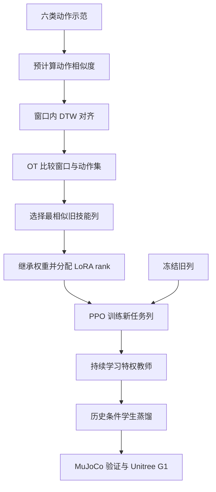

# Continual Humanoid Motion Learning：让 G1 控制器持续学新动作

*Continual Humanoid Motion Learning*（[arXiv:2610.04231](https://arxiv.org/abs/2610.04231)）研究如何让一个全身动作控制器沿任务序列逐步吸收技能，而不因新任务微调而破坏旧动作。作者提出 **Similarity-guided LoRA-PNN**，将 Progressive Neural Network、动作相似度和低秩适配结合。

- **代码与配置：** [匿名项目页](https://anonymous.4open.science/r/continual-humanoid-learning-35D3)
- **作者：** Zhewen He、Hao Huang、Geeta Chandra Raju Bethala、Chong Yu、Tao Chen、Anthony Tzes、Yi Fang
- **机构：** New York University Abu Dhabi、复旦大学
- **硬件：** Unitree G1；实机策略用 23 个驱动自由度，腕部锁定以保证安全。
- **论文：** [arXiv 摘要](https://arxiv.org/abs/2610.04231) · [HTML v1](https://arxiv.org/html/2610.04231v1) · [PDF](https://arxiv.org/pdf/2610.04231)

## 一句话理解

**每学一项新动作就增加一个策略列；旧列冻结，新列从最相似的旧动作继承，再按相似程度决定 LoRA 需要多大更新容量。**

## 英文缩写速查

| 缩写 | 英文全称 | 简要说明 |
|---|---|---|
| PNN | Progressive Neural Network | 为新任务增加策略列，并通过横向连接复用旧列表示。 |
| LoRA | Low-Rank Adaptation | 用低秩参数增量适配新任务。 |
| DTW | Dynamic Time Warping | 对齐节奏不同的动作序列。 |
| OT | Optimal Transport | 比较动作窗口或动作集的分布差异。 |
| PPO | Proximal Policy Optimization | 用于优化新任务策略列的强化学习算法。 |

## 方法图

## 核心机制

### PNN：结构性隔离旧技能

每个任务新增一个 actor column，新列可通过 lateral connections 读取之前列的表示；旧列保持冻结。旧任务参数不会被新任务梯度改写，因此遗忘通过结构隔离，而非依赖经验回放或正则项来缓解。

每个任务以参考动作跟踪为目标，actor 接收机器人状态与 reference state，输出关节动作，由 PD 控制器跟踪；PPO 配合目标条件 critic 优化新列。

### 相似度：决定继承谁、扩多大

动作片段有不同速度、长度和停顿，作者先把运动重采样至 30 Hz，提取局部根速度、偏航角速度、关节旋转增量和可选接触信号，再分层比较：

1. **窗口级 DTW：** 对齐不同节奏的短动作片段，并用 Sakoe–Chiba band 限制过度变形。
2. **窗口分布级 OT：** 比较两段长动作中出现的局部行为分布。
3. **动作集级 OT：** 比较不同技能类别的整组动作，预计算类别相似度。
4. **相似度引导扩展：** 新任务继承最相似的旧策略列，随后按相似度选择 LoRA rank；相似度较低时分配更大适配容量。

### Teacher–student：部署时使用可得观测

特权教师能读取仿真 base velocity、关键身体位姿、接触状态和随机化参数。学生通过 DAgger 蒸馏，只使用部署可得的本体历史：最近 10 帧的关节位置、速度与上一步动作。学生随后经历 Isaac Gym → MuJoCo → G1 的迁移验证。

## 实验与结果

任务顺序覆盖六类动作：**walk、run、jump、dance、fight、fall-and-up**，动作来自 LAFAN1 与 Kungfu 数据集。每项任务训练预算为 50k iterations、1,024 个并行环境，每任务评测 100 episodes。

| 指标 | 论文报告值 | 口径 |
|---|---:|---|
| Similarity-guided LoRA-PNN AA | 0.945 | 最终跨技能平均准确率 |
| AIA | 0.964 | 逐阶段平均准确率 |
| FWT | 0.125；KungfuBot2 对照 0.079 | 新任务前向迁移 |
| PNN forgetting / backward transfer | 约 0 | 旧列冻结的结构属性 |
| 可训练参数节省 | 最多 94.5% | 相对 PNN 全量微调消融 |
| 训练时间节省 | 最多 40.8% | 论文消融中每 5k iteration 对比 |
| Isaac Gym → MuJoCo | 96.13% | 学生策略 sim-to-sim，1,500 次试验 |
| G1 实机 | 90.33% | 30 个动作、每个 10 次尝试 |

94.5% 和 40.8% 是论文所列消融的最大节省幅度；线性 rank 变体在成功率 AA/AIA 上表现最好，但不能把不同配置各自的最佳数字拼成单一“全指标最优”方案。

## 复现边界

- **任务增量协议提供 task identity：** 研究设定已知当前学习/评估任务，不是机器人自主发现当前技能标签。
- **避免遗忘不等于容量恒定：** PNN 旧列保持冻结，但列和 lateral connections 随任务增长。
- **DTW/OT 是离线引导：** 参考动作的类别相似度在训练前计算，不是部署时实时技能识别。
- **实机范围：** G1 上是动作跟踪部署，不等于开放环境自主持续学习。
- **代码可见性：** 作者提供匿名 4open 项目入口；具体训练脚本、硬件配置和授权以该项目当前页面为准。

## 与其他工作对比

- [Streaming RL 持续学习分析](./paper-streaming-rl-continual-robotics.md)讨论更一般的流式更新；本文聚焦离线参考动作集的顺序扩展。
- KungfuBot 系列训练多动作跟踪控制器；本文重点是旧技能隔离、相似度迁移与轻量新列适配。
- [人形策略观测输入](../concepts/humanoid-policy-observation-inputs.md)可辅助理解教师和学生的观测差异。

## 关联页面

- [人形策略观测输入](../concepts/humanoid-policy-observation-inputs.md)
- [Streaming RL 分析](./paper-streaming-rl-continual-robotics.md)
- [人形运动任务](../tasks/humanoid-locomotion.md)
- [论文来源归档](../../sources/papers/continual_humanoid_learning_arxiv_2610_04231.md)

## 结论

该工作的思路是用 PNN 冻结旧技能，再用动作集相似度指导新策略列的初始化和 LoRA 容量。论文在六类技能、仿真迁移和 G1 实机上给出结果；但它仍是有任务标识和参考动作的 motion-tracking 系统，不能直接等同于无任务条件的通用在线学习。

## 参考来源

- [arXiv 论文](https://arxiv.org/abs/2610.04231)
- [arXiv HTML v1](https://arxiv.org/html/2610.04231v1)
- [匿名代码与配置](https://anonymous.4open.science/r/continual-humanoid-learning-35D3)
