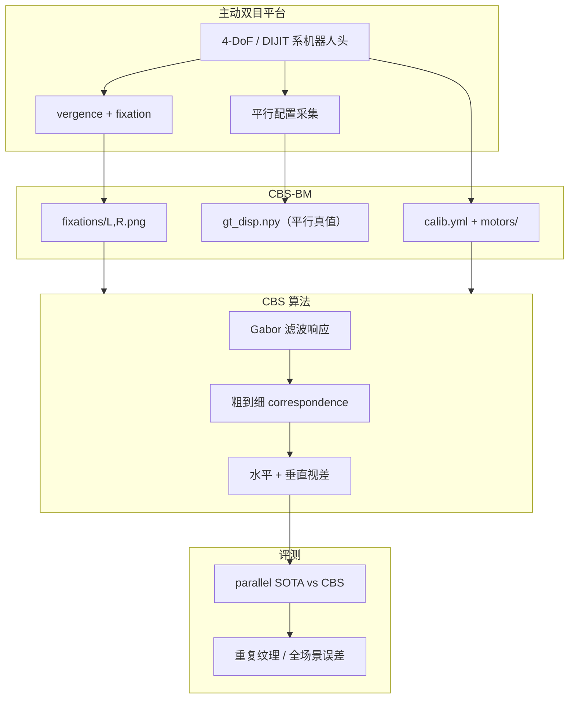
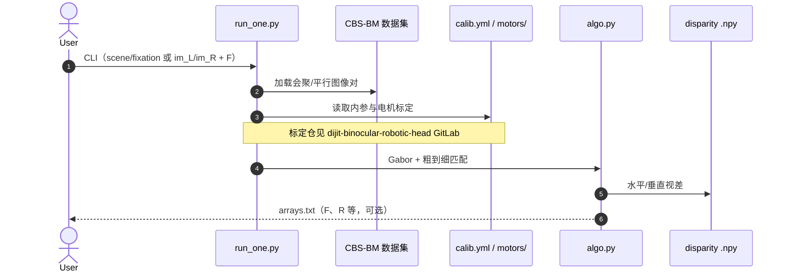

# Convergent Binocular Stereo（CBS）

**Convergent Binocular Stereo**（*Depth perception for humanoid robot vision*，Mingshi Chi / John K. Tsotsos，[*Science Robotics* 11(117)，2026-08-26](https://doi.org/10.1126/scirobotics.aec7205)）提出 **CBS** 算法与 **CBS-BM** 基准：在 **主动会聚双目** 几何下（两眼指向同一 fixation）同时估计 **水平与垂直视差**，补全人形仿生头「能 vergence 但不会算深度」的功能缺口。硬件侧与 [DIJIT](./paper-notebook-dijit-a-robotic-head-for-an-active-observer.md) 主动双目头同系；算法前身见 Chi 2025 MASc 论文 [*Convergent Active Stereo*](https://yorkspace.library.yorku.ca/items/75b1c95d-8bc9-441f-84a2-8f740a9d65c1)。

## 一句话定义

**人形主动双目不应把会聚几何硬塞回平行 stereo 管线，而应用 Gabor 粗到细在二维视差场上做对应搜索，并用 CBS-BM 证明会聚深度可与 parallel SOTA 同台竞技。**

## 英文缩写速查

| 缩写 | 英文全称 | 简要说明 |
|------|----------|----------|
| CBS | Convergent Binocular Stereo | 本文会聚双目立体算法 |
| CBS-BM | Convergent Binocular Stereo BenchMark | 49 场景自然图像会聚立体数据集 |
| DoF | Degrees of Freedom | CBS-BM 采集平台为 4-DoF 机器人系统 |
| vergence | Binocular Vergence | 两眼旋转使视线会聚于同一点 |
| version | Version Movement | 两眼同向共轭转动（改变 gaze 方向） |
| parallel stereo | Parallel Binocular Stereo | 光轴近似平行的经典双目假设与算法族 |

## 核心信息

| 项 | 内容 |
|----|------|
| **机构** | 约克大学（York University）EECS · Tsotsos Lab；Chi 亦属日本东北大学（Tohoku University）机器人系 |
| **DOI / 刊** | [10.1126/scirobotics.aec7205](https://doi.org/10.1126/scirobotics.aec7205) / *Science Robotics* 11(117)，2026-08-26（与 ZEST、Robot in a crib 同期卷期） |
| **平台** | 4-DoF 主动双目机器人系统采集 CBS-BM；标定链 DIJIT GitLab |
| **开源（截至 2026-09-17）** | **已开源**：Zenodo [10.5281/zenodo.21053380](https://doi.org/10.5281/zenodo.21053380)（MIT，`run_one.py` + CBS-BM）；DIJIT 标定 [GitLab](https://gitlab.nvision.eecs.yorku.ca/robots/dijit-binocular-robotic-head)。**无 GitHub 镜像** |

## 为什么重要

- **补「仿生头 × 深度算法」断层：** 许多人形头能 vergence/version，深度仍走 **平行 rectified stereo**；CBS 首个系统利用 **会聚几何** 做 purposeful depth computation。
- **视差是二维向量场：** 会聚配置下极线一般 **非水平**（对角 epipolar）；仅估 horizontal disparity 的 parallel 方法几何不成立——论文/学位论文均强调 diagonal correspondence search。
- **可复现基准 CBS-BM：** 首个 **自然图像会聚立体** 集：平行图 + 真值 + 多 fixation 会聚对 + 电机标定，支撑 parallel vs convergent **定量对照**。
- **工程上不必二选一：** CBS ** broadly competitive** with parallel SOTA，**重复纹理** 与 **全场景平均误差** 更优；但 **不意图** 取代不需要类人行为的 parallel 栈（参见 [立体匹配基础模型](../methods/stereo-matching-foundation-models.md)）。
- **与 DIJIT / 主动视觉线衔接：** 硬件 [DIJIT](./paper-notebook-dijit-a-robotic-head-for-an-active-observer.md) 补自由度与扫视；CBS 补 **会聚深度**；对比 [EATR-Stereo](./paper-eatr-stereo.md) 的 **VLA 内双目 token 融合** 是策略层另一路线。

## 流程总览

## 核心原理

### 会聚几何 vs 平行假设

- **Parallel stereo：** 光轴平行、极线水平 → 主流 FoundationStereo / IGEV / CREStereo 管线均隐含此假设（见 [立体匹配基础模型](../methods/stereo-matching-foundation-models.md)）。
- **Convergent stereo：** 两眼指向 **同一 3D 点**；视差含 **水平 + 垂直分量**，epipolar **可倾斜**——需 vector disparity 或二维搜索（学位论文明确「diagonal epipolar lines」）。

### CBS 算法

- **Gabor-filtered responses** 构建匹配代价。
- **Coarse-to-fine refinement** 搜索对应点。
- 同时输出 **horizontal & vertical disparity**，服务 **active binocular robots** 而非离线平行 rig。

### CBS-BM 结构（复现要点）

| 内容 | 说明 |
|------|------|
| 49 场景 | 索引 0–48 |
| 平行分支 | `L_parallel_rect.png`、`R_parallel_rect.png`、`gt_disp.npy` |
| 会聚分支 | 每场景 `fixations/<id>/{L,R}.png` + `fixations.csv`（电机 pan/tilt、像素 fixation） |
| 标定 | `calib.yml`（内参为原分辨率；图像 1/2 缩放需调焦距/主点）、`motors/L|R/` |

## 源码运行时序图

Zenodo 包入口为 `python3 run_one.py`；内存优化见 `algo.py` TODO。完整参数与 `plots/` 复现见 [Zenodo 归档](../../sources/repos/convergent_binocular_stereo_zenodo.md)。

## 评测与结果

- **对照轴：** **Parallel stereo 系统** vs **Convergent（CBS）** 在同一 CBS-BM 场景上。
- **主要结论（摘要级）：**
  - CBS 与 **state-of-the-art parallel 方法 broadly competitive**。
  - **重复纹理（repeated patterns）** 场景 CBS **优于** parallel。
  - **全场景平均水平视差与深度误差** CBS **优于** parallel。
- **定位：** 面向 **需要类人主动双目行为的人形头**；固定平行 rig / 车载双目仍优先 parallel FM（FoundationStereo 等）。

## 与其他工作对比

| 对照对象 | 几何假设 | 与 CBS 的关系 |
|----------|----------|---------------|
| Parallel stereo 基础模型（FoundationStereo / IGEV / CREStereo，见 [立体匹配基础模型](../methods/stereo-matching-foundation-models.md)） | 光轴平行、极线水平、仅估水平视差 | 同台 CBS-BM 下 broadly competitive；CBS 在 **重复纹理** 与 **全场景平均误差** 更优，但固定平行 rig 仍应优先 parallel 栈 |
| [DIJIT 主动双目头](./paper-notebook-dijit-a-robotic-head-for-an-active-observer.md) | 同系硬件，focus 在自由度与扫视 | 互补：DIJIT 提供 **会聚/扫视能力与标定链**，CBS 补上「会聚之后深度怎么算」 |
| [EATR-Stereo](./paper-eatr-stereo.md) | 双目 token 在 VLA 策略内融合 | 层级不同：EATR 在 **策略层** 吃双目，CBS 在 **metric stereo 前端** 解会聚几何 |
| [Now You See That](./paper-now-you-see-that-humanoid-vision-locomotion.md) | 立体深度驱动人形 locomotion RL | 下游消费者：CBS 输出 metric depth 后可接该类 loco/manip 感知链 |
| Chi 2025 MASc 前身工作 | 同会聚几何、diagonal epipolar 搜索 | CBS 是其期刊化演进：补 **CBS-BM 基准** 与 MIT 许可代码归档 |

定量对照表以原文与 [Zenodo 归档](../../sources/repos/convergent_binocular_stereo_zenodo.md) 的 `plots/analysis/` 为准。

## 工程实践

| 步骤 | 动作 |
|------|------|
| 1 | 下载 [Zenodo 21053380](https://doi.org/10.5281/zenodo.21053380)，解压 `cbs-convergent-binocular-stereo.zip` 与 `CBS-BM/CBS-BM.zip` |
| 2 | `git clone` [dijit-binocular-robotic-head](https://gitlab.nvision.eecs.yorku.ca/robots/dijit-binocular-robotic-head)（电机标定；CBS README 要求） |
| 3 | 示例：`python3 run_one.py --scene 5 --fixation 3 ...`（见 [Zenodo 归档](../../sources/repos/convergent_binocular_stereo_zenodo.md)） |
| 4 | 图表复现：解压 `plots.zip`，运行 `histogram_fig6.py` / `plots/analysis/` |
| 5 | 接入人形栈：CBS 输出 metric depth 后可接 loco/manip 感知（对照 [Now You See That](./paper-now-you-see-that-humanoid-vision-locomotion.md) 的立体深度 RL 线） |

## 局限与风险

- **不是 parallel FM 替代品：** 固定安装、不需 vergence 的机器人仍应优先 [FoundationStereo](../methods/stereo-matching-foundation-models.md) 等开源 parallel 栈。
- **分发体积大：** 代码包 ~2 GB，`plots.zip` ~17 GB；边缘设备需只取 `run_one.py` + 单场景。
- **内存：** `algo.py` 标注 memory intensive；大分辨率需按 README 降采样或改实现。
- **硬件耦合：** 真机复现依赖 DIJIT 系 **电机–相机标定**；无 GitHub 社区镜像与 CI。
- **期刊访问：** Science Robotics 正文 **closed access**（2027-08-26 起部分 OA 延迟）；算法与数据以 Zenodo + 学位论文 PDF 为主入口。

## 结论

**CBS 的价值不在刷 parallel benchmark 榜单，而在证明：会聚仿生头的 vergence 运动可以接上功能真实的深度计算——CBS-BM 与 Zenodo 代码把这条链路从「外观仿人」推进到「几何可算」。**

- 选型：固定平行双目 → parallel FM；**主动会聚人形头** → CBS + DIJIT 标定链。
- 重复纹理等 parallel 弱点场景，会聚二维视差搜索是 **可量化优势**，不是纯生物启发叙事。
- 与 [EATR-Stereo](./paper-eatr-stereo.md) 互补：后者在 **VLA 策略内** 融合双目 token；CBS 在 **metric stereo 前端** 解决会聚几何。
- 复现从 Zenodo `run_one.py` 起步，别跳过 **calib.yml 1/2 缩放** 与 `motors/` 标定。
- Sci. Robot. 11(117) 同期还有 ZEST / 视觉足球等——CBS 占 **感知前端几何**  niche，不替代全身控制论文线。

## 关联页面

- [立体匹配基础模型](../methods/stereo-matching-foundation-models.md) — parallel FM 选型轴
- [DIJIT 主动双目头](./paper-notebook-dijit-a-robotic-head-for-an-active-observer.md) — 同实验室硬件
- [EATR-Stereo](./paper-eatr-stereo.md) — 人形双目 + VLA
- [Now You See That](./paper-now-you-see-that-humanoid-vision-locomotion.md) — 立体深度 + 人形 locomotion
- [机器人视觉感知栈选型闭环](../queries/robot-perception-stack-selection-loop.md)

## 参考来源

- [convergent_binocular_stereo_scirobotics_2026.md](../../sources/papers/convergent_binocular_stereo_scirobotics_2026.md)
- [convergent_active_stereo_chi_masc_thesis_2025.md](../../sources/papers/convergent_active_stereo_chi_masc_thesis_2025.md)
- [convergent_binocular_stereo_zenodo.md](../../sources/repos/convergent_binocular_stereo_zenodo.md)
- [dijit-binocular-robotic-head.md](../../sources/repos/dijit-binocular-robotic-head.md)

## 推荐继续阅读

- Science Robotics 论文：<https://doi.org/10.1126/scirobotics.aec7205>
- Zenodo 代码与 CBS-BM：<https://doi.org/10.5281/zenodo.21053380>
- DIJIT 硬件论文：<https://arxiv.org/abs/2512.07998>
- 学位论文 PDF：<https://yorkspace.library.yorku.ca/items/75b1c95d-8bc9-441f-84a2-8f740a9d65c1>
