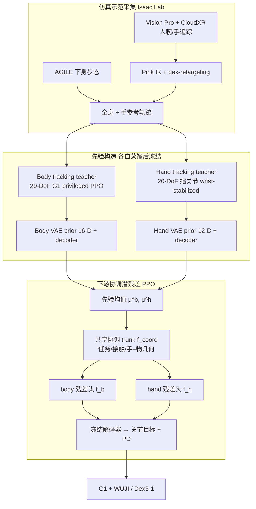

# CoorDex（Coordinating Body and Hand Priors for Continuous Dexterous Humanoid Loco-Manipulation）

**CoorDex**（arXiv:[2606.23680](https://arxiv.org/abs/2606.23680)，[项目页](https://skevinci.github.io/coordex/)，UNC Chapel Hill / UC Berkeley）提出面向 **连续高 DoF 灵巧人形 loco-manipulation** 的学习管线：不把行走与操作拆成停走两阶段，而是将 **29-DoF 全身** 与 **20-DoF 五指手** 分别蒸馏为 **冻结的 proprio 条件潜先验**（16-D body / 12-D hand），再用 **共享任务上下文 + 分体 body/hand 潜残差头** 的 PPO 在 Isaac Lab 中联合适配步态、腕位与指级接触。仿真在 **Unitree G1 + WUJI 手** 上完成 WalkGrab、OpenFridge、WalkPickTurn 三项技能；真机视频为 **G1+Dex3-1** 轨迹回放定性验证。

## 英文缩写速查

| 缩写 | 英文全称 | 简要说明 |
|------|----------|----------|
| CoorDex | Coordinating Body and Hand Priors for Dexterous Loco-Manipulation | 本文提出的 body–hand 潜先验协调残差框架 |
| DoF | Degrees of Freedom | 自由度；G1 身体 29 + WUJI 手 20 |
| PPO | Proximal Policy Optimization | 先验 tracking teacher 与下游残差策略均采用的 on-policy RL |
| VAE | Variational Autoencoder | 先验蒸馏用的 encoder–prior–decoder 结构（PULSE 同族） |
| RL | Reinforcement Learning | 下游在冻结先验潜空间上的残差强化学习 |
| IK | Inverse Kinematics | 示范采集时 Pink 求解器跟踪人腕目标 |
| RSI | Reference State Initialization | WalkPickTurn 用的 NoDemoRSI 课程式状态重置 |
| PD | Proportional-Derivative | 解码关节目标后的低层位置跟踪 |
| WUJI | Wuji Hand | 舞肌 20 主动 DoF 五指灵巧手，仿真主实验末端 |
| G1 | Unitree G1 Humanoid | 宇树 29-DoF 人形平台 |

## 为什么重要

- **把「边走边灵巧操作」从停走范式里拆出来：** 论文指出大量 loco-manip 仍是 **走近–停下–抓取**；CoorDex 用速度曲线与 WalkGrab 消融（对比 **86% stop rate** 的关节空间基线）证明可在 **~0.25 m/s 前进速度** 下完成抓抬。
- **不对称 body–hand 先验是核心归纳：** **Body prior** 负责步态、躯干、到达与 **腕位涌现**；**Wrist-stabilized hand prior** 在仿真中 **运动学固定腕**、只学 **指间协调**，避免 12-D 手潜码被 6D 腕运动占满——这是与「单手 monolithic 潜动作」不同的结构假设。
- **协调残差头有可证伪价值：** 与 Monolithic Latent Residual（同冻结先验、同 28-D 残差维）相比，分体头将成功率 **0%→55%**，body **action rate 0.40→0.22**，说明 **共享上下文 + 分通道修正** 优于单 MLP 劈裂残差。
- **工程管线完整可复用：** 仿真 XR 遥操作采参考 → privileged tracking teacher → VAE 蒸馏 → 冻结先验作 action space → 任务奖励 PPO；与 [ResMimic](./paper-resmimic.md) 的 GMT 残差、[HALOMI](./paper-halomi-humanoid-loco-manipulation.md) 的 VLA+稀疏头手接口形成 **控制层** 对照三角。

## 流程总览

## 核心机制（归纳）

### 1）先验：teacher → VAE 蒸馏 → 冻结

| 子系统 | Teacher 环境 | 控制维度 | 潜维 | 部署 proprio 要点 |
|--------|--------------|----------|------|-------------------|
| **Body** | 全身 G1+固定手型 | 29 身体关节 | 16 | 5 帧历史：$\omega_{\mathrm{base}}, q, \dot q, a_{t-1}$；**无基座线速度** |
| **Hand** | 腕位写入仿真的 floating hand | 20 指关节 | 12 | 腕系速度 + 指关节相对默认位 + 上一步手动作 |

蒸馏损失：teacher 动作 MSE + 潜码均值时序平滑 + encoder–prior KL（系数退火）。推理与 RL 期默认用 **prior mean** $\boldsymbol{\mu}^{x,p}_t$。

### 2）协调潜残差 actor

- **输入：** body/hand proprio 栈、物体与把手位姿（root + hand frame）、指尖接触力、投影重力、**冻结先验均值**、上一步 $\Delta z$。
- **输出：** $\Delta z^b \in \mathbb{R}^{16}, \Delta z^h \in \mathbb{R}^{12}$；$\tilde z = \mu + \Delta z$ 解码后经 **手目标 EMA(0.4)** 与身体槽位合并。
- **设计意图：** trunk 推理 **任务阶段与接触状态**；body 头调 **步态/躯干/腕位**，hand 头调 **预成形/闭合/接触精修**，避免单通道 MLP 抖动全身。

### 3）三项任务（仿真定量）

| 任务 | 交互结构 | 成功率 | 备注 |
|------|----------|--------|------|
| **WalkGrab** | 侧桌抓瓶–抬–搬 | **55%** | 主消融任务；fall **0%**；drop **40%** |
| **OpenFridge** | 抓把手边后退开门 | **66%** | 门角 **57.76°** / 60° 阈值 |
| **WalkPickTurn** | 取立方体转身 180° 持物 | **89%** | **NoDemoRSI** 辅助长时程 |

评估：**50k episodes**，**10k** 并行环境；成功需任务完成且保持平衡。

### 4）WalkGrab 动作空间消融（同 PPO 预算）

| 方法 | Success | Reach | Grasp | Stop | Fall |
|------|---------|-------|-------|------|------|
| All Joint Space | 0% | 100% | 0% | **86%** | 4% |
| Body Prior + Hand Joint | 0% | 96% | 1% | **90%** | 4% |
| Monolithic Latent Residual | 0% | — | — | — | 2% |
| **CoorDex** | **55%** | 100% | 55% | **0%** | 0% |

解读：关节空间基线常 **停住再抓**；仅 body 先验时腕能到位但 **指协调在关节空间不可学**；单体式潜残差能接近物体但 **躯干抖动、抓取失败**。

## 评测（论文报告）

**仿真（G1 + 20-DoF WUJI，Isaac Lab）：** 每项 **50k** eval episodes（**10k** 并行环境）；成功 = 任务完成条件满足且未摔倒。

| 任务 | 成功率 | Fall | Drop | 任务指标 |
|------|--------|------|------|----------|
| WalkGrab | 55% | 0% | 40% | 非停前进速度近瓶 ~0.25 m/s |
| OpenFridge | 66% | 0% | — | 门角 57.76° / 60° |
| WalkPickTurn | 89% | 1% | 10% | 最小航向误差 9.98° |

**真机（定性）：** G1 + **Dex3-1** 回放关节轨迹；**非** WUJI 配置的定量成功率。

## 真机与局限

- **仿真主结果：** G1 + **20-DoF WUJI**；训练与报告成功率均基于此配置。
- **真机视频：** 可用硬件为 G1 + **Dex3-1（7-DoF）**；展示为 **回放仿真关节轨迹** 的定性兼容性与 **换 hand teacher 重蒸馏** 的可扩展性，**不应与 WUJI 仿真成功率直接对比**。
- **观测：** 当前使用 **特权物体位姿与接触**；论文明确 **未做视觉 sim2real**。
- **课程：** WalkPickTurn 依赖任务特定 **NoDemoRSI**；更长时程与更多物体/hand 形态待扩展。

## 与其他工作对比

| 维度 | CoorDex | ResMimic | HALOMI |
|------|---------|----------|--------|
| 接口 | body/hand **潜先验 + 协调残差** | GMT **关节残差** | 稀疏头手 + **VLA** |
| 手 | **20-DoF 指级** 连续接触 | 多为夹爪/低维接触 | Pika **夹爪** |
| 移动操作形态 | **非停** 抓抬/开门 | 全身搬运 MoCap 残差 | 无机器人示范 + WBC |
| 先验来源 | 仿真 XR 示范 tracking | 人类 MoCap GMT | BFM-Zero 流形 |

## 关联页面

- [Loco-Manipulation](../tasks/loco-manipulation.md) — 任务语境与路线 §20
- [Manipulation](../tasks/manipulation.md) — 灵巧操作与高 DoF 手
- [ResMimic](./paper-resmimic.md) — GMT→残差 loco-manip 对照
- [HALOMI](./paper-halomi-humanoid-loco-manipulation.md) — 数据驱动/VLA 路线对照
- [Privileged Training](../concepts/privileged-training.md) — teacher–student 先验蒸馏
- [Whole-Body Tracking Pipeline](../concepts/whole-body-tracking-pipeline.md) — 运动跟踪 teacher 语境
- [BeyondMimic](../methods/beyondmimic.md) — body tracking teacher 设计来源
- [Unitree G1](./unitree-g1.md)
- [舞肌 Wuji Hand](./wuji-robotics.md)

## 参考来源

- [sources/papers/coordex_arxiv_2606_23680.md](../../sources/papers/coordex_arxiv_2606_23680.md)
- Li et al., *CoorDex: Coordinating Body and Hand Priors for Continuous Dexterous Humanoid Loco-Manipulation*, arXiv:2606.23680, 2026. <https://arxiv.org/abs/2606.23680>

## 推荐继续阅读

- [CoorDex 项目主页](https://skevinci.github.io/coordex/)
- [arXiv:2606.23680 全文](https://arxiv.org/html/2606.23680v1)
- [PULSE（Physics-based Universal Latent Space）](https://arxiv.org/abs/2109.07416) — 潜技能空间蒸馏动机来源
- [ResMimic 项目页](https://resmimic.github.io/) — 另一路全身 loco-manip 残差学习
