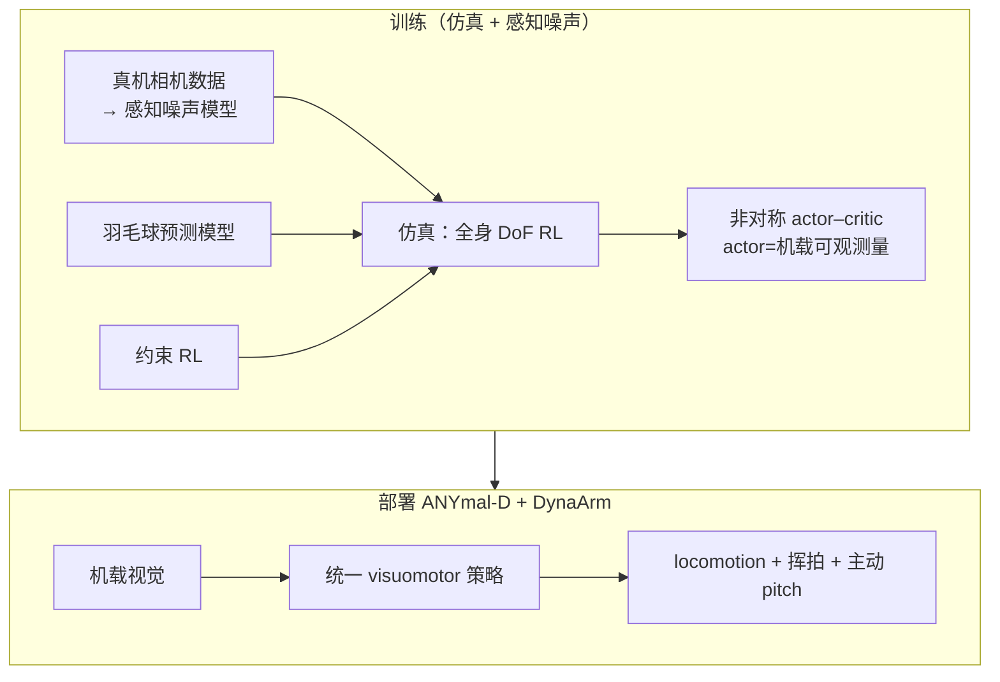
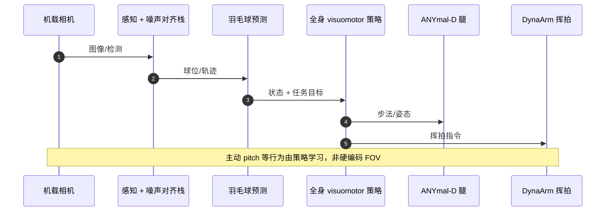

# Learning Coordinated Badminton Skills（ANYmal 四足羽毛球）

**Learning coordinated badminton skills for legged manipulators**（Ma / Cramariuc / Farshidian / Hutter 等，**Science Robotics 2025**，[DOI:10.1126/scirobotics.adu3922](https://doi.org/10.1126/scirobotics.adu3922)）在 **ANYmal-D + DynaArm** 上实现 **仅机载感知** 的自主羽毛球：用 **统一 RL 全身 visuomotor 策略** 同时协调 **追踪、步法、挥拍**；以 **真机相机标定的感知噪声模型** 对齐 sim–real 并学 **主动感知**；结合 **羽毛球预测** 与 **约束 RL** 提升部署鲁棒性。真机与人对打、多环境（含户外有风），单回合最多 **10 连拍**，挥拍速度最高 **12.06 m/s**（[项目页](https://articuno144.github.io/Learning-agile-badminton-skills/)）。

## 一句话定义

**用一条可部署的非对称 RL 全身策略，让四足移动操作臂在真实感知噪声下完成羽毛球追球与击球，并把「何时看、何时动」交给学习而非手写 FOV 规则。**

## 英文缩写速查

| 缩写 | 英文全称 | 简要说明 |
|------|----------|----------|
| RL | Reinforcement Learning | 统一全身 visuomotor 策略训练 |
| WBC | Whole-Body Control | 腿 + 臂 + 感知协同 |
| RSL | Robotic Systems Lab | ETH Zurich 机器人系统实验室 |
| RAI | Robotics and AI Institute | 与 ETH 合作机构之一 |
| DoF | Degrees of Freedom | 策略覆盖全身自由度 |
| Sim2Real | Simulation to Reality | 感知噪声模型桥接仿真与部署 |

## 为什么重要

- **动态 loco-manipulation 标杆：** 羽毛球同时要求 **快速球路、精确击球时刻、全场步法** — 比静态抓取/搬运更贴近「运动 + 操作 + 感知」闭环。
- **四足 vs 人形羽毛球谱系：** 与 [人形 Multi-Stage 羽毛球](./paper-notebook-humanoid-whole-body-badminton-via-multi-stage-re.md)、[LHBS](./paper-notebook-learning-human-like-badminton-skills-for-humanoi.md) 并列，展示 **腿式移动操作臂** 在竞技场景的可行性（Science Robotics 期刊背书）。
- **感知–控制 co-design：** **Perception-aware training** + **主动感知 emergent 行为** — 对 [ANYmal](./anymal.md) 上 visuomotor / 机载相机部署有参考意义。
- **非对称 actor–critic 部署读法：** 部署策略 **只看机载可观测量**，避免 teacher/student 行为分叉的常见 privileged learning 陷阱（项目页强调）。

## 核心信息

| 项 | 内容 |
|----|------|
| **机构** | 苏黎世联邦理工学院（ETH Zurich）RSL；Robotics and AI Institute（RAI）等 |
| **平台** | ANYmal-D + DynaArm |
| **感知** | **仅机载**（训练含真实相机噪声模型） |
| **期刊** | Science Robotics，2025-05-28 |
| **项目 / 视频** | [articuno144 项目页](https://articuno144.github.io/Learning-agile-badminton-skills/) · [YouTube](https://youtu.be/zYuxOVQXVt8) |
| **ETH** | [新闻](https://ethz.ch/en/news-and-events/eth-news/news/2025/08/playing-badminton-against-a-robot.html) · [Research Collection](https://www.research-collection.ethz.ch/items/ab676cdd-86d0-48b0-b255-303cb98f2485) |
| **开源** | **未开源**（2026-09-26：项目页/ETH 入口均无官方训练代码或权重） |

## 流程总览

## 核心原理（归纳）

| 模块 | 作用 |
|------|------|
| **统一 RL 策略** | 单策略覆盖感知–locomotion–manipulation，全 DoF 击球 |
| **感知噪声模型** | 用真实相机统计对齐 sim/deploy 感知误差，促 **主动感知** |
| **Shuttlecock prediction** | 辅助轨迹估计与击球时机 |
| **Constrained RL** | 约束下学习更稳、可部署的运动 |
| **非对称 AC** | Critic 特权信息；Actor 可部署观测空间 |

### 涌现行为（项目页）

- **距离自适应步态：** 近目标少动，远目标 gallop  
- **时间紧迫度：** 可用时间少时动作更激烈  
- **主动感知：** 挥拍前 pitch 保球在视野内  
- **战术习惯：** 击球后回中场  

## 源码运行时序图

**不适用**（截至 **2026-09-26**）：官方 **未发布** 训练/部署代码仓。预期运行时（待开源后对齐）：

## 实验与评测（摘要）

| 维度 | 归档口径 |
|------|----------|
| **对手** | 人类球员；维持 **长回合**（最多 **10 连拍**） |
| **挥拍** | 最高 **12.06 m/s** |
| **环境** | 多样场地；**户外有风** |
| **感知** | **仅机载** 自主对打 |
| **细节指标** | 本页不转存全文表格 — 见 [Science Robotics PDF](https://www.science.org/doi/10.1126/scirobotics.adu3922) |

## 与其他工作对比

| 对照 | 差异读法 |
|------|----------|
| [人形 Multi-Stage Badminton](./paper-notebook-humanoid-whole-body-badminton-via-multi-stage-re.md) | 人形 + 三阶段课程 + MoCap/EKF；本文 **四足 + 统一 visuomotor + 机载相机噪声** |
| [LHBS](./paper-notebook-learning-human-like-badminton-skills-for-humanoi.md) | 拟人 AMP + Imitation-to-Interaction；本文 **无 MoCap 挥拍先验** 叙事 |
| [ANYmal 实体](./anymal.md) | 平台载体；本文是 **RSL 动态 loco-manip + 体育** 代表作之一 |

## 工程实践

| 项 | 建议 |
|----|------|
| **复现** | 2026-09-26 **无官方代码** — 先读 DOI 全文 + [演示视频](https://youtu.be/zYuxOVQXVt8) |
| **平台** | ANYmal-D + 臂系；感知栈需 **噪声模型** 思路，非单纯几何 sim2real |
| **体育谱系** | 与 [人形拳击纵深 Stage 5](../../roadmap/depth-humanoid-boxing.md)「快速物体交互」同读 |
| **勿混** | 非人形 WBC 论文的 **像素 WM** 或 **VLA** 路线 |

## 局限与风险

- **未开源：** 无法本地复现 RL 环与感知噪声标定流程。  
- **形态专用：** 结论建立在 **四足 + DynaArm**；项目页称 **人形仿真有初步结果**，真机泛化待证。  
- **竞技深度：** 强调 **协调与对打可行性**，非职业战术 AI。  
- **感知单模态：** 未来工作提及声音/多相机（项目页 Future work）。

## 结论

**Science Robotics 此文证明：在感知噪声对齐与非对称 RL 下，四足移动操作臂可仅凭机载视觉与人进行多拍羽毛球对打，主动感知与步态自适应可涌现；工程复现仍待官方代码。**

1. **真影响：统一 visuomotor** — 一条策略覆盖 **看 + 走 + 挥**，适合动态 loco-manip 选题。  
2. **真影响：感知噪声训练** — 把 **相机误差** 写进 RL 环，比纯几何域随机更贴 **主动感知**。  
3. **真影响：ANYmal 体育样本** — 与工业巡检叙事互补，展示 **SEA 四足 + 臂** 的动态交互上限。  
4. **与人形线对照：** 人形条目重 **课程/MoCap**；本文重 **机载感知 + 期刊级四足实证**。  
5. **开源：** **未开源** — 选型时按 **论文 + 视频** 评估，勿假设 ETH 训练栈可下载。  
6. **延伸：** 战略层策略、多模态感知、人形迁移 — 见项目页 Future directions。

## 关联页面

- [ANYmal 四足机器人](./anymal.md)
- [Loco-Manipulation 任务](../tasks/loco-manipulation.md)
- [人形全身羽毛球 Multi-Stage RL](./paper-notebook-humanoid-whole-body-badminton-via-multi-stage-re.md)
- [LHBS 拟人羽毛球](./paper-notebook-learning-human-like-badminton-skills-for-humanoi.md)
- [人形拳击纵深（体育谱系）](../../roadmap/depth-humanoid-boxing.md)
- [人形足球纵深](../../roadmap/depth-humanoid-soccer.md)

## 参考来源

- [Science Robotics 论文归档](../../sources/papers/coordinated_badminton_skills_scirobotics_adu3922.md)
- [项目页 / ETH 入口归档](../../sources/sites/coordinated_badminton_eth_articuno.md)

## 推荐继续阅读

- [Science Robotics 全文](https://www.science.org/doi/10.1126/scirobotics.adu3922)
- [项目页](https://articuno144.github.io/Learning-agile-badminton-skills/)
- [ETH 新闻：Playing badminton against a robot](https://ethz.ch/en/news-and-events/eth-news/news/2025/08/playing-badminton-against-a-robot.html)
- [演示视频](https://youtu.be/zYuxOVQXVt8)
