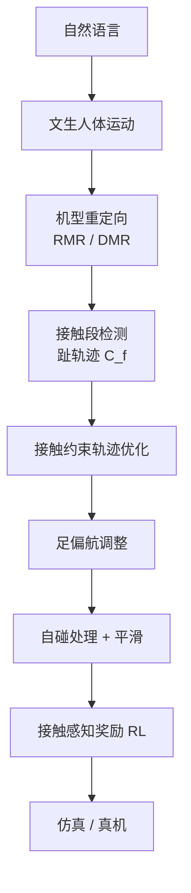
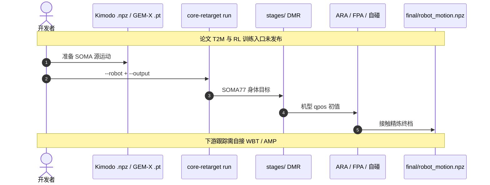

# CoRe（接触感知优化与学习的人形运动）

**CoRe**（*Contact-aware motion Refinement*；论文 *CoRe: A Hybrid Approach of Contact-Aware Optimization and Learning for Humanoid Robot Motions*，[Humanoids 2025](https://doi.org/10.1109/Humanoids65713.2025.11203055)，[项目页](https://tmjeong1103.github.io/CoRe-page/)）由 **高丽大学（Korea University）**、**韩国科学技术研究院（KIST）**、**伊利诺伊大学厄巴纳-香槟分校（UIUC）** 提出：在 RL 跟踪之前，用接触段检测与接触约束优化把文本生成的人体运动修成可执行参考，再以接触感知奖励训策略。

> **同名消歧：** 本文是人形 **运动重定向 + 精炼 + RL**。可变形世界模型见 [PhysCoRe](./paper-physcore.md)。工程实现见 [CoRe 软件](./core-retarget.md)。

## 一句话定义

**先把参考修到接触可行，再让 RL 学跟踪——而不是把脚滑和浮空留给策略去补。**

## 英文缩写速查

| 缩写 | 英文全称 | 简要说明 |
|------|----------|----------|
| CoRe | Contact-aware motion Refinement | 本文接触感知精炼与混合管线 |
| RL | Reinforcement Learning | 精炼之后的物理模仿阶段 |
| T2M | Text-to-Motion | 管线最上游的文生人体运动 |
| IK | Inverse Kinematics | 机型重定向与落脚求解 |
| Sim2Real | Simulation to Real | 项目页展示的真机迁移 |

## 为什么重要

- **打在「只靠 RL」的痛点：** 文生运动看起来像人，但初始运动学不可行会让跟踪不稳。CoRe 把脚滑、浮空、过加速当作 **参考层问题**。
- **精炼与学习分工清楚：** 优化管接触与碰撞，RL 管鲁棒执行；对应 [Pipeline](../concepts/motion-retargeting-pipeline.md) 的「几何映射 → 物理修补 → 跟踪」。
- **跨具身、少调参：** 项目页称同一管线覆盖全身 / 轮式 / 上身人形，无需逐任务调参或动力学级优化。

## 核心信息

| 项 | 内容 |
|----|------|
| **机构** | 高丽大学（Korea University）；韩国科学技术研究院（KIST）；伊利诺伊大学厄巴纳-香槟分校（UIUC） |
| **会议** | Humanoids 2025，pp. 293–300 |
| **平台** | 项目页：全身、轮式、上身三类人形；软件侧另绑 11 台商用人形 |
| **开源** | **部分开源：** [tmjeong1103/CoRe v0.1.0](https://github.com/tmjeong1103/CoRe/releases/tag/v0.1.0) 覆盖重定向+精炼；**T2M 与 RL 训练未发布** |
| **预印本** | 截至 2026-08-15 **无 arXiv**；以项目页 + IEEE 为准 |

## 核心原理 / 方法栈

1. **Contact Segment Detection** — 趾轨迹识别可靠足–地接触。
2. **Contact-Constrained Trajectory Optimization** — 消脚滑与浮空，平滑基座。
3. **Feet Orientation Adjustment** — 支撑相足偏航。
4. **Collision-handling and Smoothing** — 自碰位置修正与突变抑制。
5. **RL** — 精炼运动 + 接触段进入模仿学习，奖励显式对齐接触。

前端重定向的跨骨架统一见姊妹工作 [RMR](./paper-rmr.md)。

## 源码运行时序图

论文宣称的 T2M / RL **不在** 公开仓。可运行路径是软件仓的精炼管线，节点对齐 [`sources/repos/core_retarget.md`](../../sources/repos/core_retarget.md)：

- **最短复现：** 见 [CoRe 软件 · 源码运行时序图](./core-retarget.md#源码运行时序图)。
- **不要期待：** 仓内没有论文级 text-to-motion 或 PPO 训练脚本。

## 工程实践

| 项 | 读法 |
|----|------|
| 何时用论文叙事 | 文生/估计人体运动要进 RL，且已观察到脚滑、浮空 |
| 何时用软件 | 已有 Kimodo / GEM-X SOMA 文件，要多机预览与安全 `.npz` |
| 与 GMR 分工 | GMR 覆盖格式与在线遥操；CoRe 覆盖 SOMA 输入 + 接触制品 |
| 真机 | 项目页展示 sim-to-real；软件仍标注「先仿真再上机」 |
| 复现数字 | IEEE 全文表格未开放；先用项目页视频与软件示例验收 |

## 实验与评测

项目页（非 IEEE 全文表）给出的证据：

- 同一管线迁移到 **全身、轮式、上身** 三类具身。
- 任务跨度：上身手势 → 全身 locomotion。
- 声称 **无任务特定调参、无动力学级优化**。
- 展示仿真到真机的可迁移性。

量化对比表待 IEEE / 预印本补录。

## 结论

**真正拉开差距的是「RL 之前把接触修对」，而不是再堆一个跟踪奖励；开源仓目前只兑现了精炼前半段。**

1. **真影响：参考层接触** — 脚滑 / 浮空应在优化里消，而不是交给策略硬补。
2. **真影响：接触进奖励** — 精炼段与 RL 奖励共用接触日程，避免「修了参考、训时又对不齐」。
3. **真影响：跨具身少调参** — 适合先看三类平台视频，再决定是否接入自有跟踪栈。
4. **次要代价：全文数字在付费墙后** — 选型先看视频与软件输出，不要引用未核对的 IEEE 表。
5. **部署读法：软件 ≠ 论文全栈** — v0.1.0 可出参考轨迹；T2M 与 RL 需自接 [Kimodo](./kimodo.md) / [BeyondMimic](../methods/beyondmimic.md) 等。
6. **工程读法：先跑 HF Space** — 用捆绑 `foot_walk_stop` / `scurry_walk` 看 11 机接触是否可接受。

## 与其他工作对比

| 对照 | 差异读法 |
|------|----------|
| [GMR](../methods/motion-retargeting-gmr.md) | 运动学前端；CoRe 在其后加接触优化，并主张再接 RL |
| [RMR](./paper-rmr.md) | 姊妹：canonical rig + 方向向量；CoRe 接接触精炼与学习 |
| [ReActor](../methods/reactor-physics-aware-motion-retargeting.md) | 参考形变与 RL **同环**；CoRe 是 **先优化、再 RL** |
| [DynaRetarget](../methods/dynaretarget-sbto-motion-retargeting.md) / [KDMR](./paper-kdmr.md) | 动力学 / GRF 级 TO；CoRe 自称不做动力学级优化 |
| [PhysCoRe](./paper-physcore.md) | 仅同名；对象是可变形世界模型 |

## 局限与风险

- **开源不完整：** 无法复现论文 RL 表；只能复现精炼软件。
- **无预印本：** 接触检测阈值、奖励权重等以 IEEE 为准，项目页只有定性步骤。
- **精炼仍是运动学+接触几何：** 不替代全身动力学可行化（对照 KDMR / DSMS / SBTO）。
- **输入依赖生成/估计质量：** 上游 T2M 漂得厉害时，接触段检测会跟着错。

## 关联页面

- [CoRe 软件 v0.1.0](./core-retarget.md)
- [RMR](./paper-rmr.md)
- [Motion Retargeting](../concepts/motion-retargeting.md) / [Pipeline](../concepts/motion-retargeting-pipeline.md)
- [GMR](../methods/motion-retargeting-gmr.md) / [ReActor](../methods/reactor-physics-aware-motion-retargeting.md)
- [Kimodo](./kimodo.md)
- [PhysCoRe（同名消歧）](./paper-physcore.md)

## 参考来源

- [CoRe Humanoids 2025 论文归档](../../sources/papers/core_humanoids_2025.md)
- [CoRe 项目页归档](../../sources/sites/core-page.md)
- [CoRe 仓库归档](../../sources/repos/core_retarget.md)

## 推荐继续阅读

- 项目页：<https://tmjeong1103.github.io/CoRe-page/>
- IEEE：<https://doi.org/10.1109/Humanoids65713.2025.11203055>
- 软件：<https://github.com/tmjeong1103/CoRe>
