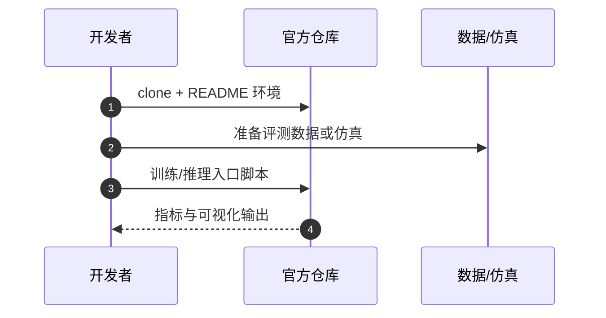

# CoRef-GS（arXiv:2609.20586）

**CoRef-GS**（*Cooperative Referring Gaussian Splatting for Multi-Agent Scene Understanding*，[arXiv:2609.20586](https://arxiv.org/abs/2609.20586)，[代码](https://github.com/ruojiruoli17/CoRef-GS)）来自 [具身智能小站 10 篇盘点](../../sources/blogs/wechat_embodied_station_10_papers_contact_wm_2026-09-18.md)（策展档位：**跟进**）。

## 一句话定义

**多机器人局部 Gaussian map 几何/语义对齐 + view-conditioned mask relation graph grounding；提出 CoQuad-Ref 基准。**

## 英文缩写速查

| 缩写 | 英文全称 | 简要说明 |
|------|----------|----------|
| WAM | World-Action Model | 联合预测未来观测与动作的策略 |
| VLA | Vision-Language-Action | 视觉–语言–动作策略 |
| SR | Success Rate | 任务成功率 |
| IL | Imitation Learning | 模仿学习 |
| GS | Gaussian Splatting | 高斯溅射三维表示 |

## 为什么重要

- 公众号将本文归入「接触时视觉之外还需预测什么」专题；跟进档位。
- **（待论文正式披露）**；开源结论：**已开源**（步骤 2.5，2026-09-18）。
- 与 tactile/WAM、主动视角、多智能体场景理解、Sim2Real、人形导航等主线交叉。

## 核心机制

| 项 | 内容 |
|----|------|
| **arXiv** | [2609.20586](https://arxiv.org/abs/2609.20586) |
| **开源** | **已开源** |
| **策展摘要** | 多机器人局部 Gaussian map 几何/语义对齐 + view-conditioned mask relation graph grounding；提出 CoQuad-Ref 基准。 |

## 源码运行时序图

节点对齐 [`sources/repos/coref-gs.md`](../../sources/repos/coref-gs.md) 与 README 入口。

## 实验与评测

- 定量指标与 baseline 协议以 arXiv PDF 与项目页为准；本页为清单级摘要。
- 读法：先确认任务设定（仿真/真机、传感器、成功定义）再对比 SR/延迟/路径长度等 headline 数字。

## 与其他工作对比

> 本页为清单级摘要，下表只做**定位对照**：CoQuad-Ref 上的结果未与下列各页核对同一评测协议，不可横比。

| 对照 | 差异读法 |
|------|----------|
| [Gaussian-LIC2](./paper-gaussian-lic2.md) | 同为 Gaussian map，止步点不同：Gaussian-LIC2 解决**建图本身**（LiDAR–惯性–相机耦合出图），CoRef-GS 接在建好的多机局部图之后做对齐与指代。选型先确认缺的是图，还是图上的语义 |
| [ParticleSplat](./paper-particlesplat.md) | 同批次另一条 GS 路线，服务对象相反：ParticleSplat 把 GS 压成对象中心粒子喂策略，CoRef-GS 把多智能体 GS 拼起来喂语言指代。一个朝**控制**收敛，一个朝**理解**发散 |
| [INSPECT](./paper-inspect-view-selection.md) | 同批次里同样在解「视野不够」，手段相反：INSPECT 让单机器人**主动换视角**，CoRef-GS **合并已有视角**。前者花动作预算，后者花通信与对齐预算 |
| [导航 / SLAM / 自主栈](../overview/navigation-slam-autonomy-stack.md) | 该页给多机建图与导航的栈位；CoRef-GS 落在「共享地图之上的指代理解」层，不替代前端里程计或回环 |
| [10 篇技术地图](../overview/contact-wm-10-papers-technology-map.md) | 同批次横向对照入口：本文列 **跟进** 档位 |

## 结论

**CoRef-GS 代表「跟进」档位的 gaussian-splatting 方向样本——部署前以开源状态与评测协议为准绳。**

1. 开源状态：**已开源**；勿凭 PDF 臆断可复现性。
2. 与同专辑 [Agile-WAM](./paper-agile-wam.md) / [INSPECT](./paper-inspect-view-selection.md) 等形成「触觉 WAM → 主动视角 → 系统平台」阅读链。
3. 若做工程选型，先对齐传感器栈与任务是否匹配文内设定。
4. 关注项目页/arXiv 版本更新与代码发布。

## 关联页面

- [vla](../methods/vla.md)
- ./paper-gaussian-lic2.md
- [navigation-slam-autonomy-stack](../overview/navigation-slam-autonomy-stack.md)
- [model-context-protocol](../concepts/model-context-protocol.md)
- [10 篇技术地图](../overview/contact-wm-10-papers-technology-map.md)

## 参考来源

- [coref_gs_arxiv_2609_20586.md](../../sources/papers/coref_gs_arxiv_2609_20586.md)
- [wechat_embodied_station_10_papers_contact_wm_2026-09-18.md](../../sources/blogs/wechat_embodied_station_10_papers_contact_wm_2026-09-18.md)
- [arXiv:2609.20586](https://arxiv.org/abs/2609.20586)

## 推荐继续阅读

- [arXiv PDF](https://arxiv.org/pdf/2609.20586)
