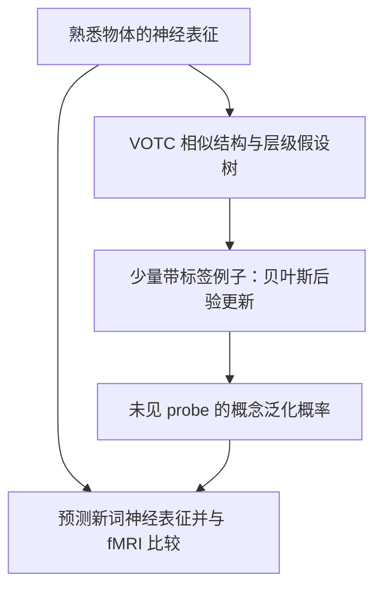

# Cortical knowledge structures guide word concept learning

**Cortical knowledge structures guide word concept learning** 是北京大学与北京师范大学团队发表于 *Nature Communications* 的认知神经科学研究：提出 Neural Bayesian Model（NBM），以腹侧枕颞皮层（VOTC）对熟悉物体的神经表征构造先验概念树，再通过贝叶斯更新解释少量样例下的新词学习和泛化。

## 英文缩写速查

| 缩写 | 英文全称 | 简要说明 |
|------|----------|----------|
| NBM | Neural Bayesian Model | 以神经表征构造概念学习先验的贝叶斯模型 |
| VOTC | Ventral Occipitotemporal Cortex | 本研究提供熟悉物体结构化神经先验的皮层区域 |
| fMRI | Functional Magnetic Resonance Imaging | 测量不同物体诱发脑活动模式的成像方法 |
| BBM | Behavioral Bayesian Model | 用行为语义相似度构造概念学习先验的贝叶斯基线 |
| LLM | Large Language Model | 论文比较的人类概念泛化行为拟合对象 |

## 核心信息

| 项 | 内容 |
|----|------|
| **作者** | Guangyao Zhang、Xiaosha Wang、Dingchen Zhang、Siwen Xie、Lusha Zhu、Yanchao Bi |
| **机构** | 北京大学、北京师范大学及相关认知神经科学 / 人工智能研究单位 |
| **发表** | Nature Communications 17, Article 6366（2026-05-13）；DOI: 10.1038/s41467-026-72868-w |
| **开放材料** | 论文声明数据、源数据、刺激和自定义代码托管于 OSF；本次未核验文件级目录 |

## 为什么重要

- **把先验知识促进少样本概念学习落到可测神经表征上。** 行为层贝叶斯词学习模型可以描述人如何推广新词，本文进一步让候选词义空间来自脑区物体表征结构。
- **揭示知识结构与推断机制的配合。** 拥有丰富语义表示本身并不保证在特定少样本任务上复制人类的泛化方式；模型如何利用先验同样重要。
- **对具身智能的启发是问题设定层面的。** 机器人若从少量示例学习开放词汇概念，可能需要显式组织已有感知经验；本文提供人类概念学习的神经证据，但没有直接提出或验证机器人算法。

## 核心原理

### 方法栈：神经先验如何变成概念泛化

实验分两阶段：先独立测量熟悉对象的神经相似结构，再让参与者在扫描仪内学习新词并做泛化判断。NBM 将第一阶段测得的对象表征组织为树状假设空间；树节点表示潜在词义类别。模型依据树结构设置先验，结合已标注例子计算候选类别的似然与后验，最后把包含 probe 对象及学习例子的假设后验概率求和，得到 probe 属于新词概念的概率。

关键点是先验树来自独立物体表征实验，学习例子再对这个结构化假设空间进行更新；因此 NBM 并不是只对 exemplar 求平均的模型。

## 实验与评测

- **实验结构：** 核心 fMRI 实验 20 名参与者，涉及 58 个物体；包括动物、人脸、人工制品和新奇形状。实验 1 获取物体诱发神经表征，实验 2 学习由少数例子指示的新词概念，并判断新 probe 是否属于该词。
- **熟悉物体：** VOTC 神经先验 NBM 可预测新词概念的神经表征及参与者泛化行为，并优于无先验、打乱神经先验等控制模型；相较行为贝叶斯先验也有增量预测力。
- **脑区差异：** 海马、腹内侧前额叶和背内侧前额叶使用各自神经先验时，没有稳定预测熟悉物体下的概念表征或泛化。不能由此推出这些区域不参与学习，作者讨论了组间表征差异与实验测量边界。
- **新奇形状：** 先验较弱的形状条件试次量较少；对该条件的行为结果应谨慎解释，论文也报告 NBM 与 GPT-4o 的差异不显著。
- **LLM 对照：** 作者测试 GPT-4o-2024-11-20 和 Qwen2.5-VL；每个试次在独立会话重复 20 次，比较「是」回答比例与人类行为的相关。混合神经与行为先验的贝叶斯模型在熟悉物体条件下拟合更好。

### 与其他工作对比

| 对照 | 假设空间来源 | 该论文结果的含义 |
|------|--------------|------------------|
| 行为贝叶斯模型（BBM） | 参与者的行为语义距离 | 神经先验 NBM 在 VOTC 表征结构上提供额外预测信息 |
| Prior-free / 神经均值模型 | 不含结构先验或仅汇总相关对象 | 结构化 VOTC 先验能解释超出 exemplar 汇总的变化 |
| GPT-4o、Qwen2.5-VL | 预训练多模态模型的任务回答 | 在指定熟悉物体任务上，贝叶斯组合模型更接近人类泛化；结论受任务与模型版本限制 |

## 结论

**本文最有价值的证据是：熟悉物体的 VOTC 神经表征结构可作为先验，帮助解释少样本新词概念学习与行为泛化；它不是对所有「秒懂」现象或机器人学习的普遍证明。**

1. **区分知识表征与推断机制：** 结构化长期物体表征为候选词义提供先验，样例再更新后验。
2. **优先读熟悉物体结果：** NBM 的主要支持来自 VOTC、先验丰富条件下的神经表征与行为泛化预测。
3. **不要过度解读脑区差异：** 海马和前额叶的阴性结果只适用于本文测量、样本与模型构造。
4. **把 LLM 结果限定在实验协议内：** 模型版本、中文提示、独立会话与重复采样均会影响行为比较。
5. **具身学习应用仍待验证：** 该论文没有机器人实验；将它迁移为机器人算法需要另行设计表征、先验构造和在线泛化评测。

## 源码运行时序图

**不适用（作为运行时序图）**：论文声明 OSF 提供支持研究的自定义代码，但本次无法核对档案中的可执行入口、依赖锁定和完整运行步骤；没有可验证的官方训练 / 推理程序或设备 IO 时序可绘制。复现前应先检查 OSF 文件清单和代码说明。

## 工程实践

| 项目 | 可复用的研究读法 |
|------|----------------|
| 先验与样例分离 | 先独立测量知识结构，再检验少量新标签如何更新概念假设 |
| 评估泛化而非背诵 | 用未见 probe 的类别判断或概率预测，区分记忆样例与概念扩展 |
| 模型比较 | 设置 prior-free、先验打乱、行为先验等消融，识别结构先验的增益 |
| 面向机器人迁移 | 可将既有物体/场景记忆作为候选先验，但需在开放词汇操控或导航任务中实测，不能直接将本文结果当作机器人性能证据 |

## 局限与风险

- **样本规模有限：** 核心 fMRI 样本为 20 人；推广到不同年龄、语言和文化群体仍需验证。
- **概念领域有限：** 实验使用 58 个物体及特定任务中的新词，不能代表一般知识、抽象概念或真实自然语言习得。
- **新奇形状条件统计功效较低：** 部分条件试次数少；不显著结果并不等于不存在机制。
- **区域阴性结果有解释边界：** 海马、VMPFC、DMPFC 的模型预测失败不能直接说明脑区不参与。
- **可复现材料需要逐件核验：** 论文将数据和自定义代码指向 OSF，但未验证档案是否含完整预处理数据、环境说明及一键运行脚本。
- **机器人关联是研究启发，不是实证迁移：** 论文没有机器人平台、控制策略或真实环境部署实验。

## 关联页面

- [贝叶斯信念分析](../concepts/bayesian-belief-analysis.md) — 对照概念假设空间的贝叶斯更新与 POMDP 状态信念更新
- [深度学习基础](../concepts/deep-learning-foundations.md) — 机器学习表示及其与结构化归纳机制的关系
- [具身语义认知地图](../concepts/embodied-semantic-cognitive-map.md) — 机器人长期语义记忆的工程问题，与人类概念学习的跨域联系

## 参考来源

- [论文来源归档](../../sources/papers/zhang_2026_cortical_knowledge_word_concept_learning.md)
- [Nature Communications 论文全文](https://www.nature.com/articles/s41467-026-72868-w)
- [OSF 数据与代码（论文声明）](https://doi.org/10.17605/OSF.IO/WRT9S)
- [Supplementary Information](https://media.springernature.com/original/springer-static/esm/art%3A10.1038%2Fs41467-026-72868-w/MediaObjects/41467_2026_72868_MOESM1_ESM.pdf)

## 推荐继续阅读

- [Xu & Tenenbaum (2007), Word learning as Bayesian inference](https://doi.org/10.1037/0033-295X.114.2.245) — 词概念学习的经典贝叶斯行为模型
- [Nature Communications 原文](https://www.nature.com/articles/s41467-026-72868-w) — 完整方法、统计结果与作者讨论
