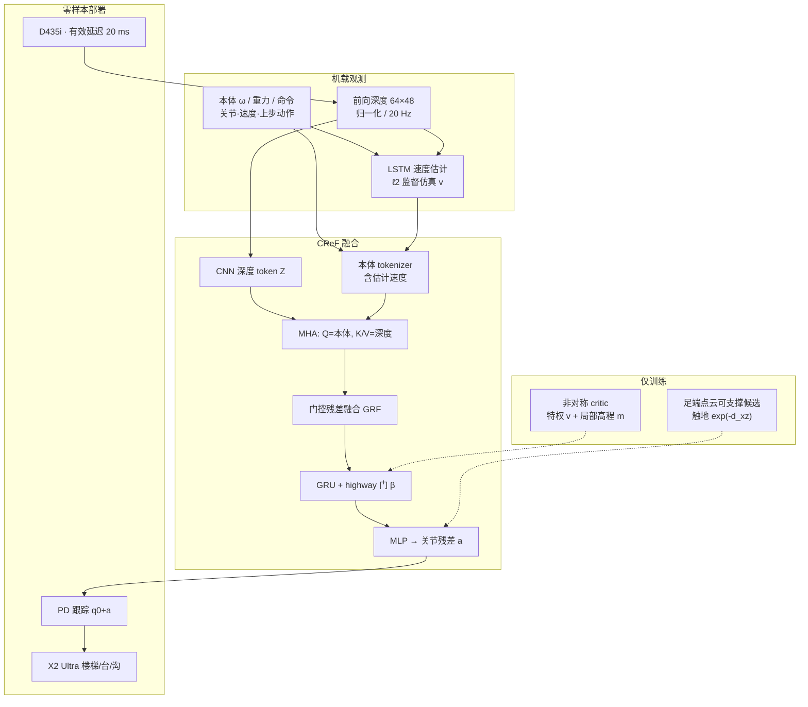

# CReF：交叉模态与循环融合的深度条件人形行走

**CReF**（*Cross-modal and Recurrent Fusion for Depth-conditioned Humanoid Locomotion*，浙江大学 / 山东大学，arXiv:[2603.29452](https://arxiv.org/abs/2603.29452)，[项目页](https://cometlogic.github.io/cref/)）提出 **单阶段** 深度条件策略：机载本体与 **前向 raw 深度** 直接映射关节位置目标，**不经过机器人中心 2.5D 高程图**，也不用地形重建 / 特权 teacher 等几何辅助目标塑形深度支路。在 **AgiBot X2 Ultra** 上零样本覆盖楼梯、高台、沟壑与反射/镂空/户外杂乱场景。

## 一句话定义

**用本体查询的交叉注意力从深度 token 抽出 locomotion 相关线索，经门控残差与 GRU+highway 做状态依赖的时序融合，再用足端点云可支撑候选奖励把触地点拉向平面支撑区。**

## 英文缩写速查

| 缩写 | 英文全称 | 简要说明 |
|------|----------|----------|
| CReF | Cross-modal and Recurrent Fusion | 本文单阶段深度条件融合框架 |
| GRF | Gated Residual Fusion | 交叉注意后的门控残差融合块 |
| GRU | Gated Recurrent Unit | 短时程记忆，缓解单帧深度部分可观测 |
| MHA | Multi-Head Attention | 本体 token 为 Q、深度 token 为 K/V |
| PPO | Proximal Policy Optimization | 非对称 actor–critic 训练算法 |
| HPL | Humanoid Parkour Learning | 论文主外基线：特权地形 → 深度学生 |
| FCQR | Foot Contact Quality Reward | BeamDojo 式接触质量对照项 |
| OOD | Out-of-Distribution | 课程外踢面/沟宽/台高与跨仿真地形 |
| PD | Proportional–Derivative | 关节目标跟踪底层控制器 |
| Sim2Real | Simulation to Real | 本文零样本、训练期不注入合成深度损坏 |

## 为什么重要

- **把「几何中间层」从部署路径拿掉：** 高程图要投影/融合/补全；重建或 teacher 几何目标会把深度表征绑到辅助损失。CReF 让 locomotion 目标单独组织视觉特征。
- **消融指向交叉注意是主杠杆：** 去掉 Cross-Attn 总体成功率 90.45%→78.56%，硬楼梯与 OOD 沟最差；GRF / highway 是稳定性补丁而非主贡献。
- **下楼与落脚精度可读：** 楼梯失败主要在下降；落脚奖励把 Hard 下楼中位偏差收到 **1.4 cm**（相对 FCQR 2.8 cm、无落脚项 9.8 cm）。
- **Sim2Real 立场与 Now You See That 相反：** 后者把立体深度伪影建模当主战场；CReF **训练不加合成深度噪声**，靠 raw-depth 特征空间 + 循环记忆在真机孔洞/栏杆下仍走。

## 核心信息

| 项 | 内容 |
|----|------|
| **机构** | 浙江大学（网络传感与控制研究所 / 控制科学与工程学院）；山东大学控制科学与工程学院 |
| **平台** | AgiBot X2 Ultra（约 1.31 m、39 kg）；RealSense D435i 下俯 50°；Jetson AGX Orin |
| **栈** | Isaac Gym + NVIDIA Warp 胶囊自遮挡深度；PPO；控制 50 Hz；深度 \(64\times48\) @ 20 Hz |
| **训练** | 4096 并行环境；约 20,000 iter / 单卡 RTX 4090 ≈30 h；落脚奖励约 +0.5 s/iter |
| **开源** | **确认未开源**（截至 2026-08-18）：项目页仅为 GitHub Pages 静态站，无训练/推理仓 |

## 流程总览

## 源码运行时序图

**不适用。** 截至 2026-08-18，[项目页](https://cometlogic.github.io/cref/) 与 [cometlogic/cref](https://github.com/cometlogic/cref) 只有静态站资源，没有可辨识的 `train.py` / 部署脚本或权重发布。

## 核心原理（方法）

### 1）本体查询的跨模态注意

深度经轻量 CNN 变成 \(N\) 个 token；本体（拼接估计线速度）编成单 query。MHA 按当前姿态/命令从深度局部块抽取 **与这一步相关** 的前瞻几何，而不是先建成全局高程图。去掉该模块后策略倾向「平均地形」步态：脚离地适应性变差，易楼梯与 OOD 沟成功率塌缩。

### 2）门控残差融合 + 循环融合

GRF 在拼接后的本体–深度特征上算候选残差与通道门，保留直通路径以便优化。GRU 聚合短时程；highway 门 \(\beta_t\) 在 **循环特征** 与 **当前融合特征** 间做逐通道混合：台阶、飞相、大倾角时 \(\beta\) 更高——单帧深度看不全脚下时更信记忆。

### 3）地形感知落脚奖励（训练期塑形）

每足维护足坐标系点缓冲；按命令步幅丢掉近脚点，把剩余点划成重叠窗。窗需足够平面、近水平、非凹陷才成为候选，候选在抬脚时刷新、触地前锁定。触地奖励最近 \(xz\) 距离的指数核（权重 2.0）。这是 **方向性靠近可支撑区**，不是 BeamDojo FCQR 那种事后禁止项；部署时 **不跑该点云规划器**。

### 4）非对称 critic，无 student 蒸馏

Actor 只看本体 + raw 深度；Critic 另吃真值速度与局部高程采样。相对 [HPL](./paper-notebook-humanoid-parkour-learning.md) 的特权 scandots teacher → 深度 DAgger，CReF 把特权留在 value 估计，行为从第一天就在可部署观测上优化。

## 工程实践

| 项 | 要点 |
|----|------|
| 深度预处理 | \(\mathbf{D}=\mathbf{D}^{\mathrm{raw}}/d_{\max}-0.5\)；与真机裁剪对齐 |
| 相机安装 | 前向 D435i **下俯 50°**；用硬件时间戳线性回归选有效 20 ms 帧 |
| 渲染 | Warp 射线–胶囊自遮挡；**不**加合成孔洞/Perlin/标定漂移 |
| 奖励权重 | 线速度跟踪 2.5；落脚 2.0；接触 1.5；冲击/滑移/绊倒为负项（论文 Table I） |
| 源码运行时序图 | **不适用**（无官方可运行仓） |
| 复现边界 | 需自建 Isaac Gym 任务、X2 资产与 Warp 深度；无公开 checkpoint |

## 实验与评测

| 维度 | 论文报告要点 |
|------|----------------|
| 仿真总体 SR（无 MuJoCo） | Full **90.45%**；HPL **74.57%**；去 Cross-Attn **78.56%** |
| 楼梯 Hard 20/30 cm | Full **97.25%**；HPL **71.05%** |
| 沟 OOD 80 cm | Full **44.70%**；HPL **20.85%**（低速命令拖累聚合 SR） |
| MuJoCo OOD | Full **20/20**；HPL **1/20**（镂空踏面 + 侧向栏杆类深度漂移） |
| 楼梯下降失败（Hard） | Full **52** vs HPL **338**（同 2000 env 协议） |
| 落脚 MAD（Hard 下楼） | **1.4 cm** vs FCQR 2.8 cm / NoFR 9.8 cm |
| 室内真机 20 trial | 楼梯 20/20；40 cm 台 20/20；80 cm 沟 18/20；OOD 19/20 |
| 真机能力展示 | >20 级连续楼梯；真实 20/26 cm 带栏杆楼梯；反射孔洞仍可走 |

## 结论

**单阶段 raw 深度策略可以不靠 2.5D 建图和几何辅助目标，用本体查询注意 + 循环门控 + 可支撑落脚奖励，在 X2 上把楼梯（尤其下楼）和零样本杂乱场景做扎实；交叉注意是主杠杆，开源仍缺。**

1. **先问要不要几何中间层** — 若部署不想维护高程图/重建头，CReF 证明 locomotion 损失本身能组织深度特征；对照 [DPL](./paper-notebook-dpl-depth-only-perceptive-humanoid-locomotion-vi.md) 的学习高程重建。
2. **交叉注意别省** — 消融里它造成最大跌幅；没有本体条件查询，策略会退回平均地形行走。
3. **落脚用「靠近可支撑」而不是只禁止** — 触地指数核把下楼偏差收到厘米级，并减少上楼踝–踢面碰撞。
4. **Highway 门是诊断器** — 飞相/倾角/台阶时 \(\beta\) 升高，说明循环记忆在补单帧深度的脚下盲区。
5. **零样本不等于深度噪声建模** — 训练不加合成损坏仍能过反射孔洞；若你的相机伪影更立体一致，对照 [Now You See That](./paper-now-you-see-that-humanoid-vision-locomotion.md) 的 8 步增广。
6. **同平台长程不在本文范围** — X2 上开放世界 1.3 km 仍看 [SSR](./paper-ssr-humanoid-open-world-traversal.md)；CReF 强调结构化课 + 室内 OOD 与感知伪影。
7. **复现成本高** — 无官方代码；数字只作选型对照，不能当可跑基线。

## 与其他工作对比

| 路线 | 感知 | 几何中间层 | 阶段 | 落脚信号 | 深度噪声 | 平台 |
|------|------|------------|------|----------|----------|------|
| **CReF** | 64×48 前向深度 | **无** | **单阶段 PPO** | **足端点云可支撑候选奖励** | **训练不注入** | X2 Ultra |
| [HPL](./paper-notebook-humanoid-parkour-learning.md) | 48×64 深度 | 特权 scandots teacher | DAgger 蒸馏 | 稀疏/几何奖励 | 中等 DR | 原 H1；本文重实现于 X2 |
| [DPL](./paper-notebook-dpl-depth-only-perceptive-humanoid-locomotion-vi.md) | 单深度 | **交叉注意重建高程** | 多教师蒸馏 | 经重建高程 | 合成进 RL 环 | TienKung Ultra |
| [Now You See That](./paper-now-you-see-that-humanoid-vision-locomotion.md) | 24×32 立体深度 | 特权 height teacher | vision-aware DAgger | 分地形 AMP | **8 步立体增广** | 定制人形 / G1 |
| [SSR](./paper-ssr-humanoid-open-world-traversal.md) | 36×36 深度 | 训练期特权高程解码 | 单阶段 PPO | **想象未来接触** | Warp 自遮挡 | X2，户外 1.3 km |
| [PIE](../methods/pie-perceptive-locomotion.md) | 深度+本体 | **显式高度图头** | 单阶段估计+PPO | 隐式+显式 | 低成本相机 | 四足（同组前作） |
| [Hiking in the Wild](./paper-hiking-in-the-wild.md) | 深度历史 | 无建图；边缘+足端体积软约束 | 单阶段 + AMP | 安全项 | Warp 对齐 | 野外 2.5 m/s |

## 局限与风险

- **确认未开源**：项目页不能当复现入口。
- **纯深度无纹理**：作者承认外观线索缺失；强纹理场景未必优于 RGB-D。
- **OOD 沟聚合 SR 被低速命令拉低**：大沟要高驱动，协议在 0.4–0.8 m/s 上平均，读表时不要当成「80 cm 沟只有 45%」。
- **下楼仍是薄弱区**：相对上楼失败数仍高一个数量级。
- **同机型对照有限**：主外基线是重实现 HPL，不是 SSR 原版数字；跨论文比 SR 时对齐地形定义。

## 关联页面

- [楼梯与障碍 Locomotion](../tasks/stair-obstacle-perceptive-locomotion.md) — 感知楼梯/沟/台挂接点
- [Humanoid Locomotion](../tasks/humanoid-locomotion.md) — 人形移动任务总览
- [Privileged Training](../concepts/privileged-training.md) — 非对称 critic、无蒸馏的对照案例
- [Footstep Planning](../concepts/footstep-planning.md) — 落脚奖励是训练塑形，不是在线规划器
- [Terrain Adaptation](../concepts/terrain-adaptation.md) — 深度不经高程图的端到端适应
- [Sim2Real](../concepts/sim2real.md) — 零样本且不注入合成深度损坏
- [PIE](../methods/pie-perceptive-locomotion.md) — 同组单阶段感知行走；PIE 仍保留显式高度图头
- [SSR](./paper-ssr-humanoid-open-world-traversal.md) — 同 X2 平台的开放世界长程对照
- [HPL](./paper-notebook-humanoid-parkour-learning.md) — 本文仿真主基线

## 参考来源

- [cref_arxiv_2603_29452.md](../../sources/papers/cref_arxiv_2603_29452.md) — 论文摘录与开源核查
- [cometlogic-cref-github-io.md](../../sources/sites/cometlogic-cref-github-io.md) — 项目页结构
- 论文 PDF：<https://arxiv.org/pdf/2603.29452>
- 论文 HTML：<https://arxiv.org/html/2603.29452v1>

## 推荐继续阅读

- [项目页](https://cometlogic.github.io/cref/) — 方法图与真机视频
- [Humanoid Parkour Learning](https://humanoid4parkour.github.io/) — CReF 范式对照的 teacher–student 深度跑酷
- [SSR 项目页](https://ssr-humanoid.github.io/) — 同平台开放世界长程
