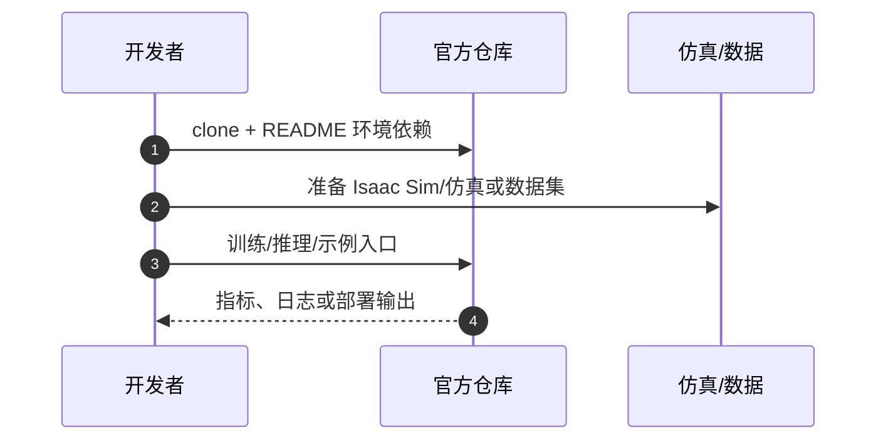

# CRISP（arXiv:2609.21761）

**CRISP**（*CRISP: Contact-Rich Robotic Simulation Platform with Extensive Geometries and Contact Solvers*，[arXiv:2609.21761](https://arxiv.org/abs/2609.21761)）来自 [具身智能小站 10 篇盘点](../../sources/blogs/wechat_embodied_station_contact_rich_sim_10_papers_2026-09-21.md)（策展档位：**跟进**）。

## 一句话定义

**统一 mesh/SDF 几何 + CANAL/SubADMM 接触求解；50–200 μm peg-in-hole 与 bolt-nut 装配平均穿透深度低于 MuJoCo/Isaac Sim 对照。**

## 英文缩写速查

| 缩写 | 英文全称 | 简要说明 |
|------|----------|----------|
| VLA | Vision-Language-Action | 视觉–语言–动作策略 |
| RL | Reinforcement Learning | 强化学习 |
| SR | Success Rate | 任务成功率 |
| Sim2Real | Simulation to Real | 仿真到真机迁移 |
| WAM | World-Action Model | 联合未来观测与动作的策略 |

## 为什么重要

- 公众号将本文归入「接触丰富操作为何总在仿真里失真」专题；跟进档位。
- **（待论文正式披露）**；开源结论：**已开源**（步骤 2.5，2026-09-21）。
- 插入/螺纹装配对碰撞几何与接触约束双敏感；CRISP 把几何表示与求解器放进同一平台。

## 核心机制

| 项 | 内容 |
|----|------|
| **arXiv** | [2609.21761](https://arxiv.org/abs/2609.21761) |
| **开源** | **已开源** |
| **策展摘要** | 统一 mesh/SDF 几何 + CANAL/SubADMM 接触求解；50–200 μm peg-in-hole 与 bolt-nut 装配平均穿透深度低于 MuJoCo/Isaac Sim 对照。 |

## 源码运行时序图

节点对齐 [`sources/repos/crisp.md`](../../sources/repos/crisp.md) 与 README 入口。

## 实验与评测

- 定量指标与 baseline 协议以 arXiv PDF 与项目页为准；本页为清单级摘要。
- 读法：先确认任务设定（仿真/真机、传感器、成功定义）再对比 headline 数字。

## 与其他工作对比

> 本页为清单级摘要，下表只做**定位对照**；数字未与下列各页核对同一评测协议，不可横比。

| 对照 | 差异读法 |
|------|----------|
| [RAPID](./paper-rapid-vlm-rl.md) | 同专辑 **深读** 档：并行仿真 + VLM 奖励管线，关注训练吞吐与 API 成本 |
| [CRISP](./paper-crisp.md) | 同专辑 **跟进** 档：接触仿真几何与求解器，关注 peg-in-hole/装配物理准确性 |
| [10 篇技术地图](../overview/contact-rich-sim-10-papers-technology-map.md) | 同批次横向对照入口：本文列 **跟进** 档位 |

## 结论

**CRISP 代表「跟进」档位的 simulation 方向样本——部署前以开源状态与评测协议为准绳。**

1. 开源状态：**已开源**；勿凭 PDF 臆断可复现性。
2. 与同专辑 [RAPID](./paper-rapid-vlm-rl.md) / [GALA](./paper-gala.md) / [CRISP](./paper-crisp.md) 形成「并行奖励 → 跨形态表征 → 接触仿真」阅读链。
3. 若做工程选型，先对齐传感器栈、仿真器与任务是否匹配文内设定。
4. 关注项目页/arXiv 版本更新与代码发布。

## 关联页面

- [contact-rich-sim-10-papers-technology-map](../overview/contact-rich-sim-10-papers-technology-map.md)
- [sim2real](../concepts/sim2real.md)
- [manipulation](../tasks/manipulation.md)
- [vla](../methods/vla.md)

## 参考来源

- [crisp_arxiv_2609_21761.md](../../sources/papers/crisp_arxiv_2609_21761.md)
- [wechat_embodied_station_contact_rich_sim_10_papers_2026-09-21.md](../../sources/blogs/wechat_embodied_station_contact_rich_sim_10_papers_2026-09-21.md)
- [arXiv:2609.21761](https://arxiv.org/abs/2609.21761)

## 推荐继续阅读

- [arXiv PDF](https://arxiv.org/pdf/2609.21761)
- [10 篇技术地图](../overview/contact-rich-sim-10-papers-technology-map.md)
