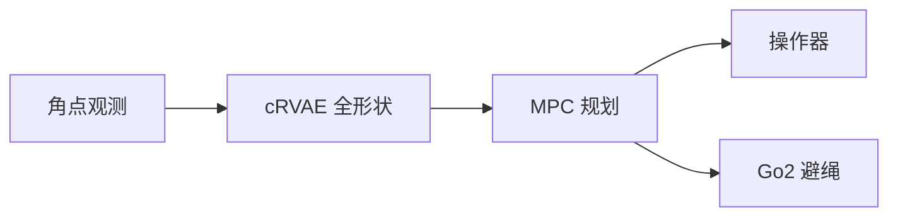

# cRVAE Deformable Manipulation（arXiv:2609.10308）

**cRVAE Deformable Manipulation**（*Deformable Object Manipulation under Partial Observability via Real-Time Full-Shape Estimation*，[arXiv:2609.10308](https://arxiv.org/abs/2609.10308)）由 **坦佩雷大学（Tampere University）；阿尔托大学（Aalto University）** 提出（公众号周更 ingest 见 [策展索引](../../sources/blogs/wechat_shenlan_weekly_manipulation_2026-09-14.md)）。

## 一句话定义

基于实时全形状估计的部分可观测可变形物体操作 — cRVAE full-shape from corner nodes。

## 英文缩写速查

| 缩写 | 英文全称 | 简要说明 |
|------|----------|----------|
| cRVAE | Conditional RVAE | 条件循环 VAE |
| MPC | Model Predictive Control | 模型预测控制 |
| XPBD | Extended Position Based Dynamics | 扩展 PBD 仿真 |

## 为什么重要

部分可观测下操作绳/布料需实时全形状；传统 XPBD 太慢。

## 核心信息

| 项 | 内容 |
|----|------|
| **机构** | 坦佩雷大学（Tampere University）；阿尔托大学（Aalto University） |
| **开源** | **未见/待发布**（步骤 2.5 核查：截至 2026-09-14 无可运行官方仓库） |

## 核心原理

cRVAE 从少量 corner nodes 推断 full shape；驱动 MPC 规划抓取/避障；Go2 协作绕绳实验验证。

### 流程总览

## 源码运行时序图

**不适用** — 截至 **2026-09-14** arXiv 与常见项目页 **未见** 官方可运行代码仓库。

## 工程实践

| 项 | 说明 |
|----|------|
| 开源状态 | 未见官方仓库；以 arXiv 为准 |
| 复现入口 | 论文方法与超参；代码发布后再补 `sources/repos/` |
| 部署注意 | 角点检测噪声影响 VAE；MPC 时域与更新率需匹配 350× 加速预算。 |

## 实验与评测

形状重建误差；绳操作任务；Go2 协作避障。

## 结论

cRVAE 实时全形状估计使部分可观测可变形体 MPC 比 XPBD 快两个数量级。

1. 角点→全形状是核心。
2. 350× 快于 XPBD rope。
3. MPC 闭环操作绳体。
4. Go2 展示腿式协作场景。
5. 泛化到新材质需重训 VAE。

## 与其他工作对比

| 对照 | 差异读法 |
|------|----------|
| XPBD 在线仿真 | 太慢无法 MPC |
| 纯视觉 mesh 估计 | 角点观测更轻 |

## 局限与风险

训练数据覆盖材质有限；极端遮挡未报。

## 关联页面

- [manipulation](../tasks/manipulation.md)
- [./paper-foldex-deformable-clothes-benchmark.md](./paper-foldex-deformable-clothes-benchmark.md)
- [generative-world-models](../methods/generative-world-models.md)

## 参考来源

- [crvae_deformable_manipulation_arxiv_2609_10308.md](../../sources/papers/crvae_deformable_manipulation_arxiv_2609_10308.md)
- [公众号周更策展](../../sources/blogs/wechat_shenlan_weekly_manipulation_2026-09-14.md)

## 推荐继续阅读

- [https://arxiv.org/abs/2609.10308](https://arxiv.org/abs/2609.10308)
