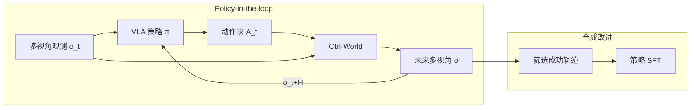
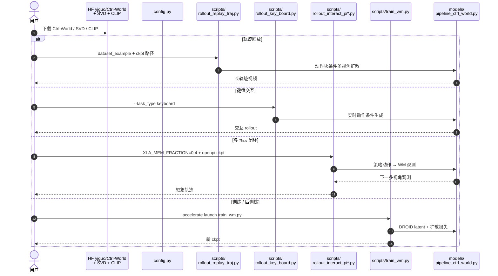

# Ctrl-World（可控机器人操作生成式世界模型）

**Ctrl-World**（*Ctrl-World: A Controllable Generative World Model for Robot Manipulation*，[arXiv:2510.10125](https://arxiv.org/abs/2510.10125)，**ICLR 2026**，Yanjiang Guo / Lucy Xiaoyang Shi 等 · **斯坦福大学（Stanford）** / **清华大学（Tsinghua）**；[项目页](https://ctrl-world.github.io/)，[代码](https://github.com/Robert-gyj/Ctrl-World)）把预训练视频扩散（SVD）改造成 **可与现代多视角 VLA 闭环交互** 的动作条件世界模型：联合预测第三人称与腕部视角，用帧级动作条件保证控制精度，用位姿条件记忆检索稳住长时 rollout，从而在 **想象空间** 完成策略评估与合成数据改进。

## 一句话定义

**一个面向 policy-in-the-loop 的可控多视角视频世界模型：用帧级动作条件与位姿记忆，让 VLA 在想象中 rollout，并据此排序策略、合成成功轨迹做 SFT。**

## 英文缩写速查

| 缩写 | 英文全称 | 简要说明 |
|------|----------|----------|
| WM | World Model | 动作条件未来观测预测器 |
| VLA | Vision-Language-Action | 多视角观测 + 语言 → 动作块的通用策略 |
| SVD | Stable Video Diffusion | 本文初始化的预训练视频扩散骨干 |
| DROID | Distributed Robot Interaction Dataset | 训练数据：~95k 轨迹 / 564 场景 |
| EEF | End-Effector | 末端位姿；动作常映射到笛卡尔空间再条件化 |
| SFT | Supervised Fine-Tuning | 用合成成功轨迹微调策略 |
| FVD | Fréchet Video Distance | 长轨迹生成质量的分布距离指标 |

## 为什么重要

- **对齐现代 VLA 输入格式：** 多数动作条件 WM 只出单第三人称；Ctrl-World **联合预测腕部视角**，减少接触幻觉，并能直接接 π₀ / π₀.₅ 等多相机策略。
- **评估可扩展：** 在新机位 / 新场景零样本想象 rollout，指令跟随排名与真机相关——降低「每改一次策略就刷大量真机」的成本。
- **改进闭环：** 不止打分，还能在想象中搜成功轨迹并 SFT；报告把 π₀.₅ 在未见指令/物体上的成功率从 **38.7%** 提到 **83.4%**（约 **+44.7 pt**）。

## 核心原理（方法）

### 闭环接口

观测 \(o_t=[I^1_t,\ldots,I^n_t,q_t]\)，策略出动作块 \(A_t\)；世界模型

\[
o_{t+1:t+H}\sim W(\cdot\mid o_t,A_t),
\]

再把 \(o_{t+H}\) 回传策略，自回归想象。

### 三组件

| 模块 | 作用 |
|------|------|
| **多视角联合预测** | 第三人称 + 腕部 token 拼接；腕部提供接触细粒度 |
| **帧级动作条件** | 动作映射笛卡尔位姿，空间 transformer 内 frame-wise cross-attention |
| **位姿条件记忆检索** | 稀疏历史帧入上下文；位姿嵌入锚定相似过去状态，抑制长时漂移 |

训练：SVD **1.5B** 初始化，仅新建动作投影 MLP 后全量扩散微调；DROID 含成功与失败轨迹；历史 **7** 帧、未来 **15** 步动作（约 1 s）、分辨率 **192×320**。

### 流程总览

## 实验要点（索引级）

| 轴 | 报告口径（以论文为准） |
|----|------------------------|
| 长轨迹生成 | 验证集 10 s 自回归；多视角优于 WPE / IRASim；腕部减幻觉 |
| 可控性 | 厘米级动作差异可产生可区分 rollout；消融去记忆 / 去帧级条件均变差 |
| 策略评估 | π₀ / π₀-FAST / π₀.₅；指令跟随与真机相关，低层接触成功常被低估 |
| 策略改进 | 扰动指令或重置初态 → 人偏好筛选 → SFT；平均 **+44.7 pt**（**38.7%→83.4%**） |

## 开源状态

**已开源**（截至 **2026-07-23** 项目页与 README 核查）：

| 产物 | 状态 |
|------|------|
| 论文 | [arXiv:2510.10125](https://arxiv.org/abs/2510.10125)（ICLR 2026） |
| 代码 | [Robert-gyj/Ctrl-World](https://github.com/Robert-gyj/Ctrl-World) · **MIT** |
| 权重 | HF [`yjguo/Ctrl-World`](https://huggingface.co/yjguo/Ctrl-World)（另需 SVD + CLIP） |
| 数据 | HF DROID `cadene/droid_1.0.1`；仓内 `dataset_example/droid_subset` |
| 推理入口 | `scripts/rollout_replay_traj.py` / `rollout_key_board.py` / `rollout_interact_pi*.py` |
| 训练 | `scripts/train_wm.py`（含下游 post-train / VLAW 流程） |

## 源码运行时序图

节点对齐 [`sources/repos/ctrl-world.md`](../../sources/repos/ctrl-world.md)。

- **最短复现：** 拉三套权重 → `rollout_replay_traj.py`（仓内子集即可）。
- **闭环评估：** 装 openpi → `rollout_interact_pi_eval.py`（论文初值条件）。
- **全量训练：** 处理 DROID latent + `create_meta_info.py` → `train_wm.py`。

## 工程实践

| 项 | 实践要点 |
|----|----------|
| 算力 | 论文训练 2×8 H100 / 2–3 天；推理单卡可跑示例子集 |
| 与 JAX 策略共存 | 设 `XLA_PYTHON_CLIENT_MEM_FRACTION` 防止显存抢占 |
| 动作块长度 | 默认 15 步≈1 s；更短策略输出需 pad |
| 成功判定 | 论文用人偏好；可换成 VLM reward（作者列为未来工作） |
| 选型 | 需要 **多视角 VLA 闭环 + 低维动作条件** 时优先；需要 **像素掩码前向/逆向统一** 见 [Masked Visual Actions](./paper-masked-visual-actions.md)；需要 **1-step 搜索速度** 见 [DriftWorld](./paper-driftworld.md) |

## 局限与风险

- **低层物理 gap：** 碰撞、滑动、旋转等接触细节仍弱；想象成功率常 **低估** 真机执行成功。
- **失败分布外推：** DROID 含失败轨迹但仍盖不全策略「反复重试」等行为。
- **骨干年代：** 初始化自 SVD，而非 [Wan](./paper-wan-video.md) 系更大开源视频模型；视觉上限受骨干约束。
- **改进范围：** 作者强调主增益在 **新指令跟随**，不宜期待用同一流程大幅拉高低层已见任务成功率。

## 与相邻工作的分界（对比）

| 对比轴 | Ctrl-World | [Masked Visual Actions](./paper-masked-visual-actions.md) | [DriftWorld](./paper-driftworld.md) |
|--------|------------|-----------------------------------------------------------|-------------------------------------|
| **条件** | 低维动作 / 位姿 | 像素掩码轨迹 | 低维动作 + FiLM |
| **视角** | 第三人称 + 腕部联合 | 单流视频条件 | 任务相关单视角为主 |
| **骨干** | SVD 1.5B | Wan-Fun-Control 14B LoRA | 自研 U-Net drifting |
| **主卖点** | VLA 闭环评估 + 合成 SFT | 前向/逆向统一 + 跨具身 | 1-step 速度 + 搜索 |

## 关联页面

- [Generative World Models](../methods/generative-world-models.md) — 生成式 WM 方法谱系
- [Video-as-Simulation](../concepts/video-as-simulation.md) — 视频即仿真概念
- [world-models-route-03-virtual-sandbox](../overview/world-models-route-03-virtual-sandbox.md) — 虚拟沙盒路线
- [Masked Visual Actions](./paper-masked-visual-actions.md) — 掩码条件对照（文中视觉基线语境）
- [Wan](./paper-wan-video.md) / [Wan-Move](./paper-wan-move.md) — 另一视频先验族与轨迹控制
- [评测选型闭环](../queries/embodied-eval-benchmark-selection-loop.md) — 想象评估如何接入验收

## 参考来源

- [Ctrl-World 论文摘录](../../sources/papers/ctrl_world_arxiv_2510_10125.md)
- [Ctrl-World 官方仓库](../../sources/repos/ctrl-world.md)
- [Ctrl-World 项目页](../../sources/sites/ctrl-world-github-io.md)

## 推荐继续阅读

- Guo et al., *Ctrl-World*, arXiv:2510.10125 / ICLR 2026 — <https://arxiv.org/abs/2510.10125>
- 官方代码与权重 — <https://github.com/Robert-gyj/Ctrl-World>
