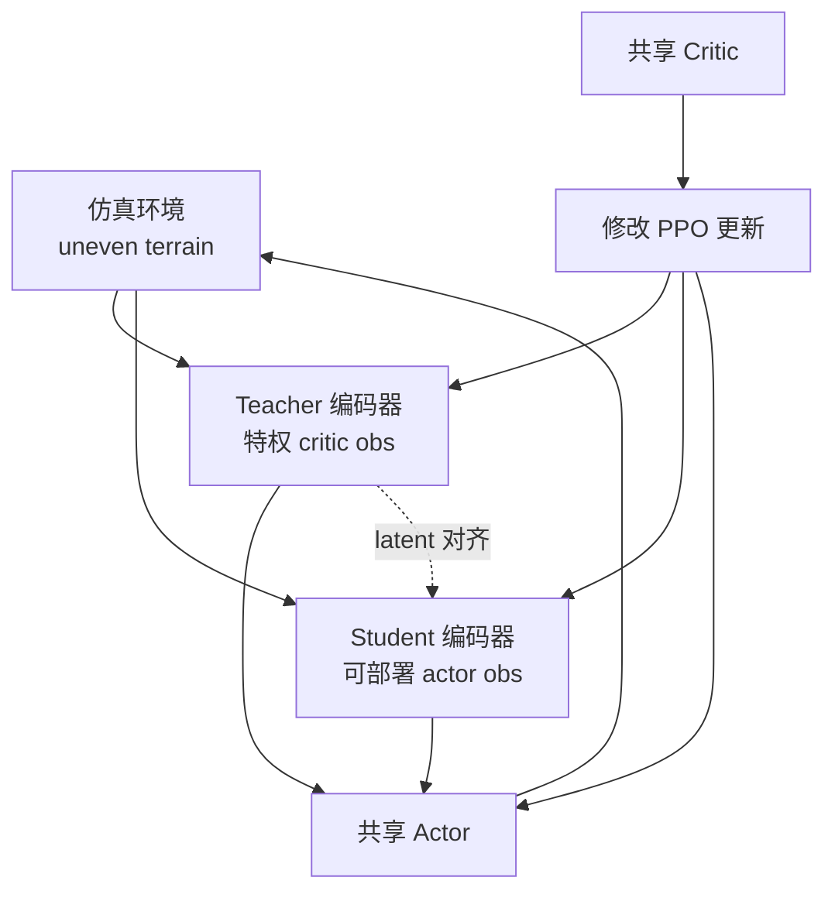
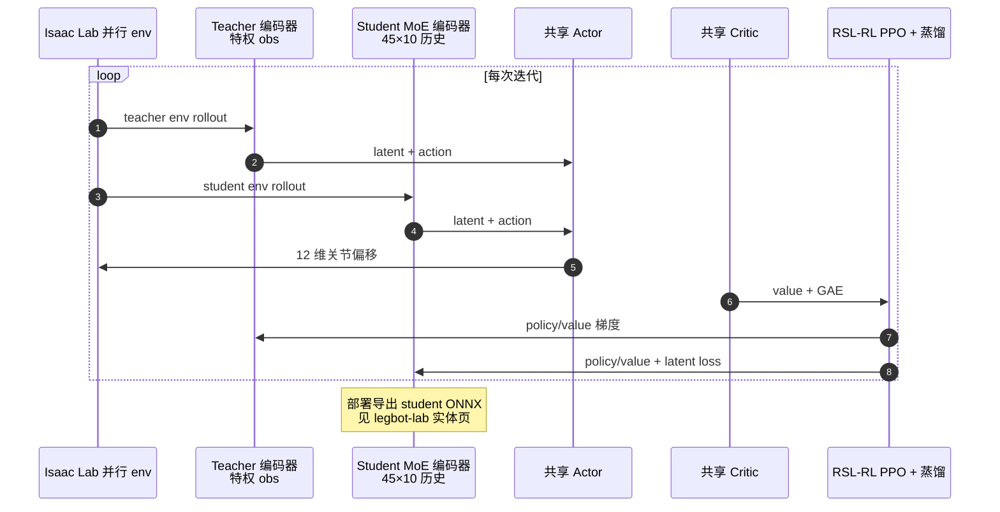

# CTS：并发 Teacher–Student 腿足 Locomotion 强化学习

**CTS**（*Concurrent Teacher-Student Reinforcement Learning for Legged Locomotion*；Hongxi Wang、Haoxiang Luo、Wei Zhang、Hua Chen；[arXiv:2405.10830](https://arxiv.org/abs/2405.10830)，2024-05）提出 **并发 Teacher–Student** 架构：特权 **教师** 与仅本体感知的 **学生** 在 **同一 PPO 训练方案** 中并行与环境交互并联合更新，而非先训教师再监督蒸馏。仿真对比显示相对两阶段 teacher–student，盲 locomotion **平均速度跟踪误差最多降低约 20%**；四足与点足双足室内外实验验证鲁棒敏捷运动。工程扩展见 [Legbot Lab](./legbot-lab.md)（`PPO-CTS-MOE`：MoE 学生编码器 + Isaac Lab 部署栈）。

## 一句话定义

**把 teacher–student 从「先 RL 后蒸馏」改成「同一 PPO 循环里教师与学生并行 rollout、联合优化」，让学生 latent 在训练中持续对齐特权教师。**

## 英文缩写速查

| 缩写 | 英文全称 | 简要说明 |
|------|----------|----------|
| CTS | Concurrent Teacher–Student | 本文核心架构 |
| TS | Teacher–Student | 特权教师向可部署学生迁移 |
| PPO | Proximal Policy Optimization | 修改版 PPO 同时更新双策略 |
| RL | Reinforcement Learning | 腿足运动控制学习范式 |
| DR | Domain Randomization | 仿真随机化（工程实现常见配套） |

## 核心信息

| 字段 | 内容 |
|------|------|
| venue | arXiv:2405.10830（2024-05-17） |
| 项目页 | [clearlab-sustech.github.io/concurrentTS](https://clearlab-sustech.github.io/concurrentTS) |
| Isaac Lab 扩展 | [Robot-Nav/legbot_lab](https://github.com/Robot-Nav/legbot_lab) 分支 `PPO-CTS-MOE` |
| 开源（Legbot 线） | **已开源** 训练+部署；见 [legbot_lab.md](../../sources/repos/legbot_lab.md) |

## 为什么重要

- **范式升级：** 相对 [teacher-student-dagger-training](../methods/teacher-student-dagger-training.md) 的 **两阶段** 蒸馏，CTS 把样本效率与最终盲走性能绑在同一 RL 目标上。
- **与 BFM 多技能 TS 区分：** [teacher-student-multi-skill-bfm](../methods/teacher-student-multi-skill-bfm.md) 面向人形多动作 BFM；CTS 聚焦 ** uneven terrain 盲 locomotion**。
- **可工程落地：** Legbot Lab 提供 MoE 学生编码器、ONNX 部署与 MuJoCo sim2sim，便于从论文读到可跑仓库。

## 核心原理

### 并发 vs 两阶段

| 阶段 | 两阶段 Teacher–Student | CTS |
|------|------------------------|-----|
| 1 | RL 训特权教师 | 教师 **与** 学生同时 rollout |
| 2 | BC/蒸馏训学生 | 修改 PPO **联合** 更新 actor/critic |
| 数据 | 两阶段分离 | 同一批次混合 teacher/student 转移 |
| Legbot 实现 | — | 75% teacher env / 25% student env（`PPO-CTS-MOE`） |

### 流程总览

### MoE 扩展（Legbot Lab，非原文必含）

`PPO-CTS-MOE` 将学生编码器换为 **8 专家 MoE + gating**，并加 **latent MSE 蒸馏** 与 **load-balance** 损失——提升复杂地形 latent 容量；部署仅用 student 分支。

## 源码运行时序图

**Legbot Lab**（[sources/repos/legbot_lab.md](../../sources/repos/legbot_lab.md)）提供可运行官方实现；CTS 原文项目页以演示为主。

## 工程实践

| 项 | 内容 |
|----|------|
| 基线分支 | `PPO`：纯 PPO + 非对称 AC + 历史（无 CTS） |
| CTS+MoE | `PPO-CTS-MOE`：MoE-CTS + Unitree 力矩–速度电机模型 |
| 训练栈 | Isaac Lab 2.2；RSL-RL；4096 envs |
| 部署 | ONNX + C++17 + CycloneDDS（见 [legbot-lab](./legbot-lab.md)） |
| 对照阅读 | [Privileged Training](../concepts/privileged-training.md) — 非对称 critic vs 两阶段 TS |

## 局限与风险

- **原文 vs Legbot 扩展：** MoE、env 比例、电机模型为 **工程仓库扩展**；引用 CTS 原文时应以 arXiv:2405.10830 为准。
- **与 RoboGauge 勿混：** [RoboGauge](https://robogauge.github.io/)（MoE + sim2sim 评测）为 **另一研究线**（XJTU Go2），非 CTS 官方代码。
- **平台差异：** 原文含点足双足实验；Legbot Lab 面向自研四足，迁移需重调 MDP 与网关。

## 评测与结论

- **仿真：** 相对两阶段 teacher–student，盲 locomotion 平均速度跟踪误差 **最多约 −20%**（原文 Table 对比）。
- **真机：** 四足与点足双足室内外 agile locomotion 视频见 [项目页](https://clearlab-sustech.github.io/concurrentTS)。

## 结论

**CTS 把 teacher–student 蒸馏并入 PPO 训练环，是盲腿足 locomotion 相对两阶段 TS 的实质性范式升级；Legbot Lab 的 MoE-CTS 分支提供了 Isaac Lab → ONNX → 真机的可复现工程路径。**

1. **先分清「并发」与「两阶段」** — 读 loss 是否同一 PPO 批次联合更新。
2. **部署只看 student** — 教师特权 obs 不进 ONNX。
3. **MoE 是 Legbot 增强** — 写论文综述时 CTS 原文可不含 MoE。
4. **与 PPO 基线对照** — 同仓库 `PPO` 分支可 ablate CTS/MoE 增益。
5. **sim2real 读 Legbot 部署节** — DDS + 网关 + FSM 是工程主风险面。
6. **交叉 [privileged-training](../concepts/privileged-training.md)** — 理解 critic 特权与 actor 可部署观测分工。

## 与其他页面的关系

- [legbot-lab.md](./legbot-lab.md) — Isaac Lab 实现与部署
- [teacher-student-dagger-training.md](../methods/teacher-student-dagger-training.md) — 两阶段 TS / DAgger
- [ppo.md](../methods/ppo.md) — PPO 基础
- [legbot-mpc-wbc.md](./legbot-mpc-wbc.md) — 同团队非 RL 控制线

## 参考来源

- [legbot_cts_arxiv_2405_10830.md](../../sources/papers/legbot_cts_arxiv_2405_10830.md)
- [legbot_lab.md](../../sources/repos/legbot_lab.md)

## 推荐继续阅读

- [arXiv:2405.10830](https://arxiv.org/abs/2405.10830)
- [CTS 项目页与视频](https://clearlab-sustech.github.io/concurrentTS)
- [Robot-Nav/legbot_lab](https://github.com/Robot-Nav/legbot_lab)（分支 `PPO-CTS-MOE`）
