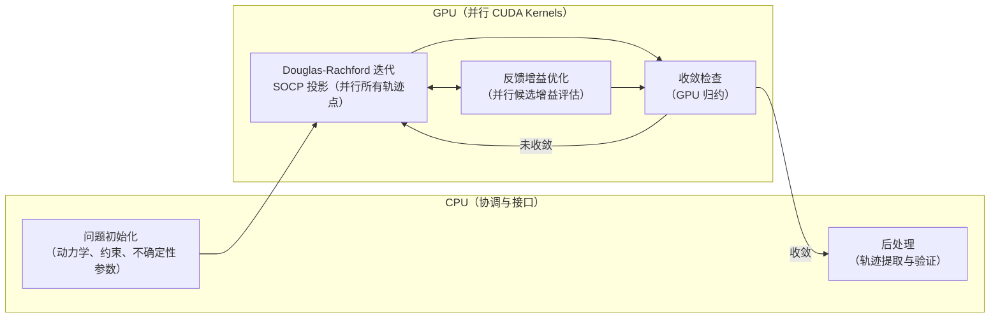

# cuNRTO：GPU 加速非线性鲁棒轨迹优化（CUDA Nonlinear Robust Trajectory Optimization）

**cuNRTO**（*cuNRTO: GPU-Accelerated Nonlinear Robust Trajectory Optimization*，[arXiv:2603.02642](https://arxiv.org/abs/2603.02642)，Georgia Tech / Theodorou 课题组，[项目页](https://cunrto.github.io/)，**RSS 2026 Finalist**）提出将 **非线性鲁棒轨迹优化（NRTO）** 的核心计算——**Douglas-Rachford SOCP 投影算子**与**反馈增益优化**——完全移植到 **CUDA GPU** 并行执行，将规划时间从 **数小时** 压缩至 **秒级**，并通过 **不确定性感知轨迹规划** 直接服务机器人 sim-to-real 鲁棒性需求。

## 一句话定义

**cuNRTO 把传统 NRTO 的 SOCP 投影 + 反馈增益联合优化全量并行到 GPU，将鲁棒规划从「离线小时级」变为「在线秒级」——为 sim2real gap 感知轨迹提供实时可行的计算路径。**

## 英文缩写速查

| 缩写 | 英文全称 | 简要说明 |
|------|----------|----------|
| cuNRTO | CUDA Nonlinear Robust Trajectory Optimization | 本文方法：GPU 加速非线性鲁棒轨迹优化 |
| NRTO | Nonlinear Robust Trajectory Optimization | 传统鲁棒轨迹优化框架；计算代价极高 |
| SOCP | Second-Order Cone Programming | 二阶锥规划；cuNRTO 的核心投影子问题形式 |
| DR | Douglas-Rachford | Douglas-Rachford 分裂算法；SOCP 投影加速器 |
| GPU | Graphics Processing Unit | 并行计算单元；cuNRTO 的核心加速硬件 |
| KL | Kullback-Leibler | KL 散度；鲁棒性度量中不确定性集合约束形式 |
| Sim2Real | Simulation to Real | 仿真到真机迁移；cuNRTO 的主要应用场景之一 |
| RSS | Robotics: Science and Systems | 本文投稿顶会；2026 年度 Finalist |

## 为什么重要

- **鲁棒规划的计算瓶颈：** 非线性鲁棒轨迹优化（NRTO）能生成对系统不确定性（如 sim2real gap、外扰）鲁棒的轨迹，但传统 CPU 实现需 **数小时** 求解，完全不满足实时或快速迭代需求。
- **GPU 并行的系统性迁移：** cuNRTO 不是简单的 GPU 加速数值积分，而是将 **SOCP 投影的 Douglas-Rachford 迭代**和**反馈增益联合优化**（两个原本顺序执行的昂贵步骤）重新设计为 **大规模并行 CUDA kernel**，实现算法级的并行重构。
- **不确定性感知规划的实用化：** 将 NRTO 拉入秒级意味着可在 RL 训练循环中嵌套鲁棒规划、或在部署时在线重规划，直接降低 sim2real gap 风险。
- **RSS 2026 Finalist：** 验证了计算系统方向在机器人顶会的核心地位——加速基础求解器与 AI/RL 同等重要。

## 核心原理与方法

### 非线性鲁棒轨迹优化框架

NRTO 在名义动力学之外显式考虑 **不确定性集合** $\mathcal{W}$（建模 sim2real gap、外扰等），求解对最坏情况不确定性鲁棒的轨迹 $\tau^*$ 与反馈策略 $K^*$：

$$\min_{\tau, K} \mathbb{E}_w[\text{cost}(\tau, K, w)] \quad \text{s.t.} \quad \forall w \in \mathcal{W},\ f(\tau, K, w) \leq 0$$

其中约束包含碰撞避免、关节极限、力矩约束等。在非线性系统下，该问题规模大且求解算法迭代代价高昂。

### Douglas-Rachford SOCP 投影

NRTO 内循环的核心计算可归结为一系列 **SOCP 投影子问题**：

$$\text{Proj}_{\mathcal{C}}(x) = \arg\min_{y \in \mathcal{C}} \|x - y\|^2, \quad \mathcal{C} = \text{SOCP 约束集}$$

cuNRTO 使用 **Douglas-Rachford 分裂算法** 将投影分解为两个简单算子的迭代应用，并在 GPU 上 **完全并行化**所有轨迹点、约束和迭代步。

### 反馈增益联合优化

在轨迹优化同时，cuNRTO 联合优化 **线性反馈增益矩阵 $K$**，使轨迹对不确定性的鲁棒性最大化：

$$K^* = \arg\min_K \text{robust cost}(\tau, K)$$

在 GPU 上，多个候选增益矩阵可 **并行评估**，大幅缩短这一步骤的时钟时间。

### 计算流程

**核心加速来源：**
1. SOCP 投影子问题间 **无数据依赖** → 可完全并行
2. Douglas-Rachford 每步迭代计算量均匀 → 高 GPU 利用率
3. 反馈增益候选 **批量并行评估** → 避免顺序搜索

## 评测与对比

- **相较传统 CPU 版 NRTO：** 传统实现需 **数小时** 求解同类非线性鲁棒轨迹优化；cuNRTO 通过算法级 GPU 并行（SOCP 投影 + 反馈增益联合优化）将规划时间压缩到 **秒级**，实现数量级加速。
- **加速使新用法成为可能：** 此前受计算代价所限「不可行」的用法——在 RL 训练循环中嵌套鲁棒规划、部署时在线重规划——在秒级求解下变为可行（详见下文「典型使用场景」对照表）。
- **加速来源（并行结构）：** ① SOCP 投影子问题间无数据依赖 → 完全并行；② Douglas-Rachford 每步迭代计算量均匀 → 高 GPU 利用率；③ 反馈增益候选批量并行评估 → 避免顺序搜索。

## 工程实践

### 代码开放状态

截至 2026-07-20 核查，[cunrto.github.io](https://cunrto.github.io/) 项目页**未列出 GitHub 仓库链接**，代码尚未公开发布。如需跟进，可定期检查项目页 Resources 区或作者主页。

**源码运行时序图：不适用**（截至入库日项目页未列 GitHub；代码尚未公开，无法描述可复现运行时序）。

### 典型使用场景

| 场景 | 传统 NRTO 耗时 | cuNRTO 耗时 | 价值 |
|------|--------------|------------|------|
| 离线批量规划（飞行轨迹库） | 数小时 | 秒～分钟 | 可迭代调参 |
| RL 训练中嵌套鲁棒规划 | 不可行 | 可行 | 真实鲁棒性监督 |
| 部署时在线重规划 | 不可行 | 可行 | 应对真机扰动 |

### Sim2Real 应用

- **不确定性建模：** 将仿真-真机动力学误差（质量、摩擦、延迟等）建模为不确定性集合 $\mathcal{W}$。
- **鲁棒轨迹保证：** cuNRTO 生成的轨迹在 $\mathcal{W}$ 约束下可行，在真机上遇到建模误差时仍有轨迹跟踪安全裕量。

## 局限与风险

- **代码未开源（截至入库日）：** 无法直接复现；依赖后续发布。
- **SOCP 近似误差：** NRTO 中非线性动力学被线性化或凸松弛处理以适配 SOCP 形式，在强非线性或大位移时近似误差需评估。
- **GPU 内存与批次规模：** 超长 horizon 或超高维系统（如全身人形）的内存需求可能超出单卡，需分批或模型简化。
- **不确定性集合建模质量：** $\mathcal{W}$ 的选择直接影响鲁棒性保证的有效性；若真实 sim2real gap 超出 $\mathcal{W}$，保证失效。
- **与 RL 的集成细节：** cuNRTO 如何与 RL 训练循环深度集成（嵌套优化 vs 预处理参考轨迹）目前仍需工程探索。

## 关联页面

- [Trajectory Optimization（轨迹优化）](../methods/trajectory-optimization.md) — cuNRTO 是 NRTO 的 GPU 加速实现，属此方法类
- [Sim2Real](../concepts/sim2real.md) — 不确定性感知规划的主要应用动机
- [Constrained Optimization（约束优化）](../concepts/constrained-optimization.md) — SOCP 投影的数学基础

## 参考来源

- [量子位：RSS 2026 三项最佳论文报道](../../sources/blogs/wechat_qbitai_rss2026_awards_2026-07-16.md)
- [cuNRTO 论文摘录（arXiv:2603.02642）](../../sources/papers/cunrto_arxiv_2603_02642.md)
- [cuNRTO 项目页归档](../../sources/sites/cunrto-github-io.md)

## 推荐继续阅读

- [arXiv:2603.02642](https://arxiv.org/abs/2603.02642) — 原始论文（PDF + HTML）
- [项目页](https://cunrto.github.io/) — 演示视频与规划结果
- [Trajectory Optimization 方法页](../methods/trajectory-optimization.md) — 本库对轨迹优化家族的系统归纳
- Theodorou et al., *Nonlinear Stochastic Optimal Control via Path Integral Methods* — Theodorou 课题组鲁棒控制基础工作
