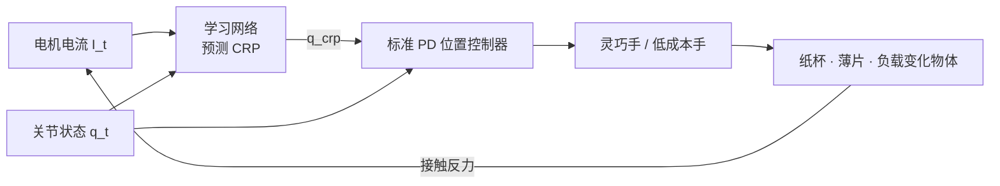

# Current as Touch（Proprioceptive Contact Feedback · arXiv:2607.03529）

**Current as Touch**（*Current as Touch: Proprioceptive Contact Feedback for Compliant Dexterous Manipulation*，[arXiv:2607.03529](https://arxiv.org/abs/2607.03529)，UNC Chapel Hill，[cat.chenyangma.com](https://cat.chenyangma.com/)）提出 **本体驱动柔顺操纵**：从 **电机电流 + 关节状态** 学习接触感知 cue，预测 **柔顺参考关节位置（CRP）** 作为 PD 控制器目标——通过 **位置误差间接产生合适交互力**，无需外置触觉/力传感器或力矩控制接口。

## 一句话定义

**把电机电流当「本体触觉」：不改控制栈，只改目标位置——让 mainstream 位置式遥操作与策略学习也能力适应。**

## 英文缩写速查

| 缩写 | 英文全称 | 简要说明 |
|------|----------|----------|
| CRP | Compliance Reference Position | 送入 PD 的 **柔顺目标关节角** |
| PD | Proportional-Derivative | 主流 **位置式** 低层控制器 |
| IoT | — | 强调 **无额外传感硬件**（Intrinsic actuator signals） |
| RMSE | Root Mean Square Error | 电流–力回归：Dex3 **10.09g** / LEAP **17.75g** |
| DoF | Degrees of Freedom | 灵巧手关节空间 |
| F/T | Force/Torque Sensor | 本文 **不依赖** 外置测力（仅标定实验对照） |
| Sim2Real | Simulation to Real | 策略学习仍走 **位置命令** 接口 |

## 为什么重要

- **拓展策展文「四类接触信号」之电机电流路线：** 与 [VT-WAM](./paper-vt-wam-visuotactile-contact-rich.md) 外置高分辨率触觉、与 [TACO](./paper-taco-tactile-wm-vla-posttrain.md) 腕部 F/T 形成 **传感成本光谱**。
- **解决位置控制与柔顺需求的接口错配：** 多数 teleop / IL **输出目标关节角**；直接力控或阻抗控制 **难接入现有 pipeline**；CRP 把接触反馈 **映射回位置参考**。
- **动机实验可复现：** Dex3 / LEAP 上电流+位置对法向力 RMSE **10–18g**，$R^2$ **0.95–0.99**——说明 **执行器自带信号含接触信息**（非精确力估计终点）。
- **多任务实证：** 纸杯堆叠、白板擦拭、抽卡片、倒水（动态负载）等 **contact-rich** 场景；**遥操作更安全高效**，下游 **策略学习鲁棒性提升**。

## 核心结构与方法

| 设计 | 方法要点 |
|------|----------|
| **输入** | 电机电流 $I_t$ + 关节状态 $q_t$（及可选历史） |
| **输出** | CRP $\hat{q}^{\mathrm{crp}}_t$ — **理想 PD 跟踪目标** |
| **控制律** | 标准位置 PD：$ \tau \propto K_p (\hat{q}^{\mathrm{crp}} - q) + K_d \dot{e}$；**不直接输出力矩命令** |
| **学习目标** | 从演示/遥操作学 **contact-aware 位置 参考**；相似姿态下 **不同电流 → 不同 CRP → 不同用户意图** |
| **与 Minimalist Compliance 对比** | 后者 **显式 wrench 估计 + 导纳控制**；本文 **端到端 CRP 预测、无 Jacobian 力恢复** |
| **与 Zhao et al. sim2real RL 对比** | 后者需 **dense tactile + RL**；本文 **position 接口 兼容 IL** |

### CRP 柔顺控制方法流

### 代表任务与接触需求

| 任务 | 接触难点 | CRP 作用 |
|------|----------|----------|
| 纸杯堆叠 | 易压溃 | 降低有效抓取力 |
| 白板擦拭 | 持续法向压力 | 维持稳定接触力 |
| 抽单张卡片 | 薄物体精确交互 | 微调指尖参考位 |
| 倒水 | 动态负载变化 | 在线适应重量 |

## 实验要点（索引级）

| 轴 | 报告口径（以论文为准） |
|----|------------------------|
| **力–电流标定（Motivation）** | Dex3 RMSE **10.09g** ($R^2{=}0.99$)；LEAP **17.75g** ($R^2{=}0.95$) |
| **平台** | Unitree Dex3、LEAP Hand 等 **多灵巧手** |
| **任务** |  fragile 物体、 sustained contact、thin-object、dynamic load |
| **应用链** | **Teleop 安全/效率** + **downstream policy** 提升 |
| **传感** | **零外置 tactile/F/T**（部署态） |
| **项目** | [cat.chenyangma.com](https://cat.chenyangma.com/) |

## 与其他工作对比

| 工作 | 关系 |
|------|------|
| **[VT-WAM](./paper-vt-wam-visuotactile-contact-rich.md)** | **外置形变触觉 + WAM**；Current as Touch **本体代理信号** |
| **[TACO](./paper-taco-tactile-wm-vla-posttrain.md)** | **腕部 12-D F/T + WM**；本文 **关节级电流** |
| **GelSight / DIGIT / ReSkin** | 高分辨率 **外置触觉**；成本高、集成难 |
| **Hybrid position/force control** | 经典 **力控**；需 F/T 或精确动力学 |
| **Minimalist Compliance Control** | **显式 wrench + 导纳**；本文 **CRP 学习、无 wrench 恢复** |

## 常见误区或局限

- **误区：** 把电流当 **精确力估计**；论文目标是 **CRP 柔顺接口**，标定实验仅为动机。
- **误区：** 认为必须切换 **力矩模式**；全程 **位置 PD**，兼容主流 IL stack。
- **局限：** 电流信号受 **电机模型、温度、摩擦** 影响；**切向微滑** 观测弱于 dedicated tactile；多指复杂接触 **未与世界模型联合**；跨手迁移需 **重新采集**。

## 与其他页面的关系

- [wm-action-consequence-category-02-contact-modeling](../overview/wm-action-consequence-category-02-contact-modeling.md) — 电机电流接触信号
- [动作后果技术地图](../overview/robot-world-models-action-consequence-technology-map.md) — 四类接触反馈索引
- [VT-WAM](./paper-vt-wam-visuotactile-contact-rich.md) — 外置触觉 WAM 对照
- [Manipulation](../tasks/manipulation.md) — 灵巧手 contact-rich 任务
- [VLA](../methods/vla.md) — 位置式 action 空间兼容语境

## 推荐继续阅读

- [Current as Touch 论文（arXiv:2607.03529）](https://arxiv.org/abs/2607.03529)
- [项目页与演示](https://cat.chenyangma.com/)
- [VT-WAM 论文实体](./paper-vt-wam-visuotactile-contact-rich.md)
- [TACO 论文实体](./paper-taco-tactile-wm-vla-posttrain.md)

## 参考来源

- [具身智能研究室 · 世界模型动作后果专题导读（2026-07）](../../sources/blogs/wechat_embodied_ai_lab_robot_world_models_action_consequence_2026.md)
- [Current as Touch 论文（arXiv:2607.03529）](https://arxiv.org/abs/2607.03529)
