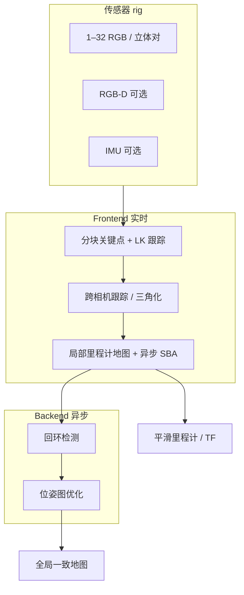
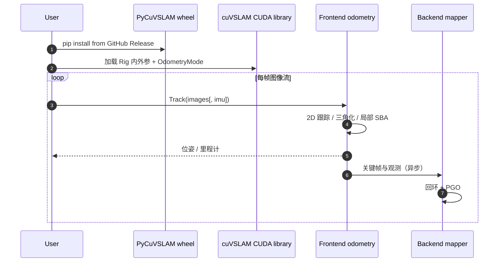

# cuVSLAM：CUDA 加速视觉里程计与建图

**cuVSLAM**（*CUDA accelerated visual odometry and mapping*，[arXiv:2506.04359](https://arxiv.org/abs/2506.04359)，[项目文档](https://nvidia-isaac.github.io/cuVSLAM/)，[代码](https://github.com/nvidia-isaac/cuVSLAM)）由 **NVIDIA** 发布，是面向 **自主移动机器人** 的 **视觉 SLAM / 里程计** 库：在 **CUDA** 上加速特征、跟踪与局部 BA，支持 **单目到 32 路相机**、**立体 / 多立体**、**RGB-D** 与 **立体 VIO**，并在 **Jetson** 等边缘 GPU 上追求 **实时、低额外开销**。ROS 2 生产接入见 [Isaac ROS Visual SLAM](./isaac-ros-visual-slam.md)。

## 一句话定义

**用 GPU 加速的经典 VSLAM 前后端，在免调参默认下覆盖 1–32 相机与 VI/RGB-D rig，把实时里程计放在前端、全局一致性与回环放在异步后端，并给出 PyCuVSLAM 与 Isaac ROS 可运行开源栈。**

## 英文缩写速查

| 缩写 | 英文全称 | 简要说明 |
|------|----------|----------|
| cuVSLAM | CUDA Visual SLAM | 本文 NVIDIA CUDA 视觉 SLAM 库 |
| VSLAM | Visual Simultaneous Localization and Mapping | 视觉同步定位与建图 |
| VIO | Visual-Inertial Odometry | 视觉-惯性里程计 |
| CUDA | Compute Unified Device Architecture | NVIDIA GPU 并行计算平台 |
| FIG | Frustum Intersection Graph | 多相机视锥重叠图，驱动跨相机跟踪 |
| SBA | Sparse Bundle Adjustment | 稀疏光束法平差，局部地图 refine |
| PGO | Pose Graph Optimization | 位姿图优化，后端全局一致 |
| RGB-D | RGB-Depth | 对齐彩色与深度相机 |
| ROS 2 | Robot Operating System 2 | 机器人中间件；Isaac ROS 封装 cuVSLAM |

## 核心信息

| 字段 | 内容 |
|------|------|
| **机构** | 英伟达（NVIDIA） |
| **arXiv** | [2506.04359](https://arxiv.org/abs/2506.04359) |
| **文档** | [nvidia-isaac.github.io/cuVSLAM](https://nvidia-isaac.github.io/cuVSLAM/) |
| **代码** | [nvidia-isaac/cuVSLAM](https://github.com/nvidia-isaac/cuVSLAM)（**NVIDIA Community License**） |
| **ROS 2** | [isaac_ros_visual_slam](https://github.com/NVIDIA-ISAAC-ROS/isaac_ros_visual_slam) |
| **开源结论** | **已开源**（2026-09-24 项目页 + GitHub 核查；PyCuVSLAM 预编译 wheel + 示例） |

## 为什么重要

- **NVIDIA 栈内的「默认 VIO/VSLAM 引擎」：** 与 [Isaac ROS Nvblox](./isaac-ros-nvblox.md)、Nav2 代价地图同一部署故事，适合 **Jetson AMR / 配送 / 仓储** 多相机 rig。
- **传感器弹性：** 从 **单目** 到 **32 相机** 与 **Multisensor** 实验模式，覆盖窄走廊（多视角 FIG）与 RealSense 类 **RGB-D** 栈；相对固定配置的学术 VIO 更贴近 **产品化 rig 多样性**。
- **工程免调参叙事：** 库内算法 **默认自适应**，复现门槛主要是 **标定 + rig 描述**（与 ORB-SLAM3 / OpenVINS 的手动调参文化形成对比）。
- **性能主张：** 技术报告称 **KITTI 平均轨迹误差 <1%**、**EuRoC 位置误差 <5 cm**，并在 Jetson 上 **实时**；Multi-Stereo 在难序列上优于单立体（见论文 §3）。

## 方法与核心结构

| 模块 | 作用 |
|------|------|
| **Frontend** | 在线位姿：2D 关键点选择 / LK 跟踪、立体或多相机三角化、局部地图、**异步局部 SBA**；优先 **平滑里程计**，减少回环/PGO 对控制环路的冲击 |
| **Backend** | 异步：全局地图、**回环**、**PGO**，维护长期一致 |
| **Multicamera + FIG** | 启动时由外参构建 **视锥交集图**，在重叠 FoV 上做跨相机跟踪与联合 PnP |
| **模式** | Mono / RGBD / Multicamera / Inertial（立体 VIO）/ Multisensor（实验，需 cuNLS 构建） |

### 流程总览

## 实验与评测（技术报告摘要）

| 基准 / 设定 | 论文要点 |
|-------------|----------|
| **KITTI Odometry** | 平均轨迹误差 **<1%**（报告口径） |
| **EuRoC** | 位置误差 **<5 cm**（报告口径） |
| **Multi-Stereo vs 单立体** | 难序列上 **精度与鲁棒性** 提升（仿真 + 真实数据集） |
| **Jetson 边缘** | 帧级 **实时** 处理（详见报告附录 Jetson 性能表） |

> 复现与最新数字以 [arXiv HTML v3](https://arxiv.org/html/2506.04359v3) 与 Release 说明为准；工程侧另见 README **Performance / Troubleshooting**（标定、同步、帧率、运动模糊）。

## 与其他工作对比

| 对照 | 差异读法 |
|------|----------|
| [ORB-SLAM3](./orb-slam3.md) | 学术开源、多地图、CPU 为主；cuVSLAM **绑定 CUDA/NVIDIA** 但 **Jetson 帧率与 Isaac ROS 集成** 更强 |
| VINS-Fusion / OpenVINS | 经典 **滑动窗口 VIO**，标定敏感、ROS 桥接工作量大；cuVSLAM 强调 **产品默认 + GPU** |
| [Isaac ROS Visual SLAM](./isaac-ros-visual-slam.md) | **ROS 2 封装层**；算法核心即 **cuVSLAM** 本库 |
| [Ultra-Fusion](./paper-ultra-fusion-multi-sensor-slam.md) | **LiDAR + 多模态图优化** 与退化调度；cuVSLAM **纯视觉（+IMU）**，无 LiDAR 因子 |
| CPU VIO 选型表 | 见 [LiDAR / SLAM / LIO / VIO 选型](../comparisons/lidar-slam-lio-vio-selection.md) 中 **Isaac cuVSLAM** 行 |

## 源码运行时序图

官方 **PyCuVSLAM** 快速路径（[examples/](https://github.com/nvidia-isaac/cuVSLAM/tree/main/examples) + Release wheel）：

**ROS 2 路径：** 相机驱动 → `isaac_ros_visual_slam` 节点 → cuVSLAM 库 → `/tf` 与 Nav2 / nvblox（见 [Isaac ROS 文档](https://nvidia-isaac-ros.github.io/repositories_and_packages/isaac_ros_visual_slam/isaac_ros_visual_slam/index.html)）。

## 工程实践

| 项 | 建议 |
|----|------|
| **许可** | **NVIDIA Community License**；商用需对照条款；与 Apache ROS 包混部署时注意合规 |
| **安装** | 优先 **Release wheel**（Ubuntu 22.04/24.04、Jetson Orin/Thor）；源码见 `BUILD.md` |
| **标定** | **内外参精度** 为第一优先级；畸变与 [EuRoC / RealSense 示例](https://github.com/nvidia-isaac/cuVSLAM/tree/main/examples) 对齐 |
| **多相机** | **硬件同步** 与正确时间戳；参考 RealSense 多机装配指南 |
| **模式选择** | 单目最便宜但 **尺度模糊**；AMR 常见 **Multicamera / Inertial**；RGB-D 单机体用 **RGBD** |
| **Multisensor** | **实验性**；仅 pinhole；需 **cuNLS** 构建 |
| **与 LiDAR 栈** | 纯视觉定位；要 LiDAR 退化韧性另评估 [Ultra-Fusion](./paper-ultra-fusion-multi-sensor-slam.md) 等 |

## 局限与风险

- **硬件绑定：** 依赖 **NVIDIA GPU + CUDA**；无法在纯 CPU 或 AMD 平台运行核心库。
- **算法透明度：** 相对 ORB-SLAM3 / OpenVINS，**内部默认与闭源优化细节** 多，论文级复现依赖官方二进制/wheel。
- **Multisensor 模式：** 文档标明 **实验性**，部分 rig 可能跟踪失败。
- **无 LiDAR：** 极端几何退化（长直隧道纯视觉）仍需 IMU 或多相机 FIG；与 LiDAR LIO 互补而非替代。

## 结论

**cuVSLAM 是 NVIDIA 机器人栈里「默认视觉 SLAM 引擎」：GPU 实时 + 1–32 相机 rig + 已开源 PyCuVSLAM/ROS 2，适合 Jetson AMR 选型；纯 CPU 学术 VIO 或 LiDAR 融合韧性场景应另选栈。**

- **真影响指标：** Jetson/x86+GPU 上 **实时帧率**、**多相机 / Multi-Stereo 鲁棒性**、**Isaac ROS 一键集成**。
- **次要代价：** **NVIDIA 许可与硬件锁定**、Multisensor 仍实验、全局后端对 **控制环路** 的影响需按产品测 TF 延迟。
- **部署读法：** 有 NVIDIA 硬件且已是 Isaac ROS 用户 → **优先 cuVSLAM 线**；要 LiDAR+GNSS 退化调度 → 对照 [Ultra-Fusion](./paper-ultra-fusion-multi-sensor-slam.md)；要完全开源 CPU VIO → ORB-SLAM3 / OpenVINS。

## 常见误区

1. **混淆 cuVSLAM 与 isaac_ros_visual_slam** — 后者是 **ROS 2 封装**，算法库是 **cuVSLAM**。
2. **以为单目可米级绝对尺度** — Mono 模式 **尺度模糊**，需立体 / 深度 / VI 或外部尺度。
3. **忽略同步** — Multicamera 联合 PnP 需要 **时间对齐** 的多路图像。

## 关联页面

- [Isaac ROS Visual SLAM](./isaac-ros-visual-slam.md)
- [导航·SLAM·自动驾驶栈总览](../overview/navigation-slam-autonomy-stack.md)
- [LiDAR / SLAM / LIO / VIO 选型](../comparisons/lidar-slam-lio-vio-selection.md)

## 参考来源

- [`sources/papers/cuvslam_arxiv_2506_04359.md`](../../sources/papers/cuvslam_arxiv_2506_04359.md)
- [`sources/sites/nvidia-cuvslam.md`](../../sources/sites/nvidia-cuvslam.md)
- [`sources/repos/cuvslam.md`](../../sources/repos/cuvslam.md)
- [`sources/repos/isaac_ros_visual_slam.md`](../../sources/repos/isaac_ros_visual_slam.md)

## 推荐继续阅读

- [cuVSLAM GitHub README](https://github.com/nvidia-isaac/cuVSLAM)
- [PyCuVSLAM API](https://nvidia-isaac.github.io/cuVSLAM/python/)
- [Isaac ROS cuVSLAM 概念页](https://nvidia-isaac-ros.github.io/concepts/visual_slam/cuvslam/index.html)
