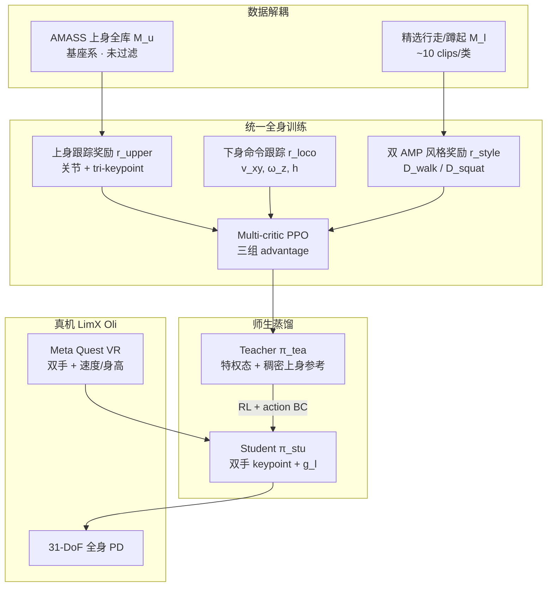

# CWI（Composite Humanoid Whole-Body Imitation · Loco-Manipulation）

**CWI**（*Composite Humanoid Whole-Body Imitation System for Loco-manipulation*，arXiv:[2606.27676](https://arxiv.org/abs/2606.27676)，IEEE RAL，逐际动力 · 港大 · 南科大 · 港科大 · 浙大 ZJU-UIUC）提出：**按身体部位角色解耦 MoCap 数据使用**，在 **单一全身策略** 内同时实现 **多样上身操作模仿** 与 **稳定命令条件下身 locomotion**——上身吃 **未过滤 AMASS 全库**，下身靠 **少量专家行走/蹲起片段 + 双 AMP 判别器** 学风格先验，再用 **多 critic PPO** 与 **师生蒸馏** 压缩为 **双手 9D keypoint + 速度/身高** 的可部署接口。

## 一句话定义

**上身用全量人类操作统计、下身用精选步态先验，训练一个全身策略，再蒸馏成「双手 + 走/蹲命令」的便携 loco-manipulation 控制器。**

## 英文缩写速查

| 缩写 | 英文全称 | 简要说明 |
|------|----------|----------|
| CWI | Composite Whole-Body Imitation | 按角色复合使用 MoCap 的全身模仿框架 |
| AMP | Adversarial Motion Prior | 对抗运动先验，下身行走/蹲起风格判别 |
| MoCap | Motion Capture | 人体动作捕捉数据库（本文主要用 AMASS） |
| PPO | Proximal Policy Optimization | 多 critic on-policy 策略优化 |
| VR | Virtual Reality | Meta Quest 双手 + 速度/身高遥操作接口 |
| DTW | Dynamic Time Warping | 消融中衡量下身运动自然度的松弛对齐距离 |

## 为什么重要

- **直击全身 MoCap 模仿的结构性矛盾：** 全库跟踪要么 **过滤掉大量上身参考**，要么让下身学到 **过激步态**；纯命令采样又难保 **人类化上身协调**——CWI 用 **数据角色解耦** 同时保留 **AMASS 表达力** 与 **稳定 locomotion 先验**。
- **统一策略 vs 分层双策略：** 与 [FALCON](./paper-resmimic.md) 式 **上下身分策略**、[HOMIE](../tasks/teleoperation.md) 式 **下身 RL + 上身 PD** 不同，CWI **不解耦控制器架构**，只在 **数据与奖励分组** 上解耦，利于 **腰–臂–腿涌现协调**（搬箱时腰俯仰随双手前伸自动调整，**无显式躯干命令**）。
- **多 critic 在 loco-manip 的可验证增益：** 去 multi-critic 手端误差 **+12.6 mm**、角速度跟踪变差；去蒸馏则 **单阶段无法从双手 keypoint 学操作**（$p_{ee}$ **42.9→173.2 mm**）——说明 **稠密 teacher 参考 + 稀疏部署接口** 的两阶段设计是刚需。
- **LimX 工程线补全：** 与 [FastStair](./paper-faststair-humanoid-stair-ascent.md)（高速楼梯）、[Any2Any](./paper-any2any-cross-embodiment-wbt.md)（跨机体 WBT）等同属 **LimX Oli** 平台叙事；CWI 覆盖 **日常 loco-manipulation + 便携 VR 遥操作**，接口刻意 **极简** 以利现场部署。
- **与 [LIMMT](../methods/limmt-gqs-motion-curation.md) 形成对照：** LIMMT 问「如何从全库 **筛 3%** 高质量 tracking 片段」；CWI 问「能否 **不按同一分布过滤全身**，而是 **上身全留、下身换小库 + AMP**」——代表 2026 人形模仿 **数据策展 vs 复合解耦** 两条路线。

## 核心结构

| 模块 | 作用 |
|------|------|
| **$\mathcal{M}_u$ 上身库** | 全 AMASS 上身轨迹，基座系表达；关节 + link + tri-keypoint 跟踪 |
| **$\mathcal{M}_l$ 下身库** | ≈10 条/类的专家 **行走 / 蹲起** clip，供 AMP 风格先验 |
| **双 AMP 判别器** | $D^{walk}$（$v_{xy}^{cmd}\neq 0$）与 $D^{squat}$（纯高度模式）；4 帧下身状态窗 |
| **Multi-critic PPO** | $r^{loco}$ / $r^{upper}$ / $r^{style}$ 三组 advantage 归一化后加权 |
| **Teacher–Student** | Teacher：特权态 + 完整 $m_u$；Student：本体历史 + 双手 9D keypoint + $g_l$；RL+BC 蒸馏 |
| **部署接口** | **Meta Quest VR**：双手 pose + $[v_{xy},\omega_z,h]$；31-DoF 关节 PD 输出 |

### 流程总览

## 实验要点（索引级）

| 轴 | 报告口径（以论文为准） |
|----|------------------------|
| **平台** | **LimX Oli** 31-DoF（1.65 m / 50 kg）；**Isaac Lab** 训练；标准质量/摩擦/传感噪声/延迟 DR |
| **命令范围** | $v_x\in[-0.5,1.0]$ m/s；$\omega_{yaw}\in[-1.2,1.2]$ rad/s；$h\in[0.17,0.9]$ m |
| **对比** | 重实现 **HOVER*** / **FALCON*** / **HOMIE***（统一奖励与 PD）；CWI 综合跟踪指标最优 |
| **关键消融** | w/o MC：$p_{ee}$ **55.5 mm**；w/o Distill：**173.2 mm**；w/o AMP：$d_{DTW}$ **1.41**；w/o AMASS-up：$p_{ee}$ **62.3 mm** |
| **真机** | 拧盖、装配、开门、击鼓、长程搬运、搬箱等；**Quest VR** 无全身 MoCap |

## 常见误区或局限

- **误区：「解耦数据 = 上下身两个策略」。** CWI **只有一个全身 actor**；解耦发生在 **参考库、AMP 判别器与 critic 分组**，不是 FALCON 式双智能体。
- **误区：「AMASS 下身没用」。** 下身 **不用 AMASS 帧级跟踪**（分布失衡），但 **上身仍吃全库**；与「整库过滤后全身跟踪」路线不同。
- **局限：** 部署接口 **不支持** 任意关节/接触级全身命令（脚踩踏板、肘击等）；行为覆盖受 **$\mathcal{M}_l$ 风格库 + 双手命令空间** 约束；作者计划用便携接口采集示范供 **VLA** 等高层扩展。

## 关联页面

- [Loco-Manipulation](../tasks/loco-manipulation.md) — 全身移动操作任务与技术路线
- [Teleoperation](../tasks/teleoperation.md) — VR 双手 + 下身命令的便携遥操作语境
- [Whole-Body Control](../concepts/whole-body-control.md)
- [Motion Retargeting Pipeline](../concepts/motion-retargeting-pipeline.md) — PHC 类重定向与基座系上身参考
- [LIMMT / GQS](../methods/limmt-gqs-motion-curation.md) — 全库质量策展的对照路线
- [TWIST](./paper-twist.md) — 全身遥操作模仿系统谱系
- [ResMimic](./paper-resmimic.md) — GMT+残差的另一套「先验 + 任务」分解
- [FastStair](./paper-faststair-humanoid-stair-ascent.md) — 同 LimX Oli 平台工程线
- [MotionWAM](./paper-motionwam-humanoid-loco-manipulation-wam.md) — 另一套「极简接口 + 全身协调」的 2026 对照（WAM vs 复合模仿）

## 与其他工作对比

| 路线 | 上身 | 下身 | 策略形态 | 部署接口 |
|------|------|------|----------|----------|
| **全身 MoCap 跟踪**（HOVER 等） | 帧级跟踪 | 帧级跟踪 | 统一策略 + 蒸馏 | 常需稠密参考/特权 |
| **FALCON*** | IK 目标 + 独立上身策略 | 独立下身策略 | **双 PPO** | 较完整状态 |
| **HOMIE*** | PD 跟踪 | RL | 分层控制 | 外骨骼同构 |
| **CWI** | **全 AMASS 上身跟踪** | **命令 + 双 AMP 先验** | **单策略 + multi-critic** | **双手 keypoint + v/h** |

## 参考来源

- [CWI 论文摘录（arXiv:2606.27676）](../../sources/papers/cwi_arxiv_2606_27676.md)

## 推荐继续阅读

- 论文 HTML（公式与图表）：<https://arxiv.org/html/2606.27676v1>
- 项目页（视频与 BibTeX）：<https://cwi-ral.github.io/CWI-RAL-Webpage>
