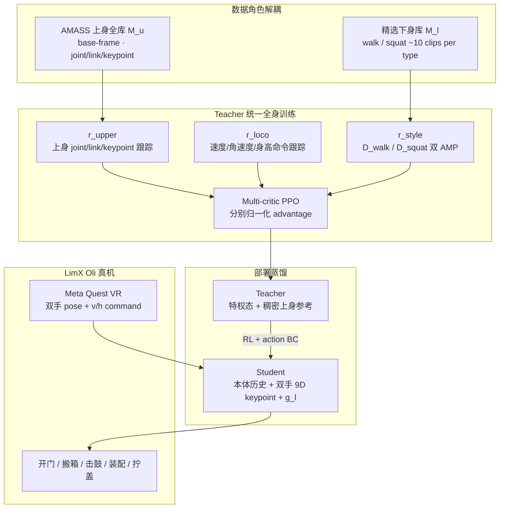

# CWI（Composite Humanoid Whole-Body Imitation）

**CWI**（*Composite Humanoid Whole-Body Imitation System for Loco-manipulation*，arXiv:[2606.27676](https://arxiv.org/abs/2606.27676)，IEEE RAL，[项目页](https://cwi-ral.github.io/CWI-RAL-Webpage)）提出 **按身体部位角色解耦 MoCap 数据使用**：上身保留 AMASS 全库的多样操作轨迹，下身用少量专家行走/蹲起片段与双 AMP 判别器维持稳定 locomotion，再以 multi-critic PPO 与 teacher-student distillation 得到可用 Meta Quest 遥操作的全身策略。

## 一句话定义

CWI 是一种「数据角色解耦、控制器仍统一」的全身模仿方法：上身学全量人类操作统计，下身学精选稳定步态先验，最终压缩成双手 keypoint + 速度/身高命令接口。

## 英文缩写速查

| 缩写 | 英文全称 | 简要说明 |
|------|----------|----------|
| CWI | Composite Whole-Body Imitation | 复合全身模仿；按上/下身角色复用不同 MoCap 分布 |
| AMP | Adversarial Motion Prior | 对抗运动先验，本文用于 walk / squat 下身风格判别 |
| MoCap | Motion Capture | 人体动作捕捉；本文主要使用 AMASS |
| PPO | Proximal Policy Optimization | 多 critic on-policy 策略优化 |
| GAE | Generalized Advantage Estimation | multi-critic 中分别估计三组 advantage |
| VR | Virtual Reality | Meta Quest 便携遥操作输入 |
| DTW | Dynamic Time Warping | 下身自然度消融指标 |

## 为什么重要

- **解决「全库 MoCap」的分布矛盾。** 全身跟踪 AMASS 会把跳跃、转身、高速位移等下身片段也灌进 locomotion；只用命令采样又失去上身人类化操作统计。CWI 把数据用途拆开：上身全保留，下身换成小而稳定的专家库。
- **不是上下身两个策略。** 它不像 FALCON / HOMIE 式双策略或分层控制，而是在 **同一全身 actor** 内用奖励、critic 和数据分组解耦，便于腰、腿、臂的协同自然涌现。
- **部署接口很轻。** Student 只吃本体历史、双手 9D tri-keypoint 与 $g_l=[v_{xy},\omega_z,h]$，不需要全身 MoCap，适合 Meta Quest 现场遥操作。
- **消融说明两阶段必要。** 去掉 multi-critic 会恶化手端与角速度跟踪；去掉蒸馏后 student 无法从稀疏双手 keypoint 直接学会操作；去掉 AMP 后下身风格 DTW 明显变差。
- **接触表示横切面清晰。** 在 [Loco-Manip 接触分类 02：接触表示](../overview/loco-manip-contact-category-02-contact-representation.md) 中，CWI 的贡献不是新触觉传感器，而是把接触相关上身目标压成可遥操作 keypoint 接口。

## 流程总览

## 核心原理（详细）

### 1. 数据角色解耦，而不是数据过滤

CWI 先用 PHC 类运动学优化器把 MoCap 重定向到 LimX Oli。关键不是对 AMASS 全身轨迹统一打分过滤，而是重写其用途：

- $\mathcal{M}_u$：保留全部 AMASS **上身** 轨迹，转换到机器人 base frame，剥离 root motion；高速旋转、跳跃等片段仍能提供可用臂部操作统计。
- $\mathcal{M}_l$：只保留少量专家 **walk / squat** clip 作为下身风格先验，避免让机器人模仿 AMASS 中不适合稳定操控的下肢运动。

这种分解保留「人类上身怎么协调」的广覆盖，同时让腿只承担稳定 locomotion 与高度调节。

### 2. 双 AMP 下身风格先验

CWI 使用两个下身 discriminator：

| 判别器 | 激活场景 | 学到的风格 |
|--------|----------|------------|
| $D^{walk}$ | $v_{xy}^{cmd}\neq 0$ | 稳定步行、移动中支撑 |
| $D^{squat}$ | 纯高度 / 下蹲命令 | 蹲起、低姿态操作 |

AMP 输入为 4 帧下身状态窗，不混入上身参考。这避免 discriminator 把上身动作当作风格判据，使下身先验服务于 locomotion 稳定，而不是强行复刻全身 MoCap。

### 3. Multi-critic PPO：把冲突目标分组优化

论文将总奖励分为 $r^{loco}$、$r^{upper}$、$r^{style}$ 三组。若用单 critic，稀疏/对抗式 style reward、dense 上身跟踪与速度/身高命令容易在 advantage 尺度上互相淹没；CWI 为三组分别估计 GAE，批内归一化后加权组合 PPO surrogate。

实验消融显示，去掉 multi-critic 后手端误差从 **42.9 mm** 增至 **55.5 mm**，角速度跟踪也退化，说明问题不是 reward 权重简单调参，而是优化信号需要按物理角色隔离。

### 4. Teacher-student：稠密参考到稀疏部署接口

Teacher 看到特权状态与完整上身参考 $m_u$；Student 只能看到部署时可得到的本体历史、双手 9D tri-keypoint 与下身命令 $g_l$。蒸馏阶段结合 RL 与 action-MSE BC，并对 BC 权重退火。

如果直接训练 student，消融报告 $p_{ee}$ 达 **173.2 mm**，说明双手 keypoint 虽是好部署接口，但信息太稀疏，必须先用 teacher 在稠密参考下学出全身协调，再压缩到轻接口。

### 5. LimX Oli 平台实验

| 轴 | 报告口径 |
|----|----------|
| 平台 | 31-DoF LimX Oli，1.65 m / 50 kg |
| 仿真 | IsaacLab；质量、摩擦、传感噪声、延迟等 domain randomization |
| 命令范围 | $v_x\in[-0.5,1.0]$ m/s，$\omega_z\in[-1.2,1.2]$ rad/s，$h\in[0.17,0.9]$ m |
| Baseline | 重实现 HOVER* / FALCON* / HOMIE*，统一奖励、观测与 PD |
| 关键消融 | w/o MC: $p_{ee}=55.5$ mm；w/o Distill: $p_{ee}=173.2$ mm；w/o AMP: $d_{DTW}=1.41$；w/o AMASS-up: $p_{ee}=62.3$ mm |
| 真机 | 拧盖、小件装配、开门、击鼓、长程 pick-place-carry、搬箱；Meta Quest VR 输入 |

## 源码运行时序图

**不适用。** 项目页（2026-07-22 核查）仅列 arXiv、YouTube、Bilibili 与 BibTeX，未列 GitHub / Code / Dataset 下载入口；arXiv abs 的 Code/Data/Media 区也未给出官方仓库。因此当前不能绘制可运行官方代码的运行时序图。

## 工程实践（含开源状态）

| 项 | 结论 |
|----|------|
| 项目页 | <https://cwi-ral.github.io/CWI-RAL-Webpage> |
| 论文 | <https://arxiv.org/abs/2606.27676> |
| 官方代码 | **未发现**；项目页无 GitHub / Code 按钮 |
| 视频 | YouTube / Bilibili 均由项目页链接 |
| 训练后端 | 论文报告 IsaacLab；实现细节未开源 |
| 硬件 | LimX Oli 31-DoF，全尺寸人形 |
| 遥操作 | Meta Quest VR 双手 + 速度/身高命令 |
| 可复现边界 | 可复核论文与视频；不可直接复现实验训练栈 |

## 局限与风险

- **接口表达受限。** Student 只接收双手 keypoint、速度与身高，不能表达脚踩踏板、肘部接触、全身任意关节命令等复杂接触目标。
- **仍需人工/规则式命令设计。** VR operator 或上层策略要给出双手与下身命令；CWI 本身不解决开放语言任务规划。
- **下身风格库小而关键。** 精选 walk/squat clip 虽稳定，但会限制步态风格与地形覆盖；换机器人或任务可能需要重新策展。
- **无官方代码。** 实现细节、reward 权重、multi-critic 工程组织与真机部署安全策略无法直接复查。
- **对比 baseline 为重实现。** HOVER* / FALCON* / HOMIE* 在 LimX Oli 上统一配置，适合做框架对照，但不等价于原论文最佳复现。

## 关联页面

- [Loco-Manipulation](../tasks/loco-manipulation.md) — 全身移动操作任务语境。
- [Teleoperation](../tasks/teleoperation.md) — Quest VR 双手 + 下身命令的部署接口。
- [Whole-Body Control](../concepts/whole-body-control.md) — 腰、腿、臂的统一 actor 协调背景。
- [Motion Retargeting Pipeline](../concepts/motion-retargeting-pipeline.md) — PHC 类重定向与 base-frame 上身参考。
- [Loco-Manip 接触分类 02：接触表示](../overview/loco-manip-contact-category-02-contact-representation.md) — CWI 所属接触横切面。
- [LIMMT / GQS](../methods/limmt-gqs-motion-curation.md) — 与「全库筛选」路线对照。
- [TWIST](./paper-twist.md) — 全身遥操作/模仿谱系。
- [ResMimic](./paper-resmimic.md) — 先验 + 任务残差的相邻路线。
- [FastStair](./paper-faststair-humanoid-stair-ascent.md) — 同 LimX Oli 平台工程线。
- [MotionWAM](./paper-motionwam-humanoid-loco-manipulation-wam.md) — 统一 WAM 动作空间路线对照。

## 参考来源

- [CWI 论文摘录（arXiv:2606.27676）](../../sources/papers/cwi_arxiv_2606_27676.md)
- [CWI 项目页核查](../../sources/sites/cwi-project.md)
- [wechat_embodied_ai_lab_loco_manip_contact_survey.md](../../sources/blogs/wechat_embodied_ai_lab_loco_manip_contact_survey.md)
- Ge et al., *CWI: Composite Humanoid Whole-Body Imitation System for Loco-manipulation*, arXiv:2606.27676, 2026. <https://arxiv.org/abs/2606.27676>

## 推荐继续阅读

- [CWI 项目页](https://cwi-ral.github.io/CWI-RAL-Webpage)
- [arXiv HTML](https://arxiv.org/html/2606.27676v1)
- [Loco-Manip 接触技术地图](../overview/loco-manip-contact-technology-map.md)
- [LIMMT / GQS Motion Curation](../methods/limmt-gqs-motion-curation.md)
