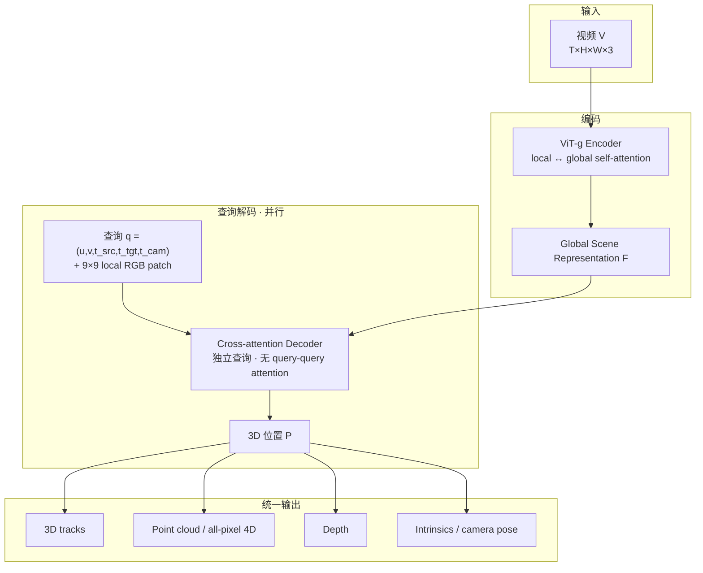

# D4RT：按需查询的统一 4D 动态场景重建

**D4RT**（*Efficiently Reconstructing Dynamic Scenes One D4RT at a Time*，arXiv:[2512.08924](https://arxiv.org/abs/2512.08924)，[CVPR 2026](https://d4rt-paper.github.io/)，[项目页](https://d4rt-paper.github.io/)，[DeepMind 通稿](https://deepmind.google/blog/d4rt-teaching-ai-to-see-the-world-in-four-dimensions/)）由 **Google DeepMind** 与 **牛津大学 VGG**（Andrew Zisserman 等）等提出：用 **一次前馈编码 + 轻量并行查询解码**，把动态视频里的 **深度、相机参数、稀疏/稠密 3D 跟踪、全像素 4D 重建** 收进 **同一接口**，避免 VGGT 式多解码头或 MegaSaM 式多模型 + 测试时优化。

> **开源状态：** 截至 **2026-09-10**，项目页 **未列 GitHub / 权重** → **确认未开源**（步骤 2.5 核查）。

## 一句话定义

**把视频编码成 Global Scene Representation，再用可并行、互不交互的时空查询解码任意像素的 3D 位置——用查询范式统一 4D 重建，而不是为每个任务堆独立解码器或后处理优化。**

## 英文缩写速查

| 缩写 | 英文全称 | 简要说明 |
|------|----------|----------|
| D4RT | Dynamic 4D Reconstruction and Tracking | 本文方法总称 |
| GSR | Global Scene Representation | 编码器输出的全局 latent 场景表示 |
| SRT | Scene Representation Transformer | 查询式解码灵感来源 |
| TAPVid-3D | — | 动态视频 3D 点跟踪评测协议 |
| ATE | Absolute Trajectory Error | 相机轨迹绝对平移误差 |
| APD₃D | Average Percent of Points within Delta (3D) | 3D 跟踪误差阈值内点比例 |

## 核心信息

| 字段 | 内容 |
|------|------|
| **机构** | 谷歌 DeepMind（Google DeepMind）；牛津大学（University of Oxford / VGG）等 |
| **arXiv** | [2512.08924](https://arxiv.org/abs/2512.08924)（2025-12-09，v2） |
| **会议** | CVPR 2026（项目页 BibTeX） |
| **规模** | Encoder ViT-g **~1B** + Decoder cross-attention **~144M** |
| **训练** | 48 帧 clip @ 256²；2048 查询/batch；64 TPU × 500k steps（~2 天） |
| **开源（截至 2026-09-10）** | **确认未开源** — 无官方仓库或权重 |

## 为什么重要

- **统一 4D 接口：** 同一解码器通过改变查询 $(u,v,t_{\text{src}},t_{\text{tgt}},t_{\text{cam}})$ 得到 **track / depth / point cloud / pose**，无需 SpatialTrackerV2 式多阶段或 VGGT 式分任务头。
- **动态对应：** 相对纯重建方法（MegaSaM、$\pi^3$），能在 **动态物体** 上建立 **全视频、统一参考系** 的 3D 对应；相对只从首帧跟踪的方法，可覆盖 **首帧不可见** 区域。
- **效率数量级：** 论文报 **18–300×** 3D 跟踪吞吐（Table 3）；pose **200+ FPS**（A100，Fig 3）；DeepMind 博客：**1 分钟视频 ~5 s（单 TPU）** vs 先前 SOTA **~10 min**。
- **机器人上游几何：** 可作 **动态 egocentric / 操作视频** 的 **4D 点跟踪 + 相机 + 稠密深度** 前馈模块，与 [Macrodata Hand-Action](../methods/macrodata-egocentric-hand-action.md) 等 **VGGT 窗式几何** 互补——D4RT 强调 **动态时空对应**，VGGT/VGG-T³ 强调 **多视图静态/离线 pointmap**。

## 流程总览

## 核心原理

### 1. 时空解耦查询

查询把 **源像素** $(u,v,t_{\text{src}})$ 与 **目标时刻** $t_{\text{tgt}}$、**参考相机时刻** $t_{\text{cam}}$ **分开指定**。因此可：
- 固定 $(u,v,t_{\text{src}})$、扫 $t_{\text{tgt}}$ → **3D 轨迹**
- 固定 $t_{\text{cam}}$、查询全像素 → **统一世界系 point cloud**
- 令 $t_{\text{src}}=t_{\text{tgt}}=t_{\text{cam}}$ → **深度图**

### 2. 独立并行解码

每个查询 **只 cross-attend 到 $F$**，查询之间 **不做 self-attention**（论文早期实验：开启 query self-attention 会明显掉点）。训练只需 **少量随机查询** 即可反传；推理可对 **成千上万查询并行** → 高吞吐 tracking / dense 4D。

### 3. Local patch 上下文

解码查询除 Fourier 编码的 $(u,v)$ 与时间嵌入外，还拼接 **源帧 9×9 RGB patch** embedding（GL 提出；Sec 4.4 消融显著）——类似给每个探针附带局部外观上下文。

### 4. All-pixel 4D（Alg. 1）

全像素跟踪用 **occupancy grid** 跳过已访问时空像素，自适应 **5–15×** 加速；可行是因为 **单查询代价低**，而稠密逐帧解码或重型 sparse decoder（SpatialTrackerV2）难以承受。

## 源码运行时序图

**不适用**（截至 2026-09-10 **确认未开源**：项目页与 DeepMind 博客均无官方 GitHub / 权重 / Demo 入口；实现基于内部 Kauldron 栈，无可公开复现路径）。

## 评测要点

| 任务 | 基准 | 印象 |
|------|------|------|
| **3D 跟踪** | TAPVid-3D（DriveTrack / ADT / PStudio） | 相机系 AJ/APD₃D **领先** SpatialTrackerV2、CoTracker3+VGGT 等（Table 4） |
| **世界系跟踪** | TAPVid-3D world coord | APD₃D **0.470**（DriveTrack，GT intrin.）等 **显著优于** 对照 |
| **吞吐** | 单 A100 @ 目标 FPS | @60FPS **550** tracks（DELTA **0**；SpatialTrackerV2 **29**） |
| **Point cloud L1** | Sintel / ScanNet | **0.768 / 0.028**，优于 VGGT、MegaSaM、$\pi^3$（Table 5 左） |
| **Video depth AbsRel** | Sintel / ScanNet / KITTI / Bonn | 多数据集 **SOTA 或并列最佳**（Table 5 右） |
| **Camera pose** | Sintel / ScanNet / Re10K | Sintel ATE **0.065**；Re10K AUC **83.5**（Table 6） |

## 对比定位

| 对照 | D4RT 差异 |
|------|-----------|
| **VGGT** | 多解码头、**无动态 3D 对应**；D4RT **统一查询** + **动态 track**；pose **~9×** 更快（Fig 3） |
| **MegaSaM** | 多 off-the-shelf 模块 + **测试时优化**；D4RT **单趟前馈**；博客 **~120×** wall-clock |
| **SpatialTrackerV2** | 多阶段 + 迭代 refine；D4RT **单阶段**；跟踪吞吐 **18–300×**（Table 3） |
| [VGG-T³](./paper-vgg-ttt.md) | **离线多视图 pointmap / COLMAP 替代**；D4RT 面向 **视频 4D / 动态** |
| [GenCeption](./genception.md) | 生成骨干改 **统一视频感知**；深度上 GenCeption 以 **极少合成数据** 逼近 D4RT 量级（Table 2 对照） |

## 工程实践

| 项 | 建议 |
|----|------|
| **选型** | 需要 **动态视频 4D 跟踪 + 深度 + 相机** 的统一前馈模块 → 跟踪 D4RT 发表与通稿结论；**静态大图集 SfM** → [VGG-T³](./paper-vgg-ttt.md) / VGGT |
| **集成** | 输出为 **查询式 API**（非固定 tensor 头）；机器人管线需封装 **稀疏 track / dense 4D / depth** 三种查询调度 |
| **延迟** | A100 **200+ FPS pose**、博客 **1 min→~5 s（TPU）** — 适合 **近实时 AR / 遥操作几何**，但仍需实测 GPU 与 batch 查询数 |
| **复现** | **暂无官方权重** — 勿依赖社区非官方仓作产品基线 |
| **与 WBT 关系** | 不替代 [Motion Retargeting](../concepts/motion-retargeting.md)；可作 **egocentric 动态场景理解** 或 **Real2Sim 几何先验** 上游 |

## 结论

**D4RT 的价值在于用「一次编码、按需查询」把动态 4D 重建从多模块拼图变成单接口前馈模型，并在跟踪吞吐与 TAPVid-3D 等基准上同时拉开数量级差距——它不是静态 SfM 的替代品，而是动态视频 4D 感知的新默认参照。**

- **真影响指标是查询并行度 + 轻量解码器**：独立 cross-attention 查询使 **18–300×** 跟踪吞吐与 **200+ FPS** pose 成为可能；重 decoder 或多阶段 refine 路线在动态 dense 4D 上难以扩展。
- **动态 holistic 4D 是差异化能力**：相对 MegaSaM / $\pi^3$ 的「静态重建 + 动态失败」，D4RT 能 **全像素、统一参考系** 跟踪动态物——对 manipulation / egocentric 视频尤为重要。
- **Local RGB patch 是必要工程细节**：9×9 patch 不是小 trick；去掉会显著伤性能，说明 **探针式解码仍需局部外观**。
- **开源缺口是当前最大部署障碍**：截至入库日 **无官方代码/权重**；选型与对标应基于论文/项目页数字，量产集成需等待官方发布或自研复现。
- **与 VGGT 系分工明确**：要 **千图 pointmap / 定位** 看 VGG-T³；要 **单视频动态 4D** 看 D4RT；[GenCeption](./genception.md) 则探索 **生成骨干能否用极少数据逼近 D4RT 深度性能**。

## 局限与风险

- **确认未开源：** 无法直接接入现有机器人栈；社区实现 **非官方**。
- **训练算力：** 64 TPU × 2 天 + 大规模混合数据（含内部集）——复现门槛高。
- **查询调度复杂度：** Dense all-pixel 4D 虽可行，仍依赖 occupancy 启发式；极端长视频内存与查询数需工程裁剪。
- **与专用专家差距：** GenCeption 等表明在 **单任务深度** 上可用 **更少数据** 逼近；D4RT 强在 **统一 4D 接口 + 速度**，非所有子任务都是绝对 SOTA。
- **机器人闭环未验证：** 论文基准偏 CV 4D 重建；真机 **延迟、标定、动态手–物** 仍需系统集成评测。

## 参考来源

- [d4rt_arxiv_2512_08924.md](../../sources/papers/d4rt_arxiv_2512_08924.md) — arXiv 摘录与实验表
- [d4rt-paper.md](../../sources/sites/d4rt-paper.md) — 项目页与开源核查
- 论文 PDF：<https://arxiv.org/pdf/2512.08924>
- DeepMind 通稿：<https://deepmind.google/blog/d4rt-teaching-ai-to-see-the-world-in-four-dimensions/>

## 关联页面

- [GenCeption](./genception.md) — 深度/4D 感知统一基础模型；benchmark 以 D4RT 为对照专家
- [VGG-T³](./paper-vgg-ttt.md) — VGGT 系离线前馈几何与视觉定位
- [State Estimation](../concepts/state-estimation.md) — 相机与稠密几何在状态估计栈中的位置
- [状态估计枢纽](../overview/hub-state-estimation.md) — SLAM / 几何基础模型索引
- [Visual Representation for Policy](../concepts/visual-representation-for-policy.md) — 策略用视觉表征选型

## 推荐继续阅读

- [D4RT 项目页（交互 4D 可视化）](https://d4rt-paper.github.io/)
- [arXiv:2512.08924](https://arxiv.org/abs/2512.08924)
- [DeepMind：Teaching AI to see the world in four dimensions](https://deepmind.google/blog/d4rt-teaching-ai-to-see-the-world-in-four-dimensions/)
