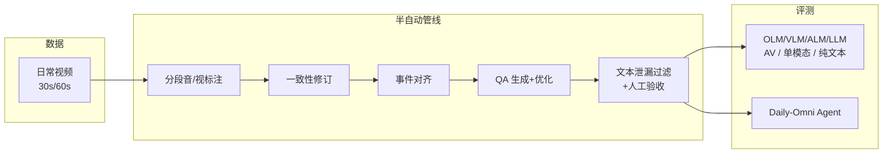
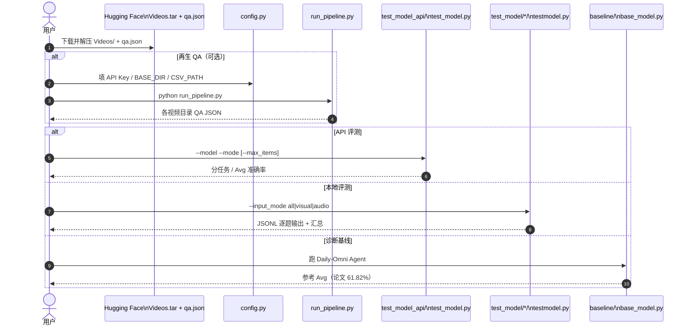

# Daily-Omni（日常音视频跨模态时序推理基准）

**Daily-Omni**（*Towards Audio-Visual Reasoning with Temporal Alignment across Modalities*，[arXiv:2505.17862](https://arxiv.org/abs/2505.17862)，Ziwei Zhou / Rui Wang / Zuxuan Wu / Yu-Gang Jiang · **复旦大学**；[项目页](https://lliar-liar.github.io/Daily-Omni/) · [Leaderboard](https://lliar-liar.github.io/Daily-Omni/#leaderboard) · [代码](https://github.com/Lliar-liar/Daily-Omni) · [数据](https://huggingface.co/datasets/liarliar/Daily-Omni)）针对「单模态基准已强、跨模态同步仍弱」的缺口，构建面向日常生活场景的 **多选题音视频问答（AVQA）** 基准，并配套可扩展半自动出题管线与诊断基线。

## 一句话定义

用 **真实日常视频 + 强制跨模态时序对齐的六类 MCQA**，诊断 omni-modal MLLM 是否真能把「同时发生的声与画」对齐起来推理——而不是靠单通道或文本泄漏蒙对。

## 英文缩写速查

| 缩写 | 英文全称 | 简要说明 |
|------|----------|----------|
| AVQA | Audio-Visual Question Answering | 音视频联合问答；本基准主任务形态 |
| MLLM / OLM | Multimodal / Omni-modal Language Model | 评测对象；OLM 同时吃音+视 |
| AV Align | Audio-Visual Alignment | 六任务族之一：判断声画事件是否并发 |
| MCQA | Multiple-Choice Question Answering | 四选一；随机基线 25% |
| TMRoPE | Temporal Multimodal Rotary Position Embedding | 文中讨论的跨模态时序位置设计（如 Qwen Omni） |
| ASR | Automatic Speech Recognition | Agent 中 Whisper 补全语音转写 |

## 为什么重要

- **补齐具身感知上游的「声画同步」轴：** [具身评测选型闭环](../queries/embodied-eval-benchmark-selection-loop.md) ① 层已有 [RoboBench](./robo-bench.md)（操纵认知）与 [ESI-Bench](./esi-bench.md)（主动空间）；Daily-Omni 专门测 **开放域日常场景下的音视频时序对齐**，更贴近真实环境声（非仅语音）对具身大脑的约束。
- **模态消融证明双通道必需：** 去掉音频或视觉常掉 **10–28** 个百分点；音频-only 往往高于视觉-only——与许多「视觉偏置视频 QA」相反。
- **显式对齐基线可打穿弱统一模型：** 训练无关的 **Daily-Omni Agent**（Avg **61.82%**）超过多个近期开源 OLM，把瓶颈钉在 **时序对齐机制** 而非「再堆参数」。
- **产业读榜信号：** 项目页榜首为 **AGIBOT X-Lab WITA-Omni Preview（Closed）85.21%**（2026-07-26 更新），与智元多模态栈叙事同向；开源权重侧以 Nemotron / Qwen3-Omni 为参考。
- **工程可复现：** GPL-3.0 仓 + HF 视频包；API / 本地评测脚本齐全。

## 核心信息

| 项 | 内容 |
|----|------|
| 机构 | 复旦大学（计算与人工智能创新学院；可信具身智能研究院） |
| 规模 | **684** 视频 · **1197** 题；30s **647** / 60s **550** |
| 任务族 | AV Align / Event Sequence / Reasoning / Inference / Comparative / Context Understanding |
| 数据源 | AudioSet、Video-MME、FineVideo（排除静态口播与非英语） |
| 代码 | [Lliar-liar/Daily-Omni](https://github.com/Lliar-liar/Daily-Omni) · **GPL-3.0** |
| 数据 | [liarliar/Daily-Omni](https://huggingface.co/datasets/liarliar/Daily-Omni) · **CC BY-NC-SA 4.0** |
| 开源核查 | **已开源**（2026-07-30）：管线 + 评测 + 基线 + HF 资产 |

## 核心原理（方法）

### 半自动 QA 生成管线

1. **分段标注：** 将 30s/60s 剪成三段；Gemini 对视觉（无声）与音频 **独立** 标注，降低跨模态幻觉。
2. **修订：** 全片视觉一致性修订；再用视觉上下文纠正音频误标并归因声源。
3. **事件对齐：** 一次查询建立音–视并发事件对（抽检 100 视频对齐正确率 **>90%**）。
4. **出题与优化：** Deepseek-R1 按六任务族生成 MCQA，删减文本泄漏线索、加强干扰项。
5. **泄漏过滤 + 人工验收：** GPT-4o 与 Deepseek-V3 **纯文本** 双双答对则丢弃（≈47%）；人工验收接受率 ≈30%。

### 诊断基线：Daily-Omni Agent

解耦流水线：分段视觉/音频标注（Qwen2.5-VL + Qwen2-Audio）+ Whisper 转写 → 视觉一致性修订 → 按题检索关键事件并做局部时序 grounding → Qwen2.5-14B 作答。用于证明 **把时序局部证据显式化** 的收益，而非追求刷新榜单最高分。

### 流程总览

## 源码运行时序图

节点对齐 [`sources/repos/daily-omni.md`](../../sources/repos/daily-omni.md) 与官方 README。

关键复现路径：先落 HF 资产，再选 `test_model_api` 或 `test_model/*/testmodel.py`；`--input_mode` 直接做模态消融。

## 工程实践

| 项 | 建议 |
|----|------|
| 最短评测 | HF 解压 → `pip install -r requirements.txt` → API 或本地 `testmodel.py` |
| 模态消融 | 统一 `--input_mode {all,visual,audio}`；VLM 脚本遇 `audio` 会不支持 |
| 读榜 | 以项目页 [#leaderboard](https://lliar-liar.github.io/Daily-Omni/#leaderboard) 为准；闭源 Preview 与开源权重分表读 |
| 许可证 | 代码 **GPL-3.0**；数据 **CC BY-NC-SA 4.0**（商用分发需另核） |
| 具身选型用法 | 作 [① 层认知评测](../queries/embodied-eval-benchmark-selection-loop.md) 的 **AV 同步诊断**；高分仍 ≠ 可下发动作（对照 RoboBench→VLA 相关结论） |

## 实验与评测

### Leaderboard 快照（AV 全模态 Avg，入库日）

| 模型 | 开闭源 | Avg |
|------|--------|-----|
| AGIBOT X-Lab WITA-Omni Preview | Closed | **85.21** |
| Qwen3.5-Omni-Plus† | Closed | 84.68 |
| Gemini 3.1 Pro Preview | Closed | 82.79 |
| Doubao Seed 2.0 Lite | Closed | 82.12 |
| NVIDIA Nemotron 3 Nano Omni 30B A3B | Open | **74.52** |
| Qwen3-Omni-30B-A3B-Thinking | Open | 73.60 |
| Gemini 2.5 Flash | Closed | 73.06 |
| Daily-Omni-Baseline-Qwen2.5 | Open | 61.82 |
| 早期 Unified-IO-2 / VideoLLaMA2 等 | Open | ≈27–35 |

† 1175/1197 有效样本；详见项目页脚注。

### 关键现象

1. **对齐敏感题拉开差距：** 弱时序融合模型可低于解耦基线；强 OLM（Qwen Omni / Gemini / 新 Preview）明显更高。
2. **模态消融：** Gemini 2.5 Flash 73.06% → A-only 54.05% / V-only 44.61%；Qwen3-Omni 去模态约 −13–16%。
3. **纯文本上限低：** GPT-4o / Deepseek-V3 / Qwen2.5-14B 约 **34–36%**，说明泄漏过滤有效。
4. **子采样稳定：** 80% 视频子集时，代表模型 5–95 分位带宽约 **1.1–1.2** 个百分点。

## 结论

**一句话总判：Daily-Omni 证明「日常场景里声画是否对齐」仍是 omni-modal 栈的主瓶颈；榜分要分闭源 Preview / 开源权重 / 解耦基线三档读，且高分只说明感知同步，不证明可执行控制。**

1. **真影响指标是 AV Align 与去模态掉点** — 全模态 Avg 好看但 V-only/A-only 崩盘，说明模型在吃单通道捷径。
2. **解耦 Agent 是诊断尺，不是部署目标** — 61.82% 用来卡「统一模型是否学会对齐」。
3. **闭源 Preview 与开源权重不要混排决策** — WITA-Omni 85% 是产业预览信号；可复现对比优先 Nemotron / Qwen3-Omni。
4. **数据许可偏研究** — CC BY-NC-SA 限制商用分发；代码 GPL-3.0 有传染性。
5. **放进具身评测链时定位在 ① 层补维** — 与 RoboBench（操纵认知）、ESI-Bench（主动空间）互补，再往下才接 VLA / 真机成功率。
6. **扩展靠管线不是靠手标** — 半自动 + 泄漏过滤是后续领域定制基准的可抄作业。

## 与其他工作对比

| 基准 | 主测对象 | 交互/模态 | 与 Daily-Omni |
|------|----------|-----------|---------------|
| **Daily-Omni** | OLM/MLLM **跨模态时序对齐** | 被动 AV MCQA | 日常开放域 + 可扩展管线 + 模态消融 |
| [RoboBench](./robo-bench.md) | MLLM **操纵 System 2** | 多图 QA + 规划模拟器 | 偏机器人操纵认知链，非环境声对齐 |
| [ESI-Bench](./esi-bench.md) | 具身 **空间智能** | OmniGibson 主动探索 | 测「为看见而行动」，少覆盖音频 |
| [EWMBench](./ewmbench.md) | 具身 **世界模型视频** | 开环视频生成 | 评场景/轨迹/语义，非 AVQA |
| WorldSense 等 AVQA | 日常 AV QA | MCQA | 论文指其缺可扩展自动出题与诊断协议 |

## 局限与风险

- **非具身动作基准：** 不含控制量 / 任务成功率；不可替代 ③ 层策略评测。
- **闭源榜波动：** Preview 模型与 API 过滤（如 Qwen3.5-Omni-Plus 缺 22 题）会影响可比性。
- **许可证：** 非商业数据许可 + GPL 代码，产品集成前需法务审阅。
- **领域偏置：** 排除非英语与大量静态口播；工业噪声 / 机器人本体噪声分布可能不同。

## 关联页面

- [具身大模型评测基准选型闭环](../queries/embodied-eval-benchmark-selection-loop.md) — ① 层放入 AV 同步诊断
- [具身大模型分类学选型闭环](../queries/embodied-fm-taxonomy-loop.md) — VLM/OLM 感知层 I/O
- [RoboBench](./robo-bench.md) — 操纵向 MLLM 认知评测
- [ESI-Bench](./esi-bench.md) — 主动空间智能评测
- [EWMBench](./ewmbench.md) — 具身世界模型生成评测
- [五大具身模型分类对比](../comparisons/vlm-vln-vla-vlx-world-model-taxonomy.md) — VLM 能力边界
- [统一多模态 token](../methods/unified-multimodal-tokens.md) — omni 融合表征接口
- [智元灵犀 X1](./agibot-lingxi-x1.md) — 榜首 WITA-Omni 所属产业栈入口

## 参考来源

- [论文摘录 · Daily-Omni arXiv:2505.17862](../../sources/papers/daily_omni_arxiv_2505_17862.md)
- [项目页与 Leaderboard](../../sources/sites/daily-omni-github-io.md)
- [官方仓库 Lliar-liar/Daily-Omni](../../sources/repos/daily-omni.md)

## 推荐继续阅读

- [Daily-Omni 项目页 Leaderboard](https://lliar-liar.github.io/Daily-Omni/#leaderboard) — 持续更新的闭源/开源分数与模态消融表
- [arXiv:2505.17862](https://arxiv.org/abs/2505.17862) — 管线、Agent 与消融全文
