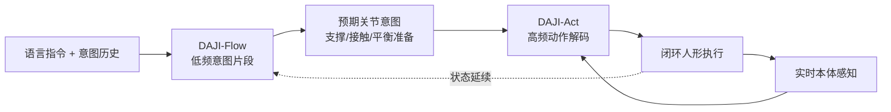

# DAJI（预期关节意图 · 语言条件人形控制）

**DAJI**（*Before the Body Moves: Learning Anticipatory Joint Intent for Language-Conditioned Humanoid Control*，arXiv:2605.14417，[项目页](https://hxxxz0.github.io/DAJI_PAGE/)）提出：流式语言全身控制需要的不是更「像人」的运动片段，而是 **语言生成与闭环控制之间** 一层 **可执行、且对未来物理过渡有预期** 的表示——**预期关节意图（anticipatory joint intent）**。

## 一句话定义

**先形成带未来准备信息的关节意图，再在反馈下执行**——生成输出本身就是部署控制接口，而不是需要底层被动修补的外部运动参考。

## 英文缩写速查

| 缩写 | 英文全称 | 简要说明 |
|------|----------|----------|
| RL | Reinforcement Learning | 通过与环境交互最大化长期回报来学习策略的范式 |
| VLA | Vision-Language-Action | 视觉-语言-动作多模态基础策略方向 |
| API | Application Programming Interface | 应用程序编程接口 |
| MLP | Multi-Layer Perceptron | 多层感知机，处理本体向量等低维输入 |
| CPU | Central Processing Unit | 中央处理器 |
| RGB | Red-Green-Blue | 彩色图像通道，常与深度 (RGB-D) 配合 |
| WAM | World Action Model | 联合世界模型与动作预测的架构 |
| Manipulation | Robot Manipulation | 抓取、移动、操作物体的任务总称 |

## 为什么重要

- **与「听懂语言」的分工**：大模型接人形时，瓶颈常不在语义理解，而在 **语义如何变成身体能连续接住的动力学过程**（重心、支撑脚、接触时机、片段间状态不可重置）。
- **与参考轨迹范式的张力**：上层 kinematic reference + 底层 tracker 在仿真/展示中可行，但参考易与 **当前动量与接触** 脱节；DAJI 把接口改成 **低频意图 + 高频解码**，让生成侧不必承担每个控制步细节，执行侧不必猜上层「到底想做什么」。
- **与任务接口层（身体系统栈）对齐**：与 [人形 RL 运动控制身体系统栈](../overview/humanoid-rl-motion-control-body-system-stack.md) 第 7 层「skill token / latent action / action chunk」同属 **VLA 可调用的身体 API** 争夺线；DAJI 给出 **关节意图 + 预期** 的一种具体形态。

## 核心结构

| 模块 | 功能 |
|------|------|
| **DAJI-Flow** | 根据自然语言与近期意图历史，**自回归** 预测未来 **意图片段**（低频） |
| **DAJI-Act** | 将每个意图 **解码** 为高频全身动作；融合 **实时本体感知**；由带未来信息的教师经 **学生 rollout 蒸馏** 为可部署扩散策略 |
| **Joint-intent 空间** | 生成与执行共享；Flow 的输出 **直接** 被 Act 消费，而非转成易碎的外部轨迹 |

### 流程总览

### 「预期」指什么

- 轨迹主要回答 **「想要什么动作」**；预期意图还要编码 **「为接住下一步，现在身体应如何准备」**（例如转身前的重心、迈步前的支撑切换）。
- 公众号编译稿引用的消融：去掉未来相关信息后，**约 60s 闭环成功率从约 87% 降至约 10%**——说明长程 **流式指令切换** 时，片段间 **身体状态连续** 比单段动作美观更关键（论文表格以 PDF 为准）。

## 实验要点（索引级）

| 设定 | 报告口径（项目页 / 编译稿） |
|------|---------------------------|
| HumanML3D 风格生成 | 成功率约 **94.42%**（TextOp 约 90.00%，MotionStreamer 约 87.50%）；FID 约 0.147 |
| BABEL 长时序流式 | 子序列 FID 约 **0.152**（TextOp 约 0.538） |
| 部署接口 | 64 维 MLP、CPU 延迟约 **4.71 ms**、成功率约 **80.8%**（16 维约 49.5%） |

## 与相邻工作的边界

| 工作 | 关系 |
|------|------|
| **OmniH2O** | 多源输入（VR/RGB/语言等）统一到 **人形身体接口**；DAJI 专注 **语言流式 + 预期意图**，问题域在「接口层」同族 |
| **TextOp / MotionStreamer** | 语言→人形运动生成的强基线 |
| **MDM / ASE / CALM** | 人体运动表示与技能嵌入谱系；DAJI 强调 **真实闭环、低延迟部署** |
| **VLA / WAM** | VLA 偏 \(p(a\mid o,l)\)；DAJI 不声称联合建模未来观测，但补足 **语言后、电机前** 的 **可执行中间层** |

## 常见误区或局限

- **误区：** 把 DAJI 仅当作「更好的 Text-to-Motion」；其核心主张是 **控制接口与闭环可部署性**，而非单段 kinematic 质量。
- **误区：** 认为语言模型足够强后身体会自然跟上；人形 **没有重置键**，前一步状态差会拖累后续片段。
- **局限：** 开放场景中的地形、碰撞、人机交互与失败恢复仍超出单一意图表示；与 [世界模型训练闭环](../overview/robot-world-models-training-loop-taxonomy.md) 路线可互补但不同层。

## 关联页面

- [VLA（Vision-Language-Action）](../methods/vla.md) — 语言条件策略与 **身体 API** 上下文
- [Loco-Manipulation](../tasks/loco-manipulation.md) — 全身移动操作任务族
- [Teleoperation](../tasks/teleoperation.md) — OmniH2O 等 **身体接口** 对照
- [人形 RL 运动控制：身体系统栈](../overview/humanoid-rl-motion-control-body-system-stack.md) — 第 7 层任务接口 / VLA 调用

## 方法栈

见上文 **核心结构** 与 **流程总览**（`###` 小节）；完整机制与模块分工以原文为准。

## 与其他工作对比

- 正文已给出与相邻路线 / baseline 的 **定性对照**；定量表格与 ablation 见原文（[参考来源](#参考来源)）。

## 参考来源

- [DAJI 论文摘录（arXiv:2605.14417）](../../sources/papers/daji_arxiv_2605_14417.md)
- [DAJI 项目页归档](../../sources/sites/daji-hxxxz0-github-io.md)
- [Hxxxz0/DAJI 仓库归档](../../sources/repos/hxxxz0_daji.md)
- [具身智能研究室 · 语义到身体接口（微信公众号）](../../sources/blogs/wechat_embodied_ai_lab_daji_semantic_body_interface.md)

## 推荐继续阅读

- [机器人论文阅读笔记：Ψ₀](https://imchong.github.io/Humanoid_Robot_Learning_Paper_Notebooks/papers/04_Loco-Manipulation_and_WBC/Ψ₀__An_Open_Foundation_Model_Towards_Universal_Humanoid_Loco-Manipulation/Ψ₀__An_Open_Foundation_Model_Towards_Universal_Humanoid_Loco-Manipulation.html)- 论文 PDF：<https://arxiv.org/pdf/2605.14417>
- 项目主页：<https://hxxxz0.github.io/DAJI_PAGE/>
- 官方代码：<https://github.com/Hxxxz0/DAJI>
- OmniH2O：<https://arxiv.org/abs/2406.08858> — 多输入统一身体接口的参照
