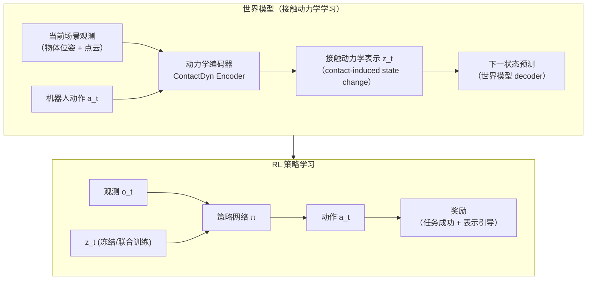
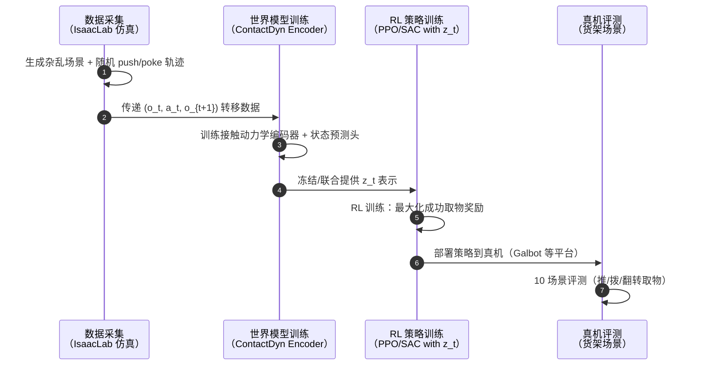

# DAPL：杂乱场景中的外在灵巧性（Emerging Extrinsic Dexterity in Cluttered Scenes via Dynamics-aware Policy Learning）

**DAPL**（*Emerging Extrinsic Dexterity in Cluttered Scenes via Dynamics-aware Policy Learning*，[arXiv:2603.09882](https://arxiv.org/abs/2603.09882)，CASIA / BAAI / Galbot / PKU / SJTU 联合，通讯作者 He Wang，[项目页](https://pku-epic.github.io/DAPL/)，**RSS 2026 Finalist**）提出通过 **世界模型学习接触诱导的动力学表示**，并将该表示作为 RL 策略的引导信号，在 **杂乱场景** 中涌现出 **推拨翻转（push/poke/flip）** 等 **外在灵巧性（extrinsic dexterity）** 行为，无需精细抓取规划即可完成货架杂货场景的目标物取出。

## 一句话定义

**DAPL 让策略「感知」接触如何扰动周围障碍物动力学——世界模型提炼的接触动态表示驱动 RL，涌现出在杂乱堆叠中推/拨/翻转取物的外在灵巧性。**

## 英文缩写速查

| 缩写 | 英文全称 | 简要说明 |
|------|----------|----------|
| DAPL | Dynamics-aware Policy Learning | 本文框架：感知接触动力学的策略学习 |
| RL | Reinforcement Learning | 本文训练范式；以动力学表示为辅助奖励/表示 |
| ED | Extrinsic Dexterity | 外在灵巧性：借助环境接触实现操作，而非指尖精细控制 |
| WM | World Model | 世界模型；学习接触诱导的场景状态转移 |
| BAAI | Beijing Academy of Artificial Intelligence | 北京智源人工智能研究院；联合机构之一 |
| PKU | Peking University | 北京大学；联合机构之一 |
| SJTU | Shanghai Jiao Tong University | 上海交通大学；联合机构之一 |
| RSS | Robotics: Science and Systems | 本文投稿顶会；2026 年度 Finalist |

## 为什么重要

- **杂乱环境取物的核心挑战：** 货架、储物柜等真实场景中，目标物往往被多个障碍物包围，直接抓取路径被阻断——传统规划方法要求精确物体模型，学习方法则难以处理接触诱导的复杂动力学。
- **外在灵巧性的 RL 涌现：** DAPL 不显式编程推拨/翻转动作，而是通过学习到的接触动力学表示让策略自主发现这些行为——代表了从「给定动作原语」到「自主涌现操作策略」的范式转变。
- **仿真与真机双验证：** 仿真增益 >25%，真机在 10 个场景约 50% 成功率，证明了动力学感知表示的 sim-to-real 有效性。
- **货架杂货场景实用价值：** 直接面向仓储/零售机器人需求，目标明确。

## 核心原理

### 框架总览

### 关键模块

| 模块 | 作用 |
|------|------|
| 接触动力学编码器 | 从多帧观测序列提炼「此动作会如何扰动障碍物」的紧凑表示 z_t |
| 表示引导 RL | 将 z_t 注入策略观测，显式告知策略当前接触状态 |
| 障碍物状态预测头 | 世界模型辅助任务：预测接触后障碍物位移，强迫 z_t 含有接触动力学信息 |
| 外在灵巧性行为涌现 | 无显式原语编程；推/拨/翻转行为由 RL 最大化成功奖励时自主涌现 |

### 动力学感知的核心直觉

$$z_t = \text{Enc}(o_{t-k:t},\, a_{t-k:t-1})$$

表示 $z_t$ 捕获过去 $k$ 步动作序列在场景中引发的接触历史，相当于策略对「我刚才如何影响了周围物体」的感知——这正是外在灵巧性的决策依据。

## 工程实践

### 代码开放状态

截至 2026-07-20 核查，[pku-epic.github.io/DAPL](https://pku-epic.github.io/DAPL/) 项目页显示 **"Code (In preparation)"**；关联 GitHub 仓库 [SteveOUO/IsaacLab-nonPrehensile](https://github.com/SteveOUO/IsaacLab-nonPrehensile) 已存在但内容处于**筹备阶段（in preparation）**，非完整可运行代码。如需跟进，建议定期检查上述仓库 README 更新状态。

**源码运行时序图：** 当前代码尚未正式发布，以下为基于项目页与论文描述的**预期**流程（供参考，非正式可复现路径）：

### 仿真环境

- **IsaacLab**（IsaacLab-nonPrehensile 为扩展）；杂乱货架场景随机化
- 机器人末端执行器：平行夹爪（操作模式：推/拨/翻转，非抓取）

### 真机部署

- 平台：Galbot 或类似 6-DOF 操作臂
- 评测：10 个不同杂乱配置货架场景，每场景多次试验取成功率
- 成功率：**约 50%**（仿真至真机存在接触动力学 gap，动力学感知表示有助于缩小但未完全消除）

## 局限与风险

- **代码未完整公开（截至入库日）：** IsaacLab-nonPrehensile 仓库处于 "In preparation"，无法直接复现。
- **50% 真机成功率仍有提升空间：** 杂乱场景接触动力学多样，部分配置下策略泛化不足。
- **非抓取操作的任务范围：** DAPL 专注推/拨/翻转，不涵盖精细夹取；复杂物体形状（轻薄片、球形等）处理有限。
- **世界模型分布外泛化：** 世界模型对训练分布外的障碍物形状与质量可能预测失准，影响 z_t 质量。
- **货架场景特化：** 当前评测场景偏向货架杂货，对非结构化工业或家庭桌面场景的泛化性未充分验证。

## 关联页面

- [Manipulation（操作任务）](../tasks/manipulation.md) — 杂乱场景取物是 manipulation 的核心子任务
- [Contact-Rich Manipulation（接触丰富操作）](../concepts/contact-rich-manipulation.md) — 外在灵巧性的理论基础
- [Reinforcement Learning（强化学习）](../methods/reinforcement-learning.md) — DAPL 的训练范式
- [Sim2Real](../concepts/sim2real.md) — DAPL 仿真到真机的迁移挑战与策略

## 参考来源

- [量子位：RSS 2026 三项最佳论文报道](../../sources/blogs/wechat_qbitai_rss2026_awards_2026-07-16.md)
- [DAPL 论文摘录（arXiv:2603.09882）](../../sources/papers/dapl_extrinsic_dexterity_arxiv_2603_09882.md)
- [DAPL 项目页归档](../../sources/sites/dapl-pku-epic-github-io.md)

## 推荐继续阅读

- [arXiv:2603.09882](https://arxiv.org/abs/2603.09882) — 原始论文（PDF + HTML）
- [项目页与演示视频](https://pku-epic.github.io/DAPL/) — 货架场景推/拨/翻转演示
- [Contact-Rich Manipulation](../concepts/contact-rich-manipulation.md) — 接触丰富操作的系统性归纳
- Zhu et al., *Extrinsic Dexterity: In-Hand Manipulation with External Force* — 外在灵巧性早期代表工作
