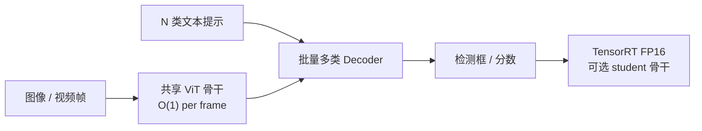
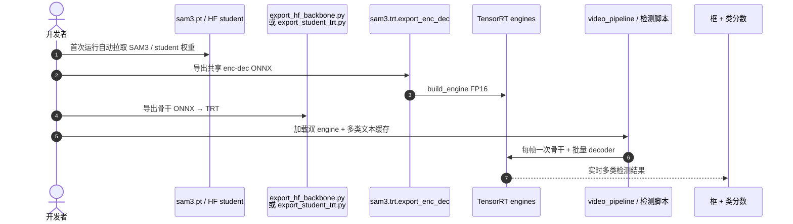

# DART：SAM3 实时多类别开放词汇检测

**DART**（*Detect Anything in Real Time*；论文 *From Single-Prompt Segmentation to Multi-Class Detection*，[arXiv:2603.11441](https://arxiv.org/abs/2603.11441)，[代码](https://github.com/mkturkcan/DART)）由 **Mehmet Kerem Turkcan** 提出：**不修改 SAM3 权重**，通过系统级重组把 [SAM 3](./paper-sam3.md) 从「每类一次前向」变为 **实时多类检测器**。

## 一句话定义

**利用 SAM3 视觉骨干与文本提示无关这一结构不变量，全类别共享一次 backbone，再叠批量多类解码与 TensorRT FP16，把开放词汇检测延迟从 O(N) 打到 O(1) 骨干成本。**

## 英文缩写速查

| 缩写 | 英文全称 | 简要说明 |
|------|----------|----------|
| DART | Detect Anything in Real Time | 本文 training-free 加速框架 |
| SAM 3 | Segment Anything Model 3 | 被包装的开放词汇分割/检测基座 |
| OV | Open-Vocabulary | 检测类别由文本提示定义，非固定类表 |
| TRT | TensorRT | NVIDIA 推理引擎；DART 默认 FP16 部署路径 |
| AP | Average Precision | COCO 检测精度指标 |
| FPS | Frames Per Second | 每秒处理帧数；机载实时性核心指标 |
| ViT | Vision Transformer | SAM3 骨干族（ViT-H/14 等） |
| HF | Hugging Face | 权重托管（`mehmetkeremturkcan/DART`） |

## 为什么重要

- **机器人感知前端：** [SAM 3](./paper-sam3.md) 概念检测强，但逐类重复 439M 骨干在多目标场景太慢；DART 让「同时找椅子+杯子+人」在单卡上可实时。
- **免重训：** 不改 SAM3 checkpoint，降低接入 [零样本导航](../tasks/zero-shot-object-navigation.md) / 语义建图管线的工程门槛。
- **可部署：** 官方提供 backbone / enc-dec TRT engine 导出、视频流水线与 **DARTF**（Jetson Orin INT8）分支。

## 核心信息

| 项 | 内容 |
|----|------|
| **任务** | 多类别开放词汇 **检测**（由 SAM3 分割栈精简为检测路径） |
| **基座** | SAM3 ViT-H/14 + 跨模态 decoder（权重不变） |
| **核心技巧** | 共享骨干 · 批量多类解码 · 检测专用推理 · TensorRT FP16 |
| **开源** | **已开源**：[mkturkcan/DART](https://github.com/mkturkcan/DART) + [HF 权重](https://huggingface.co/mehmetkeremturkcan/DART) |
| **与 humanoid DART 区分** | 本页是 **视觉检测** DART；[Humanoid DART](./paper-humanoid-dart.md) / [DART-Control](../methods/dart-control.md) 是运动/控制另一条线 |

## 核心原理

### 结构不变量

SAM3 每类独立前向时，成本 ≈ **N × 骨干**。DART 利用：**图像特征不依赖当前文本提示** → 骨干 **每帧只算一次**，N 类仅在 decoder 侧批量处理。

### 流程总览

### 加速与精度（论文 / README）

| 类别数 N | 相对逐类 SAM3 累计加速 | 代表精度 |
|----------|------------------------|----------|
| 3 | **5.6×** | — |
| 80 | **25×** | COCO val2017 **55.8 AP** |
| 4 类 @ 1008px, RTX 4080 | — | **15.8 FPS** |
| Student RepViT 骨干 | 更快 | **38.7 AP**，骨干 **13.9 ms** |

## 源码运行时序图

官方仓 [mkturkcan/DART](https://github.com/mkturkcan/DART)（归档见 [sources/repos/dart-sam3.md](../../sources/repos/dart-sam3.md)）：

- **最短路径：** `pip install -e .` → 构建 `enc_dec` engine → `export_hf_backbone.py` → 按 README Quick Start 跑单图/视频。
- **极低延迟：** HF 上的蒸馏 student 骨干 + `export_student_trt.py`；边缘 Jetson 看 `dartf/`（DARTF INT8）。

## 工程实践

| 项 | 建议 |
|----|------|
| 与 SAM3 分工 | SAM3：概念分割/掩码；DART：**多类框检测实时化**，权重同源 |
| 机载 | Orin 优先 **DARTF** INT8；工作站用 TRT FP16 + ViT-H 或 Pruned-16 |
| 类别数 | 提示越多 decoder 越重，但骨干仍 O(1)；按任务裁剪提示集 |
| 建图 | 检测框仍需深度/LiDAR 提升；见 [2D→3D 语义提升 Gap](../concepts/2d-to-3d-semantic-lifting-gap.md) |

## 实验与评测

- **COCO val2017（5000 图，80 类）：** 55.8 AP @ 15.8 FPS（4 类批、1008×1008、RTX 4080）。
- 论文声称超过在数百万框标注上训练的专用开放词汇检测器（同设置对比）。
- 仓库含 `scripts/eval_coco_official.py` 与视频 FPS benchmark。

## 结论

DART 把 SAM3 的开放词汇能力从「研究级延迟」推到「多类实时检测」：**骨干共享 + TRT** 是真杠杆，蒸馏骨干是极端延迟下的备选。

- 多目标机器人感知优先评估 **同时检测类数 × FPS**，不要只看单类 SAM3 掩码质量。
- **Training-free** 意味着可直接复用现有 SAM3 权重与提示词，但 TRT 导出是一次性工程成本。
- 80 类全扫仍受 decoder 批量上限约束；按场景维护 **动态提示子集** 更稳。
- 需要像素级掩码时仍回 SAM3 分割路径；DART 优化的是 **框检测吞吐**。
- Jetson 部署读 **DARTF** 报告：INT8 _graph rewrite_ 在 AP 几乎不变时显著降延迟。

## 局限与风险

- **依赖 SAM3 生态：** 需 SAM3 checkpoint 与 TRT/CUDA 栈；非纯 ONNX 一键跨平台。
- **检测非分割：** 若下游要精确掩码，仍需 SAM3 或其它分割头。
- **Windows 编码：** README 要求 `PYTHONIOENCODING=utf-8` 避免控制台 Unicode 问题。

## 与其他工作对比

| 对照对象 | 输出与成本模型 | 与 DART 的差异 |
|----------|---------------|---------------|
| **[SAM 3](./paper-sam3.md)（同源基座）** | 概念分割掩码；N 类 ≈ **N × 骨干** | 权重完全相同，DART 只重组推理路径：骨干降到 **O(1)/帧**，80 类累计 **25×**；代价是走检测路径、不出精确掩码 |
| **专用开放词汇检测器（论文同设置对照）** | 在数百万框标注上训练 | DART **免重训**，靠系统级重组达到 COCO **55.8 AP**；论文称同设置下超过这类专训模型，但换基座即需重做 TRT 导出 |
| **[SAM 2](./paper-sam2.md)** | 视频记忆式分割/跟踪 | SAM 2 的杠杆是**跨帧记忆**（跟踪身份），DART 的杠杆是**跨类共享骨干**（单帧吞吐）；多目标长视频两者是叠加而非二选一 |
| **[SAM](./paper-segment-anything.md)** | 几何提示（点/框）分割，无文本语义 | 类别仍需外部给定；DART 的类别由文本提示定义，可直接对接 [零样本目标导航](../tasks/zero-shot-object-navigation.md) 的开放词汇需求 |
| **蒸馏 student 骨干（仓内备选）** | RepViT 骨干，13.9 ms | 精度掉到 **38.7 AP**；只有在延迟预算硬约束（Jetson/DARTF INT8）时才应换，工作站上优先 ViT-H + TRT FP16 |

## 关联页面

- [SAM 3](./paper-sam3.md) · [SAM](./paper-segment-anything.md)
- [零样本目标导航](../tasks/zero-shot-object-navigation.md)
- [GO2 三维语义建图 SAM 流水线](../queries/go2-3d-semantic-mapping-sam-pipeline.md)
- [机器人感知栈选型](../queries/robot-perception-stack-selection-loop.md)

## 参考来源

- [DART 论文摘录（arXiv:2603.11441）](../../sources/papers/dart_arxiv_2603_11441.md)
- [DART 代码仓](../../sources/repos/dart-sam3.md)

## 推荐继续阅读

- 仓库 README：<https://github.com/mkturkcan/DART>
- Hugging Face 权重：<https://huggingface.co/mehmetkeremturkcan/DART>
- SAM 3 实体页：[paper-sam3.md](./paper-sam3.md)
