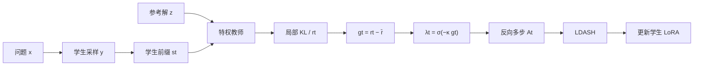
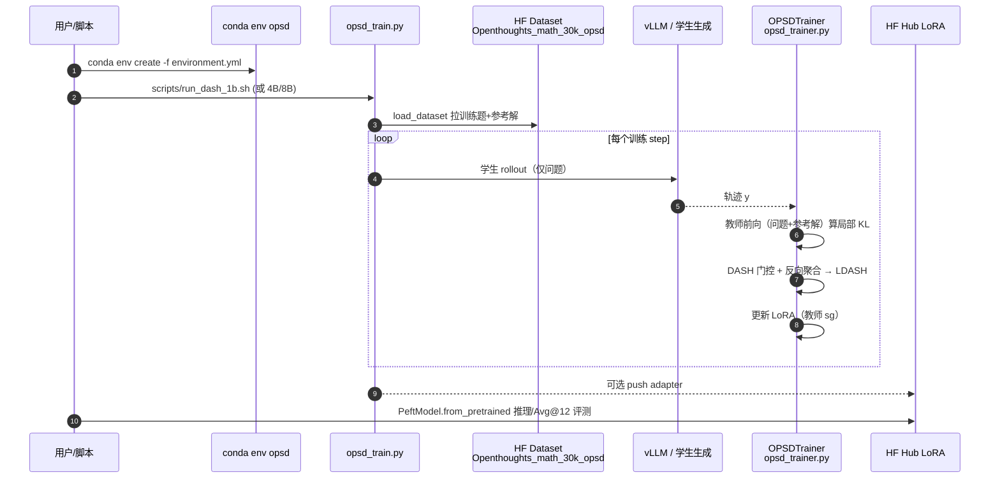

# DASH：分歧自适应的 OPSD 监督视界

**DASH**（*Divergence-Adaptive Supervision Horizons*；[arXiv:2608.06243](https://arxiv.org/abs/2608.06243)，[代码](https://github.com/DBtxy/DASH-OPSD)）由 **中科院自动化所 / EverMind / 盛大集团 / 国科大 / 武汉人工智能研究院 / 武汉大学** 等提出：在 on-policy self-distillation（OPSD）已提供的稠密 token 监督上，用局部蒸馏信号相对序列均值的间隙构造 **自适应传播门**，经反向多步聚合得到**路径依赖**的 token 权重。

## 一句话定义

**不改教师构造、不增加师生前向，只把 OPSD 的均匀 \(1/T\) 聚合换成「看分歧时间结构」的自适应视界，从而在数学推理上稳定超过匹配 OPSD。**

## 英文缩写速查

| 缩写 | 英文全称 | 简要说明 |
|------|----------|----------|
| DASH | Divergence-Adaptive Supervision Horizons | 本文自适应监督视界方法 |
| OPSD | On-Policy Self-Distillation | 学生轨迹上查询特权教师的稠密蒸馏 |
| RLVR | Reinforcement Learning with Verifiable Rewards | 可验证结果奖励的后训练范式 |
| GRPO | Group Relative Policy Optimization | 文中 RLVR 基线之一 |
| KL | Kullback–Leibler divergence | 局部师生分布散度 \(d_t\) |

## 为什么重要

- **稠密仍不够：** OPSD 解决稀疏序列奖励，但均匀系数对「同一局部分歧、不同未来」一视同仁。
- **几乎零额外开销：** 复用已算 \(\pi^T/\pi^S\)，步时增幅 <1%，可直接挂现有 OPSD 训练栈。
- **对本库：** 与 [RLVR-World](./paper-shenlan-wm-14-rlvr-world.md) 同属可验证奖励/后训练轴；与 EverMind 线 [HarnessBank](./paper-harnessbank.md) / [SkillCorpus](./paper-skillcorpus.md) 形成「推理后训练 ↔ agent 外挂层」对照。

## 核心信息

| 项 | 内容 |
|----|------|
| **机构** | 中国科学院自动化研究所（CASIA）；恒心智能（EverMind）；盛大集团（Shanda Group）；中国科学院大学（UCAS）；武汉人工智能研究院（Wuhan AI Research）；武汉大学（WHU） |
| **数据** | OpenThoughts-Math-30K（29,434） |
| **模型** | Qwen3-1.7B / 4B / 8B Instruct + LoRA |
| **开源** | **已开源** — [DBtxy/DASH-OPSD](https://github.com/DBtxy/DASH-OPSD)；HF LoRA `dbtxy/DASH-Qwen3-*-LoRA` |

## 核心原理

### 方法栈

| 模块 | 机制 |
|------|------|
| OPSD 骨干 | 学生 \(\pi(\cdot\mid x)\) 采样；教师 \(\pi(\cdot\mid x,z)\)（\(z\)=参考解）在学生前缀上给分布 |
| 局部信号 | \(d_t=\mathrm{KL}(\pi_t^T\|\pi_t^S)\)；词汇项 clip \(\tau=0.05\) → \(r_t\) |
| 自适应门 | \(g_t=r_t-\bar{r}\)，\(\lambda_t=\mathrm{sg}[\sigma(-\kappa g_t)]\)，\(\kappa=5\) |
| 反向聚合 | \(A_T=r_T\)，\(A_t=r_t+\lambda_t A_{t+1}\)；\(\mathcal{L}=\frac1T\sum_t A_t\) |
| 读法 | 低于均值的局部信号开门 → 更长有效视界；门 stop-grad，只作系数 |

### 流程总览

## 源码运行时序图

关键复现路径：`environment.yml` → `scripts/run_dash_*.sh` →（可选）合并 LoRA；数据与基座在运行时从 Hugging Face 拉取。

## 工程实践

| 项 | 建议 / 论文设定 |
|----|----------------|
| 挂载条件 | 已有 OPSD/特权教师栈；想改进均匀聚合 |
| 默认超参 | \(\tau=0.05\)，\(\kappa=5\)；LoRA r64/α128；lr \(5\times10^{-6}\)；bs 64；200 step |
| 长度 | 主文短 rollout 1024；2k/4k 文称相近，为省算选 1024 |
| 评测 | Avg@12，thinking 模式，max new tokens 38,912 |
| 不要做的 | 把 Inverse-gap（反号门）当默认；消融显示有害 |
| 许可注意 | 仓未钉 SPDX；NOTICE 列 TRL/OPSD 第三方许可 |

## 实验与评测

- **主表（四种子均值）：** 相对匹配 OPSD macro：**1.7B 41.87→45.07（+3.20）**；**4B 63.60→65.00（+1.40）**；**8B 64.80→66.40（+1.60）**；九个 benchmark×scale 均为展示对比最高。
- **对照：** 超过 GRPO†、EOPD、AVSD、PW-OPSD 等文内对比（† 部分取自 Zhao et al.）。
- **消融：** 固定 \(\lambda\) 已优于 OPSD；自适应再超最佳固定 \(\lambda\)；尺度匹配后相对轮廓仍贡献增益。

## 结论

**DASH 把 OPSD 从「处处均摊的稠密监督」推进到「随分歧轨迹伸缩视界的稠密监督」；真影响指标是数学推理 Avg@12，代价几乎只是一次廉价重加权。**

1. **真影响：时序系数** — 同局部 \(d_t\) 因历史/未来不同而权重不同。
2. **真影响：零额外师生前向** — 工程上可直接替换 OPSD loss 聚合。
3. **真影响：跨尺度稳定** — 1.7B/4B/8B 全胜匹配 OPSD。
4. **次要代价：依赖参考解教师** — 与纯无解 RLVR 设定不同。
5. **部署读法：** 有参考轨迹的 math/code 后训练优先试；许可与 CITATION 仍待仓库完善。
6. **工程读法：** 跟 `run_dash_*.sh` 与 HF LoRA 即可起步复现。

## 与其他工作对比

| 对照 | 差异读法 |
|------|----------|
| Vanilla OPSD | 均匀 \(1/T\)；DASH 序列自适应门 + 多步聚合 |
| PW-OPSD | 预定义位置权重；DASH 由实现分歧序列决定 |
| GRPO / RLVR | 序列级可验证奖励；DASH 仍是蒸馏系数分配 |
| [RLVR-World](./paper-shenlan-wm-14-rlvr-world.md) | RLVR 对齐世界模型任务指标；DASH 对齐推理 LM 的 OPSD 聚合 |
| EOPD / AVSD | 改熵加权或多视角教师；DASH 只改编聚合 |

## 局限与风险

- 主设定短 completion；超长 CoT 需另验。
- 特权信息 \(z\) 假设存在参考解。
- 仓库 license 字段空、CITATION 未填完——引用与再分发前核对 NOTICE。
- 展示表含外部†数字与单跑基线，主声称以匹配 OPSD 四种子对照为准。

## 关联页面

- [RLVR-World](./paper-shenlan-wm-14-rlvr-world.md) — RLVR 用于世界模型的对照索引
- [HarnessBank](./paper-harnessbank.md) / [SkillCorpus](./paper-skillcorpus.md) — 同 EverMind 线的 agent 外挂层
- [AI Auto-Research](../concepts/ai-auto-research.md) — 研究自动化中的可验证训练环
- [Reinforcement Learning](../methods/reinforcement-learning.md) — RL 基础方法页

## 参考来源

- [dash_opsd_arxiv_2608_06243.md](../../sources/papers/dash_opsd_arxiv_2608_06243.md) — 论文摘录与开源核查
- [dash-opsd.md](../../sources/repos/dash-opsd.md) — GitHub 仓归档
- [arXiv:2608.06243](https://arxiv.org/abs/2608.06243) — 原文
- [DBtxy/DASH-OPSD](https://github.com/DBtxy/DASH-OPSD) — 官方代码

## 推荐继续阅读

- [DASH GitHub README](https://github.com/DBtxy/DASH-OPSD) — 公式、结果表与安装
- [OPSD 上游仓（Zhao et al.）](https://github.com/siyan-zhao/OPSD) — 特权教师与训练脚手架来源
- [HF LoRA 1.7B](https://huggingface.co/dbtxy/DASH-Qwen3-1.7B-LoRA) — 推理适配器
