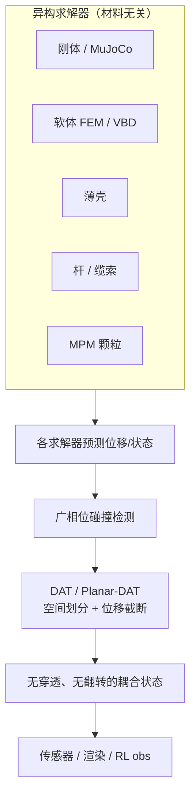

# DAT：Divide and Truncate 多物理无穿透接触

**Divide and Truncate（DAT）**（*A Penetration and Inversion Free Framework for Coupled Multi-physics Systems*，[arXiv:2604.15513](https://arxiv.org/abs/2604.15513)，SIGGRAPH 2026）由 **NVIDIA**（含 Newton 核心维护者 Miles Macklin）提出：在 **刚体、体软体、薄壳、杆与动画碰撞体** 共存场景中，用 **空间划分 + 位移截断** 做 **无穿透、无单元翻转（inversion-free）** 的接触解析。**Planar-DAT** 仅限制 **朝向邻近表面** 的法向运动，切向自由，缓解传统投影带来的 **人工阻尼与接触死锁**。框架 **材料无关、求解器无关**，可作为任意迭代优化器的 **后处理步** 插入——在 [Newton](./newton-physics.md) 中承担多物理统一碰撞/接触处理。

## 一句话定义

**把环境切成互斥区域并截断物体位移，使多物理耦合接触既无穿透又无翻转，且不必让每种材料求解器互相「认识」对侧物理。**

## 英文缩写速查

| 缩写 | 英文全称 | 简要说明 |
|------|----------|----------|
| DAT | Divide and Truncate | 本文统一接触框架 |
| Planar-DAT | Planar Divide and Truncate | 仅法向截断、切向自由的变体 |
| MPM | Material Point Method | 颗粒/软体常用连续介质离散 |
| FEM | Finite Element Method | 体/壳有限元软体 |
| XPBD | Extended Position-Based Dynamics | 位置基约束求解器族 |
| PBD | Position Based Dynamics | 粒子约束迭代求解 |
| GPU | Graphics Processing Unit | Newton 等大并行仿真的算力基础 |

## 为什么重要

- **多物理是机器人仿真的常态：** 操作（刚体手）+ 可变形物体（布料、软包、颗粒）+ 环境壳体往往 **并存**；接触若穿透或翻转，RL / 轨迹优化 / 数字孪生都会失真。
- **异构求解器耦合难：** [Newton](./newton-physics.md) 同时承载 MuJoCo Warp、VBD、ImplicitMPM、[Kamino](./paper-kamino.md) 等后端；DAT 的 **材料无关** 设计让各求解器只需响应 **本地接触约束**，不必嵌入对侧本构。
- **后处理可插拔：** 不绑定特定时间积分器，可作为 **迭代优化后的投影步** —— 降低把「接触正确性」写进每个求解器的维护成本。
- **Planar-DAT 针对真实痛点：** 全向截断常带来 **切向粘滞感与 deadlock**；只卡法向是工程上可感的改进。

## 核心信息

| 项 | 内容 |
|----|------|
| **机构** | 英伟达（NVIDIA） |
| **会议** | SIGGRAPH 2026 |
| **耦合对象** | 刚体、体软体、薄壳、杆、动画体 |
| **保证** | 无穿透；无单元翻转 |
| **Newton 角色** | 用户说明与作者背景指向 Newton **统一碰撞/接触管线** |
| **开源** | **随 Newton 主仓**（[newton-physics/newton](https://github.com/newton-physics/newton)）；arXiv 截至入库日 **未列独立仓库** |

## 核心原理

### DAT 主干

1. **划分（Divide）：** 将环境空间划分为 **互斥区域**（exclusive regions），每个物体/单元归属明确区域。
2. **截断（Truncate）：** 将预测位移 **截断** 在所属区域内 → **穿透不可能**；同时避免软体 **单元翻转**。
3. **材料无关：** 物体只响应 **自身接触约束**；对侧可以是刚体、MPM 颗粒或壳，无需共享本构接口。
4. **求解器无关：** 接在 **任意迭代优化器输出之后** 作为后处理。

### Planar-DAT

| 变体 | 约束 | 效果 |
|------|------|------|
| 全向 DAT | 位移限制在区域边界内 | 强无穿透，但可能抑制切向滑动 |
| **Planar-DAT** | 仅限制 **朝向邻近表面** 的法向分量 | 切向自由 → 减人工阻尼、缓解死锁 |

### 流程总览

## 实验与评测

| 项 | 口径 |
|----|------|
| **归档定量数据** | **无** — 截至入库日 arXiv 摘要与归档未落下逐项基准表；本页不提供可横比的数字 |
| **论文给的是保证而非分数** | **无穿透**、**无单元翻转** 是硬性几何保证，不是「多少百分比场景不穿模」的统计量 |
| **可自测的判据** | 穿透深度是否恒为 0；软体单元体积是否出现负值（翻转）；切向滑动是否被人工阻尼吃掉；密堆接触是否死锁 |
| **可复现路径** | Newton 多物理示例（`cloth_*`、`mpm_*`、刚–软耦合 demo）中对比开/关 DAT 与 全向 DAT / Planar-DAT 两档 |
| **不适用的对照** | 与 MuJoCo 经典接触模型比「谁更准」无意义——后者管 **摩擦与冲量物理**，DAT 管 **几何可行性**，量的不是同一件事 |

- **读法：** 这是一篇 **图形学求解器** 论文，评价轴是稳定性与保证强度，不是成功率。想要数字，须等 SIGGRAPH 2026 正式材料，或在自己的场景里按上表判据实测。

## 源码运行时序图

算法作为 **Newton 接触管线组件** 分发，无独立训练/推理仓库；复现路径为 Newton 多物理示例中的仿真步进（见 [newton-physics](./newton-physics.md) 工程实践）。**不适用**单独 sequenceDiagram；典型步进仍为 `CollisionPipeline.collide` → `Solver.step` →（DAT 后处理）→ 更新 `State`。

## 工程实践

| 步骤 | 做法 |
|------|------|
| 选型 | 场景含 **刚–软–壳–颗粒** 混合且需 **硬无穿透** 时优先考虑 DAT 叙事；纯开链刚体 RL 仍多用 MuJoCo 接触 |
| Newton | `pip install "newton[examples]"`；多物理示例 `cloth_*`、`mpm_*`、刚–软耦合 demo |
| 变体 | 需要 **滑动/滚动** 接触时优先理解 **Planar-DAT** 相对全向 DAT 的切向释放 |
| 对照 | 位置基统一粒子（[Particles4All](./particles4all.md)）走 **单环 PBD**；DAT 走 **后处理截断** —— 问题分解不同 |

## 局限与风险

- **独立代码入口：** 截至入库日无单独 GitHub；跟进 [Newton 发布说明](https://github.com/newton-physics/newton) 与 SIGGRAPH 材料。
- **与硬 LCP 接触对比：** DAT 保证几何无穿透，但 **摩擦/冲量物理** 仍依赖各求解器本构；勿与 MuJoCo 经典接触模型直接等同。
- **后处理顺序：** 作为后处理插入时，需与求解器迭代次数、子步划分一并调参，否则可能出现「力学上已收敛但几何仍需投影」的额外成本。

## 与其他工作对比

| 路线 | 接触在哪解 | 异构材料怎么办 | 与 DAT |
|------|------------|----------------|--------|
| **DAT / Planar-DAT** | 求解器 **之后** 的几何后处理 | 各物体只看自身约束，**互不认识对侧本构** | 本页 |
| MuJoCo 经典软接触 | 求解器 **内部**（凸优化/LCP 近似） | 需在同一接触模型下表达所有材料 | 管的是摩擦与冲量；DAT 管几何可行性。两者不是替代关系，可叠 |
| [Particles4All](./particles4all.md) 式统一粒子 PBD | **单一求解环** 内的位置约束 | 把所有材料降到同一套粒子表示 | 问题分解相反：统一表示 vs 保留异构求解器 + 统一后处理 |
| IPC 类障碍函数方法 | 求解器内部的能量项 | 需为每种材料接入障碍项 | 同样追求无穿透，但代价进到 **优化目标里**（步长与收敛受限）；DAT 把代价放在投影步 |
| [Kamino](./paper-kamino.md) | 闭链刚体专用后端 | 只管刚体 | 是 DAT 的 **被服务方** 之一，不是竞品 |
| [Mixed MPM](./paper-mixed-mpm-stiff-elastoplasticity.md) | MPM 内部的本构处理 | 只管颗粒/弹塑性 | 同栈另一块拼图；DAT 负责它与刚体/壳相遇时的边界 |

- **最关键的分歧点：** **接触正确性该写进谁**。传统做法要求每个求解器都懂接触，维护成本随后端数量相乘；DAT 把它抽成一层谁都能挂的后处理，这正是 [Newton](./newton-physics.md) 同时养 MuJoCo Warp / VBD / ImplicitMPM / Kamino 多后端所需要的。
- **全向 DAT vs Planar-DAT** 是本页最该记住的一组对照：前者强保证但吃掉切向滑动，后者只卡法向、保住滑动与滚动。需要真实摩擦行为时默认选后者。
- **读法：** 以上为 **路线级** 对照；与各 baseline 的逐项定量比较以 **原文 PDF** 与 SIGGRAPH 材料为准（[参考来源](#参考来源)）。

## 关联页面

- [Newton Physics](./newton-physics.md) — DAT 的工程落点与多求解器栈
- [Mixed MPM（刚性弹塑性）](./paper-mixed-mpm-stiff-elastoplasticity.md) — 同栈颗粒/刚体耦合
- [Kamino](./paper-kamino.md) — 闭链刚体后端
- [Contact Dynamics](../concepts/contact-dynamics.md)
- [仿真物理保真（Query）](../queries/simulation-physics-fidelity.md)
- [Particles4All](./particles4all.md) — 浏览器统一粒子 PBD 对照

## 结论

**总判：DAT 把「多物理接触」从各求解器内部逻辑抽成可插拔的几何后处理，在 Newton 栈里为刚–软–壳–杆混合场景提供无穿透/无翻转的统一保证；Planar-DAT 是能否保留真实滑动的关键开关。**

1. **先问有没有异构材料：** 仅开链刚体 RL 不必上 DAT；混合软体/壳/颗粒才体现价值。
2. **Planar-DAT 优先于全向 DAT** 当场景需要切向滑动或滚动。
3. **材料无关 ≠ 摩擦无关：** 冲量与摩擦仍由各后端负责，DAT 管几何可行性。
4. **跟进 Newton 主仓** 而非找独立 repo。
5. **与 PBD 统一粒子（Particles4All）对照阅读** —— 单求解器内约束 vs 跨求解器后处理。
6. **SIGGRAPH 2026 材料** 可能补充更多基准与参数建议。

## 参考来源

- [DAT arXiv 2604.15513 归档](../../sources/papers/dat_arxiv_2604_15513.md)

## 推荐继续阅读

- [arXiv:2604.15513](https://arxiv.org/abs/2604.15513)
- [Newton 官方文档 Overview](https://newton-physics.github.io/newton/stable/guide/overview.html)
- [Newton GitHub](https://github.com/newton-physics/newton)
