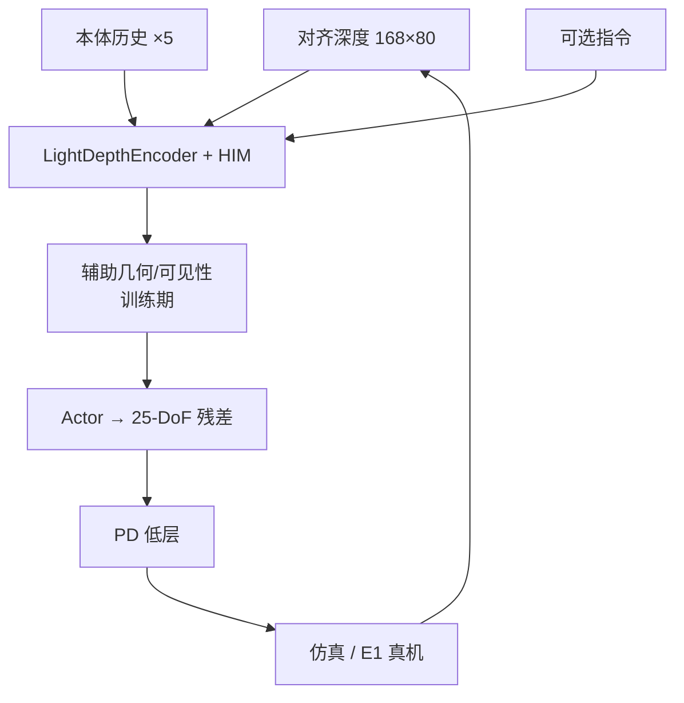

# DAVIS（深度-only 主动视觉人形足球）

**DAVIS: A Depth-Only End-to-End Active-Vision Framework for Humanoid Soccer Skills**（Jiakang Jin 等，**Noetix Robotics** × **清华大学**，[arXiv:2609.28175](https://arxiv.org/abs/2609.28175)，[项目页](https://thusi-lab.github.io/DAVIS/)）问一个 **部署严格** 的问题：能否只用 **头载深度 + 本体历史 + 低维指令** 直接输出 **25-DoF** 关节 PD 目标，在 **无运行时检测/规划** 的情况下学会 **主动转头** 与足球接触技能。

## 一句话定义

**把足球接触当成部分可观控制：训练期用可见性门控几何与特权 critic 教会在丢球时仍能对齐击球，部署期 actor 只吃单帧深度与五 step 本体历史，头动与全身踢球在同一 PPO 图里学。**

## 英文缩写速查

| 缩写 | 英文全称 | 简要说明 |
|------|----------|----------|
| DAVIS | Depth-only Active-Vision … | 本文框架名 |
| HIM | History Inference Module | 编码多步本体历史的特征（文内 HIM 历史通路） |
| AMP | Adversarial Motion Priors | 类人运动先验，稳定全身动作 |
| PPO | Proximal Policy Optimization | 训练算法；非对称 actor-critic |
| DoF | Degrees of Freedom | 25 = 23 身体 + 2 主动头关节 |

## 为什么重要

- **主动视觉 = 控制 DOF：** E1 头动改变下一帧深度；固定 gaze 模块与端到端 RL **不可交换**。
- **深度-only 部署栈小：** 相对 RGB+检测+规划流水线，适合 **算力与延迟敏感** 的人形足球。
- **与 privileged 足球 RL 对照：** [Vision dribbling](./paper-vision-dribbling-humanoid-soccer-privileged-representation.md) 等走不同感知假设；DAVIS 强调 **导出图无外部感知**。

## 核心信息

| 项 | 内容 |
|----|------|
| **机构** | Noetix Robotics；清华大学 |
| **平台** | 仿真 + **Noetix E1** 真机 |
| **观测** | 168×80 深度（0.3–5 m）+ **5 步**本体历史 + 可选指令 |
| **动作** | 25-D 关节位置残差 → `qdes = q0 + s ⊙ a` |
| **开源** | **待发布**（项目页无 GitHub，2026-09-25） |

## 核心原理

### 运行时接口（actor）

- **LightDepthEncoder** → 32-D 深度 latent。
- **HIM** 编码历史；与本体、指令、**confidence-gated 物体特征** 拼接后进 actor MLP。
- **辅助头（训练）**：每任务物体 3D center + visibility；几何 loss 仅在 **可见** 时；visibility BCE。
- **GT→prediction annealing：** 早期混合仿真 GT 几何，单调 schedule 过渡到 **100% 深度预测**；辅助 loss EMA 过高可暂停 annealing。

### 非对称学习

- Critic 可用速度、接触、地形 scan、物体状态、课程变量等 **特权量**；**不进入** 部署 actor。

### 任务实例

| 技能 | 物体 | 指令 | 要点 |
|------|------|------|------|
| **射门** | 球 + 门 | 无 | 点球 / 任意球课程； behind-ball approach |
| **带球** | 球 | 12 向 `kπ/6` | Repeated-S slalom；速度/距离带约束 |

**分 checkpoint 训练**，共享 depth-to-control 接口。

## 流程总览

## 源码运行时序图

**不适用** — 截至 2026-09-25 **无官方可运行代码**（[`davis-thusi-lab.md`](../../sources/sites/davis-thusi-lab.md)）。

## 实验与评测（项目页）

**射门：** 仿真点球/任意球 easy–hard total SR **~0.85**；真机点球分档 **0.55–0.68**。

**带球：** Repeated-S（3/5/7 杆 × 3 转角）**900 trials**，mean SR **0.65**。

## 结论

**DAVIS 说明深度-only + 主动头足以承载人形足球接触闭环，但训练期的几何 annealing 与可见性门控是部署可信度的关键，不是可删 trick。**

1. **勿把辅助几何当部署输入** — 导出 actor **仅** depth/proprio/command。
2. **射门与带球分策略** — 对象/奖励/课程不同；勿期望单 checkpoint 通吃。
3. **主动视觉必须进动作空间** — 2 头 DoF 与 23 身体 DoF 同训。
4. **真机 SR 低于仿真** — 点球 hardest 档 ~0.55；部署需分档验收。
5. **开源待发布** — 复现前以 PDF + 项目页为准。
6. **与检测流水线对比要公平** — 本文卖点是 **无运行时模块**，不是绝对 SR SOTA。

## 与其他工作对比

| 维度 | DAVIS | [Vision dribbling（Sci. Robot.）](./paper-vision-dribbling-humanoid-soccer-privileged-representation.md) |
|------|-------|-------------------------------------------------------------------------------------------------------------|
| 感知 | **单深度 + 主动头** | 特权/多模态表征路线 |
| 运行时模块 | **无检测/规划** | 依设定可能含额外感知栈 |
| 任务 | 射门 + 定向带球 | 人形足球 RL 标杆技能 |

## 关联页面

- [Humanoid Soccer](../tasks/humanoid-soccer.md)
- [Reinforcement Learning](../methods/reinforcement-learning.md)
- [Embodied 13 Papers 地图](../overview/embodied-13-papers-technology-map.md)

## 参考来源

- [`davis-humanoid-soccer_arxiv_2609_28175.md`](../../sources/papers/davis-humanoid-soccer_arxiv_2609_28175.md)
- [`davis-thusi-lab.md`](../../sources/sites/davis-thusi-lab.md)
- Jin et al., *DAVIS: A Depth-Only End-to-End Active-Vision Framework for Humanoid Soccer Skills*, arXiv:2609.28175, 2026

## 推荐继续阅读

- [项目页](https://thusi-lab.github.io/DAVIS/)
- [arXiv PDF](https://arxiv.org/pdf/2609.28175)
