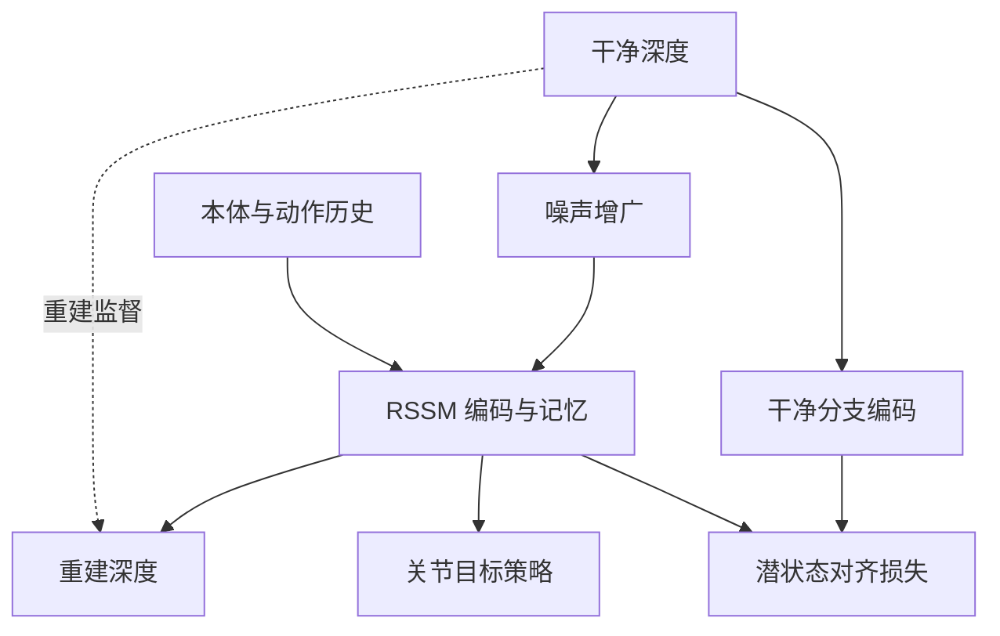
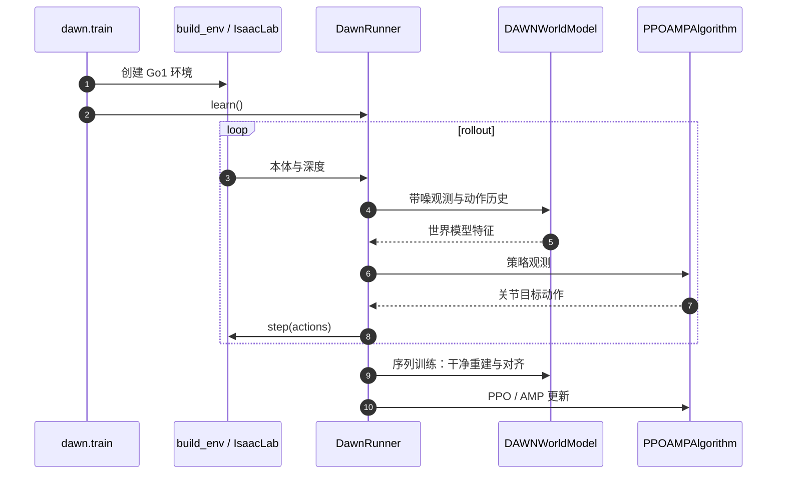

# DAWN：深度去噪世界模型四足跑酷

## 一句话定义

**让世界模型在训练中学会忽略深度噪声，把地形表征交给跑酷策略。**

## 英文缩写速查

| 缩写 | 英文全称 | 简要说明 |
|---|---|---|
| DAWN | Denoising and Alignment in World models for Noise-robustness | 去噪重建与表征对齐框架 |
| WMP | World Model-based Perception | 采用的世界模型感知基线 |
| RSSM | Recurrent State-Space Model | 用历史、动作和观测更新潜状态 |
| PPO | Proximal Policy Optimization | 策略训练算法 |
| AMP | Adversarial Motion Priors | 官方实现中的动作先验 |
| GRU | Gated Recurrent Unit | 确定性记忆状态的序列网络 |
| KL | Kullback–Leibler Divergence | 后验与预测先验的差异约束 |

## 为什么重要

仿真深度通常比真实相机干净；光照和边缘噪声会破坏感知策略。把抗噪目标放进训练，能减少部署时依赖人工滤波调参的负担。

## 核心信息

| 项目 | 内容 |
|---|---|
| 作者 | Yohan Choi、Min-Jun Kim、Jin-Sung Kim、Yong-Jae Kim、Youn-Hee Han |
| 机构 | 韩国技术教育大学（Korea University of Technology and Education） |
| 年份 / 会议 | 2026 / IROS 2026；项目页自述最佳论文奖入围 |
| 平台 | Unitree Go1；D435i；Nvidia Jetson NX（沿用论文名称，不推断具体型号） |
| 输入 / 输出 | 深度、本体观测、动作历史 → 世界模型特征 → 关节目标位置 |

## 方法栈：核心原理

1. **去噪重建：** 编码器接收带噪深度，解码器重建干净目标；重建项与 KL 约束保留几何信息。
2. **对比对齐：** 同场景干净/带噪潜状态经投影头拉近，不同场景分开。
3. **闭环策略：** RSSM 的 GRU 状态保留历史信息；训练损失与投影头不增加相对 WMP 的推理路径开销。这不代表整体没有推理耗时。

## 源码运行时序图

入口来自[源码核查](../../sources/repos/dawn-parkour.md)；回放使用 `dawn.play → DawnEvalRunner`。图描述训练主干调用，不是 Go1 真机通信实现。

## 工程实践

| 参数 / 操作 | 复现读法 |
|---|---|
| 50 Hz 控制、64×64 深度每 5 步更新 | 深度为 10 Hz；分别验收两条路径的延迟 |
| IsaacLab 4,096 并行环境 | 默认规模，先检查显存与相机开销 |
| 关闭 D435i 内置滤波 | 验证学习出的抗噪表征；仍需检查观测时序 |
| 官方代码 | 训练/仿真回放已发布；独立权重下载与真机入口未见 |
| 源码对照 | `_target_key()` 切到 `image_clean`；`_extra_losses()` 计算对齐 |

源码采用带噪/干净相似度矩阵的双向交叉熵；论文描述 SimCLR 风格目标，复现应以具体样本组织为准，不假设完全相同。本次未执行机器人训练。

## 实验与评测

| 条件 | 作者报告 |
|---|---|
| 仿真楼梯 / 沟 / 台阶平均成功率 | 96.9%；3 个种子，各条件 100 episodes |
| 真机零样本能力 | 18 cm 楼梯、70 cm 沟、45 cm 高台；每难度 10 次试验 |

96.9% 是特定仿真地形平均值，不是现实所有任务的成功率。

## 结论

**把深度噪声纳入表征监督，并分别验收感知与闭环控制。**

1. 对照重建与对齐的消融，避免把收益归因于单纯加噪。
2. 分别测量 10 Hz 深度与 50 Hz 控制路径的延迟。
3. 先用官方入口训练与回放，再补真机 IO；公开视频不能替代部署包。

## 与其他工作对比

| 工作 | 区别 |
|---|---|
| [WMP](./paper-sa-2409-16784-wmp-world-model-based-perception-for-visual-legg.md) | 基础 RSSM 感知路线；DAWN 改训练输入和损失，保留架构 |
| [SWAP](./paper-swap-parkour.md) | 强调对称等变表征；DAWN 聚焦深度抗噪，极限障碍尺寸不能直接跨论文排名 |

## 局限与风险

评测覆盖论文给定的噪声与地形，不能推断对完全丢失深度或所有陌生障碍都有效。NX 型号、实时延迟与底层伺服频率不能由策略频率反推；真机复现仍需通信、停止机制与动作映射。

## 关联页面

- [楼梯与障碍感知运动中心](../tasks/stair-obstacle-perceptive-locomotion.md)
- [Sim2Real](../concepts/sim2real.md)
- [WMP](./paper-sa-2409-16784-wmp-world-model-based-perception-for-visual-legg.md)
- [SWAP](./paper-swap-parkour.md)

## 参考来源

- [论文归档](../../sources/papers/dawn_arxiv_2609_29092.md)
- [项目页核查](../../sources/sites/dawn-parkour.md)
- [源码核查](../../sources/repos/dawn-parkour.md)

## 推荐继续阅读

- [DAWN 全文](https://arxiv.org/html/2609.29092v1)
- [官方安装步骤](https://github.com/DocyNoah/dawn-parkour/blob/main/INSTALL.md)
