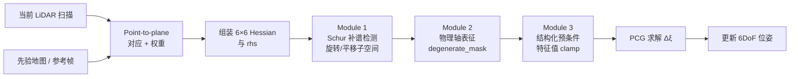
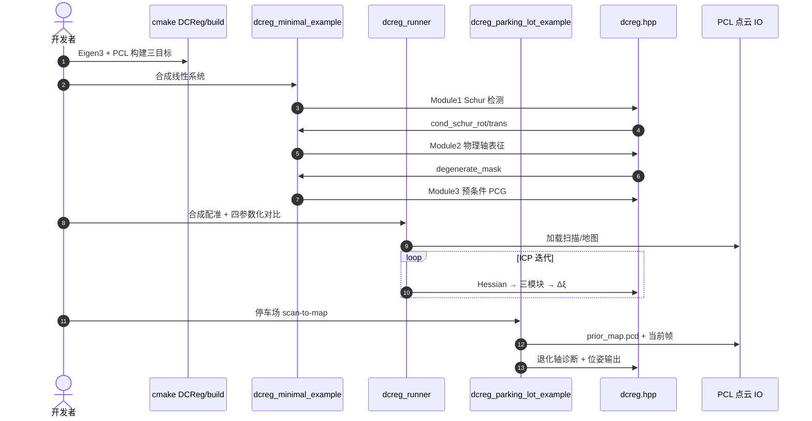

# DCReg：Decoupled Characterization for Efficient Degenerate LiDAR Registration

**DCReg**（*Decoupled Characterization for Efficient Degenerate LiDAR Registration*；[IJRR 2026](https://journals.sagepub.com/doi/10.1177/02783649261465040)，[arXiv:2509.06285](https://arxiv.org/abs/2509.06285)，[代码](https://github.com/JokerJohn/DCReg)，[视频](https://www.bilibili.com/video/BV1jsHQzCEra/)）由 **香港科技大学、国防科技大学、北京科技大学（通讯）、多伦多大学** 的 Xiangcheng Hu、Xieyuanli Chen、Mingkai Jia、Jin Wu、Ping Tan、Steven L. Waslander 提出：在 **几何退化** LiDAR 配准中建立 **detect–characterize–mitigate** 范式——**Schur 补** 解耦旋转/平移可观性，将弱模态映射到 **物理运动轴**，再以 **定向预条件 PCG** 稳定求解，而不损伤已可观方向。

## 一句话定义

**对 point-to-plane 配准的 Hessian 做 Schur 分解判退化，把弱模态对齐到 roll/pitch/yaw 与 x/y/z，再只 clamp 弱方向特征值并 PCG 求解。**

## 英文缩写速查

| 缩写 | 英文全称 | 简要说明 |
|------|----------|----------|
| DCReg | Decoupled Characterization for Ill-conditioned Registration | 本文框架；解耦表征退化 LiDAR 配准 |
| PCG | Preconditioned Conjugate Gradient | 预条件共轭梯度；本文线性求解器 |
| P2L | Point-to-Plane | 点到平面 ICP 变体；Hessian 来源 |
| SLAM | Simultaneous Localization and Mapping | 同步定位与建图；配准为底层模块 |
| LiDAR | Light Detection and Ranging | 旋转/固态激光点云输入 |
| MAP | Maximum A Posteriori | 预条件器特征值 clamp 的正则动机 |

## 为什么重要

- **退化是 LiDAR 定位常态：** 长廊、停车场、长直道等场景下部分平移/旋转方向 **弱约束**，全 Hessian 判据易被旋转–平移耦合 **误导**。
- **可解释弱模态：** 相对「全系统阻尼」或黑盒正则，DCReg 输出 **哪条物理轴退化、贡献比多少**，便于调试 scan-to-map 与 LIO 后端。
- **轻量可嵌入：** 官方实现 **Eigen + PCL**（可选 TBB/OpenMP），`dcreg_minimal_example` 适合抽模块进现有 SLAM；Open3D / PCL 上游 PR 推进 **库级集成**。
- **与 PUMA 同作者线：** [Xieyuanli Chen](./paper-puma-lidar-mesh-odometry.md) 在 mesh 里程计与退化配准两条 LiDAR 几何线上均有开源贡献。

## 核心信息

| 项 | 内容 |
|----|------|
| **机构** | 香港科技大学（HKUST）、国防科技大学（NUDT）、北京科技大学（USTB，通讯）、多伦多大学（University of Toronto） |
| **出处** | The International Journal of Robotics Research (IJRR), 2026 |
| **论文** | <https://journals.sagepub.com/doi/10.1177/02783649261465040> |
| **代码** | <https://github.com/JokerJohn/DCReg> |
| **开源** | **已开源** — `main` 完整实现（2026-04-21）；`baseline` 为早期基线分支（2026-09-21 GitHub 核查） |
| **数据** | 仓内合成/停车场帧 + Drive 外链 `prior_map.pcd` |

## 流程总览

## 核心原理

### Module 1：Schur 补谱退化检测

- 对 point-to-plane 线性化得到的 **6×6 Hessian** 做 **Schur 补分解**，分离 **3DoF 旋转** 与 **3DoF 平移** 子块。
- 分别报告 `cond_schur_rot`、`cond_schur_trans`，避免全矩阵 `cond_full` 因耦合 **掩盖** 单轴退化。

### Module 2：物理轴退化表征

| 输出 | 含义 |
|------|------|
| `degenerate_mask`（6 位） | 对应 roll/pitch/yaw、x/y/z 是否弱约束 |
| 对齐特征值 | 各物理轴上的 Schur 特征值强度 |
| 轴贡献比 | 弱模态在物理基下的能量占比 |

- **基对齐（basis alignment）** 解决特征基符号/排序歧义，使日志与可视化可直接读成「沿 x 平移退化」等工程语言。

### Module 3：定向预条件缓解

- 在 **预条件器** 内对弱方向 **特征值 clamping**（MAP 动机），**不修改** 原最小二乘目标与最优解。
- **PCG** 迭代求解增量；弱方向被稳定、强方向保持原精度；相对全系统 Tikhonov 类阻尼更 ** surgical**。

## 与其他工作对比

| 维度 | DCReg | 经典 point-to-plane ICP | FAST-LIO / LIO-SAM |
|------|-------|-------------------------|---------------------|
| 退化处理 | Schur 解耦 + 物理轴 + 预条件 PCG | 常无显式退化模块 | 依赖 IMU / 因子图冗余 |
| 输出 | 可解释 `degenerate_mask` | 仅位姿/残差 | 滤波状态 + 地图 |
| 栈 | Eigen + PCL 模块 | PCL / 自研 | ROS 完整 LIO |
| 场景 | 长廊、停车场等 **纯几何退化** | 退化时不稳定 | IMU 可部分补可观性 |

论文对比基线含 ME-SR、ME-TSVD、ME-TReg、FCN-SR、O3D、XICP、SuperLoc 等 **退化感知配准** 方法。

## 源码运行时序图

节点对齐 [`sources/repos/dcreg.md`](../../sources/repos/dcreg.md)：

## 工程实践

| 项 | 内容 |
|----|------|
| **环境** | Ubuntu 20.04；C++17；**必需** Eigen3、PCL；**可选** TBB、OpenMP |
| **构建** | `cmake -S DCReg -B DCReg/build && cmake --build DCReg/build -j8` |
| **集成入口** | `dcreg_minimal_example` — 三模块 API 演示，适合嵌入现有 SLAM |
| **回归** | `dcreg_runner` — 合成数据四参数化；`dcreg_parking_lot_example` — 真实停车场 |
| **可视化** | `python3 scripts/visualize_parking_lot_example.py`（需 pip 装 open3d） |
| **数据** | 大 prior map 从 README Google Drive 下载至 `DCReg/data/Parking-Lot-example/` |
| **开源状态** | **已开源**；README 计划后续发布 **DCReg 定位系统** 整管线 |

## 评测

| 项 | 内容 |
|----|------|
| **指标** | 长时定位精度；求解耗时；退化轴诊断一致性 |
| **相对基线** | 精度 **+20–50%**；速度 **5–30×**（最高 **116×**） |
| **场景** | 多样退化环境 + 停车场单帧 scan-to-map |
| **读法** | 关注 **退化场景子集** 与 **求解器耗时**；与 FAST-LIO 等含 IMU 栈对比时需分清 **纯几何配准模块 vs 完整 LIO** |

## 结论

**DCReg 把 LiDAR 退化配准从「黑盒阻尼」推进到可解释的 Schur–物理轴–预条件 PCG 三件套，适合作为 scan-to-map 内核升级。**

1. **长廊/停车场** 等纯 LiDAR 定位应先查 `degenerate_mask`，勿只看 RMSE 均值。
2. 集成时优先跑通 **`dcreg_minimal_example`**，再替换现有 point-to-plane 线性求解步骤。
3. **Schur 旋转/平移条件数** 比 `cond_full` 更可信；日志应分开记录。
4. 与 [FAST-LIO](./fast-lio.md) **互补**：IMU 补可观性 ≠ 消除几何退化；DCReg 适合 **无 IMU 或 IMU 失效** 的配准子模块。
5. 关注 Open3D / PCL 上游 PR，库级 merge 后维护成本低于私有 fork。
6. 大 prior map 需外链下载；CI/离线环境请预置 `prior_map.pcd`。

## 局限与风险

- **模块级非整栈：** 当前开源以 **配准求解器** 为主；README 定位系统仍 **待发布**。
- **仍依赖几何对应：** 动态物体、错误 prior 地图会污染 Hessian，退化诊断不能替代 **外点剔除**。
- **非 ROS 节点：** 需自行封装进 Nav2 / LIO 管线；与 [PUMA](./paper-puma-lidar-mesh-odometry.md) 类似偏研究仓。
- **IMU 融合：** 本文聚焦 **纯 LiDAR 几何退化**；高速运动或 IMU 主导场景应走 LIO 而非单挂 DCReg。

## 关联页面

- [里程计与激光雷达融合](../methods/lidar-odometry-fusion.md)
- [LiDAR / LIO / VIO 选型](../comparisons/lidar-slam-lio-vio-selection.md)
- [导航·SLAM 栈总览](../overview/navigation-slam-autonomy-stack.md)
- [PUMA（mesh 地图 LiDAR 里程计，同作者 Chen）](./paper-puma-lidar-mesh-odometry.md)
- [FAST-LIO](./fast-lio.md)

## 参考来源

- [dcreg_ijrr_2026_hu.md](../../sources/papers/dcreg_ijrr_2026_hu.md)
- [dcreg.md](../../sources/repos/dcreg.md)
- [dcreg-github.md](../../sources/sites/dcreg-github.md)

## 推荐继续阅读

- [JokerJohn/DCReg README](https://github.com/JokerJohn/DCReg)
- [arXiv:2509.06285](https://arxiv.org/abs/2509.06285)
- [PUMA ICRA 2021（Xieyuanli Chen）](https://github.com/PRBonn/puma)
