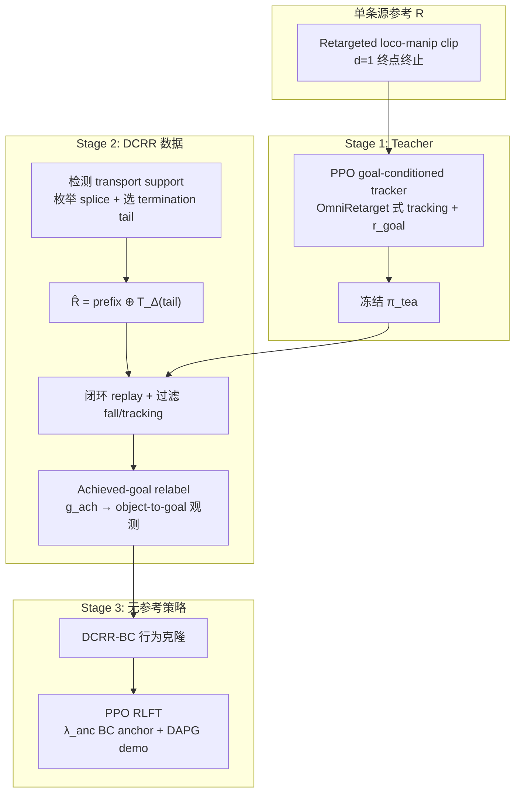

# DCRR：单条 motion clip 的距离条件人形物体搬运

**Learning Distance-Conditioned Object Transport for Humanoid Loco-Manipulation from a Single Motion Clip**（[arXiv:2609.21467](https://arxiv.org/abs/2609.21467)，2026-09-18）由 **韩国电子技术研究院（KETI）**、**首尔大学（SNU）** 与 **高丽大学（Korea University）** 提出。论文针对 **单源参考 motion tracking** 在物体搬运中只能复现 **源终点** 的问题，形式化 **termination-versus-passage gap**，并用 **Distance-Conditioned Reference Recomposition（DCRR）** 从同一条 clip 构造 **多距离、终止完整** 的监督，再蒸馏为 **无参考** 的距离条件策略。

## 一句话定义

**把源 clip 的 demonstrated termination 段重拼到中间搬运状态，用冻结 tracking teacher 闭环验证后按 achieved placement relabel，再 BC + RL 得到可按归一化距离命令终止搬运的人形 loco-manipulation 策略。**

## 英文缩写速查

| 缩写 | 英文全称 | 简要说明 |
|------|----------|----------|
| DCRR | Distance-Conditioned Reference Recomposition | 重定位终止段并闭环 replay 构造距离条件演示 |
| BC | Behavior Cloning | 从 teacher replay 动作蒸馏无参考策略（DCRR-BC） |
| RLFT | Reinforcement-Learning Fine-Tuning | PPO 微调 DCRR-BC（frozen-BC anchor + DAPG-style demo loss） |
| HER | Hindsight Experience Replay | 对照：仅 relabel goal 不改变动作，无法补全中间终止行为 |
| PPO | Proximal Policy Optimization | teacher 与 RLFT 优化算法 |
| MAE | Mean Absolute Error | 评测 $|\hat d - d|$，$\hat d$ 为 achieved 归一化运输距离 |

## 为什么重要

- **点明 passage ≠ termination：** 源轨迹经过的中间物体位移是 **继续搬运中的 passage**，不是「在该距离完成放置/脱接触/ settling」的 **termination-complete** 结局；单纯加距离命令或 HER/GCSL 式 relabel 改不了动作。
- **不依赖 learned generator：** 与 [Humanoid-DART](./paper-humanoid-dart.md) 扩散扩 archive、[DemoHLM](./paper-loco-manip-161-136-demohlm.md) object-centric 重放不同，DCRR **只重用源 clip 已有片段** + 几何 splice，用 **物理 replay** 筛可行轨迹。
- **与 OmniRetarget 分工清晰：** [OmniRetarget](./paper-hrl-stack-03-omniretarget.md) 产出 **embodiment/scene 一致** 的参考；DCRR 在已有参考上 **改变终端运输结果**（同一交互模式内调距离）。
- **四模式统一管线：** Carry（抓抬放）、Kick-Push（脚击）、Crouch-Push（低姿推）、Drag（后撤拉）共用三阶段栈，说明 gap 与解法不限于单一接触类型。
- **蒸馏后仍可调距：** DCRR-BC/RLFT **无 reference 输入**，真机用第三人称 marker 估物体位姿 + 自相机对齐运输方向即可下发 goal。

## 核心信息

| 项 | 内容 |
|----|------|
| **机构** | 韩国电子技术研究院（KETI）；首尔大学（SNU）；高丽大学（Korea University） |
| **作者** | Yuhyeon Hwang、Daniel Sungho Jung、YongHyeok Seo、Mingi Jung、Chang Nho Cho、Jung-Hoon Hwang、Dongin Shin |
| **发表** | arXiv:2609.21467（2026-09-18，cs.RO） |
| **平台** | Unitree G1（29 关节位置目标）；训练 **Isaac Sim**；sim2sim **MuJoCo**（1 kg 物体，无策略适配） |
| **源 motion** | 每交互模式 **1** 条 retargeted clip（运输距离约 1.44 / 1.30 / 0.80 / 1.10 m） |
| **开源** | **未开源** — 截至 2026-09-24 arXiv 无代码/项目页；步骤 2.5 已核 |

## 流程总览

## 核心机制

### 1）距离条件 formulation

- 平面运输方向 $u$ 与尺度 $D_{\max}$ 由源 clip 起终点定义；命令 $d=D/D_{\max}$，目标 $\bar g(d)$ 沿 $u$ 放置，竖直分量继承源终止物体高度。
- 策略观测：**本体 + 历史 + object-to-goal**；**不**直接输入标量 $d$，与 teacher 一致。
- 成功判据：稳定结束且最小化 $|\hat d - d|$，$\hat d$ 由 rollout 终止时物体平面位移归一化得到。

### 2）Termination-versus-passage gap

- 中间位移时物体仍在 **active transport**；只有源终点附近才演示 **放置/脱接触/恢复** 等 **轨迹级终止转移**。
- **HS-BC**（对源前缀做 hindsight outcome label）总体 MAE **0.44**、Drag fall **53.63%**，说明 **改 label 不改动作** 无法填 gap。

### 3）Reference recomposition

- 在平滑平面物体运动检测的 **transport support** 上取 splice 帧 $t$；从候选 termination tail 中选 residual transport 接近最小且 transition cost $\rho$ 小的帧 $f^\star(t)$。
- 前缀 $(r_0,\ldots,r_{t-1})$ 与经平面旋转/平移对齐的 tail 拼接；**无** temporal blending、**无** 学习型 motion generation。
- 对命令 $d$ 选 $t_s(d)$ 最小化 $|D_{\mathrm{nom}}(t)-dD_{\max}|+\lambda_s\rho$（$\delta=0.02$，$\lambda_s=0.05$）。

### 4）Teacher 与 replay 过滤

- Teacher 在 **原 $d=1$ 源参考** 上训练，推理时 replay 源与重组参考；**Parallel+Orthogonal** 终点扰动使短距 $d_{\mathrm{nom}}=0.2$ 有效 replay 从 **28.6%→90.7%**。
- 保留：无 fall、足够运输、合法终止物体状态、满足源 derived tracking 阈值。

### 5）DCRR-BC 与 RLFT

- BC 损失为 action 维度平均 L2；RL actor 加 **on-policy 对 frozen BC 均值的 anchor**（$\lambda_{\mathrm{anc}}=10$）与 **DAPG 式** 对 replay 动作 demo 项（$w_k$ 随 advantage 尺度）。
- RL 奖励：**goal progress + task completion + fall/正则**；**无** reference tracking，避免学生重新绑死在单条参考。

## 源码运行时序图

**不适用**（截至 2026-09-24 无官方可运行代码仓库或 README 入口；复现需自建 Isaac Sim G1 环境与 teacher/recomposition/RLFT 栈。）

## 工程实践

| 维度 | 记录 |
|------|------|
| 网络 | 512–256–128 ELU MLP；输出 29 维关节位置目标；1 帧 joint-state history |
| Teacher / RL goal 项 | $r_{\mathrm{goal}}=2\exp(-\|p_{\mathrm{obj}}-g\|_2^2/0.3^2)$ |
| 域随机 | 质量 $[0.1,2.0]$ kg；摩擦 $[0.1,1.0]$ |
| RLFT 命令采样 | $d\sim\mathcal U[0.1,1.2]$ |
| 仿真评测 | 每 setting 300 episodes；报告 $\hat d$、MAE、fall rate |
| 真机 | 1 kg 物体；第三人称相机 + 物体 visual marker；episode 初用 **egocentric** 对齐运输方向与 goal |
| 开源状态 | arXiv **无** GitHub；**未开源** |

## 实验与评测

### 距离条件主结果（Table II，四模式 macro-average）

| Method | MAE $\downarrow$ | Fall (%) $\downarrow$ |
|--------|------------------|------------------------|
| Source Teacher (Wide) | 0.43 | 0.03 |
| Src-BC | 0.28 | 14.34 |
| HS-BC | 0.44 | 15.17 |
| AMP-Body+Object | 0.21 | 0.08 |
| DCRR Teacher | **0.10** | **0.01** |
| **DCRR-BC** | **0.15** | 9.07 |

- **Source Teacher (Wide)** 虽在 $d\in[0.1,1.0]$ 上训练，仍贴近 **$d=1$ 终点**，说明 **宽 goal 分布 + 固定参考** 不能稳定产生中间终止。
- **AMP-Body+Object** 在 Carry/Kick MAE 很低，但 **Drag MAE 0.53** 且 Carry **不保证抓抬序列**，提示 **低 MAE ≠ 保交互模式语义**。

### Achieved-goal relabel（同轨迹，Table III）

| Goal label | Overall MAE |
|------------|-------------|
| Nominal | 0.17 |
| Achieved (ours) | **0.16** |

闭环接触下 nominal 与 achieved 不一致；用 **终端 achieved placement** 作 label 略优，尤其在 $d=0.4$、$0.8$。

### RLFT 与 sim2sim（Table IV macro-average fall）

| Method | Train sim Fall | MuJoCo sim2sim Fall |
|--------|----------------|---------------------|
| DCRR-BC | 8.83% | 17.78% |
| DCRR-RLFT | **2.22%** | **8.50%** |
| DCRR Teacher | 0.17% | 0.17% |

RLFT 改善命令跟踪方差与 fall，但 **无参考策略** 与 teacher 之间仍有 **鲁棒性差距**。

### 硬件（DCRR-RLFT，Table V 摘要）

- 命令 $d\in\{0.4,0.7,1.0,1.2\}$，每模式每命令 5 trials。
- 四命令 macro mean $\hat d$ 约 **0.30 / 0.60 / 0.90 / 1.04**；Kick-Push 偏差较大（脉冲接触）；$d\ge 1.0$ 时 fall 略增。

## 与相邻路线对比

| 路线 | 如何变运输距离 | 是否 termination-complete | 数据需求 |
|------|----------------|---------------------------|----------|
| **DCRR** | 重拼源 termination 段 + 闭环 replay | 是（replay 筛选） | **每模式 1 clip** |
| [DemoHLM](./paper-loco-manip-161-136-demohlm.md) | object/proprio-centric 阶段重放 | 依赖 WBC 回放成功 | 1 VR demo / 任务 |
| [Humanoid-DART](./paper-humanoid-dart.md) | 扩散生成 + tracker 过滤 + relabel | 面向连续 **goal 空间** | 2–4 sparse demos |
| HER / HS-BC | relabel passage 为 goal | **否** | 源 replay 即可 |
| [OmniRetarget](./paper-hrl-stack-03-omniretarget.md) | 场景/embodiment 保真重定向 | 不改变源 **终端结果** | 动捕/视频源 |

## 结论

**DCRR 把「单 clip 只能终止于源终点」归结为 termination-versus-passage gap，用 termination 段重拼 + 物理 replay 制造真正的中间终止演示，再蒸馏成无参考距离条件策略——这是相对 HER/宽 goal teacher 更关键的一步。**

- **主指标：** DCRR-BC 四模式 macro MAE **0.15** vs Src-BC **0.28**、HS-BC **0.44**；teacher 级 **0.10 / 0.01% fall** 说明重组 reference 本身可跟踪。
- **Relabel 要用 achieved 而非 nominal：** 同轨迹 overall MAE **0.17→0.16**；闭环接触下 nominal proposal 与真实终止不一致。
- **蒸馏代价：** DCRR-BC fall **~9%**；RLFT 降到 **2.22%**（训练 sim）但仍高于 teacher **0.17%**——部署应预期 **无参考鲁棒性 gap**。
- **AMP 对照的教训：** 低距离误差可能 **丢失交互语义**（Drag 不移动、Carry 不抓抬）；DCRR 显式重用源 **termination 行为**。
- **覆盖边界：** 训练 goal 集中在 **源定义运输方向**；$d>1$ 需源 tail 或 teacher perturb 范围内；更远距离或新方向需额外 transport 段或生成。
- **复现：** **未开源**；依赖 Isaac Sim G1、[OmniRetarget](./paper-hrl-stack-03-omniretarget.md) 式 teacher 与 recomposition 超参，入库日无官方仓库可对照。

## 局限与风险

- **时空覆盖受源 clip 限制：** 不能凭空创造与源 **phase 不一致** 的长距 active transport；$d>1$ 外推依赖源 tail 与 perturb 范围。
- **方向单一：** 3D goal 表示但训练 goal 沿 **源 $u$** 集中，侧向/反向运输未验证。
- **感知栈简化：** 真机用 **marker + 第三人称**；无 onboard 泛化感知或动态障碍物。
- **对象与场景：** 1 kg 刚性物体、固定交互模式；质量/摩擦随机化仅在仿真。
- **代码未发布：** recomposition 阈值、filter 与 RL 奖励权重无法审计。

## 关联页面

- [Loco-Manipulation](../tasks/loco-manipulation.md)
- [Imitation Learning](../methods/imitation-learning.md)
- [Reinforcement Learning](../methods/reinforcement-learning.md)
- [Sim2Real](../concepts/sim2real.md)
- [OmniRetarget](./paper-hrl-stack-03-omniretarget.md)
- [DemoHLM](./paper-loco-manip-161-136-demohlm.md)
- [Humanoid-DART](./paper-humanoid-dart.md)
- [Unitree G1](./unitree-g1.md)

## 参考来源

- [DCRR arXiv 来源摘录](../../sources/papers/dcrr_arxiv_2609_21467.md)
- arXiv: <https://arxiv.org/abs/2609.21467>

## 推荐继续阅读

- [OmniRetarget 实体页](./paper-hrl-stack-03-omniretarget.md)
- [DemoHLM 单示范 loco-manip 数据生成](./paper-loco-manip-161-136-demohlm.md)
- InterReal（arXiv:2603.07516）— 保接触 augment 但 **保留源运输结果**，与 DCRR 终端变化形成对照
