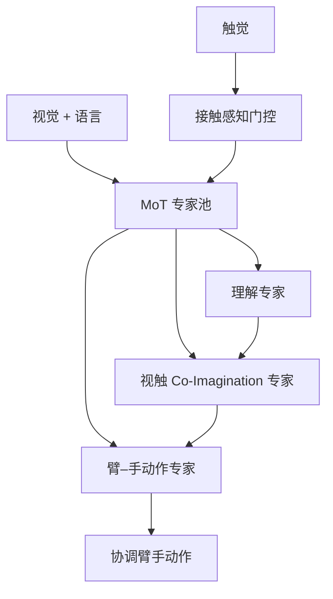
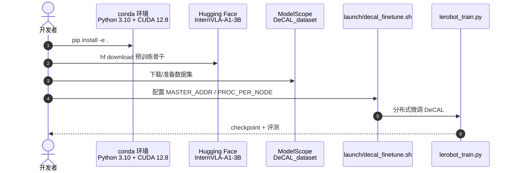

# DeCAL：接触感知灵巧 VLA

**DeCAL**（*Towards Physically-Grounded Dexterous Vision-Language-Action Models via Contact-Aware Latent Co-Imagination*，[arXiv:2609.09119](https://arxiv.org/abs/2609.09119)，[项目页](https://aureleopku.github.io/DeCAL/)，[代码](https://github.com/AureleoPKU/DeCAL)，CoRL 2026）由 **北京大学** 与 **北京智源人工智能研究院（BAAI）** 的 Yankai Fu、Ning Chen、Shanghang Zhang 等提出：灵巧操作 **接触丰富、遮挡严重**，同质多模态拼接的 VLA 难以 **自适应触觉注入** 与 **显式物理动力学**。DeCAL 用 **Mixture-of-Transformers（MoT）** 统一理解、想象与动作，并引入 **接触感知门控** 与 **视触 Latent Co-Imagination**。

## 一句话定义

**灵巧 VLA 需要分专家的理解/想象/动作，再用接触门控决定何时信触觉，并用联合 latent 想象补视觉看不见的动力学。**

## 英文缩写速查

| 缩写 | 英文全称 | 简要说明 |
|------|----------|----------|
| DeCAL | Contact-Aware Latent Co-Imagination | 本文框架 |
| VLA | Vision-Language-Action | 视觉–语言–动作策略 |
| MoT | Mixture-of-Transformers | 分专家架构 |
| PSR | Progress Success Rate | 任务进展成功率；本文 83.4% |
| SR | Success Rate | 端到端成功率；六项任务均值 71% |
| OOD | Out-of-Distribution | 四类未见场景泛化评测 |

## 为什么重要

- **触觉不是常驻通道：** Adaptive Visuo-Tactile Fusion 用 **接触感知门控** 动态决定触觉何时、何处进入，避免始终拼接导致噪声与过拟合。
- **想象要联合视触：** Co-Imagination 同时建模视觉与触觉未来，给策略 **隐式物理世界知识**，对齐「触觉世界模型 VLA」主线。
- **数字与开源齐备：** 六项真机接触丰富任务 **71% SR / 83.4% PSR**；[GitHub](https://github.com/AureleoPKU/DeCAL) + [ModelScope 数据](https://www.modelscope.cn/datasets/Aureleo/DeCAL_dataset) 已发布。

## 核心信息

| 项 | 内容 |
|----|------|
| **机构** | 北京大学；北京智源人工智能研究院（BAAI） |
| **会议** | CoRL 2026 |
| **骨干** | 基于 InternVLA-A1-3B 初始化 |
| **开源** | **已开源** — 代码 Apache-2.0；数据集 ModelScope；预训练自 Hugging Face 下载 |

## 流程总览

## 核心原理

1. **MoT 分工：** 理解、视触想象、动作生成各用专家，跨专家信息流动而非单塔硬融合。
2. **接触感知门控：** 根据接触状态调节触觉贡献——非接触阶段降权，接触相位强化，缓解 [AT-VLA](./paper-sa-2605-07308-at-vla-adaptive-tactile-injection-for-enhanced-f.md) 同类「何时注入」问题但采用 co-imagination 框架。
3. **Latent Co-Imagination：** 联合预测视觉与触觉 latent 动态，使策略在严重遮挡下仍保有 **交互演化** 的内部模型。
4. **物理接地：** 目标不是多模态对齐分数，而是 **接触丰富任务** 上的成功率与 OOD 稳健性。

## 源码运行时序图

官方仓 [AureleoPKU/DeCAL](https://github.com/AureleoPKU/DeCAL)（归档见 [sources/repos/decal.md](../../sources/repos/decal.md)）：

- **最短复现：** conda 环境 → 安装依赖 → 下载 InternVLA-A1-3B → 拉 ModelScope 数据 → `launch/decal_finetune.sh`。
- **注意：** Qwen3-VL、Cosmos Tokenizer 权重首次运行自动下载；真机评测需自备臂手与触觉硬件栈。

## 实验与评测

- **六项真机接触丰富灵巧任务：** 平均 **SR 71%**，**PSR 83.4%**（项目页 / README Highlights）。
- **OOD：** 四类未见设定仍报告强泛化（细节以 PDF 为准）。
- **对照：** 相对同质融合 VLA 与无 co-imagination 变体，增益集中在 **接触相位** 与 **遮挡** 场景。

## 结论

**DeCAL 把触觉世界模型写进 VLA 的方式是「门控注入 + 联合想象」，而不是永久拼接触觉通道或单独训一个判别头。**

1. **MoT 是工程必需** — 理解/想象/动作梯度需求不同，单塔易互相干扰。
2. **门控解决何时信触觉** — 与 [ContactWorld](./paper-sa-2606-13877-contactworld-what-matters-in-vision-tactile-worl.md) 等同触达线，DeCAL 卖点在 **生成式 co-imagination**。
3. **71% / 83.4% 是真机锚点** — 读 PSR 与 SR 差别：进展 vs 完全成功。
4. **InternVLA 初始化** — 复现需接受大模型依赖与 GPU 成本。
5. **数据在 ModelScope** — 国内镜像友好；国际用户注意访问路径。

## 工程实践

| 项 | 建议 |
|----|------|
| 何时用 | 灵巧、遮挡重、接触相位关键的任务型 VLA |
| 硬件 | 需可靠触觉流与臂手同步；具体平台见论文 |
| 训练 | `launch/decal_finetune.sh`；多卡需改 `PROC_PER_NODE` |
| 与 ForceVLA / FWBC | 那些偏 **力/力矩**；DeCAL 偏 **高维触觉想象** |

## 关联页面

- [VLA](../methods/vla.md)
- [AT-VLA](./paper-sa-2605-07308-at-vla-adaptive-tactile-injection-for-enhanced-f.md)
- [ContactWorld](./paper-sa-2606-13877-contactworld-what-matters-in-vision-tactile-worl.md)

## 参考来源

- [`decal_arxiv_2609_09119.md`](../../sources/papers/decal_arxiv_2609_09119.md)
- [`decal.md`](../../sources/sites/decal.md)
- [`decal.md`](../../sources/repos/decal.md)
- [arXiv:2609.09119](https://arxiv.org/abs/2609.09119)

## 推荐继续阅读

- [DeCAL GitHub](https://github.com/AureleoPKU/DeCAL)
- [ModelScope 数据集](https://www.modelscope.cn/datasets/Aureleo/DeCAL_dataset)
- [原文 PDF](https://arxiv.org/pdf/2609.09119)
