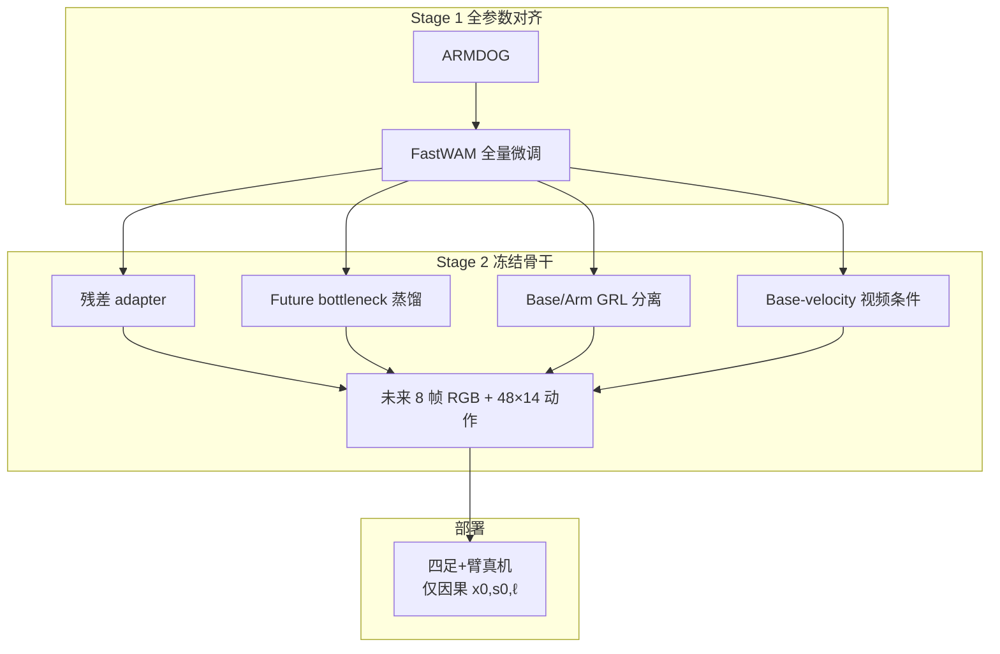

# DECOWAM（腿足移动操作解耦全身 WAM）

**DECOWAM**（*Decoupled Whole-Body World-Action Model for Legged Mobile Manipulation*，[arXiv:2608.20114](https://arxiv.org/abs/2608.20114)）在 **FastWAM（Wan-2.2 + ActionDiT）** 上为 **四足+臂** 移动操作显式分解 **基座运动、臂操作与相机 ego-motion**，用参数高效残差适配联合预测 **未来 RGB** 与 **48 步 14-D 全身 action chunk**。

## 一句话定义

**冻结视频–动作先验，用四类解耦接口把移动视角、导航速度通道与操作通道分开建模**——在 ARMDOG 真机数据上同时改善未来视频与动作预测，并提升全身协调与基座抗扰。

## 英文缩写速查

| 缩写 | 英文全称 | 简要说明 |
|------|----------|----------|
| WAM | World Action Model | 联合未来观测与动作 chunk 的具身策略 |
| DECOWAM | Decoupled Whole-Body WAM | 本文：基座/臂/ego-motion 显式因子化 |
| ARMDOG | — | 四足+6-DoF 臂同步 video–state–language 数据集 |
| GRL | Gradient Reversal Layer | 对抗分离 base/arm latent |
| VLA | Vision-Language-Action | π₀.₅、X-VLA 等固定基座对照 |
| FastWAM | — | Wan-2.2 视频扩散 + ActionDiT 动作专家骨干 |
| RGB | Red-Green-Blue | 机载 15 Hz 单目视频流 |

## 为什么重要

- **填补腿足移动操作 WAM 空白：** 固定基座 VLA/WAM 不建模 **移动相机** 与 **多速率全身命令**；DECOWAM 把 ego-motion、base velocity、arm joints 拆成语义对齐接口。
- **参数高效：** Stage 2 仅 **25.95M** 可训练参数（相对全量微调 **~232×** 缩减），仍降低 action MSE **21.7%** 并改善视频指标。
- **配套 ARMDOG：** **217 episodes / 56k 帧**，每帧对齐 RGB、14-D 全身动作、语言——使 factorization 可训练可评测。
- **真机闭环证据：** 79 trials/法；**全身协调（WBCM-SR）** 与 **基座位移鲁棒性** 领先 π₀.₅ / X-VLA / FastWAM。

## 核心方法与结构

| 模块 | 作用 |
|------|------|
| **残差 WAN adapter** | 每 block 128-D bottleneck 残差，保留预训练视频 先验 |
| **Future bottleneck** | 教师读 \((c,f,s_0)\)，学生仅 \((c,s_0)\)；部署因果 |
| **Base/arm GRL** | 对抗鼓励 latent 各管导航 vs 操作语义 |
| **Ego-motion token** | 归一化 base velocity 条件化视频 token |
| **ActionDiT** | 输出 \(K{=}48\) 步 chunk：臂[0:7]、夹爪、基座速度[7:10]、padding |

### 流程总览

## 实验要点（索引级）

| 轴 | 报告口径 |
|----|----------|
| **开环 replay** | Action MSE **−21.7%** vs FastWAM；F-MSE / A-MSE 同步改善 |
| **真机 79 trials** | WBCM-SR、位移鲁棒性 **DECOWAM 最高**；任务完成与最强基线相当 |
| **延迟** | Evaluator **1333 ms** vs FastWAM 1197 ms（**+11.4%**） |
| **数据** | ARMDOG：217 ep，27 任务夹，15 Hz |

## 结论

**DECOWAM 证明：腿足移动操作的 WAM 需要 embodiment-aware 因子化，而非把 base 速度与臂关节拼进同一隐变量。**

- **显式三路接口** — base velocity 既是要预测的控制量，也是解释相机运动的 ego-motion 条件；GRL 分离 arm/base latent。
- **未来瓶颈蒸馏** — 特权未来视觉摘要以因果学生注入动作专家，部署不依赖未来帧。
- **参数高效可部署** — 25.95M 适配参数即可显著降 MSE；推理严格因果 \((x_0,s_0,\ell)\)。
- **真机协调 > 单点成功率** — 在需 **静止基座伸臂** 等全身协调场景，DECOWAM 定性优于惯性移动的 FastWAM/X-VLA。
- **开源空白** — 截至入库日 **无项目页/代码/ARMDOG 公开链**；复现需等待作者发布。

## 工程实践与开源状态

| 项 | 状态 |
|----|------|
| **代码 / 数据** | **确认未开源**（arXiv 无 Code/Data 链） |
| **骨干对照** | [FastWAM](https://github.com/yuantianyuan01/FastWAM) 可独立获取，非 DECOWAM 实现 |
| **源码运行时序图** | **不适用**（无可运行官方 DECOWAM 仓） |

## 常见误区或局限

- **误区：** 把 FastWAM 微调结果当作 DECOWAM 复现。
- **局限：** ARMDOG 规模有限；仅四足+臂一种 embodiment；延迟仍受 6.7B 级骨干制约。

## 与其他页面的关系

- [World Action Models](../concepts/world-action-models.md) — Joint WAM 族
- [MotionWAM](./paper-motionwam-humanoid-loco-manipulation-wam.md) — 人形全身 WAM 对照（双足 vs 四足）
- [4D-WAM](./paper-4d-wam.md) — 另一 FastWAM 后训练路线
- [Action Chunking](../methods/action-chunking.md) — 48-step 全身 chunk
- [VLA](../methods/vla.md) — 固定基座强基线

## 推荐继续阅读

- [DECOWAM 论文（arXiv:2608.20114）](https://arxiv.org/abs/2608.20114)
- [FastWAM 官方仓](https://github.com/yuantianyuan01/FastWAM)

## 参考来源

- [DECOWAM 论文归档](../../sources/papers/decowam_arxiv_2608_20114.md)
