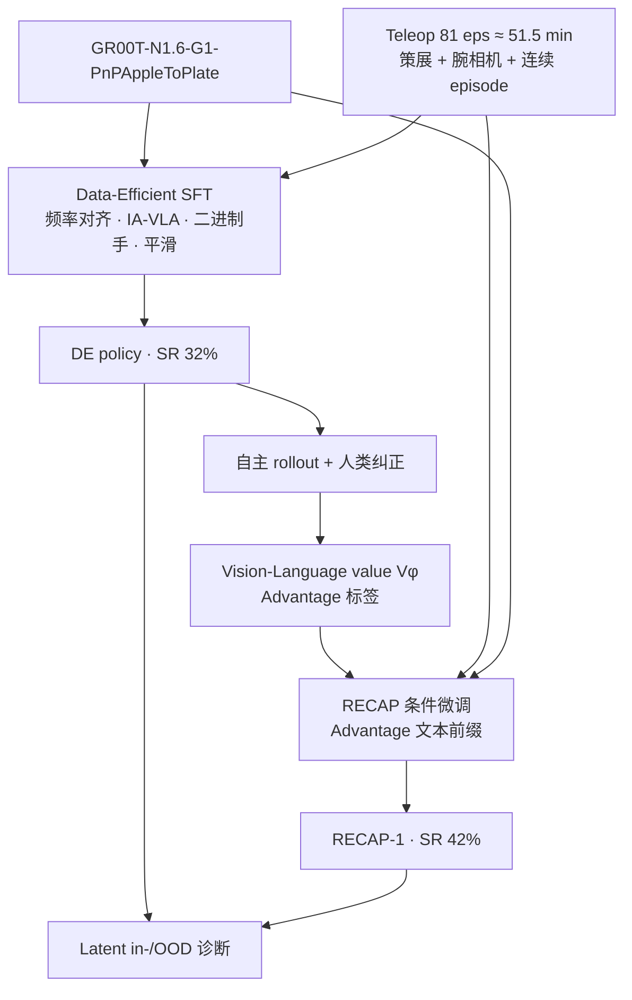

# DEED：零售人形 VLA 的数据高效后训练与经验驱动学习

**DEED**（*Data-Efficient Post-Training and Experience-Driven Learning*；论文 *Closing the Lab-to-Store Gap*，[arXiv:2607.20345](https://arxiv.org/abs/2607.20345)）由 **HIVE Robots** 与 **丹麦技术大学（DTU）** 提出：在 **Unitree G1-Edu** 上以 **GR00T N1.6** 做超市薯片补货，论证「实验室→门店」鸿沟主要是 **系统集成与数据设计**，而非再改 VLA 架构——不改模型结构、单卡 GPU，即可把不可用的 naive SFT 变成可部署策略。

## 一句话定义

**先用频率对齐、策展、视觉高亮与降维动作等 Data-Efficient 配方把预训练 VLA 调到能干活，再用适配 GR00T 解耦结构的 RECAP（文本 advantage 前缀 + 视觉–语言价值函数）从真机经验里再挤一轮增益，并用 latent 诊断盯住分布漂移。**

## 英文缩写速查

| 缩写 | 英文全称 | 简要说明 |
|------|----------|----------|
| DEED | Data-Efficient Post-Training and Experience-Driven Learning | 本文两阶段系统框架 |
| VLA | Vision-Language-Action | 视觉–语言–动作多模态策略 |
| RECAP | RL with Experience and Corrections via Advantage-conditioned Policies | 用 advantage 条件化策略、融合自主经验与纠正 |
| SFT | Supervised Fine-Tuning | 在遥操作示范上的监督微调 |
| IA-VLA | Input Augmentation for Vision-Language-Action | 用 VLM 掩膜/框增强任务相关视觉输入 |
| GR00T | Generalist Robot 00 Technology（NVIDIA） | 本文后训练起点：N1.6 + G1 PnP checkpoint |

## 为什么重要

- **打脸「再换架构」叙事：** 同 ckpt 上 naive SFT **0/50**，DE 配方后 **16/50**——增益来自工程配方而非新骨干。
- **人形零售闭环样本：** 真实货架/手推车/商品箱、转身腰部运动、腕部相机，比桌面固定位姿操作更接近门店噪声。
- **RECAP 迁到解耦 VLA 的做法可复用：** 文本 `Advantage=*` 前缀 + 独立价值头，避免改 GR00T 预训练约定。
- **经验驱动的反例同样有价值：** 第二轮 RECAP 掉到 **22%**，说明自生成数据主导会漂移——要保持 teleop 混合。

## 核心信息

| 项 | 内容 |
|----|------|
| **机构** | 海夫机器人（HIVE Robots）；丹麦技术大学（Technical University of Denmark） |
| **平台** | Unitree G1-Edu + Dex-3；头 D435i + 双腕 D405；Unitree locomotion 保平衡 |
| **模型** | GR00T N1.6，初始化 `GR00T-N1.6-G1-PnPAppleToPlate` |
| **算力** | 单卡 NVIDIA RTX 5090 |
| **开源** | **未开源**（截至 2026-07-24 无项目页 / GitHub） |

## 核心原理

### 方法栈

| 模块 | 角色 |
|------|------|
| **频率层级** | \(f_r=f_{\mathrm{ctrl}}\le f_{\mathrm{cam}}\)，遥操作可更高；本文 50 / 30 / 25 Hz |
| **数据策展** | 均衡覆盖、高效成功、保留恢复、动作一致、连续多子任务 episode |
| **IA-VLA 高亮** | VLM 掩膜传播 + 货架空位框，减轻虚假视觉相关 |
| **降依赖** | 双手二进制开合；Butterworth 平滑 chunk；避免弱共享语言提示 |
| **动作降维** | 32 → 20 维（臂关节 + 二进制手 + 腰 + 基座速度） |
| **RECAP 适配** | 文本 advantage 前缀；价值函数仅视觉+语言；每轮从原 ckpt 重启 |

### 流程总览

### 源码运行时序图

**不适用** — 截至 2026-07-24，论文未提供可运行官方代码或项目页实现入口；读者可对照公开的 [Isaac-GR00T](https://github.com/NVIDIA/Isaac-GR00T) / [GR00T N1 实体](./paper-hrl-stack-34-gr00t_n1.md) 自行搭建后训练实验，但 **无法复现 DEED 官方管线**。

## 工程实践

| 项 | 建议 |
|----|------|
| 先做配方再谈 RL | 频率/相机/策展/动作空间不对时，advantage 微调救不了 0% 策略 |
| 相机布局 | 头相机不够时补 **腕部视角**；与视觉高亮一起上 |
| 手部接口 | 开合型任务优先 **二进制夹爪式** 命令，降低低频 VLA 负担 |
| RECAP 轮次 | **一轮**可能涨点；多轮需固定 teleop:rollout 混合，防止自举漂移 |
| Reset | advantage 易抑制「回到初始」——可用外部复位或把 reset 写进回报/子任务 |
| 监控 | 把 latent in-distribution 信号当一等公民，解释掉点是否来自分布收缩 |

### 评测速查（薯片补货，各 50 episode）

| 模型 | 成功率 | 成功均值时长 | 最多连续袋数 |
|------|--------|--------------|--------------|
| Naive SFT | 0%（0/50） | — | 0 |
| DE policy | **32%**（16/50） | 24.30 s | **4** |
| RECAP iter 1 | **42%**（21/50） | 22.37 s | 1 |
| RECAP iter 2 | 22%（11/50） | 21.09 s | 1 |

## 实验与评测

- **任务：** 超市复刻场景薯片补货（抓袋 → 转身放架 → 转回）；左臂为主。
- **数据：** teleop 81 条 ≈51.5 min；两轮 RECAP 另加 116 条自主 rollout；合计操作 ≈108.4 min。
- **主结论：** Data-Efficient 承担主要跃迁（0%→32%）；RECAP-1 再至 42%；RECAP-2 因自举漂移回落到 22%。

## 结论

**lab→store 鸿沟首先是系统集成与数据设计问题，不是再换 VLA 架构；经验驱动有用但非单调，必须守住 teleop 与 rollout 的混合比。**

1. **先做 Data-Efficient 配方** — 频率对齐、腕相机、策展、动作降维、视觉高亮、推理平滑，把同 ckpt 的 naive SFT 从 **0%→32%**。
2. **RECAP 一轮可再涨点** — 文本 `Advantage` 前缀适配 GR00T 解耦结构，**42%**；每轮宜从原公开 ckpt 重启。
3. **第二轮易自举漂移** — 自生成数据主导时掉到 **22%**；高变异人形任务上要固定 demonstration:rollout 混合或周期性回灌 teleop。
4. **Reset 会被 advantage 抑制** — 补货后「回到初始」常需外部复位，或改写回报/子任务定义。
5. **代码未开放** — 可读配方、不可逐行复现；对照公开 Isaac-GR00T / 其他 RECAP 飞轮实现。

## 与其他工作对比

| 对照 | 差异读法 |
|------|----------|
| [STEAM](./paper-steam-advantage-modeling.md) | 离线自监督 advantage + CFGRL；DEED 是 **在线 rollout + 文本 advantage 前缀** 且绑 GR00T 解耦结构 |
| [Learning to Fold](./paper-lehome-learning-to-fold.md) | 开源 AWR+RECAP 飞轮（双臂叠衣）；DEED 面向 **零售人形 + 系统配方**，代码未开 |
| [OpenHLM](./paper-loco-manip-161-154-openhlm.md) | 全身原生 VLA 经验配方与长程榜；DEED 基线是 **同 ckpt naive SFT**，不声称横扫全身榜 |
| [GR00T N1](./paper-hrl-stack-34-gr00t_n1.md) | 预训练基础模型；DEED 是其 **门店后训练系统学** |

## 局限与风险

- **单任务、单平台、二值成功、样本少** — 作者自述外推需谨慎。
- **代码未开放** — 无法核对 IA-VLA / 价值头 / 数据清洗细节。
- **经验驱动非单调** — 第二轮掉点；高变异人形任务上 advantage 估计更噪。
- **不是全身操作 VLA 天花板对比** — 基线是「同 ckpt 的 naive SFT」，不是 OpenHLM / 大规模全身采集配方的横向榜。

## 关联页面

- [GR00T N1](./paper-hrl-stack-34-gr00t_n1.md) — 后训练所依赖的基础模型族
- [VLA](../methods/vla.md) — 方法总览与「部署经验后训练」语境
- [STEAM](./paper-steam-advantage-modeling.md) — 离线 advantage / CFGRL 对照
- [Learning to Fold](./paper-lehome-learning-to-fold.md) — AWR+RECAP 异步飞轮对照（已开源）
- [Green-VLA](./paper-greenvla-staged-vla-humanoid.md) — flow-VLA 保守 RL 后训练对照
- [OpenHLM](./paper-loco-manip-161-154-openhlm.md) — 全身原生 VLA 经验配方对照
- [Loco-manipulation](../tasks/loco-manipulation.md) / [Manipulation](../tasks/manipulation.md)

## 参考来源

- [deed_arxiv_2607_20345.md](../../sources/papers/deed_arxiv_2607_20345.md) — 论文摘录与开源核查
- [arXiv:2607.20345](https://arxiv.org/abs/2607.20345) — 原文（HTML/PDF）

## 推荐继续阅读

- [arXiv HTML 全文](https://arxiv.org/html/2607.20345)
- [Isaac GR00T 仓库](https://github.com/NVIDIA/Isaac-GR00T)
- [STEAM（离线 advantage 后训练）](./paper-steam-advantage-modeling.md)
- [Learning to Fold（开源 RECAP 飞轮）](./paper-lehome-learning-to-fold.md)
