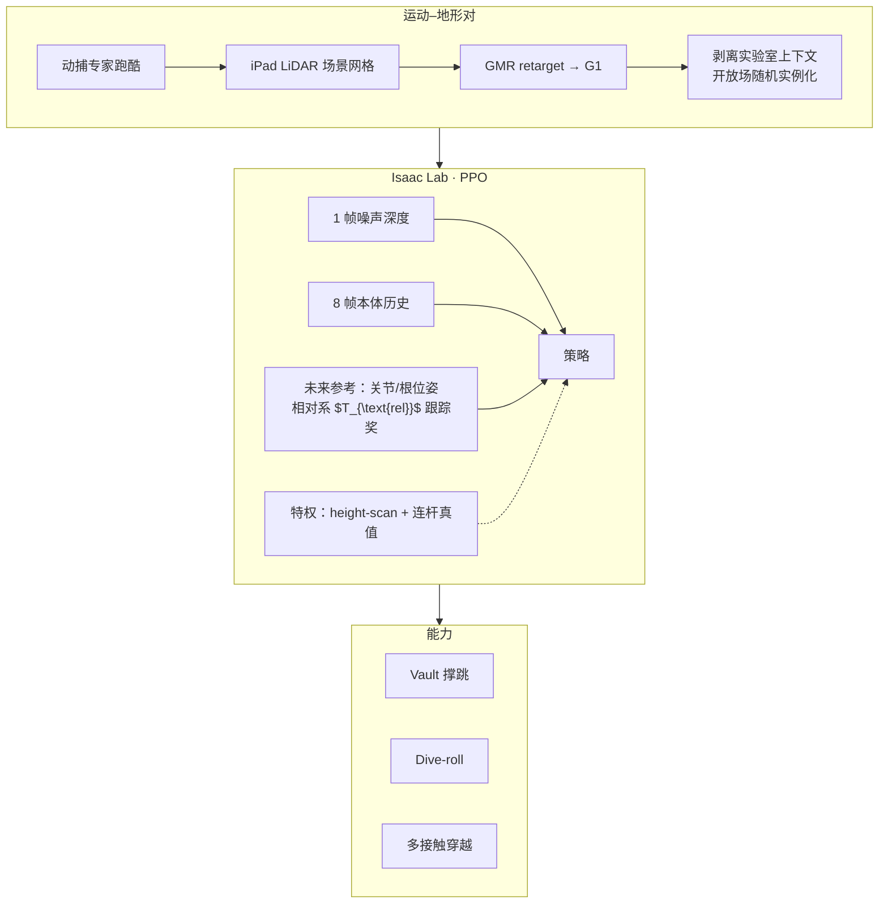

# Deep Whole-body Parkour：感知式全身跑酷

**Deep Whole-body Parkour**（arXiv:2601.07701）隶属 [Project Instinct](./project-instinct.md)，在 [42 篇 RL 身体系统栈](https://mp.weixin.qq.com/s/hz9JXtJeUPRfUGzfD-pZuA) 为 **#23/42**（03 感知式高动态运动），在 [AMP 专题](https://mp.weixin.qq.com/s/YZsm3855iP3TNTTt1aou7w) 为 **#18/19**（04 交互与长时程）。核心命题：**感知 locomotion** 只会用脚，**盲运动跟踪** 不会看障碍——本文把 **深度外感知** 接入 **全身参考跟踪**，让 vault、俯冲翻滚等 **多接触技能** 能按局部几何 **闭环改步态**。

## 一句话定义

**以动捕–LiDAR 配对的运动–地形数据集训练单策略 PPO：actor 读噪声深度与本体历史，跟踪相对参考系下的全身目标，在非结构化障碍上完成可容忍初始位姿偏差的感知式跑酷。**

## 英文缩写速查

| 缩写 | 英文全称 | 简要说明 |
|------|----------|----------|
| WBT | Whole-Body Tracking | 全身参考运动跟踪控制接口 |
| RL | Reinforcement Learning | 大规模 Isaac Lab 并行训练 |
| PHP | Perceptive Humanoid Parkour | Instinct 跑酷簇姊妹方向 |
| GPU | Graphics Processing Unit | Warp 射线投射并行深度渲染 |
| G1 | Unitree G1 Humanoid | 动捕 retarget 与真机平台 |
| PPO | Proximal Policy Optimization | 非对称 actor-critic 训练算法 |

## 为什么重要

- **范式缝合：** 在 [运动小脑 64 篇地图](../overview/humanoid-motion-cerebellum-technology-map.md) 归类 **A 走路底座**（8/64）——手脚躯干 **一起** 参与跑酷，而非仅足式踏板。
- **闭环 vs 盲跟踪：** 盲 WBT 需精确摆放才能对齐预录轨迹；深度策略可 **缩步/伸步** 以对准撑手点——把脆弱 playback 变成可部署空间行为。
- **仿真工程贡献：** 分组 mesh 实例 + 预计算 group→mesh 表，万级并行深度 **~10×** 加速（Algorithm 1）——感知 WBT 训练吞吐的关键。
- **非 AMP 主线但专题收录：** 与 [Embrace Collisions #19](./paper-amp-survey-19-embrace_collisions.md) 共构 Instinct **全身极限运动** 版图；读 AMP 专题末段时应与 **Hiking #09**、[PhysHSI #15](./paper-amp-survey-15-physhsi.md) 对照。

## 流程总览

## 核心机制（归纳）

### 1）数据集与相对跟踪系

- 同步采集 **人体动力学 + 障碍网格**；GMR + 手工关键帧修正接触。
- **$T_{\text{rel}}$：** 机器人 xy/yaw + 参考 z/roll/pitch——解耦平面误差与垂直/俯仰模仿（Fig. 2）。
- 奖励：全局根位姿、相对系连杆位姿/速度、动作率与接触/力矩惩罚等（BeyondMimic 类简化跟踪）。

### 2）感知与非对称训练

- Actor：**深度图 + 本体**；Critic：**地形 height-scan**、连杆真值、完整参考。
- **自适应采样：** 按失败率过采样难「运动–地形对」（Algorithm 2）。

### 3）分组 Warp 射线投射

- 静态地形 group $=-1$（全员可见）；每机器人唯一 group（不见其他 env 的 ghost 机体）。
- 预计算 hash 表避免每射线遍历全局 mesh——大规模并行训练可行。

## 常见误区

1. **不是经典 AMP 论文：** 主奖励是 **参考跟踪** + 感知，非对抗运动先验；AMP 专题将其作为 **感知×全身** 收束参考。
2. **≠ 仅足式跑酷：** 强调 **手、躯干接触** 的 vault/翻滚；与 [Hiking in the Wild](./paper-hiking-in-the-wild.md) 踏板落脚跑酷互补。
3. **≠ PHP 重复：** 同属 Instinct 跑酷簇，本文侧重 **WBT+深度** 统一多技能；PHP 链式动态技能侧重点不同（策展导读原话）。
4. **数据非 AMASS 规模：** 定制 **接触丰富几何** 小集，质量重于数量。

## 实验与评测

- **仿真：** 多类跑酷动作 × 多样障碍几何；相对盲跟踪对 **初始距离/角度扰动** 更鲁棒。
- **真机：** Project Instinct 页展示深度 onboard、重复测试与下游蒸馏用例。
- **工程：** 射线投射加速与 Isaac Lab 大规模并行为可复现要素。

## 结论

**把深度外感知接入全身参考跟踪，单策略按局部几何闭环改步态，完成 vault、dive-roll 等多接触跑酷。**

1. **缝合感知 loco 与盲 WBT** — actor 读噪声深度与本体历史，跟踪相对参考系全身目标，可缩步 / 伸步对准撑手点。
2. **相对跟踪系 $T_{\text{rel}}$ 解耦误差** — 机器人 xy/yaw + 参考 z/roll/pitch，避免平面漂移破坏垂直 / 俯仰模仿。
3. **非对称 critic + 自适应采样** — critic 用 height-scan 与连杆真值；按失败率过采样难「运动–地形对」。
4. **分组 Warp 射线投射是吞吐关键** — 预计算 group→mesh 表，万级并行深度约 10× 加速。
5. **定位与数据边界要认清** — 主奖励是参考跟踪而非 AMP；强调手 / 躯干接触，与足式 Hiking 互补；数据为定制接触丰富小集，质量优先于规模。

## 与其他页面的关系

- 团队门户：[project-instinct.md](./project-instinct.md)
- RL 栈：[humanoid-rl-motion-control-body-system-stack.md](../overview/humanoid-rl-motion-control-body-system-stack.md)（#23/42）
- AMP 专题：[humanoid-amp-motion-prior-survey.md](../overview/humanoid-amp-motion-prior-survey.md)（#18/19）
- 姊妹：[paper-hiking-in-the-wild.md](./paper-hiking-in-the-wild.md)、[paper-amp-survey-19-embrace_collisions.md](./paper-amp-survey-19-embrace_collisions.md)
- 任务：[stair-obstacle-perceptive-locomotion.md](../tasks/stair-obstacle-perceptive-locomotion.md)

## 参考来源

- [deep_whole_body_parkour_arxiv_2601_07701.md](../../sources/papers/deep_whole_body_parkour_arxiv_2601_07701.md)
- [humanoid_rl_stack_23_deep_whole_body_parkour.md](../../sources/papers/humanoid_rl_stack_23_deep_whole_body_parkour.md)
- [humanoid_amp_survey_18_deep_whole_body_parkour.md](../../sources/papers/humanoid_amp_survey_18_deep_whole_body_parkour.md)
- [humanoid_amp_survey_19_catalog.md](../../sources/papers/humanoid_amp_survey_19_catalog.md)
- [wechat_embodied_ai_lab_humanoid_rl_motion_survey.md](../../sources/blogs/wechat_embodied_ai_lab_humanoid_rl_motion_survey.md)
- [wechat_embodied_ai_lab_humanoid_amp_motion_prior_survey.md](../../sources/blogs/wechat_embodied_ai_lab_humanoid_amp_motion_prior_survey.md)

## 推荐继续阅读

- [Deep Whole-body Parkour 项目页](https://project-instinct.github.io/deep-whole-body-parkour)
- [arXiv:2601.07701](https://arxiv.org/abs/2601.07701)
- [42 篇 RL 运动控制（微信公众号）](https://mp.weixin.qq.com/s/hz9JXtJeUPRfUGzfD-pZuA)
- [AMP 专题长文](https://mp.weixin.qq.com/s/YZsm3855iP3TNTTt1aou7w)
