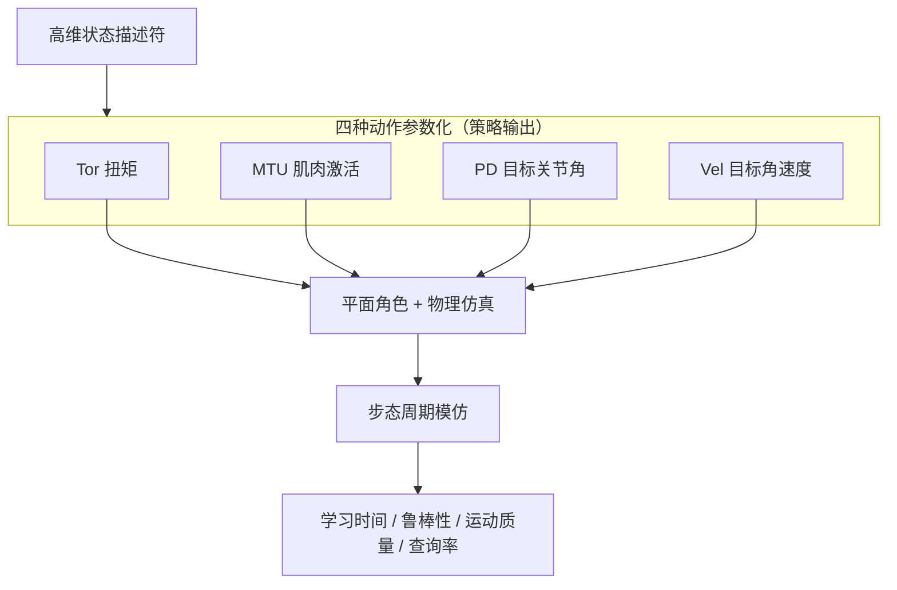

---

type: entity
tags: [reinforcement-learning, locomotion, action-space, character-animation, pd-control, xbpeng, ubc]
status: stable
summary: "SCA 2017：在步态模仿任务上对比扭矩、肌肉激活、目标关节角（PD）与目标角速度四种 DeepRL 动作空间，论证带局部反馈的高层参数化通常学得更快、更鲁棒、运动质量更好。"
updated: 2026-05-21
arxiv: "1611.01055"
venue: curated
related:
  - ../queries/legged-humanoid-rl-pd-gain-setting.md
  - ../entities/paper-cassie-feedback-control-drl.md
  - ../entities/paper-quadruped-torque-control-rl.md
  - ../entities/xue-bin-peng.md
  - ../methods/reinforcement-learning.md
  - ../tasks/locomotion.md
  - ../concepts/character-animation-vs-robotics.md
sources:
  - ../../sources/papers/deeprl_locomotion_action_space_sca2017.md
---

# Learning Locomotion Skills Using DeepRL: Does the Choice of Action Space Matter?

**一句话定义**：在 **平面物理角色** 的 **步态周期模仿** 上，用深度 RL **对照四种动作参数化**（扭矩、肌肉激活、**目标关节角 + PD**、目标关节角速度），从 **学习时间、鲁棒性、运动质量与策略查询率** 论证 **高层动作空间 + 局部反馈** 往往优于端到端扭矩控制。

## 英文缩写速查

| 缩写 | 英文全称 | 简要说明 |
|------|----------|----------|
| PD | Proportional–Derivative | 关节位置/阻抗底层控制，策略输出常为其 setpoint |
| Locomotion | Robot Locomotion | 足式/人形等无轮移动能力的总称 |
| RL | Reinforcement Learning | 通过与环境交互最大化长期回报来学习策略的范式 |
| Kp | Proportional Gain | PD 控制的位置误差增益，影响刚度与响应 |
| Kd | Derivative Gain | PD 控制的速度误差增益，抑制振荡 |
| Sim2Real | Simulation to Real | 把仿真中学到的策略迁移落地真机的工程主线 |
| legged_gym | Legged Gym | 足式机器人 RL 训练的常用开源框架 |
| MDP | Markov Decision Process | 状态–动作–奖励–转移的标准序贯决策建模框架 |

## 为什么重要

- **动作接口争论的「前史锚点」**：后续腿足/人形 RL 中「**策略输出目标角 + PD 内环**」与「**直驱扭矩**」的分歧，在仓库 [Kp/Kd 设置 Query](../queries/legged-humanoid-rl-pd-gain-setting.md) 里多以 **2018 以后的 Cassie / 四足论文** 展开；本文（**SCA 2017，arXiv 2016**）在 **角色动画 + 模仿步态** 设定下给出 **四种语义的系统实证**，便于理解 Peng 研究线的起点。
- **与 [Xue Bin Peng](./xue-bin-peng.md) 学位论文一致**：与 [M.Sc. 论文项目页](https://xbpeng.github.io/projects/MSc_Thesis/index.html) 同属 **「用 DeepRL 开发 locomotion 技能」** 阶段；获奖论文（**SCA 2017 Best Student Paper**）是后续 DeepMimic、Cassie 与 sim2real 的共同前导。

## 核心机制（提炼）

### 四种动作语义

| 参数化 | 策略输出（概念） | 局部反馈 | 典型优劣（论文归纳） |
|--------|------------------|----------|----------------------|
| **Tor** | 关节扭矩 | 无 | 探索难、学习慢、鲁棒性偏弱 |
| **MTU** | 肌肉激活 | 肌肉–肌腱动力学 | 利用被动动力学；与生物力学模型绑定 |
| **PD** | 目标关节角 | PD 跟踪内环 | **样本效率与运动质量往往最佳** |
| **Vel** | 目标关节角速度 | 速度级跟踪 | 介于 Tor 与 PD 之间 |

### 流程总览（对照实验结构）

**归纳结论（跨角色/步态）：** **PD（目标角 + 内环）** 与部分 **Vel / MTU** 等 **具身反馈** 路线，往往比 **纯扭矩** 更快收敛、策略更抗扰、动作更自然；但 **任务与角色形态** 仍决定最优接口 — 不能脱离具体 plant 外推。

## 常见误区或局限

- **平面角色 ≠ 真机人形**：结论用于 **解释接口直觉**，迁移到 Cassie / Unitree 时必须叠加 **接触模型、执行器带宽与观测噪声** 单独验证。
- **模仿步态 ≠ 奖励塑形 locomotion**：任务是 **跟踪周期步态**，与 **速度指令、地形课程** 等 RL locomotion 的 reward 设计不同；读此文应聚焦 **动作语义**，而非照搬 reward。
- **PD 增益未单独扫参**：论文对比的是 **接口族**，不是 [Kp/Kd 随机化](../queries/domain-randomization-guide.md) 的工程细节 — 后者见后续 Cassie / legged_gym 文献。

## 与其他页面的关系

- **上游（作者线）**：[Xue Bin Peng](./xue-bin-peng.md)、[Character Animation vs Robotics](../concepts/character-animation-vs-robotics.md)
- **同主题后续（机器人 MDP）**：[Cassie 反馈控制 DRL](./paper-cassie-feedback-control-drl.md)、[四足扭矩控制 RL](./paper-quadruped-torque-control-rl.md)
- **策展索引**：[Legged / Humanoid RL 中 Kp/Kd 设置](../queries/legged-humanoid-rl-pd-gain-setting.md)、[RL+PD 动作接口论文索引](../../sources/papers/rl_pd_action_interface_locomotion.md)

## 实验与评测

- 量化指标、消融与 sim2real / 实机结果见 **原文 PDF** 与 [参考来源](#参考来源)；本页正文侧重方法结构与知识库交叉引用。

## 参考来源

- [DeepRL 动作空间 SCA 2017 原始资料](../../sources/papers/deeprl_locomotion_action_space_sca2017.md)
- Peng & van de Panne, *Learning Locomotion Skills Using DeepRL: Does the Choice of Action Space Matter?*, SCA 2017 — [arXiv:1611.01055](https://arxiv.org/abs/1611.01055) · [DOI:10.1145/3099564.3099567](https://doi.org/10.1145/3099564.3099567) · [项目页](https://xbpeng.github.io/projects/ActionSpace/index.html)

## 关联页面

- [Legged / Humanoid RL 中 Kp/Kd 设置](../queries/legged-humanoid-rl-pd-gain-setting.md)
- [Cassie 反馈控制 DRL](./paper-cassie-feedback-control-drl.md)
- [四足扭矩控制 RL](./paper-quadruped-torque-control-rl.md)
- [Reinforcement Learning](../methods/reinforcement-learning.md)
- [Locomotion](../tasks/locomotion.md)

## 推荐继续阅读

- [ActionSpace 项目页 PDF / 视频](https://xbpeng.github.io/projects/ActionSpace/index.html)
- [Peng M.Sc. 论文 PDF](https://xbpeng.github.io/projects/MSc_Thesis/MSc_Thesis.pdf)
- [DeepMimic](../methods/deepmimic.md) — 同一作者组在 **示例引导 + 物理角色** 上的后续标杆
