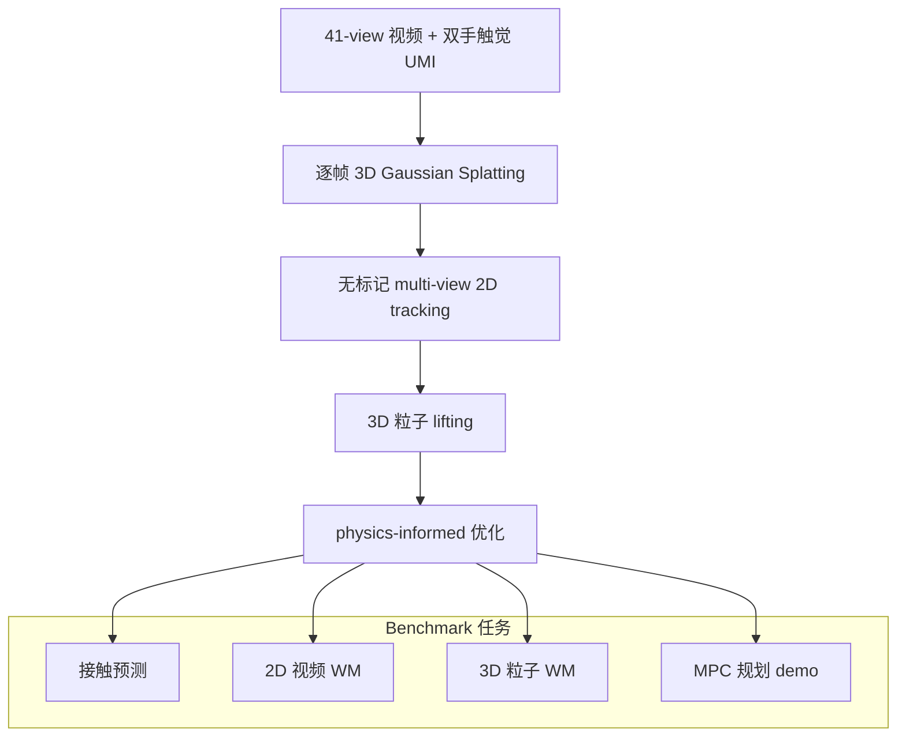

# Deform360（Massive Multi-view Visuotactile Dataset · arXiv:2607.05390）

**Deform360**（*Deform360: A Massive Multi-view Visuotactile Dataset for Deformable World Models*，[arXiv:2607.05390](https://arxiv.org/abs/2607.05390)，Brown / Columbia / MIT 等，ECCV 2026，[deform360.lhy.xyz](https://deform360.lhy.xyz)）发布 **大规模真实世界可变形体视触觉数据**：198 类日常物体、1980 条交互、**215.7 小时 / 2330 万帧**；**41 路环绕相机 + 双手触觉 UMI 夹爪** 同步记录 **全局运动与接触诱发局部形变**，支撑 **2D 视频 WM vs 3D 粒子 WM** 系统对照与 **MPC 规划** 初步验证。

## 一句话定义

**可变形动力学太难 —— 用 360° 视觉 + 双手触觉 + 无标记 3D 粒子标注，把「2D 可扩展 vs 3D 结构先验」放进同一 benchmark。**

## 英文缩写速查

| 缩写 | 英文全称 | 简要说明 |
|------|----------|----------|
| WM | World Model | 2D 视频 vs 3D 粒子 **动作条件未来预测** |
| MPC | Model Predictive Control | 数据集上 **goal-conditioned** 布绳/布片规划 demo |
| UMI | Universal Manipulation Interface | 双手 **触觉 equipped** 夹爪采集平台 |
| 3DGS | 3D Gaussian Splatting | 逐帧几何重建中间表示 |
| RGB | Red-Green-Blue | 720p 级多视角视频（网页预览 480p） |
| Tactile | — | 法向压力接触 cue（**切向微滑未观测**） |
| PhysTwin | — | 论文对照 **3D 粒子/物理先验** WM 之一 |

## 为什么重要

- **可变形体 WM 的「范式之争」缺数据：** 纯 2D 视频 WM **可扩展但长程 3D 不一致**；3D 粒子/物理 WM **结构先验强但缺大规模预训练**；Deform360 提供 **同分布对照**（策展文几何/接触层数据缺口）。
- **补齐接触专题数据层：** 与 [VT-WAM](./paper-vt-wam-visuotactile-contact-rich.md) / [TACO](./paper-taco-tactile-wm-vla-posttrain.md) **方法层** 互补；支持 **contact prediction** 与 **visuotactile coupling** 评测。
- **规模显著超越 prior real-world deformable sets：** 相对 Robo360 / PokeFlex / DOT 等（见论文 Table 1），**198 物体 / 23.3M 帧 / 41 views / 触觉** 组合唯一。
- **真实机器人规划 demo：** Deform360 训练的 PhysTwin 在 **未见 xArm 第二实验室** 做 cloth/rope MPC **零微调迁移**——证明数据 **可下游规划**。

## 核心结构与方法

| 组成 | 规模 / 方法 |
|------|-------------|
| **物体** | **198** 类日常可变形体（1D 绳线 / 2D 布片 / 3D 毛绒等 **17 材质类别**） |
| **序列** | **1980** 条交互（每物体多条 primitive） |
| **时长 / 帧** | **215.7 h** cumulative multi-view；**~23.3M** 帧 |
| **视觉** | **41** 路同步环绕相机；**标定 + 360°** |
| **触觉** | 双手 UMI 夹爪 **法向压力**；遮挡区 **触觉约束粒子** |
| **3D 标注管线** | 多视角视频 + 触觉 → 逐帧 **3DGS** → 无标记 2D track → 3D lift → **physics-informed 优化** → dense particles |
| **三大 benchmark 任务** | ① contact prediction ② **2D vs 3D WM** future prediction ③ robot MPC planning |

### 采集–标注–评测管线

### 数据集规模 / 模态 / 开放获取（索引）

| 维度 | 说明 |
|------|------|
| **规模** | 198 obj · 1980 seq · 215.7 h · 23.3M frames · 13 action primitives |
| **模态** | 多视角 RGB 720p、相机标定、**双手触觉压力**、dense 3D particles/mesh、3DGS |
| **许可证 / 获取** | 项目页 **Fully open**；代码 + pipeline 与 **Hugging Face 数据集** 发布（具体条款以 [deform360.lhy.xyz](https://deform360.lhy.xyz) 与 HF 仓库为准） |
| **训练输入 / 可部署就绪度** | dense 3D 粒子 + mesh 可直接作 **3D 粒子 WM 策略输入**；2D 多视角视频供 **video WM 训练输入**；PhysTwin + MPC 已示范 **零微调可部署** 到未见 xArm 真机（属 offline benchmark，非在线控制指令流） |
| **对比 prior** | 唯一同时具备 **Mesh+Calib+Markerless+Tactile+360°+41 Views** 的大规模 real deformable 集（Table 1） |

## 实验要点（索引级）

| 轴 | 报告口径（以论文为准） |
|----|------------------------|
| **2D vs 3D WM** | **低数据**：3D 粒子模型 **优**（结构先验）；**大数据**：2D 视频 WM **泛化更好**（可扩展性） |
| **Contact prediction** | 同步触觉 **提升** 视觉–接触耦合建模 |
| **Robot planning** | PhysTwin + MPC：训练 lab → **未见 xArm 第二 lab** cloth/rope **零微调** |
| **Generalization splits** | unseen episode / unseen object 等（见论文 qualitative） |
| **发布** | 代码、pipeline、交互 4D 查看器、BibTeX |
| **会议** | ECCV 2026 |

## 与其他工作对比

| 数据集 / 工作 | 关系 |
|---------------|------|
| **Robo360 / DOT / PokeFlex** | 少触觉或 **少 views**；Deform360 **41 view + bimanual touch** |
| **PhysTwin / PGND** | 3D WM **方法**；Deform360 为 **训练/评测源** |
| **Cosmos / 2D video WM** | **可扩展 2D** 路线对照对象 |
| **[VT-WAM](./paper-vt-wam-visuotactile-contact-rich.md)** | 真机 **闭环 tactile WAM**；Deform360 偏 **offline benchmark** |
| **[RynnWorld-4D](./paper-rynnworld-4d-rgb-depth-flow.md)** | **RGB-DF 4D** 生成；Deform360 聚焦 **可变形体 + 粒子** |
| **[ClothTransformer](./paper-clothtransformer-unified-latent-cloth-simulation.md)** | **仿真神经布料求解器** + 无穿透 GT；Deform360 偏 **真实布绳视触觉 WM** |

## 常见误区或局限

- **误区：** 触觉覆盖 **全部接触力学**；论文明确 **切向 micro-slip 未观测**，主要为 **法向压力 cue**。
- **误区：** 3D 粒子 **永远优于 2D**；结论为 **数据量依赖的 trade-off**，非单一赢家。
- **局限：** 采集 **lab 固定**；action space 以 **human UMI 原语** 为主；WM 榜单 **未含最新 WAM 闭环**；许可证需 **按 HF 页面** 遵守学术/商用条款。

## 与其他页面的关系

- [wm-action-consequence-category-02-contact-modeling](../overview/wm-action-consequence-category-02-contact-modeling.md) — 数据层支柱
- [wm-action-consequence-category-03-geometry-4d](../overview/wm-action-consequence-category-03-geometry-4d.md) — 2D/3D/4D WM 对照语境
- [动作后果技术地图](../overview/robot-world-models-action-consequence-technology-map.md) — 专题总览
- [Generative World Models](../methods/generative-world-models.md) — 2D 视频 WM 方法栈
- [VT-WAM](./paper-vt-wam-visuotactile-contact-rich.md) — 视触觉操纵对照

## 推荐继续阅读

- [Deform360 论文（arXiv:2607.05390）](https://arxiv.org/abs/2607.05390)
- [Deform360 项目页与交互查看器](https://deform360.lhy.xyz)
- [PhysTwin](https://arxiv.org/abs/2404.03572) — 3D 粒子 WM 对照方法
- [RynnWorld-4D 论文实体](./paper-rynnworld-4d-rgb-depth-flow.md)

## 参考来源

- [具身智能研究室 · 世界模型动作后果专题导读（2026-07）](../../sources/blogs/wechat_embodied_ai_lab_robot_world_models_action_consequence_2026.md)
- [Deform360 论文（arXiv:2607.05390）](https://arxiv.org/abs/2607.05390)
