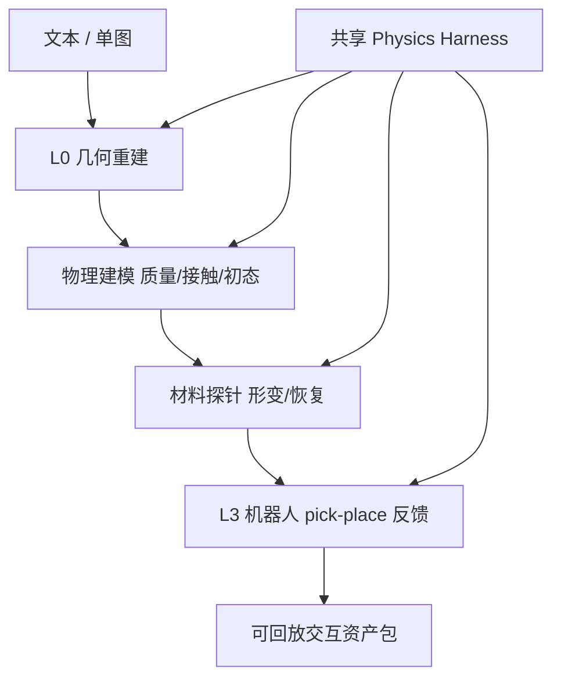

# DeformSmith（arXiv:2609.18620）

**DeformSmith**（*Physics Harness-Guided Hierarchical Generation of Deformable Assets for Robot Manipulation*，[arXiv:2609.18620](https://arxiv.org/abs/2609.18620)，[项目页](https://can-lee.github.io/deformsmith-web/)）来自 [具身智能小站 9 篇盘点](../../sources/blogs/wechat_embodied_station_9_papers_perception_action_transfer_2026-09-17.md)。

## 一句话定义

**从文本或单张图生成可仿真、可抓取的可变形物体——分层 agent 构建几何/材料/交互，共享 physics harness 用探针与机器人反馈筛掉物理不合理的候选。**

## 英文缩写速查

| 缩写 | 英文全称 | 简要说明 |
|------|----------|----------|
| L0–L3 | Layer 0–3 | 几何→物理→材料→机器人交互四层 |
| Sim2Real | Simulation to Real | 仿真资产到真机迁移 |

## 为什么重要

- 软体/可变形操作数据稀缺；纯外观生成难保证 **接触后形变与释放** 可信。
- Harness 把 **物理探针 + manipulation feedback** 写进生成环，而非事后人工筛 mesh。
- 开源结论：**待发布**（2026-09-17）。

## 流程总览

## 核心机制

| 项 | 内容 |
|----|------|
| **arXiv** | [2609.18620](https://arxiv.org/abs/2609.18620) |
| **开源** | **待发布** |
| **输出** | 几何、外观、物理参数、验证记录与可回放交互数据统一表示 |

## 源码运行时序图

**不适用**（截至 2026-09-17 无官方代码仓库）。

## 实验与评测

- **评测口径是「物理验收通过率」而非外观分：** harness 在 L1–L3 逐层施加探针（形变/恢复）与 pick-place 反馈，候选资产是否进入输出包由这条链判定——本页把它当作该工作的主评测轴。
- **本页为清单摘要级：** 截至 2026-09-17，量化的通过率、消融（去掉某一层 / 去掉 harness）与下游策略训练收益以 **原文 PDF 与项目页** 为准，见 [参考来源](#参考来源)。
- **复现前提未就绪：** 代码与资产格式 **待发布**，无法独立跑通生成–验收闭环；引用数字时请注明来自作者自报。

## 与其他工作对比

| 对照对象 | 差异 |
|----------|------|
| 纯外观/几何生成（text-to-3D、image-to-mesh） | 只保证「看起来像」，接触后形变与释放不可信；DeformSmith 把 **物理探针** 写进生成环而非事后人工筛 mesh |
| [FPSA R2S2R](./paper-fpsa-r2s2r.md) | 互补的两端：FPSA 变形 **刚性资产** 且保持插口/配合面功能不失效；DeformSmith 直接生成 **可变形本体** |
| 手工建模 + 参数标定 | 精度可控但不可规模化；本文用分层 agent 换吞吐，代价是需要 harness 才能兜住物理合理性 |
| [生成式世界模型](../methods/generative-world-models.md) 路线 | WM 生成的是 **未来观测**，DeformSmith 生成的是 **可仿真资产**——前者服务预测，后者服务数据扩充 |

## 结论

**DeformSmith 的价值在「生成即物理验收」——适合补可变形 Sim 数据，但发布前需核对 harness 与下游 sim 引擎绑定关系。**

1. 与刚性 mesh 增广（如 [FPSA R2S2R](./paper-fpsa-r2s2r.md)）互补：一个管软体生成，一个管接口保持。
2. 分层 agent 便于 debug 哪一层导致物理失败。
3. 待代码发布后再评估与 Isaac/MuJoCo 等栈的导入成本。

## 关联页面

- [manipulation](../tasks/manipulation.md)
- [sim2real](../concepts/sim2real.md)
- [generative-world-models](../methods/generative-world-models.md)
- [9 篇技术地图](../overview/perception-action-transfer-9-papers-technology-map.md)

## 参考来源

- [deformsmith_arxiv_2609_18620.md](../../sources/papers/deformsmith_arxiv_2609_18620.md)
- [wechat_embodied_station_9_papers_perception_action_transfer_2026-09-17.md](../../sources/blogs/wechat_embodied_station_9_papers_perception_action_transfer_2026-09-17.md)

## 推荐继续阅读

- [DeformSmith 项目页](https://can-lee.github.io/deformsmith-web/)
- [arXiv PDF](https://arxiv.org/pdf/2609.18620)
