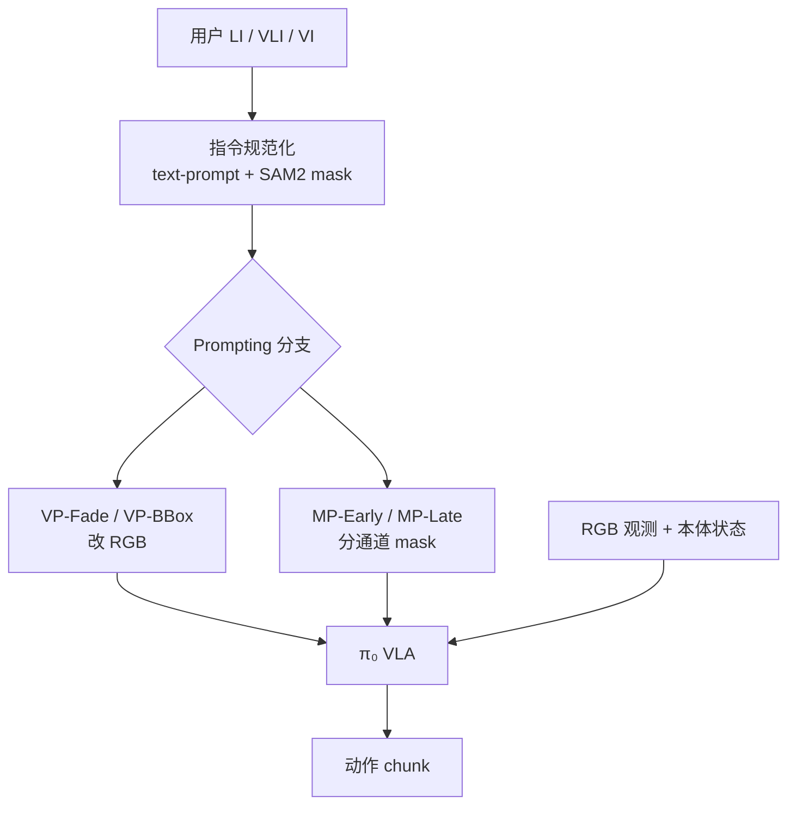

# DeicticVLA：语言与指示手势三模式统一 VLA

**DeicticVLA**（*Unifying Instruction Modes Based on Language and Deictic Gestures in a Single VLA*，[arXiv:2608.28108](https://arxiv.org/abs/2608.28108)）由 **大阪大学系统创新系** 的 Kango Yanagida、Tatsuya Aoki、Yuichiro Yoshikawa 与 **东京大学国际神经智能研究中心** 的 Takato Horii 提出：把 **Language Instruction (LI)**、**Vision-Language Instruction (VLI)**、**Visual Instruction (VI)** 规范化为统一的「文本 prompt + 指示 mask」，让 **单一** 预训练 VLA 在运行时切换三种人机交互模式。

> **对照：** [Point-VLA](https://arxiv.org/abs/2608.23138) 仅覆盖 LI+VLI；[GesVLA](https://arxiv.org/html/2605.22812v1) 把手势编码为连续 latent token。本文走 **click → SAM 2 mask → RGB 或分通道 mask 提示** 路线，并在 **相同骨干、相同 demo、相同总训练步数** 下做 prompting 与训练策略对照。

## 一句话定义

**当桌上多个同类物体让纯语言 LI 又难写又不可靠时，DeicticVLA 用 click 生成的指示 mask 把 VLI/VI 与 LI 绑进同一 π₀ 策略——关键不在多训一个模型，而在 canonical 接口 + 两阶段训练能否让 mask 在 unseen layout 上真起作用。**

## 英文缩写速查

| 缩写 | 英文全称 | 简要说明 |
|------|----------|----------|
| DeicticVLA | Deictic Vision-Language-Action | 本文三模式统一 VLA 框架 |
| LI | Language Instruction | 用户仅提供自然语言 |
| VLI | Vision-Language Instruction | 语言（含「this/there」）+ 指示 click |
| VI | Visual Instruction | 仅 click；固定 prompt `follow visual instruction` |
| VLA | Vision-Language-Action | 视觉–语言–动作策略 |
| SAM 2 | Segment Anything Model 2 | click  grounding 为 pixel mask（真机 sam2.1-hiera-tiny） |
| VP | Visual Prompting | 在 RGB 上渲染 bbox 或 fade（VP-BBox / VP-Fade） |
| MP | Mask Prompting | 分通道 mask 与 RGB 特征融合（MP-Early / MP-Late） |
| LIBERO | Lifelong Robot Learning benchmark | 仿真对照套件 Object / Spatial / Goal |
| SR | Success Rate | 任务成功率；ΔSR = 有 mask − 无 mask |

## 为什么重要

- **HCI 现实：** 家庭/办公场景常有多件同类或相似外观物体；纯 LI 把消歧负担推给用户，模型却不一定听详细描述。
- **模式割裂：** 既往工作多固定 LI 或 VLI 或 VI 之一；Point-VLA 仍缺 VI。
- **设计空白：** RGB 视觉提示 vs 分通道 mask 提示、融合位置、单/两阶段训练此前缺少 **同骨干同数据** 的系统对照。

## 核心信息

| 项 | 内容 |
|----|------|
| **机构** | 大阪大学系统创新系；东京大学国际神经智能研究中心（IRCN） |
| **作者** | Kango Yanagida、Tatsuya Aoki、Yuichiro Yoshikawa、Takato Horii |
| **arXiv** | [2608.28108](https://arxiv.org/abs/2608.28108)（2026-08-28，预印本未同行评审） |
| **骨干** | [π₀](./paper-pi0.md) 全参数微调；动作 chunk 空间不变 |
| **仿真** | LIBERO-Object / Spatial / Goal 子集；2×A100；60k steps（2S：30k LI + 30k all） |
| **真机** | UR5e + Robotiq 2F-85（Fin-ray）；顶视 + 腕部相机；GELLO 360 ep |
| **开源** | **截至 2026-09-09 未开源** — arXiv 无 Code/Data 链接，无项目页 |

## 核心原理

### 指令规范化

用户 click 平板上的机器人视角图像 → **SAM 2** 生成 **Mask-T**（抓取）、**Mask-G**（放置）、**Mask-R**（空间参照）。LI 时 mask 为零；VI 时用共享默认文本，任务语义全在 mask。

### 四种 prompting（同一 canonical 输入）

| 方法 | 机制 | LI 行为 |
|------|------|---------|
| **VP-Fade** | IA-VLA 式：mask 外区域 0.8 灰化 | 不渲染，原 RGB |
| **VP-BBox** | 各 mask 红框（线宽 1% 边长） | 不渲染，原 RGB |
| **MP-Early** | mask patch embed 在 ViT **输入前** elementwise 加 | 零 mask → 不变 |
| **MP-Late** | mask 在 ViT **输出后** 融合 | 零 mask → 不变 |

### 流程总览

### 两阶段训练（2S，主设定）

1. **Stage 1：** 仅 𝒟_LI（30k steps）— 先学会任务与语言跟随。
2. **Stage 2：** 联合 𝒟_all = LI + VLI + VI（30k steps）— 注入指示能力且 **保留 LI 防遗忘**。

对照：**1S**（60k 联合）、**2S-NoLI**（Stage2 去掉 LI，LI SR 跌至 ~64–72%）。

## 源码运行时序图

**不适用（官方可运行代码尚未发布）。** 截至 2026-09-09：arXiv 页面无 GitHub / 项目页链接。预期发布后管线为：用户 click → SAM 2 mask 跟踪 → canonical `(ℓ, 𝕄)` → prompting 分支 → π₀ 推理 → 动作 chunk；真机侧 GELLO 示教数据含双相机 + mask + 30 Hz 控制。

## 工程实践

| 项 | 建议 / 论文设定 |
|----|----------------|
| 何时用 | 多同类物体消歧、用户愿 point/click、需 LI 与 gesture 模式热切换 |
| 交互 | click 优于 sketch（方差小）；真机 SAM 2 跟踪 ~30 Hz（RTX 4090） |
| 仿真选型 | **VP-BBox** 在 Spatial-ZS 领先（VLI ΔSR +16.0）；分布内四法均 ~95% |
| 真机选型 | 作者选 **MP-Late**（不改 RGB，避免红框/背景 fade 干扰） |
| 训练 | 必须 **2S 且 Stage2 含 LI**；1S 会使 VP 系列 zero-shot mask 利用近零 |
| 数据规模 | 真机三任务共 360 ep / ~97k steps；小数据即可三模式共策略 |
| 复现现状 | **等官方代码**；可先复用 open π₀ + SAM 2 + LIBERO 子集做 prompting 对照 |

## 实验与评测

### 仿真（LIBERO 子集，GT mask，Table II 摘要）

**分布内（2S）：** 四法 mean SR **94.1–95.6%**；mask 贡献 ΔSR：VLI **+22–26**、VI **+32–35**（百分点）。

**Zero-shot layout（2S 亮点）：**

| Prompting | Object-ZS VI ΔSR | Spatial-ZS VLI ΔSR |
|-----------|------------------|---------------------|
| VP-BBox | +27.8 | **+16.0** |
| MP-Late | +25.2 | +0.9 |
| MP-Early | +10.0 | +3.1 |

**训练消融：** 1S 下 VP-Fade/BBox 的 Object-ZS ΔSR **≈0**；2S-NoLI 损害 VP-BBox/MP-Late 的 zero-shot 且 LI 大幅遗忘。

### 真机（MP-Late，Table V 摘要）

| 条件 | LI | VLI | VI |
|------|----|----|-----|
| PutBlock TL3（未见序数/空间表达） | 20.0% | 80.0% | **75.0%** |
| OrganizeToy VC-Surface（未见桌布） | 60.0% | **87.5%** | 90.0% |
| OrganizeToy NO-Category（未见类别） | **16.7%** | **100%** | **100%** |

LI (baseline) 仅 LI 数据 30k 训练；DeicticVLA 三模式联合 2S。VLI/VI 在未见表达、视觉扰动、新实例/新类别上 consistently 优于 LI。

## 结论

**DeicticVLA 的可迁移主张是「三模式不是三个模型，而是同一 canonical 接口上的运行时切换；能否在 unseen layout 用上 mask，取决于 prompting 族 + 两阶段训练，而不是分布内 SR 是否已经饱和。」**

1. **真影响：统一 LI/VLI/VI** — 首个在 **单一预训练 VLA** 内覆盖含 VI 的三模式切换（相对 Point-VLA）。
2. **真影响：2S + Stage2 保留 LI** — 1S 或 2S-NoLI 都会损害 mask 泛化或 LI 跟随；联合 Stage2 是默认配方。
3. **真影响：prompting 要分场景选** — 仿真 Spatial-ZS 选 VP-BBox；真机部署选 MP-Late 保 RGB 上下文。
4. **真影响：gesture 消歧胜过冗长 LI** — 未见类别 100% vs 16.7% 是强信号（小数据真机）。
5. **次要代价：click + SAM 管线** — 依赖分割质量与 UI；仿真用 GT mask，真机需 SAM 跟踪。
6. **部署读法：** 代码未发；先按 π₀ + SAM 2 + 2S(15k+15k) + MP-Late 规划真机 POC。

## 与其他工作对比

| 对照 | 差异读法 |
|------|----------|
| [Point-VLA / Pointing-VLA](https://arxiv.org/abs/2608.23138) |  typed spatial readout；支持 LI+VLI，**无 VI** |
| [GesVLA](https://arxiv.org/html/2605.22812v1) | 手势 keypoint → 连续 latent；本文 click → SAM mask → VP/MP |
| [OpenVLA](./paper-openvla.md) | 通用开源 VLA 基线；无三模式指示接口 |
| [π₀](./paper-pi0.md) | 本文直接 fine-tune 的骨干 |
| [ReflexVLA](./paper-reflexvla.md) | 同 π 系 VLA 生态；Reflex 攻延迟动态任务，本文攻多模式指令消歧 |
| IA-VLA / BringMyCup | VP-Fade  lineage；本文在 **同设置** 下对比 VP vs MP |

## 局限与风险

- **未开源：** 无法复核 mask 融合实现、LIBERO 子集筛选与真机 SAM 失败处理。
- **click 模态：** 未覆盖 pointing/gaze/sketch；tablet UI 增加部署层。
- **仿真 mask 为 GT：** 对比 prompting 时刻意排除 SAM 误差，真机仍依赖 SAM 2。
- **预印本：** 2026-08-28 提交，尚未同行评审；100% 等 headline 需看独立复现。
- **任务规模：** 真机三任务、~360 ep；长尾家务泛化未验证。

## 关联页面

- [VLA](../methods/vla.md) — 方法母页
- [Manipulation](../tasks/manipulation.md) — 操作任务背景
- [Action Chunking](../methods/action-chunking.md) — π₀ 动作 chunk 协议
- [LIBERO](./libero-benchmark.md) — 仿真评测套件
- [π₀](./paper-pi0.md) — 骨干模型
- [OpenVLA](./paper-openvla.md) — 开源 VLA 对照
- [ReflexVLA](./paper-reflexvla.md) — 同骨干族不同痛点（延迟 vs 指示）
- [LLM 机器人控制接口](../concepts/llm-robotics-control-interfaces.md) — 多模态指令设计语境

## 参考来源

- [deicticvla_arxiv_2608_28108.md](../../sources/papers/deicticvla_arxiv_2608_28108.md) — 论文摘录与开源核查
- [arXiv:2608.28108](https://arxiv.org/abs/2608.28108) — 原文

## 推荐继续阅读

- [arXiv HTML 全文](https://arxiv.org/html/2608.28108) — 含 Table II/V 与附录 MP-Inter
- [Point-VLA](https://arxiv.org/abs/2608.23138) — LI+VLI spatial readout 对照
- [GesVLA](https://arxiv.org/html/2605.22812v1) — 手势 latent 融合的另一路线
- [π₀ 论文](https://arxiv.org/abs/2410.24164) — DeicticVLA 骨干来源
