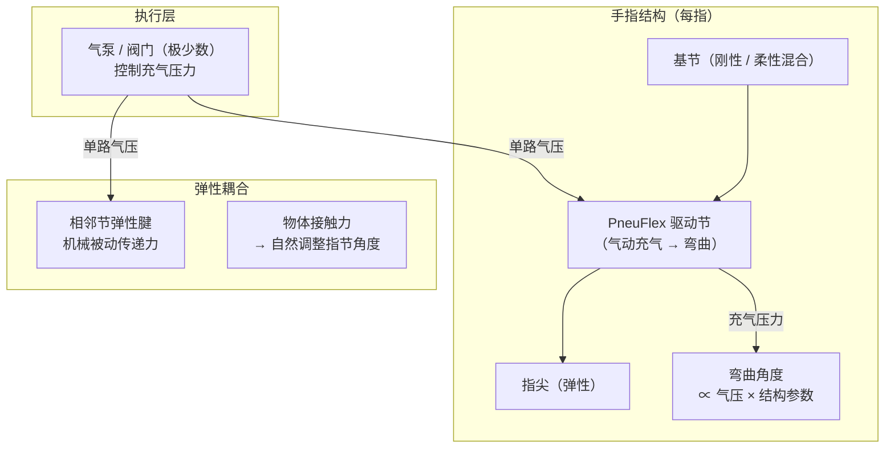

# 顺应性欠驱动机器人手（A Novel Type of Compliant, Underactuated Robotic Hand for Dexterous Grasping）

**Deimel & Brock 柔性手**（*A Novel Type of Compliant, Underactuated Robotic Hand for Dexterous Grasping*，[DOI: 10.15607/rss.2014.x.018](https://doi.org/10.15607/rss.2014.x.018)，RSS 2014；IJRR 扩展版 [DOI: 10.1177/0278364915592961](https://doi.org/10.1177/0278364915592961)，Raphael Deimel & Oliver Brock，TU Berlin，**RSS 2026 Test of Time Award**）提出一种 **高度顺应性的欠驱动拟人机器人手**：使用 **极少量气动执行器**，利用 **自然机械耦合** 和 **与物体的接触力** 自适应地完成多种抓取构型，实现了 **轻量、抗冲击、本质安全** 的灵巧手设计，成为后续软体气动手（如 RBO Hand 系列）的开创性工作。

## 一句话定义

**少量气动执行器 + 弹性耦合结构的欠驱动手：让接触本身成为控制信号，抓取形态由物体几何自然调适——安全、廉价、抗冲击，奠定软体灵巧手十年研究基础。**

## 英文缩写速查

| 缩写 | 英文全称 | 简要说明 |
|------|----------|----------|
| RBO | Robotics and Biology Lab | TU Berlin Brock 课题组简称；该手常称 RBO Hand |
| DOF | Degree of Freedom | 自由度；本手指手指多 DOF 但执行器数远少于 DOF 数 |
| PneuFlex | Pneumatic Flexible Actuator | 文中气动弹性执行器元件名称 |
| RSS | Robotics: Science and Systems | 原始论文发表顶会（2014）；2026 Test of Time 颁奖会 |
| IJRR | International Journal of Robotics Research | IJRR 扩展版（2015）；含更完整实验数据 |
| VF | Voluntary Flexion | 主动屈曲；与被动接触弯曲对应 |

## 为什么重要

- **欠驱动手的设计范式转变：** 传统灵巧手追求「每关节一个驱动器」的全驱动路线，代价是昂贵、重量大、控制复杂、碰撞危险。本工作证明 **通过机械顺应性 + 接触力学**，极少驱动器（气动软执行器）就能完成多样化抓取。
- **自适应抓取的机制合理性：** 手指结构的弹性让各指节在 **接触到物体时自然调适角度**，不需要精确规划每个关节——抓取可靠性反而因此提高（容错性强）。
- **安全性与低成本的工程价值：** 硅胶/橡胶材质本质柔软，冲击时不损坏目标物或操作者；原型制作成本极低（百美元量级），推动了后续「民主化灵巧手」研究方向。
- **后续工作的基础：** RBO Hand 1/2、RBO Hand 3（高弹性网格执行器）、以及众多软体手工作均将本文列为奠基参考；RSS 2026 Test of Time Award 肯定了其十二年持续影响。
- **接触力学的正面利用：** 与依赖精确感知规避接触的传统范式相反，本手 **以接触为驱动力** 而非干扰——这一设计哲学深刻影响了软体机器人与接触丰富操作领域。

## 核心原理与方法

### 结构设计

### 核心机制

| 机制 | 说明 |
|------|------|
| 气动驱动 | PneuFlex 气动执行器：充气 → 指节弯曲；多节可串联 |
| 欠驱动耦合 | 一路气压控制多个关节，通过弹性结构被动分配 |
| 接触自适应 | 手指接触物体后，接触力调整各节相对位置，形成 form closure / force closure |
| 顺应性抓取 | 手指材质柔软，抓取力与接触面积自然分布，不需精确控制 |

### 抓取分类（Feix 等）

本手通过压力调节可实现的抓取类型包括：
- **圆柱抓**（cylindrical grasp）：握持圆柱形物体
- **指尖抓**（fingertip grasp）：轻持小物体
- **侧捏**（lateral pinch）：拇指与食指侧面夹持
- **钩状抓**（hook grasp）：弯曲手指挂钩形物体

## 工程实践

### 制作要点

- **材料：** 硅橡胶（手指主体）+ 弹性纤维增强（防止径向膨胀，引导弯曲方向）
- **制造方式：** 注模（cast molding）；当时约 300 美元原材料成本
- **执行器数：** 原始版本约 5 路气压（对应拇指 + 四指分组）
- **控制方式：** 气压值 → 整体弯曲程度；精细抓取姿态由接触与弹性被动调节

### 代码与开源状态

本工作为 2014 年硬件论文，**无软件代码开源**（机械设计为核心贡献）；但后续 RBO Hand 2/3 相关资料已有更多公开设计文件。如需复现，参考 IJRR 扩展版附录与 TU Berlin Brock Lab 网站。

**源码运行时序图：不适用**（核心贡献为机械结构设计，无软件仓库；气动控制为简单压力映射）。

### 后续演进（RBO Hand 系列）

| 版本 | 主要改进 |
|------|---------|
| RBO Hand 1（本文） | 原始 PneuFlex 设计；RSS 2014 |
| RBO Hand 2（IJRR 2015） | 更完整实验评测；更多抓取类型 |
| RBO Hand 3（2017+） | 高弹性网格执行器（Handed Shearing Auxetics）；可实现更复杂形变 |

## 实验与评测

- **抓取能力实测：** 单一少驱动软手可实现圆柱抓、指尖抓、侧捏、钩状抓等多种抓取构型，抓取形态由物体几何与接触力被动调适（Feix 抓取分类见上）。
- **IJRR 2015 扩展评测：** 期刊扩展版（[DOI:10.1177/0278364915592961](https://doi.org/10.1177/0278364915592961)）提供更完整的实验评测与更多抓取类型数据。
- **工程指标：** 约 5 路气压驱动、约 300 美元原材料成本，硅胶/橡胶材质本质柔顺、抗冲击、本质安全。
- **长期影响：** RSS 2026 **Test of Time Award** 肯定其十二年持续影响。

## 与其他工作对比

- **vs 全驱动灵巧手：** 传统灵巧手追求「每关节一个驱动器」，代价是昂贵、笨重、控制复杂、碰撞危险；本手用极少气动执行器 + 机械顺应性完成多样抓取，**以接触为驱动信号而非干扰**。
- **本设计路线演进：** RBO Hand 1（本文，RSS 2014）→ RBO Hand 2（IJRR 2015，更完整评测与更多抓取类型）→ RBO Hand 3（Handed Shearing Auxetics 高弹性网格执行器，可实现更复杂形变）。
- **vs 现代直驱电动灵巧手：** 与 [MIDAS Hand](../entities/midas-hand.md) 等直驱电动手形成软 / 硬两条工程路线对照——前者以顺应性换容错与安全，后者以刚性换力量与精度。

## 局限与风险

- **力量与精度的权衡：** 柔性顺应性带来抓取包容性，但同时限制了 **最大抓持力** 和 **精细位置控制** 精度，不适合需要强力夹持的工业任务。
- **抓取稳定性依赖接触几何：** 对形状规则物体（柱、球）效果好；对扁平薄片或不规则形状物体，被动自适应可能不足。
- **气动系统的基础设施需求：** 需要气泵、气管、阀门，在无气源环境部署受限；与电动执行器集成复杂。
- **模型不透明性：** 弹性耦合与接触力学复杂，难以精确建模；基于模型的高精度规划困难，通常依赖感知反馈。
- **速度限制：** 气动充放气有延迟，快速动作（如高速 pick-and-place）受制。

## 关联页面

- [Manipulation（操作任务）](../tasks/manipulation.md) — 灵巧手是操作的核心硬件基础
- [MIDAS Hand](../entities/midas-hand.md) — 现代直驱电动灵巧手；与气动柔性手形成对照
- [Dexterous Kinematics（灵巧运动学）](../concepts/dexterous-kinematics.md) — 欠驱动手的运动学分析基础
- [Contact-Rich Manipulation（接触丰富操作）](../concepts/contact-rich-manipulation.md) — 以接触为核心机制的设计哲学

## 参考来源

- [量子位：RSS 2026 三项最佳论文报道](../../sources/blogs/wechat_qbitai_rss2026_awards_2026-07-16.md)
- [Deimel & Brock 论文摘录（RSS 2014）](../../sources/papers/deimel_compliant_underactuated_hand_rss2014.md)

## 推荐继续阅读

- Deimel & Brock, [*A Novel Type of Compliant, Underactuated Robotic Hand*](https://doi.org/10.15607/rss.2014.x.018) — 原始 RSS 2014 论文
- Deimel & Brock, [*IJRR 2015 扩展版*](https://doi.org/10.1177/0278364915592961) — 含更完整实验评测
- [MIDAS Hand](../entities/midas-hand.md) — 对照现代直驱灵巧手的工程路线
- Sievert et al., *RBO Hand 3 with Handed Shearing Auxetics* — 本设计路线的后续演进
