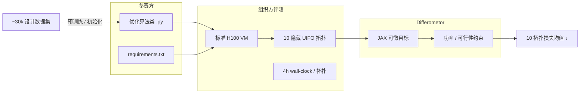
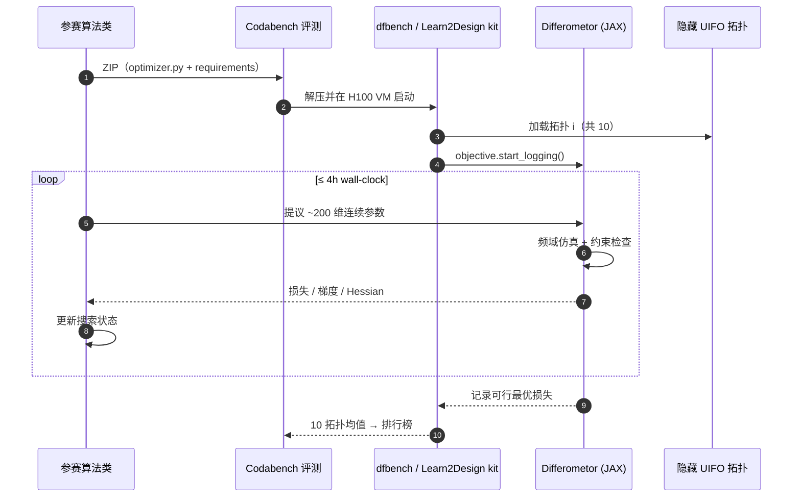

# Designing physics experiments with artificial intelligence

**Designing physics experiments with artificial intelligence**（Klimesch 等，*Nature* 2026 **Review**，DOI [10.1038/s41586-026-10898-6](https://doi.org/10.1038/s41586-026-10898-6)）综述 AI 如何从「调少数实验参数」走向 **提出全新仪器布局**。全文把实验设计统一为在巨大 **硬件配置空间** 上、受实验可行性与科学目标约束的 **寻优问题**，并以四条主线组织文献与实践：**（1）表达性搜索空间工程；（2）快速可靠仿真器；（3）科学目标→可计算目标函数；（4）能同时探索离散与连续设计选择的 AI 方法**。当代落地标杆之一是 **Learn2Design-2026**（[NeurIPS 2026 Challenge](https://www.learn2design2026.com/)）：参赛方提交 **优化算法**，组织方在隐藏 **UIFO** 拓扑上用 **Differometor**（JAX 可微干涉仪仿真）在 **4h** 预算内评测 **~200** 维连续设计变量。

## 一句话定义

**把「做实验」从人类专家的工艺直觉，升级为可搜索、可仿真、可竞赛的高维硬件寻优问题；AI 的价值在于同时处理离散拓扑与连续光机参数，并在可微仿真器上把科学灵敏度目标编译成可优化损失。**

## 英文缩写速查

| 缩写 | 英文全称 | 简要说明 |
|------|----------|----------|
| AI | Artificial Intelligence | 本文语境含贝叶斯优化、进化、RL、生成模型等探索方法 |
| UIFO | Quasi-Universal Interferometer (search space) | Learn2Design 采用的准通用干涉仪参数化搜索空间 |
| GW | Gravitational Wave | 引力波；竞赛任务为探测器灵敏度优化 |
| JAX | JAX (Google) | Python 可微数值栈；Differometor 实现基础 |
| BO | Bayesian Optimization | 高维昂贵黑盒优化的常见外层方法之一 |
| RL | Reinforcement Learning | 将设计步进建模为序贯决策时的探索范式 |
| SPRIND | Federal Agency for Disruptive Innovation | 德国联邦颠覆性创新署；赞助 Learn2Design 奖金 |
| HPC | High Performance Computing | EuroHPC 360k GPU·h 用于生成 30k 设计数据集 |

## 为什么重要

- **范式升级：** Review 明确划出从 **参数微调** 到 **de novo 布局发现** 的尺度；发现的配置常 **违背既有惯例** 却达到或超越人类设计 — 与机器人里「形态–控制共设计」共享 **搜索空间工程** 问题结构。
- **四问框架可迁移：** 搜索空间、仿真器、目标函数、探索算法四件套可直接对照 [可微仿真](../concepts/differentiable-simulation.md)、[强化学习](../methods/reinforcement-learning.md) 与 [HydroGym](./paper-hydrogym.md) 等 **物理域 benchmark** 文化。
- **可微仿真成为瓶颈突破：** **Differometor** 把干涉仪优化从 Finesse+数值微分推到 JAX 自微分，官方宣称 GPU 上可达 **~160×** 加速 — 使 **4h 内 200 维** 外层搜索在竞赛中可重复。
- **算法提交而非设计提交：** Learn2Design 强制 **方法可复用**（隐藏拓扑评测），与「刷榜单一光机图」的静态设计竞赛不同，更接近 ML benchmark 的 **泛化** 要求。

## 核心原理：Review 四问 × Learn2Design 落地

| 主线 | Review 问什么 | Learn2Design-2026 怎么实例化 |
|------|---------------|-------------------------------|
| **1. 搜索空间** | 如何把真实仪器参数化且保持物理可行？ | **UIFO**：~**200** 连续自由度（激光功率、镜面反射率、网格间距等）；准通用干涉仪拓扑 |
| **2. 仿真器** | 多快、多可靠？能否支撑外层循环？ | **Differometor**（JAX，对齐 Finesse）：频域干涉仪、量子噪声、光机效应；PyPI `differometor` |
| **3. 目标函数** | 科学灵敏度如何变成可优化标量？ | 纯 JAX 损失 + 功率/可行性约束；不可行运行回退随机搜索基线 |
| **4. 探索方法** | 离散+连续混合动作如何搜索？ | 参赛 **Python 优化类**（梯度、进化、学习、混合）；**4h/拓扑** wall-clock 预算 |

## 流程总览（竞赛评测闭环）

## Learn2Design-2026 案例要点

| 项 | 内容 |
|----|------|
| **赛事** | NeurIPS 2026 Challenge；门户 [submit.learn2design2026.com](https://submit.learn2design2026.com/competitions/4/) |
| **提交物** | ZIP：单个优化类 + 依赖；**非**固定探测器蓝图 |
| **评分** | 10 隐藏拓扑各自 **可行最优损失** 的算术平均（越低越好） |
| **数据** | ~**30,000** 高质量设计（EuroHPC **360,000 GPU·h**）；Round 1 公开 43 队全量统计 |
| **奖金** | **EUR 25,000**（SPRIND）；决赛提交截止 **2026-10-15** |
| **机构** | 图宾根大学 / Feyer / ELIZA / 耶拿 / Nikhef / **Caltech**（Adhikari）等 |

## 源码运行时序图

典型复现路径：`pip install differometor` → 克隆 [Learn2Design-2026](https://github.com/artificial-scientist-lab/Learn2Design-2026) starter kit → 本地按 `docs/submission.md` 实现 `Optimizer` 接口 → 用 `competition_data/round1/` 对照 Round 1 统计。

## 工程实践

| 步骤 | 建议 |
|------|------|
| **1. 读 Review 四问** | 先判断你的仪器问题是「调参」还是「de novo」；后者必须投资搜索空间与仿真器 |
| **2. 装 Differometor** | CPU：`pip install differometor`；竞赛级吞吐：`jax[cuda13]` GPU |
| **3. 用公开数据** | `GraviTune-Dataset` + 竞赛仓 30k 设计做 warm start / 表示学习 |
| **4. 对齐评测协议** | 严格遵守 **4h** 计时起点与 **可行性约束**；不可行解会被基线替代 |
| **5. 方法报告** | 决赛需 2–4 页技术报告方可领奖；可参与联合竞赛综述论文 |

## 局限与风险

- **域特异性：** 本文 **非** 腿足/操作机器人 benchmark；与 [Gymnasium](./gymnasium.md) 的关系是 **「昂贵仿真 + 外层优化」** 方法论同构，而非任务域重叠。
- **隐藏评测：** 公开榜与最终榜拓扑不同；过拟合公开 UIFO 实例的风险与 ML 竞赛相同。
- **仿真–现实缝隙：** Differometor 对齐 Finesse，但真机装配、损耗与控制系统未完全进入 4h 目标 — 获奖设计仍需实验物理学家审查。
- **利益冲突（Nature 披露）：** 部分作者创立 **Feyer GmbH** 并获 SPRIND 资助（稿件提交后）；读竞赛结果时需区分学术 Review 与商业孵化时间线。
- **资格限制：** 奖金受 NeurIPS / SPRIND 制裁与地域条款约束（见竞赛 README）。

## 开源状态（项目页核查）

| 资源 | 状态 |
|------|------|
| `github.com/artificial-scientist-lab/Learn2Design-2026` | **已开源**（MIT；含 Round 1 数据） |
| `github.com/artificial-scientist-lab/Differometor` | **已开源**（MIT + PyPI） |
| `github.com/artificial-scientist-lab/Differometor-Benchmark` | **已开源**（`dfbench`） |
| `github.com/artificial-scientist-lab/GraviTune-Dataset` | **已开源**（设计数据集） |
| `learn2design2026.com` | 官方竞赛站 + 链到上述资源 |
| Nature Review PDF | 订阅/机构访问；摘要与引用见 Nature 页 |

## 结论

**Nature Review 把 AI 实验设计从「黑盒调参」升格为可讲授的四层栈（空间–仿真–目标–探索）；Learn2Design-2026 用可微干涉仪仿真与隐藏拓扑算法赛证明这套栈在引力波领域已可运营化。**

- 框架层：四问适用于量子光学、显微术、粒子物理等多域；机器人读者应重点看 **搜索空间参数化** 与 **可微仿真加速** 如何改变外层优化预算。
- 案例层：~**200** 连续维 + **4h** 硬预算 + **算法提交** 使竞赛测的是 **泛化探索能力**，不是单次手工光机图。
- 工具层：**Differometor** MIT 开源 + PyPI，降低复现门槛；30k 设计与 Round 1 全量日志支持监督/初始化研究。
- 对比层：与 [HydroGym](./paper-hydrogym.md) 同属 **Nature 级物理 benchmark**，但 HydroGym 走 Gymnasium RL 环，Learn2Design 走 **昂贵仿真 + 黑盒/梯度外层优化** — 不宜横比减阻%与探测器损失。
- 部署层：获奖算法仍需经实验物理学家与工程约束审查；仿真器速度提升 **不** 自动等于可建造成品。

## 关联页面

- [Differentiable Simulation（可微仿真）](../concepts/differentiable-simulation.md) — Differometor 与机器人可微刚体仿真的共性与差异
- [Reinforcement Learning](../methods/reinforcement-learning.md) — 序贯设计决策的一种探索范式
- [HydroGym](./paper-hydrogym.md) — 另一 Nature 2026 物理域 RL 基准，可对照「平台化 benchmark」叙事
- [Gymnasium](./gymnasium.md) — RL 环境 API；Learn2Design 非 Gym 环境，但共享基准文化
- [Query：具身大模型评测基准选型闭环](../queries/embodied-eval-benchmark-selection-loop.md) — 本文案例属 **科学仪器设计** 基准，与具身 VLA 基准正交但可借鉴「隐藏测试集 + 算法提交」协议

## 参考来源

- [Designing physics experiments with AI — Nature 2026 论文摘录](../../sources/papers/designing_physics_experiments_with_ai_nature_s41586_026_10898_6.md)
- [Learn2Design-2026 竞赛站归档](../../sources/sites/learn2design_2026.md)
- [Learn2Design-2026 竞赛仓库归档](../../sources/repos/artificial_scientist_lab_learn2design_2026.md)
- [Differometor 仓库归档](../../sources/repos/artificial_scientist_lab_differometor.md)

## 推荐继续阅读

- Nature Review：<https://www.nature.com/articles/s41586-026-10898-6>
- 竞赛站：<https://www.learn2design2026.com/>
- 官方竞赛仓：<https://github.com/artificial-scientist-lab/Learn2Design-2026>
- Differometor：<https://github.com/artificial-scientist-lab/Differometor>
- Artificial Scientist Lab 组织：<https://github.com/artificial-scientist-lab>
