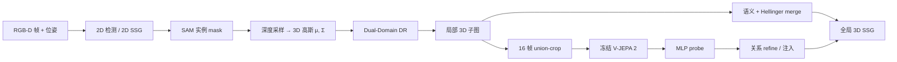

# DeWorldSG（深度感知 3D 语义场景图 · 世界模型先验）

**DeWorldSG**（*Depth-Aware 3D Semantic Scene Graph Generation via World-Model Priors*，[arXiv:2607.00889](https://arxiv.org/abs/2607.00889)，ECCV 2026，Seok-Young Kim / Abdelrahman Elskhawy / Taewook Ha 等 · **韩国科学技术院（KAIST）** / **慕尼黑工业大学（TU Munich）** / **慕尼黑机器学习中心（MCML）**；[项目页](https://deworldsg2026.github.io/)）从 RGB-D 序列 **增量** 构建时空一致的 **3D 语义场景图（3D SSG）**：物体侧用 **深度感知 3D 高斯分布** 替代单点投影，关系侧用跨帧证据聚合并注入 **V-JEPA 2** 世界模型先验，缓解逐帧推理的几何不稳与关系稀疏。

## 一句话定义

**把每实例建成 mask 引导的 3D 高斯节点、用 Dual-Domain Depth Refinement 稳住 merge，再用 V-JEPA 2 时序先验 refine 不确定关系边，从 RGB-D 流在线产出 3D 语义场景图。**

## 英文缩写速查

| 缩写 | 英文全称 | 简要说明 |
|------|----------|----------|
| 3D SSG | 3D Semantic Scene Graph | 3D 物体节点 + 有向语义/空间关系边的结构化场景抽象 |
| DR | Dual-Domain Depth Refinement | 空间域与深度域联合深度去噪，抑制 flying pixels |
| SSG | Semantic Scene Graph | 2D/3D 语义场景图；本文从 2D 检测 lifting 到 3D |
| WM | World Model | 本文特指冻结 **V-JEPA 2** 提供的时序关系先验 |
| SAM | Segment Anything Model | 实例 mask 分割，支撑深度采样与高斯估计 |
| SLAM | Simultaneous Localization and Mapping | 本文用 ORB-SLAM3 位姿做鲁棒性实验 |

## 为什么重要

- **几何 lifting 不必绑死稠密重建：** 相对 [3DSSG](https://arxiv.org/abs/2003.13348) / MonoSSG 等 **点云/SLAM 重建优先** 路线，DeWorldSG 只用 depth-guided lifting + 增量 merge 即在 3DSSG 上超过点云基线 Rel. Recall。
- **关系不能只看单帧：** 逐帧 2D SSG → 3D 投影常漏边；跨帧聚合 + WM 先验把 **时序证据** 写进 predicate，Tab. 3 显示 V-JEPA 2 优于 DINOv2 静态 probe。
- **面向在线 embodied 栈：** ReplicaSSG 上 **108.53 ms/帧** 平均延迟；ORB-SLAM3 位姿下仍保留 GT 的 **89.2%** Obj. R / **87.6%** Rel. R — 比离线真值位姿假设更接近 AR/机器人部署。
- **与站内 WM 主线交叉：** 不是生成像素未来，而是把 [V-JEPA 2](./paper-vjepa2.md) 当 **关系证据收集器** — 属于 [上下文主导型世界代理](../overview/embodied-wm-route-context.md) 读法下的结构化地图维护。

## 核心信息

| 项 | 内容 |
|----|------|
| **机构** | 韩国科学技术院（KAIST）；慕尼黑工业大学（TU Munich）；慕尼黑机器学习中心（MCML） |
| **作者** | Seok-Young Kim、Abdelrahman Elskhawy、Taewook Ha、Dooyoung Kim、Eunjae Shin、Benjamin Busam†、Woontuck Woo† |
| **输入** | RGB-D 序列 \(\{(I_t, D_t)\}_{t=1}^T\) + 相机内参 \(K\) + 位姿 \(T_t\) |
| **输出** | 3D SSG \(G=(V,E)\)：节点 \((c_i, \mu_i^{3D}, \Sigma_i^{3D})\)，边 \(r_{i\to j}\) |
| **骨干** | 2D 检测/SSG → SAM mask → Dual-Domain DR → 3D 高斯；关系：16 帧 union-crop + 冻结 V-JEPA 2 + MLP probe |
| **训练硬件** | 单卡 NVIDIA RTX A6000 48 GB |
| **开源（截至 2026-09-11）** | arXiv 写 *open-sourced*；[项目页](https://deworldsg2026.github.io/) Code 按钮 **Coming Soon**；GitHub 仅 [`deworldsg2026.github.io`](https://github.com/deworldsg2026/deworldsg2026.github.io) — **待发布** |

## 核心原理（方法）

### 概率 3D 节点与 Dual-Domain Depth Refinement

每检测实例在 SAM mask 内对深度采样，估计 **3D 高斯** \((\mu_i^{3D}, \Sigma_i^{3D})\) 而非单点投影 — 显式编码空间不确定性。Dual-Domain DR 在空间域与深度域联合滤波 flying pixels / 传感器噪声（论文 Eq. 1–2，\(\tau=0.05, \epsilon=10^{-3}\) 等），再供全局 merge 使用 Hellinger 阈值 \(\delta_g=0.7\)、类距离 \(\delta_c=0.8\)。

### 增量全局 merge

逐帧局部 3D 子图按 **语义一致性 + 高斯相似度** 合并进全局 \(G\)。相对单帧 lifting，增量策略减轻同一物体重复实例化与错误连边（定性对比 prior SoTA FROSS）。

### V-JEPA 2 关系 refine

对熵高于阈值的不确定边，抽取 **16 帧 union-crop clip**，经 **冻结 V-JEPA 2** 编码 → mean-pool → 两层 MLP probe 得 \(p_{\mathrm{WM}}(r_{i\to j})\)，与几何/时序累积证据融合（\(\alpha_{ij}=0.5\)，熵阈值 1.0）。Ablation (d) vs (e)：DINOv2 静态 probe Pred. 56.6 → V-JEPA 2 **57.3**，Relation 49.5 → **50.2**。

### 流程总览

## 源码运行时序图

**不适用**（截至 2026-09-11）：项目页 Code 为 **Coming Soon**，GitHub 仅见静态站 [`deworldsg2026/deworldsg2026.github.io`](https://github.com/deworldsg2026/deworldsg2026.github.io)，无官方训练/推理入口可对齐 sequenceDiagram。代码发布后应补：RGB-D IO → 2D SSG → SAM/DR → merge → V-JEPA probe → 全局图导出。

## 工程实践

| 模块 | 要点 |
|------|------|
| **物体过滤** | 置信度阈值 0.7；每帧保留 top-10 关系（对齐 FROSS 协议） |
| **DR 超参** | \(\gamma_{\text{base}}=0.03, \alpha=10, \beta=0.02\) |
| **位姿** | 训练/评测可用 GT pose；部署实验用 ORB-SLAM3 估计 |
| **延迟预算** | SAM **25.26 ms** + 关系 refine **69.39 ms** 占大头；全管线 **~109 ms/帧** |
| **下游接口** | 输出结构化 \(G\) 可接 [SayPlan](./paper-sayplan-llm-scene-graph-planning.md) 式符号规划或 [Functional-SLAM](./paper-functional-slam.md) 式在线地图 — 需自行接 ROS/策略栈 |

## 评测与指标

**数据集：** [3DSSG](https://arxiv.org/abs/2003.13348)（1,482 scans / 478 室内）；[ReplicaSSG](https://arxiv.org/abs/2303.07932)（7 val / 11 test scenes，Visual Genome 类系）。

**3DSSG（Tab. 1，Recall %）**

| 方法 | Rel. | Obj. | Pred. | mRecall Obj. | mRecall Pred. |
|------|------|------|-------|--------------|---------------|
| FROSS (prior SoTA) | 27.9 | 62.4 | 33.0 | 63.8 | 18.0 |
| **DeWorldSG** | **50.2** | **75.0** | **57.3** | **70.6** | **36.0** |

相对 FROSS：**Relation +77.4%**、**Object +20.2%**、**Predicate +23.2%**（论文口径）。

**ReplicaSSG（Tab. 2，GT pose）**

| 方法 | Rel. | Obj. | Pred. |
|------|------|------|-------|
| FROSS | 22.3 | 26.1 | 27.8 |
| **DeWorldSG** | **38.2** | **35.4** | **45.3** |

**位姿鲁棒性：** ORB-SLAM3 位姿下 Obj. R **33.8**（GT 35.4 的 89.2%）、Rel. R **37.4**（GT 38.2 的 87.6%）。

**Ablation（3DSSG，Tab. 3 摘要）：** 2D lifting 基线 Rel. 28.5 → +mask 40.3 → +DR 47.8 → +V-JEPA WM **50.2**；逐步单调增益。

## 与其他工作对比

| 对比轴 | DeWorldSG | [FROSS](https://arxiv.org/abs/2303.07932) (prior SoTA) | [vS-Graphs](./paper-vs-graphs-visual-slam-scene-graph.md) | [Functional-SLAM](./paper-functional-slam.md) | [EgoSG](./paper-sa-ego-239-egosg-learning-3d-scene-graphs-from-egocentric-r.md) |
|--------|-----------|----------------------------------------------------------|-----------------------------------------------------------|-----------------------------------------------|--------------------------------------------------------------------------------|
| **输入** | RGB-D 序列 + 位姿 | RGB-D lifting | RGB-D SLAM | RGB 流 + MASt3R-SLAM | 第一人称 RGB-D |
| **几何** | 3D 高斯节点 + DR | 2D→3D 投影 | 墙/房间/楼层布局 | 稠密几何 + 功能 O/U | 索引级 3D SSG |
| **关系** | 跨帧聚合 + **V-JEPA 2** | 逐帧/稀疏 | 布局拓扑 | 功能边 + 拓扑回环 | 清单 Highlights |
| **在线** | ~109 ms/帧 incremental | 离线/序列 | SLAM 在线 | SLAM 在线 | CVPR 2024 |
| **开源** | **待发布** | 有代码 | 有代码 | **已开源** | 见项目页 |

## 局限与风险

- **开源未落地：** 论文/arXiv 宣称 open-sourced，但项目页 **Coming Soon** — 复现前以页上链接为准，勿按已开源选型。
- **算力与模块依赖：** SAM + V-JEPA 2 refine 占 **~87 ms/帧**；边缘设备需裁剪或蒸馏。
- **室内 RGB-D 偏置：** 评测集中在 3DSSG/ReplicaSSG 室内扫描；室外、纯 RGB、动态场景未覆盖。
- **关系类不平衡：** mRecall Pred. 36.0 仍低于 head-class Recall — 长尾 predicate 部署需额外校准。
- **与 SLAM 图分工：** 不做相机跟踪/回环，位姿来自外部（GT 或 ORB-SLAM3）；与 [vS-Graphs](./paper-vs-graphs-visual-slam-scene-graph.md) / [Functional-SLAM](./paper-functional-slam.md) 互补而非替代。

## 结论

**DeWorldSG 把「深度稳几何 + 世界模型补关系」落到可增量更新的 3D SSG，在 3DSSG/ReplicaSSG 上显著超过 FROSS，但截至入库日代码仍未发布。**

- **优先借鉴：** mask 引导 3D 高斯节点 + Dual-Domain DR + 跨帧关系聚合 — 比单点 lifting 更抗 depth 噪声。
- **WM 用法：** 冻结 V-JEPA 2 作 **关系 probe**，不是像素 rollout；与 [V-JEPA 2](./paper-vjepa2.md) 规划/AC 用法不同。
- **部署读法：** ~109 ms/帧 适合 **交互式 AR / 慢速 manip 感知**；SAM+WM refine 是瓶颈，需 profiling。
- **复现门槛：** 等官方 repo/权重；当前仅可引用论文指标与项目页 demo。
- **栈内位置：** 见 [导航与 SLAM 自主栈](../overview/navigation-slam-autonomy-stack.md) 场景图分支，与 SLAM 几何图、SayPlan 符号规划串联。

## 关联页面

- 世界模型先验：[V-JEPA 2](./paper-vjepa2.md)
- 3D 场景图 SLAM：[vS-Graphs](./paper-vs-graphs-visual-slam-scene-graph.md)、[Functional-SLAM](./paper-functional-slam.md)
- 第一人称 3D SSG：[EgoSG](./paper-sa-ego-239-egosg-learning-3d-scene-graphs-from-egocentric-r.md)
- 符号规划消费场景图：[SayPlan](./paper-sayplan-llm-scene-graph-planning.md)
- 栈位：[导航与 SLAM 自主栈](../overview/navigation-slam-autonomy-stack.md)

## 参考来源

- [`sources/papers/deworldsg_arxiv_2607_00889.md`](../../sources/papers/deworldsg_arxiv_2607_00889.md) — 论文摘录与开源核查
- [`sources/sites/deworldsg-website.md`](../../sources/sites/deworldsg-website.md) — 项目页归档
- 论文：<https://arxiv.org/abs/2607.00889>
- 项目页：<https://deworldsg2026.github.io/>

## 推荐继续阅读

- [DeWorldSG 项目页（demo 视频）](https://deworldsg2026.github.io/)
- [V-JEPA 2 实体页](./paper-vjepa2.md) — 被引用的预训练世界模型
- [Functional-SLAM](./paper-functional-slam.md) — 在线功能 3D 场景图 SLAM（已开源对照）
