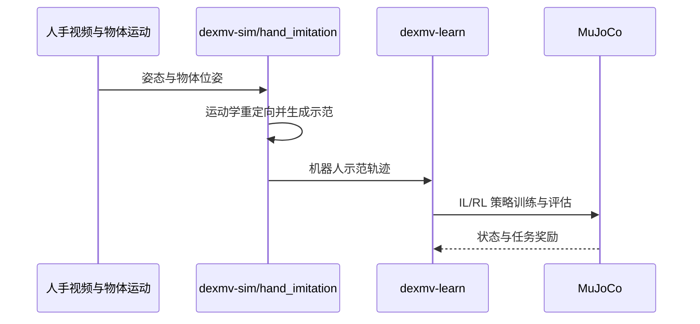

# DexMV：Imitation Learning for Dexterous Manipulation from Human Videos

## 一句话定义

**DexMV** 将人手操作视频转成机器人灵巧手示范，让操作策略先学会有意义的抓取与操作过程，再用任务奖励改进。

## 英文缩写速查

| 缩写 | 英文全称 | 简要说明 |
|------|----------|----------|
| DexMV | Dexterous Manipulation from Videos | 视频到灵巧手示范的平台与管线 |
| IL | Imitation Learning | 借助演示引导策略训练 |
| RL | Reinforcement Learning | 在任务奖励下完善操作动作 |
| DAPG | Demonstration Augmented Policy Gradient | 文中结合演示的策略优化方法 |

## 为什么重要

灵巧手单靠稀疏奖励很难探索到“靠近—抓稳—操作—松开”的完整轨迹。视频提供动作顺序，但必须先对齐手与物体，再适配机器人手的关节范围。

## 方法

视频中估计三维人手和物体位姿，转换手掌方向、指尖等目标为机器人手示范；在仿真中先用演示引导策略，再以任务反馈训练。关键是保留**手相对物体**的关系，不能只模仿孤立手形。

## 实验与评测

论文展示倒水、放入容器、物体重定位等 MuJoCo 灵巧手任务；项目页将 DAPG 管线与无演示 RL 比较。视频用于**离线造示范**，运行中的策略读仿真状态，不是直接读视频的真机策略。

## 与其他工作对比

相较 [运动重定向](../concepts/motion-retargeting.md) 中关注全身骨架的工作，DexMV 重点是**手—物交互**及下游灵巧手学习。

## 结论

**可复用的是先从视频提取物体相关操作示范，再用策略学习补足动力学，而非宣称视频姿态本身就可直接驱动真机。**

1. 视频估计误差要在手—物共同坐标系检查。
2. 关节活动范围和时间连续性决定示范能否训练。
3. 仿真任务提升不能等同于真机泛化。

## 工程实践

复现先检查物体六自由度轨迹、指尖接近和接触时刻，再比较纯 RL 与演示增强训练。[官方仿真仓](https://github.com/yzqin/dexmv-sim) 提供重定向与环境，[学习仓](https://github.com/yzqin/dexmv-learn) 提供训练和推理；MuJoCo、数据、模型许可需要另行满足。

## 局限与风险

视觉恢复依赖可见性与相机标定，手指遮挡及物体接触估计误差会传到示范；论文未报告实体灵巧手结果。

## 源码运行时序图

这对应两仓 README 的模块职责；具体命令和数据路径见[代码归档](../../sources/repos/dexmv-sim.md)。

## 关联页面

- [运动重定向](../concepts/motion-retargeting.md)
- [操作任务](../tasks/manipulation.md)

## 参考来源

- [Day 1 文章逐篇索引](../../sources/blogs/humanoid_motion_intelligence_day1_data_retargeting_2026_10_02.md)
- [官方两仓与运行入口](../../sources/repos/dexmv-sim.md)
- [项目页开放状态](../../sources/sites/dexmv-project.md)
- [官方项目页](https://yzqin.github.io/dexmv/)
- [论文](https://arxiv.org/abs/2108.05877)

## 推荐继续阅读

- [DexMV 官方项目页与代码入口](https://yzqin.github.io/dexmv/)
