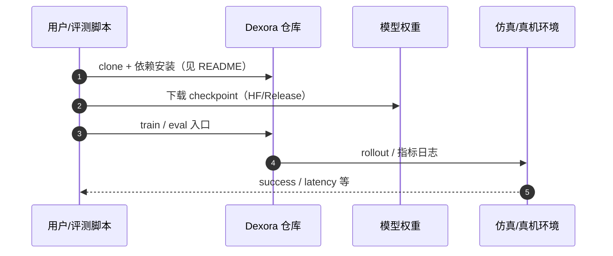

# Dexora（arXiv:2605.18722）

**Dexora**（*Dexora: Open-source VLA for High-DoF Bimanual Dexterity*，[arXiv:2605.18722](https://arxiv.org/abs/2605.18722)，[项目页](https://dexoravla.github.io/)，[代码](https://github.com/dexoravla/Dexora)）来自 [机器人研发工程师 · 前沿算法盘点](../../sources/blogs/wechat_robot_engineer_embodied_frontier_algorithms_2026-09-23.md)。

## 一句话定义

**首个开源 36-DoF 双臂双手端到端 VLA：外骨骼臂 + Vision Pro 指跟踪遥操作；判别器加权 Diffusion Transformer；灵巧任务 66.7% vs 51.7%。**

## 英文缩写速查

| 缩写 | 英文全称 | 简要说明 |
|------|----------|----------|
| Dexora | Dexora VLA | 本文 36-DoF 双手 VLA |
| VLA | Vision-Language-Action | 视觉–语言–动作策略 |
| DoF | Degrees of Freedom | 自由度 |
| DiT | Diffusion Transformer | 扩散 Transformer 策略头 |

## 为什么重要

- 高 DoF 双手操纵缺可复现端到端 VLA；低维夹爪方案无法覆盖拧瓶盖/叠衣。
- 开源结论：**已开源**（步骤 2.5，2026-09-23）。
- 与 [具身前沿算法技术地图](../overview/embodied-frontier-algorithms-technology-map.md) 同路线条目可横向对照。

## 核心机制

| 项 | 内容 |
|----|------|
| **arXiv** | [2605.18722](https://arxiv.org/abs/2605.18722) |
| **开源** | **已开源** |
| **要点** | 混合遥操作 + MuJoCo 数字孪生；100K sim + 10K+ 真机轨迹；clip 级质量判别降权噪声示范。 |
| **文内指标** | 基础任务 90% 成功；灵巧平均 66.7%（作者报告）；ICRA 2026。 |

## 源码运行时序图

图下说明：复现以 [`sources/repos/dexora.md`](../../sources/repos/dexora.md) 与官方 README 为准。

## 实验与评测

- 基础任务 90% 成功；灵巧平均 66.7%（作者报告）；ICRA 2026。
- **读法：** 索引级摘要；逐项 baseline 以原文 PDF 为准。

## 与其他工作对比

| 维度 | Dexora（本文） | [RDT-1B](./paper-rdt-1b.md) | [GraspVLA](./cn-os-graspvla.md) |
|------|----------------|------------------------------|----------------------------------|
| 本体自由度 | **36-DoF 双臂双手**（高 DoF 灵巧） | 双臂，末端以夹爪为主 | 以抓取为中心的单/双臂 |
| 数据来源 | 外骨骼臂 + Vision Pro 指跟踪遥操作；100K sim + 10K+ 真机 | 大规模多本体预训练 + 微调 | 大规模抓取合成/真机数据 |
| 动作头 | 判别器加权 **Diffusion Transformer**（按 clip 质量降权噪声示范） | Diffusion Transformer | 抓取位姿 + 动作输出 |
| 主打问题 | 高 DoF 手指动作的 **数据质量** 与可学性 | 跨本体泛化 | 开放词汇抓取泛化 |

- **横比前先对齐本体：** 本页 **灵巧任务平均 66.7%（作者报告）** 是在 36-DoF 双手本体上测的；与夹爪 VLA 的成功率不同口径，**不可直接比大小**。
- **本文的增量在数据侧：** 判别器按 clip 质量加权，针对的是遥操作指部数据 **噪声大于夹爪数据** 这一事实，而不是新的策略结构——复现时这一步比换动作头更影响结果。
- **逐项 baseline：** 本页属索引级摘要，各对照组数值 **以 [原文 PDF](https://arxiv.org/abs/2605.18722) 为准**。

## 结论

**Dexora 把高 DoF 双手 VLA 拉到可开源复现；部署前核对 LeRobot v2.1 数据 schema 与硬件栈。**

1. 开源边界：**已开源** — 以项目页/仓库实际链接为准（入库日 2026-09-23）。
2. 核心机制：混合遥操作 + MuJoCo 数字孪生；100K sim + 10K+ 真机轨迹；clip 级质量判别降权噪声示范。…
3. 部署前核对硬件栈与评测协议，勿直接横比公众号摘录数字。

## 关联页面

- [vla](../methods/vla.md)
- [manipulation](../tasks/manipulation.md)
- [paper-rdt-1b](./paper-rdt-1b.md)
- [cn-os-graspvla](./cn-os-graspvla.md)

## 参考来源

- [dexora_arxiv_2605_18722.md](../../sources/papers/dexora_arxiv_2605_18722.md)
- [wechat_robot_engineer_embodied_frontier_algorithms_2026-09-23.md](../../sources/blogs/wechat_robot_engineer_embodied_frontier_algorithms_2026-09-23.md)
- [arXiv:2605.18722](https://arxiv.org/abs/2605.18722)

## 推荐继续阅读

- [arXiv PDF](https://arxiv.org/pdf/2605.18722)
- [项目页](https://dexoravla.github.io/)
- [代码](https://github.com/dexoravla/Dexora)

