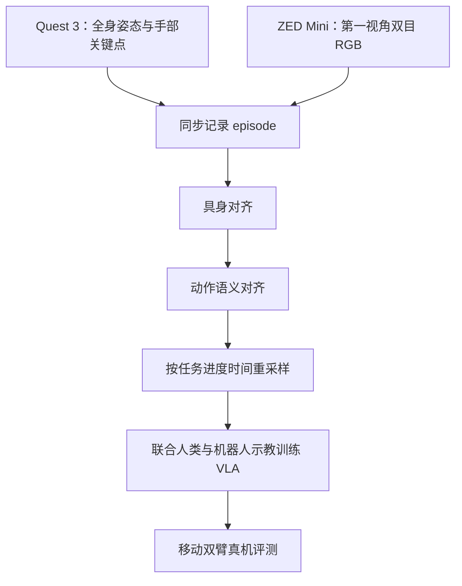
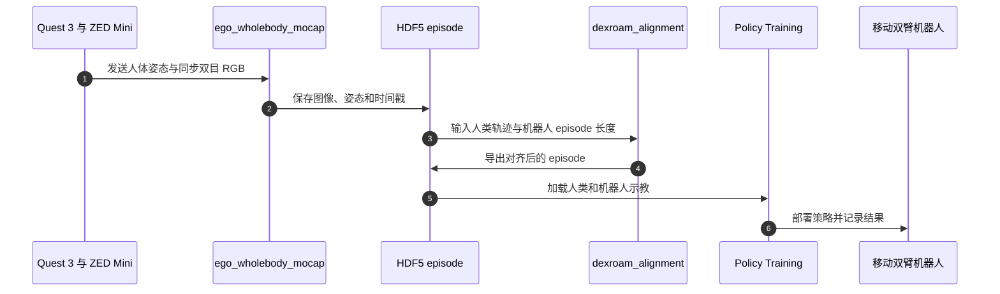

# DexRoam：从第一视角全身示教学习移动双臂灵巧操作

## 一句话定义

DexRoam 将无需外部追踪器的人类全身示教映射到机器人动作空间，再与机器人示教联合学习移动双臂灵巧操作策略。

## 英文缩写速查

| 缩写 | 英文全称 | 简要说明 |
|------|----------|----------|
| VLA | Vision-Language-Action | 视觉与语言条件下生成机器人动作的策略 |
| MoCap | Motion Capture | 记录人体姿态与动作的过程 |
| RGB | Red-Green-Blue | 头戴双目相机提供的彩色视频 |
| HDF5 | Hierarchical Data Format 5 | 组织采集 episode 的数据容器 |
| MMD | Maximum Mean Discrepancy | 比较对齐前后动作分布的指标 |
| SWD | Sliced Wasserstein Distance | 衡量动作分布差异的指标 |

## 为什么重要

移动双臂灵巧操作要求底盘、躯干、视线与手指在同一段动作中协同。DexRoam 让示教者自然完成任务，再将全身轨迹对齐到机器人，而非先将动作简化为静态双臂轨迹。它降低了完全依赖真机遥操作数据的门槛，但论文仍联合使用机器人示教，人类数据不是替代品。

## 核心方法栈

### 1. 第一视角采集

Meta Quest 3 获取头部位姿、33 个身体关节及每只手 25 个手部关键点；头戴 ZED Mini 同步采集双目 RGB。系统无需外置相机阵列、环境标记或穿戴式动作捕捉器。

### 2. 三阶段人机对齐

- **具身对齐：** 将人类全身轨迹映射为机器人的底盘、躯干、手腕、头部和手部目标。
- **动作语义对齐：** 将绝对目标改写为相对机器人当前状态的动作。
- **时间对齐：** 按任务进度重采样轨迹，以匹配机器人示教的执行尺度；它不等于改变控制频率或动作块长度。

### 流程总览

## 源码运行时序图

官方公开两个代码仓，分别覆盖采集 / 对齐和策略训练。公开数据子集不能代表论文完整训练语料。

## 实验与评测

论文报告五项真实机器人任务：Pick Chips Can、Pour Water、Throw Trash、Deliver Fruit、Push Chair & Close Laptop。每项任务 20 次真机试验：

| Backbone | 仅机器人示教 | 加入对齐人类示教 |
|---|---:|---:|
| GR00T N1.7 | 29% | 56% |
| π0.5 | 32% | 57% |

项目页的 Pick Chips Can 示例显示，动作分布 MMD 从 0.598 降至 0.313，SWD 从 0.926 降至 0.563。消融结果显示，省略动作语义或时间对齐都会降低性能。

公开 HF 示例含 50 条 Astribot + 双 XHand 的“推椅并合上笔记本” episode，约 30 Hz。数据卡将其定位为管线集成示例，不能用来独立复算论文结果。

## 与其他工作对比

| 路线 | 数据来源 | 优势 | 代价 |
|---|---|---|---|
| 直接机器人遥操作 | 操作员控制真实或镜像机器人 | 动作天然可执行 | 采集设备和人工时间成本高 |
| 视频模仿 | 第一或第三视角 RGB | 数据易扩展 | 缺少机器人动作对应监督 |
| DexRoam | VR 全身姿态 + 头戴双目 RGB + 三阶段对齐 | 保留全身耦合，可与机器人示教联合训练 | 仍需机器人示教，并依赖专用硬件与重定向配置 |

## 结论

**一句话总判：DexRoam 把全身人类示教转成机器人可用的动作监督；提升来自示教数据与三阶段对齐整体，而非单纯加视频。**

1. 采集与动作对齐需要一起设计，RGB 提供观察信息，姿态和手部关键点提供动作结构。
2. 三阶段分别处理身体、控制语义和执行进度差异。
3. 论文实验仍使用机器人示教，不能解读成零机器人数据训练。
4. 公开的 50 条 HF episode 是单任务管线示例，不是完整数据集。
5. 迁移新机器人时，应验证坐标系、动作接口、可达性与时间尺度。

## 局限与风险

- 结果依赖 Quest 3、ZED Mini、Astribot 与 XHand 等硬件组合，换平台需重新验证映射。
- 公开数据规模有限，不能独立复现论文总体结果或完整数据效率曲线。
- 姿态误差、相机同步和末端可达性会影响重定向质量。
- 缺少力 / 触觉反馈会限制抓取稳定性。

## 关联页面

- [双臂操作](../tasks/bimanual-manipulation.md)
- [移动操作](../tasks/loco-manipulation.md)
- [全身追踪与动作重定向流程](../concepts/whole-body-tracking-pipeline.md)
- [模仿学习](../methods/imitation-learning.md)

## 参考来源

- [DexRoam 论文摘录](../../sources/papers/dexroam_arxiv_2609_35761.md)
- [DexRoam 项目页与开源状态](../../sources/sites/dexroam-github-io.md)
- [人体采集与对齐代码](../../sources/repos/zhourui9813-dexroam.md)
- [策略训练代码](../../sources/repos/zhourui9813-dexroam-policy-training.md)
- [DexRoam 示例数据集](https://huggingface.co/datasets/zhourui9813/DexRoam_Realworld_Data)

## 推荐继续阅读

- [DexRoam 项目页](https://dexroam.github.io/)
- [论文 arXiv:2609.35761](https://arxiv.org/abs/2609.35761)
- [Human-to-Robot Alignment 代码](https://github.com/zhourui9813/DexRoam)
