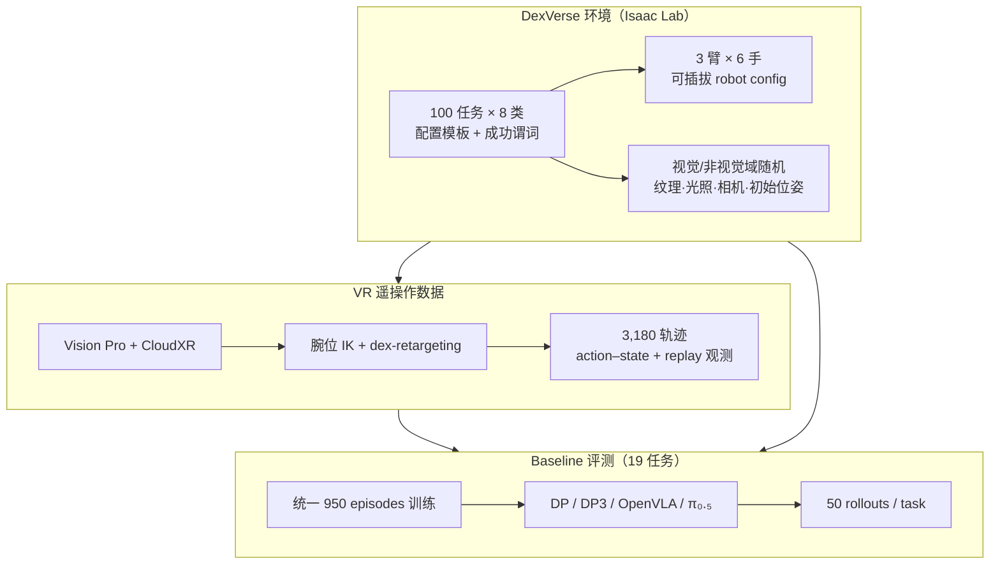

# DexVerse（Multi-Task, Multi-Embodiment Dexterous Manipulation Benchmark）

**DexVerse**（arXiv:[2607.08751](https://arxiv.org/abs/2607.08751)，[项目页](https://ycyao216.github.io/DexVerse.site/)，UNC-Chapel Hill / HKU / UC Berkeley，通讯作者 Mingyu Ding）是面向 **通才灵巧操作策略** 的大规模模块化仿真 benchmark：在 **Isaac Lab** 上统一 **100** 项任务、**3** 种机械臂 × **6** 种灵巧手、可配置 **视觉/非视觉域随机**，并提供 **3,180** 条 VR 遥操作专家轨迹（本体、RGB、深度、点云、仿真状态）。论文在 **19** 项 baseline 任务上评测 Diffusion Policy、DP3、OpenVLA、π₀.₅，最佳平均在线成功率仅 **34%**，且 **无单一方法统治全部技能族**。

## 英文缩写速查

| 缩写 | 英文全称 | 简要说明 |
|------|----------|----------|
| DexVerse | Dexterous Manipulation Universe Benchmark | 本文提出的多任务多具身灵巧操作评测平台 |
| DP | Diffusion Policy | 2D 图像 + 低维状态的扩散模仿学习基线 |
| DP3 | 3D Diffusion Policy | 点云几何输入的 3D 扩散策略基线 |
| VLA | Vision-Language-Action | 互联网预训练视觉–语言–动作模型族（OpenVLA、π₀.₅） |
| IL | Imitation Learning | 遥操作示范驱动的行为克隆/扩散训练范式 |
| RL | Reinforcement Learning | DexVerse 支持并行 RL 环境（benchmark 表项之一） |
| DoF | Degrees of Freedom | 高 DoF 手–臂联合控制是 dexterous 与夹爪 benchmark 的核心分界 |

## 为什么重要

- **补齐「灵巧 + 多具身 + 视觉变化 + 示范」四轴：** 相对 CALVIN/LIBERO（夹爪为主）、DexMimicGen（示范生成、视觉变化弱）、DexJoCo（任务规模较小），DexVerse 在 Table 1 中 **五项能力均标 ✓**，便于研究 **跨任务、跨具身、跨视觉条件** 的联合泛化。
- **任务谱系覆盖 contact regime：** 8 类从 primitive 到 **39** 项 multi-goal 与 **5** 项 long-horizon（MakeCoffee、MicrowaveFood 等），把 **非抓取、关节体、双手协调、精密插入** 放在同一配置框架下，支持按 **交互模式** 而非仅物体类型做误差分析。
- **示范数据工程可移植：** action–state 存储 + **state replay** 再生观测，缓解跨机器 PhysX 漂移；对需要改相机 preset 或增观测项的研究，比「每条轨迹烘焙全模态」更轻量。
- **基线结果尚未饱和：** π₀.₅ 与 DP3 并列 **0.34** 均值，PushT / InsertPen / SlideUtilityKnife 等 **全员 0%**——为 IL/VLA 在 **持续力控与亚厘米对齐** 上留出明确 headroom。

## 流程总览

## 核心机制（归纳）

### 1）模块化任务与具身解耦

- 每任务 $\mathcal{T}=(\Omega,\mathcal{S}_0,\mathcal{O},\mathcal{A},\mathcal{G})$：交互物体、初始分布、观测/动作接口、成功谓词。
- **Manager-based Isaac Lab** 接口：观测、动作、事件、终止、奖励项由配置类驱动；同类任务共享 asset loading、reset、success check 模板。
- **具身切换：** Franka Research 3 / UR10e / xArm 7 + Sharpa Wave、WUJI、Shadow、Inspire、Allegro、LEAP（含 floating 手变体）；满足接口即可插入任务，无需 fork 环境代码。

### 2）任务分类（论文 Table 2）

| 类别 | 数量 | 评测焦点 |
|------|------|----------|
| Primitive / Functional | 9 + 11 | 基础抓取与 affordance 部位 |
| Articulation / Contact-rich | 18 + 8 | 关节约束与精密对齐 |
| Non-prehensile / Bimanual | 5 + 5 | 推滑枢轴与双手协调 |
| Multi-goal / Long-horizon | 39 + 5 | 组合子目标与多阶段流程 |

### 3）示范集统计

| 切片 | 规模 |
|------|------|
| 单目标任务 | 56 × 55 = 3,080（Shadow 50 + 其余 5 手各 1） |
| 长时域任务 | 5 × 20 = 100 |
| **合计** | **3,180** 轨迹 |
| Baseline 训练子集 | 19 任务 × 50 episodes = **950** |

### 4）Baseline 结论（论文 §4.1）

| 发现 | 含义 |
|------|------|
| VLA 预训练 ≯ 从零扩散 | π₀.₅ **0.34** 仅持平 DP3；OpenVLA **0.19** 落后——web 图像与低 DoF 先验难迁移到高 DoF 多指流形 |
| 观测模态 **技能依赖** | DP 擅 pick-lift；DP3 擅 tool use（点云几何）；π₀.₅ 擅 articulation & precision（语言/flow 子目标） |
| 精密接触 **共同失败** | PushT 四维 **0.00**；InsertPen、SlideUtilityKnife、OpenLaptop 近零——BC 无显式力反馈/闭环接触修正 |

## 与代表性 benchmark 对比（概念层）

| 平台 | 手型 | 任务规模 | 视觉变化 | 专家 demo | 与 DexVerse 关系 |
|------|------|----------|----------|-----------|------------------|
| [LIBERO](../entities/maniskill2.md) / CALVIN | 平行夹爪 | 数十–百级 | △ | ✓ | 长程语言条件，非 dexterous |
| [DexMimicGen](./paper-notebook-dexmimicgen-automated-data-generation-for-bimanu.md) | 双手灵巧 | 9 | ✗ | ✓（生成） | 侧重 **示范扩增** 而非百任务评测 |
| DexJoCo | 灵巧 | 11 | ✓ | ✓ | 功能导向 dexterous，规模与 RL 并行弱于 DexVerse |
| [CHORD](./paper-chord-contact-wrench-dexterous-manipulation.md) | 双手 | 4,739（RL） | 固定 | 人类演示→CWS | **RL + 接触力学奖励** 大规模库；与 DexVerse **IL/VLA 评测轴** 互补 |
| **DexVerse** | 灵巧 | **100** | ✓ | ✓（VR） | **多具身 + 多模态观测 + 未饱和 IL 基线** |

## 常见误区或局限

- **≠ 已解决 dexterous manipulation：** 34% 均值与多项零成功率说明 benchmark **远未饱和**，不宜把「跑通 DP」误读为通才灵巧已就绪。
- **仿真-only 当前版本：** 论文明确未来扩展真机迁移与更多具身；选型时区分 **仿真 IL 排行榜** 与 **部署闭环**。
- **Shadow 手主导示范：** 单目标任务 50/55 来自 Shadow Hand，跨手泛化仍需依赖 retarget 与 per-hand 少量轨迹——读表时注意 **具身分布偏斜**。
- **与 loco-manipulation 正交：** 桌面臂–手设定；全身人形 dexterous loco-manip 见同团队系的 [CoorDex](./paper-coordex-dexterous-humanoid-loco-manipulation.md)。

## 关联页面

- [Manipulation](../tasks/manipulation.md) — 操作任务总览与 benchmark 索引
- [灵巧操作数据管线](../queries/dexterous-manipulation-data-pipeline.md) — 示范采集、retarget 与评测平台选型
- [IL for Manipulation](../queries/il-for-manipulation.md) — 扩散/VLA 模仿学习路线
- [Contact-Rich Manipulation](../concepts/contact-rich-manipulation.md) — 精密接触类任务难点
- [Isaac Lab](./isaac-lab.md) — 仿真后端与 manager-based 环境
- [CoorDex](./paper-coordex-dexterous-humanoid-loco-manipulation.md) — UNC/Berkeley 人形 dexterous loco-manipulation

## 参考来源

- [DexVerse 论文归档](../../sources/papers/dexverse_arxiv_2607_08751.md)
- Yao et al., *DexVerse: A Modular Benchmark for Multi-Task, Multi-Embodiment Dexterous Manipulation*, [arXiv:2607.08751](https://arxiv.org/abs/2607.08751)

## 推荐继续阅读

- [DexVerse 项目页](https://ycyao216.github.io/DexVerse.site/) — 任务可视化、数据格式与 baseline 复现
- Chi et al., *Diffusion Policy* — 论文主要 2D IL 基线来源
- Xu et al., *3D Diffusion Policy (DP3)* — 点云几何策略与 tool-use 强项对照
