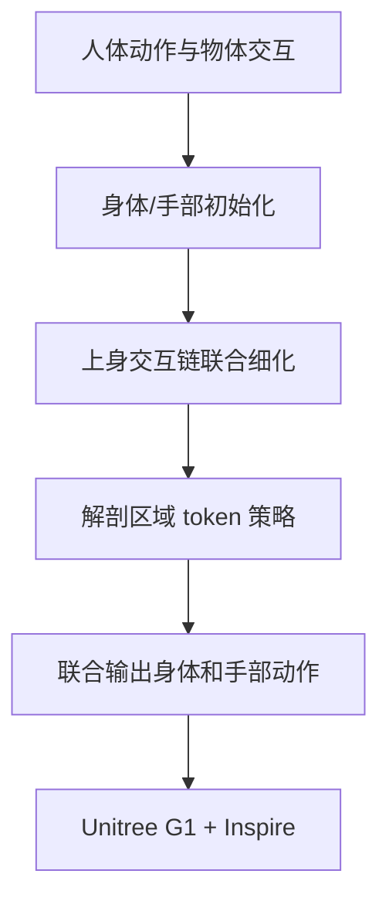

# DexWeave：从人体示范学习灵巧人形移动操作

## 一句话定义

DexWeave 将身体、手腕、手指和物体交互共同重定向，再以解剖区域注意力策略学习全身灵巧移动操作。

## 英文缩写速查

| 缩写 | 英文全称 | 说明 |
|---|---|---|
| WBC | Whole-Body Control | 全身协调控制 |
| RL | Reinforcement Learning | 强化学习策略训练 |
| G1 | Unitree G1 Humanoid | 相关论文的真机平台 |

## 流程总览

## 方法与证据

论文摘要描述两阶段交互一致重定向，再以解剖区域 token 和定向遮罩注意力表达身体部位依赖；策略直接强化学习，不依赖预训练跟踪器或后续残差优化。摘要报告 G1 与 Inspire 灵巧手真机部署。

## 局限与风险

结果依赖训练覆盖、机器人配置、传感器和论文中的任务协议。文章摘要可辅助定位；定量结果与代码开放状态应以论文和官方项目页为准。

## 结论

- 识别策略接收的目标和部署时实际可见的观测。
- 区分仿真评测、受控真机展示与开放场景能力。
- 结合接触、身体平衡和任务进度评估，不用单一成功率代表通用性。

## 关联页面

- [移动操作任务](../tasks/loco-manipulation.md)
- [ViLoMan：视觉—本体移动操作](./paper-viloman.md)

## 参考来源

- [来源档案](../../sources/papers/dexweave_arxiv_2609_34724.md)
- [arXiv:2609.34724](https://arxiv.org/abs/2609.34724)

## 推荐继续阅读

- [Day 4：移动操作](../overview/humanoid-motion-intelligence-day4-loco-manipulation.md)
